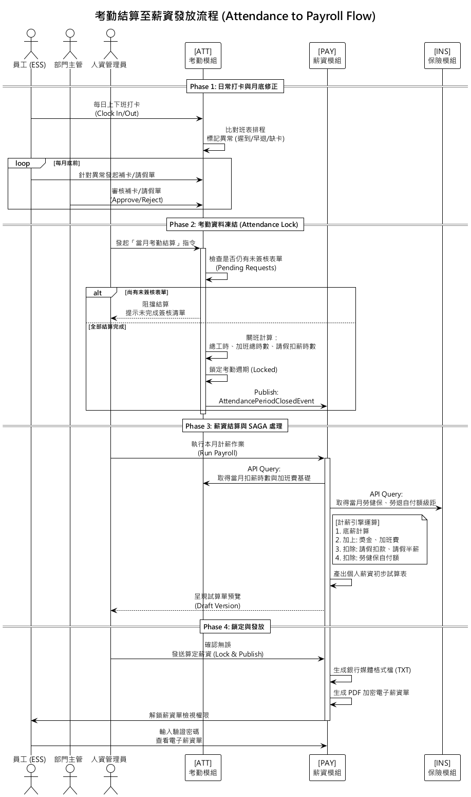
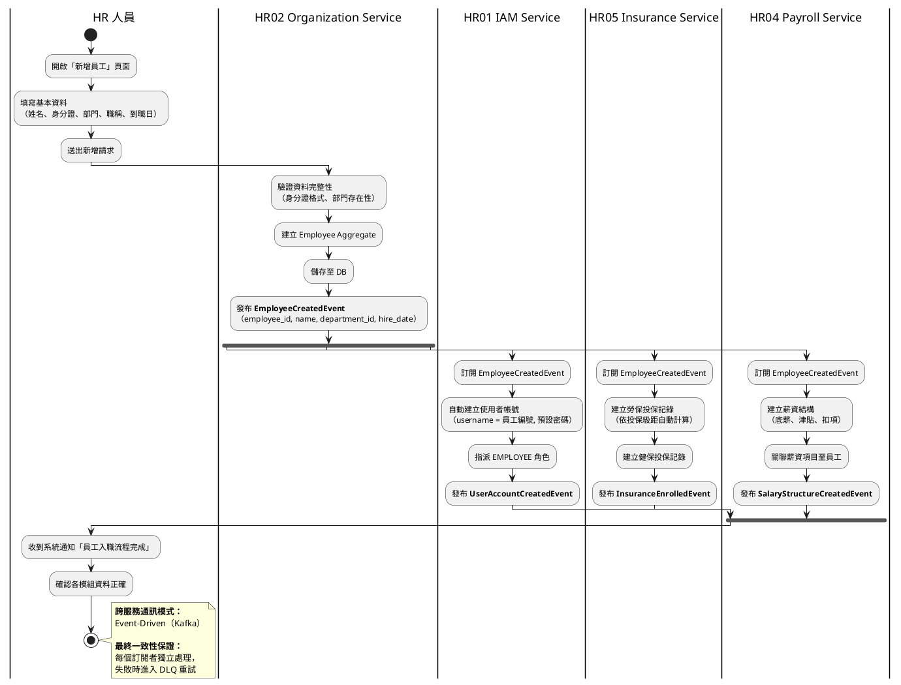
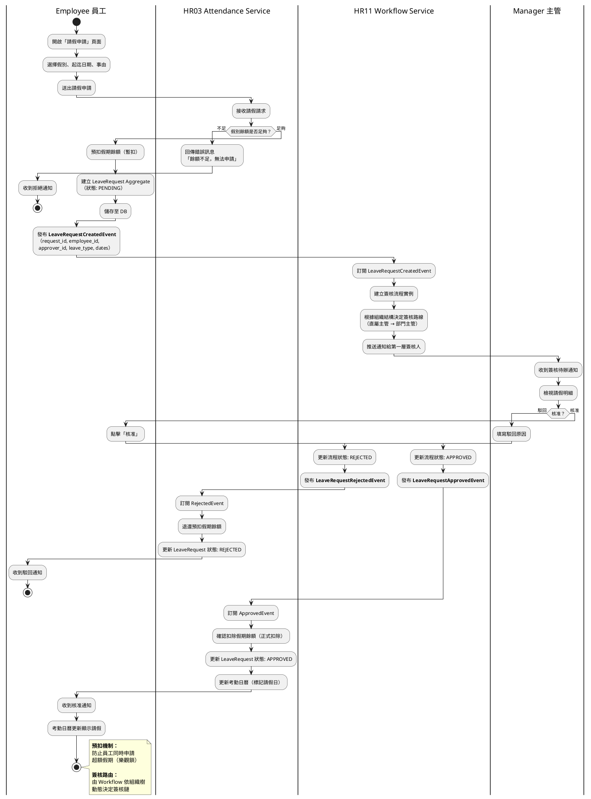
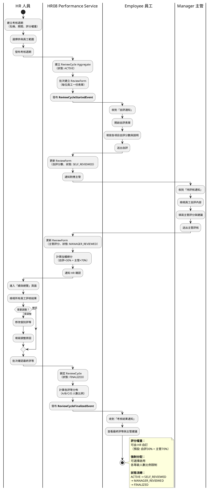

# 核心業務流程圖 (Business Flowcharts & Swimlane)

本文件展示系統中跨模組、高複雜度的核心業務邏輯流程。透過泳道圖 (Swimlane Diagram) 清晰界定出不同角色 (Actors) 以及後端微服務集群 (Microservices) 於各個階段應負擔的責任與系統邊界條件。

---

## 一、 考勤結算至薪資發放流程 (Attendance to Payroll Flow)

此流程涵蓋了企業人資系統中最關鍵的「月結處理」。它不僅牽涉前端使用者的互動，更涉及【考勤模組 (ATT)】與【薪資模組 (PAY)】之間的跨服務資料同步與非同步事件運算。

> **圖表格式：** PlantUML 渲染｜原始碼：`04_核心業務流程圖.puml`｜渲染指令：`java -jar tools/plantuml.jar -smetana -o diagrams 04_核心業務流程圖.puml`

### 流程設計要點 (Architecture Design Points)

此設計展示了複雜的分散式結算邏輯如何被穩健地處理：

1. **防呆與依賴檢查 (Constraint & Validation)**：在進入薪資計算（Phase 3）前，必須確保考勤資料已經完全鎖定（Phase 2）。系統防呆設計會阻擋在仍有請假單卡在主管端的狀態下進行結算，確保資料一致性 (Data Integrity)。
2. **事件與 API Query 的混合應用 (Hybrid Communication)**：
   * 考勤結班後會發出 Event 告知 PAY 模組「這段期間的資料已鎖定」。
   * 但計薪時，基於資料即時性且為了避免把龐大運算參數塞入 Kafka 訊息中，PAY 模組是主動呼叫 ATT 與 INS 的 Query API 索取精確的時數與級距數字（API Composition 模式）。此做法降低了 Queue 的負載並提高了資料獲取的正確性。

---

## 二、員工入職流程 (Employee Onboarding Flow)

此流程描述從 HR 建立員工資料到完成所有系統初始化的跨服務協作。涉及【組織模組 (ORG)】、【IAM 模組】、【保險模組 (INS)】、【薪資模組 (PAY)】四個服務的非同步事件串接。

### 流程設計要點

1. **事件驅動解耦（Event-Driven Decoupling）**：HR02 只負責建立員工本身，其餘服務透過訂閱 `EmployeeCreatedEvent` 自動完成後續作業，實現服務間零耦合。
2. **最終一致性（Eventual Consistency）**：三個下游服務（IAM、Insurance、Payroll）平行處理，任一服務失敗不影響其他服務，透過 Dead Letter Queue 機制確保最終一致。
3. **冪等性設計（Idempotency）**：每個訂閱者以 `employee_id` 作為冪等鍵，重複消費同一事件不會產生重複資料。

---

## 三、請假簽核流程 (Leave Approval Flow)

此流程展示員工發起請假到主管核准的完整路徑，涉及【考勤模組 (ATT)】與【簽核模組 (WFL)】的協作。

### 流程設計要點

1. **預扣機制（Reservation Pattern）**：申請時先預扣餘額避免超額申請，駁回時退還。此模式類似電商的庫存預留。
2. **動態簽核路由（Dynamic Routing）**：Workflow 服務根據組織結構樹自動決定簽核鏈，支援多層簽核與代理人機制。
3. **狀態機驅動（State Machine）**：LeaveRequest 的生命週期由狀態機管理：`PENDING → APPROVED/REJECTED`，確保狀態轉換的合法性。

---

## 四、績效考核流程 (Performance Review Flow)

此流程展示一個完整的績效週期，從 HR 建立考核週期到最終確認評等，涉及【績效模組 (PER)】的多角色協作。

### 流程設計要點

1. **彈性表單設計（Flexible Form）**：考核項目與權重由 HR 於週期建立時自定義，支援 KPI、OKR、360 度等多種考核類型。
2. **狀態機嚴格控制（State Machine）**：表單狀態依序流轉 `ACTIVE → SELF_REVIEWED → MANAGER_REVIEWED → FINALIZED`，不可跳步或回退，確保流程正確性。
3. **強制分配機制（Forced Distribution）**：HR 可選擇啟用各評等的人數比例限制（如 A 等不超過 20%），系統會在確認階段提供分佈警示。
