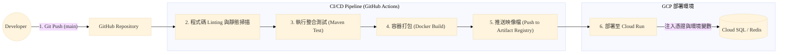

# CI/CD 持續整合與部署指南 (CI/CD Deployment Guide)

本指南說明如何透過 GitHub Actions (或類似 CI/CD 工具) 將 HRMS 專案自動打包、測試，並部署至 Google Cloud Run。

## 一、 部署架構與流程說明

本專案全面採用無伺服器 (Serverless) 微服務架構，每個模組（如 IAM, Organization 等）將被獨立打包為 Docker 容器並交由 Google Cloud Run 執行。

### CI/CD 流程圖 (Pipeline Workflow)
當開發人員將程式碼 Push 至 `main` 分支時，觸發以下自動化流程：



---

## 二、 準備部署所需文件 (Dockerfile 範例)

專案根目錄或各微服務模組下，需準備對應的 Dockerfile。由於本專案採用 Maven 多模組架構，建議使用 **Multi-stage Build** 來最小化產品映像檔容量。

以下為部署單一微服務（以 `hrms-iam` 為例）的 Dockerfile 範本：

```dockerfile
# -----------------------------------------------------
# Stage 1: Builder (編譯環境)
# -----------------------------------------------------
FROM maven:3.9.6-eclipse-temurin-21-alpine AS builder
WORKDIR /app

# 先複製 pom 檔，利用 Docker Cache 來快取依賴
COPY pom.xml .
COPY hrms-common/pom.xml hrms-common/
COPY hrms-iam/pom.xml hrms-iam/
# ... 複製其他模組的 pom (或使用特定 Maven 外掛)
RUN mvn dependency:go-offline

# 複製原碼並進行編譯打包 (指定打包 hrms-iam 及其相依模組)
COPY src ./src
COPY hrms-common/src ./hrms-common/src
COPY hrms-iam/src ./hrms-iam/src
RUN mvn clean package -pl hrms-iam -am -DskipTests

# -----------------------------------------------------
# Stage 2: Run (正式運行環境)
# -----------------------------------------------------
FROM eclipse-temurin:21-jre-alpine
WORKDIR /app

# 建立非 root 使用者提升安全性
RUN addgroup -S hrmsgroup && adduser -S hrmsuser -G hrmsgroup
USER hrmsuser

# 從 Builder 階段將打包好的 jar 檔複製過來
COPY --from=builder /app/hrms-iam/target/*.jar app.jar

# Cloud Run 會動態分配 $PORT 環境變數，因此啟動指令需注入對應設定
ENTRYPOINT ["sh", "-c", "java -Dserver.port=${PORT:8080} -Dspring.profiles.active=prod -jar app.jar"]
```

---

## 三、 Google Cloud Platform (GCP) 配備準備

在自動部署前，您必須在 GCP 完成以下基礎設施的建置與權限設置。

### 1. 建立資源
*   **Artifact Registry**：建立一個 Docker 映像檔存放區 (Repository)。
*   **Cloud SQL (PostgreSQL)**：開啟一台 SQL 實體。建議選擇 **Private IP** 以強化安全性。請在該實例內建立系統所需資料庫與使用者帳密。
*   **Service Account (服務帳號)**：建立一個專給 GitHub Actions 使用的 IAM 身份。賦予它 `Cloud Run Admin`、`Artifact Registry Writer`、`Service Account User` 的權限。並為其產生一把 JSON Key (Secret)。

### 2. Github Secrets 配置
在您的 GitHub Repo -> Settings -> Secrets and variables 中新增以下 Secrets：
*   `GCP_CREDENTIALS`: 上一步產生的 Service Account JSON 內容。
*   `GCP_PROJECT_ID`: 您的 GCP 專案 ID。
*   `DB_USERNAME`: 真實的 Cloud SQL 連線帳號。
*   `DB_PASSWORD`: 真實的 Cloud SQL 連線密碼。

---

## 四、 GitHub Actions 腳本範例

在專案中建立 `.github/workflows/deploy-iam.yml`，以完成全自動佈署至 Cloud Run。

```yaml
name: Deploy IAM Service to Cloud Run

on:
  push:
    branches:
      - main
    paths:
      - 'backend/hrms-common/**'
      - 'backend/hrms-iam/**' # 當這兩個模組有更動時才觸發

env:
  PROJECT_ID: ${{ secrets.GCP_PROJECT_ID }}
  SERVICE_NAME: hrms-iam-service
  REGION: asia-east1
  IMAGE_URL: asia-east1-docker.pkg.dev/${{ secrets.GCP_PROJECT_ID }}/hrms-repo/hrms-iam

jobs:
  build-and-deploy:
    runs-on: ubuntu-latest
    steps:
      - name: Checkout Code
        uses: actions/checkout@v4

      - name: Google Cloud Auth
        uses: google-github-actions/auth@v2
        with:
          credentials_json: ${{ secrets.GCP_CREDENTIALS }}

      - name: Setup Cloud SDK
        uses: google-github-actions/setup-gcloud@v2

      - name: Configure Docker
        run: gcloud auth configure-docker asia-east1-docker.pkg.dev

      - name: Build and Push Docker Image
        # 這裡會吃根目錄的 Dockerfile
        run: |
          docker build -t ${{ env.IMAGE_URL }}:${{ github.sha }} .
          docker push ${{ env.IMAGE_URL }}:${{ github.sha }}

      - name: Deploy to Cloud Run
        uses: google-github-actions/deploy-cloudrun@v2
        with:
          service: ${{ env.SERVICE_NAME }}
          region: ${{ env.REGION }}
          image: ${{ env.IMAGE_URL }}:${{ github.sha }}
          #注入連線環境變數 (真實密碼不會外洩於 Repo)
          env_vars: |
            SPRING_PROFILES_ACTIVE=prod
            DB_USERNAME=${{ secrets.DB_USERNAME }}
            DB_PASSWORD=${{ secrets.DB_PASSWORD }}
            SPRING_DATASOURCE_URL=jdbc:postgresql://<Cloud_SQL_IP>:5432/hrms_iam
          # 設定無伺服器擴縮與安全設定
          flags: |
            --allow-unauthenticated 
            --min-instances=0 
            --max-instances=5
```

## 五、 開發與生產環境切換與資安防護
**絕對禁止**將正式環境的資料庫帳號或密碼寫死在 `application.yml` 等原始碼中提交上版控系統。
任何敏感資訊應一律在 CD 階段，透過 Secrets/Environment Variables 的動態注入，交給容器。這保證了在開源庫上的專案程式碼完全安全無毒，即便 Repo 遭外洩，駭客也無法入侵真實的主機與資料庫。
