# UI Flow 總覽

**文件編號：** UI-01
**版本：** 1.0
**更新日期：** 2026-03-02
**適用範圍：** HRMS 全系統 14 個服務模組的用戶操作路徑

---

## 目錄

1. [系統入口與導航總覽](#1-系統入口與導航總覽)
2. [角色-功能可見性矩陣](#2-角色-功能可見性矩陣)
3. [各模組 UI Flow](#3-各模組-ui-flow)
4. [跨模組流程](#4-跨模組流程)

---

## 1. 系統入口與導航總覽

### 1.1 系統入口流程

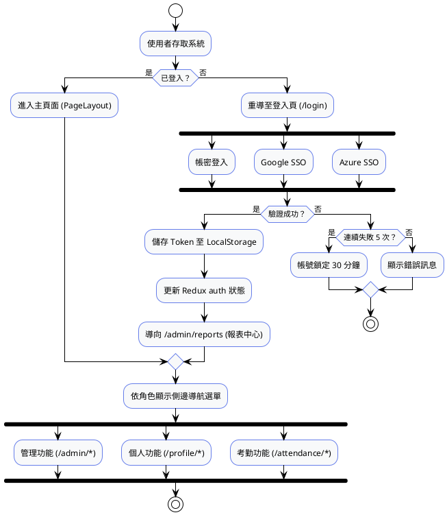

### 1.2 角色導向首頁

| 角色 | 預設首頁 | 可見選單 |
|:---|:---|:---|
| ADMIN | `/admin/reports` | 全部功能 |
| HR | `/admin/reports` | 除系統設定外全部 |
| MANAGER | `/admin/reports` | 團隊管理 + 審核功能 |
| PM | `/admin/projects` | 專案管理 + 工時管理 |
| FINANCE | `/admin/payroll/runs` | 薪資 + 保險 + 報表 |
| EMPLOYEE | `/attendance/check-in` | 個人功能 (ESS) |

---

## 2. 角色-功能可見性矩陣

| 頁面代碼 | 頁面名稱 | ADMIN | HR | MANAGER | PM | FINANCE | EMPLOYEE |
|:---|:---|:---:|:---:|:---:|:---:|:---:|:---:|
| **HR01 — IAM** |
| HR01-P01 | 登入頁 | ✅ | ✅ | ✅ | ✅ | ✅ | ✅ |
| HR01-P02 | 使用者管理 | ✅ | — | — | — | — | — |
| HR01-P03 | 角色權限分配 | ✅ | — | — | — | — | — |
| HR01-P04 | 修改密碼 | ✅ | ✅ | ✅ | ✅ | ✅ | ✅ |
| **HR02 — 組織員工** |
| HR02-P01 | 部門與編制 | ✅ | ✅ | — | — | — | — |
| HR02-P02 | 員工列表 | ✅ | ✅ | — | — | — | — |
| HR02-P03 | 員工詳情 | ✅ | ✅ | — | — | — | — |
| **HR03 — 考勤管理** |
| HR03-P01 | 每日打卡 | ✅ | ✅ | ✅ | ✅ | ✅ | ✅ |
| HR03-P02 | 請假加班申請 | ✅ | ✅ | ✅ | ✅ | ✅ | ✅ |
| HR03-P03 | 我的考勤日誌 | ✅ | ✅ | ✅ | ✅ | ✅ | ✅ |
| HR03-P04 | 考勤例外審核 | ✅ | ✅ | ✅ | — | — | — |
| HR03-P07 | 班制管理 | ✅ | ✅ | — | — | — | — |
| HR03-P08 | 假期類型設定 | ✅ | ✅ | — | — | — | — |
| HR03-P09 | 考勤報告 | ✅ | ✅ | ✅ | — | — | — |
| HR03-P10 | 月結審核 | ✅ | ✅ | — | — | — | — |
| **HR04 — 薪資核算** |
| HR04-P01 | 計薪作業中心 | ✅ | ✅ | — | — | — | — |
| HR04-P03 | 我的電子薪資單 | ✅ | ✅ | ✅ | ✅ | ✅ | ✅ |
| HR04-P06 | 計薪審核 | ✅ | — | — | — | ✅ | — |
| **HR05 — 保險管理** |
| HR05-P01 | 勞健保加退保 | ✅ | ✅ | — | — | — | — |
| HR05-P02 | 保費試算工具 | ✅ | ✅ | — | — | — | — |
| HR05-P03 | 我的保險資訊 | ✅ | ✅ | ✅ | ✅ | ✅ | ✅ |
| **HR06 — 專案管理** |
| HR06-P02 | 專案列表 | ✅ | — | — | ✅ | — | — |
| HR06-P03 | 專案詳情 | ✅ | — | — | ✅ | — | — |
| HR06-P04 | 專案編輯 | ✅ | — | — | ✅ | — | — |
| HR06-P05 | 專案任務 | ✅ | — | — | ✅ | — | — |
| **HR07 — 工時申報** |
| HR07-P01 | 每週工時報表 | ✅ | ✅ | ✅ | ✅ | ✅ | ✅ |
| HR07-P02 | 工時審核看板 | ✅ | — | — | ✅ | — | — |
| HR07-P03 | 工時報告 | ✅ | ✅ | — | ✅ | — | — |
| **HR08 — 績效考核** |
| HR08-P01 | 考核週期管理 | ✅ | ✅ | — | — | — | — |
| HR08-P03 | 我的評核表 | ✅ | ✅ | ✅ | ✅ | ✅ | ✅ |
| HR08-P04 | 團隊績效 | ✅ | — | ✅ | — | — | — |
| **HR09~14 — 支援模組** |
| HR09-P01 | 招募管理 | ✅ | ✅ | — | — | — | — |
| HR10-P01 | 教育訓練 | ✅ | ✅ | — | — | — | — |
| HR11-P01 | 簽核流程 | ✅ | ✅ | — | — | — | — |
| HR12-P01 | 訊息通知 | ✅ | ✅ | — | — | — | — |
| HR13-P01 | 文件管理 | ✅ | ✅ | — | — | — | — |
| HR14-P01 | 報表中心 | ✅ | ✅ | ✅ | ✅ | ✅ | — |

---

## 3. 各模組 UI Flow

### 3.1 HR01 IAM — 身分認證流程

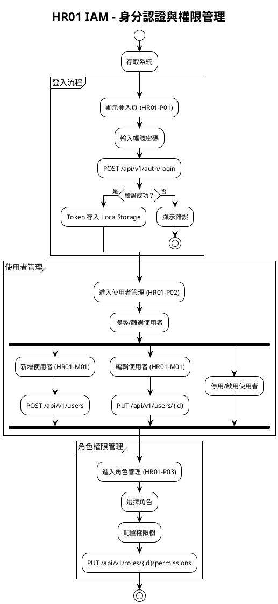

### 3.2 HR02 組織員工 — 員工生命週期

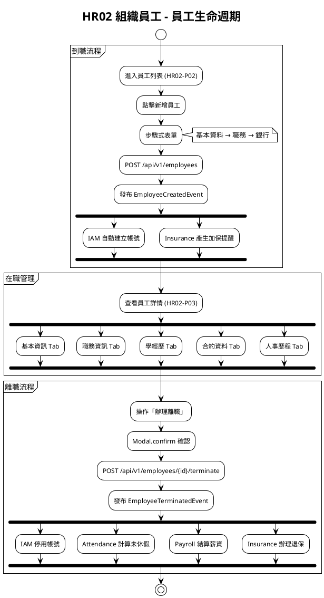

### 3.3 HR03 考勤管理 — 請假申請流程

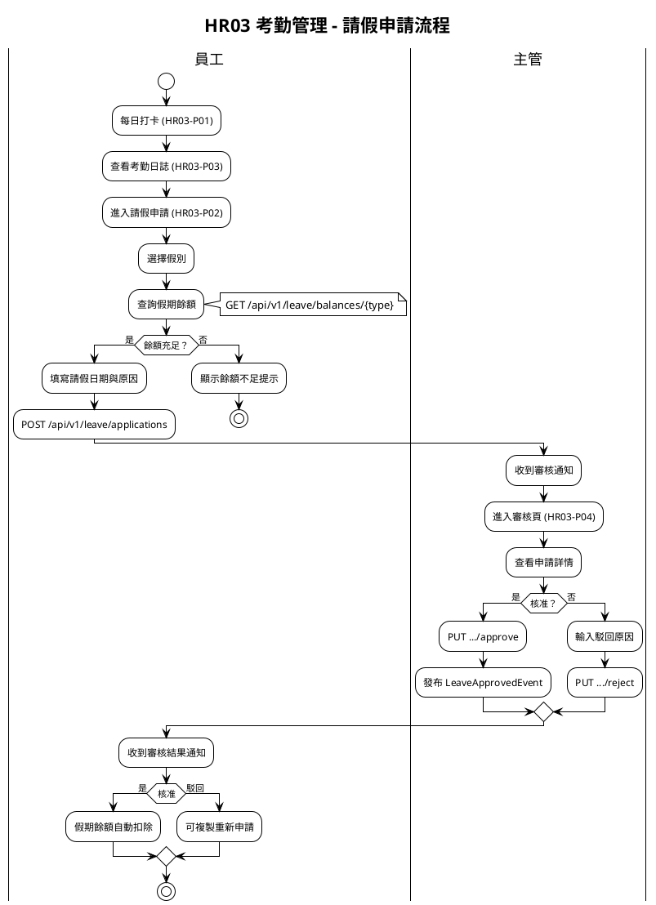

### 3.4 HR04 薪資管理 — 計薪流程

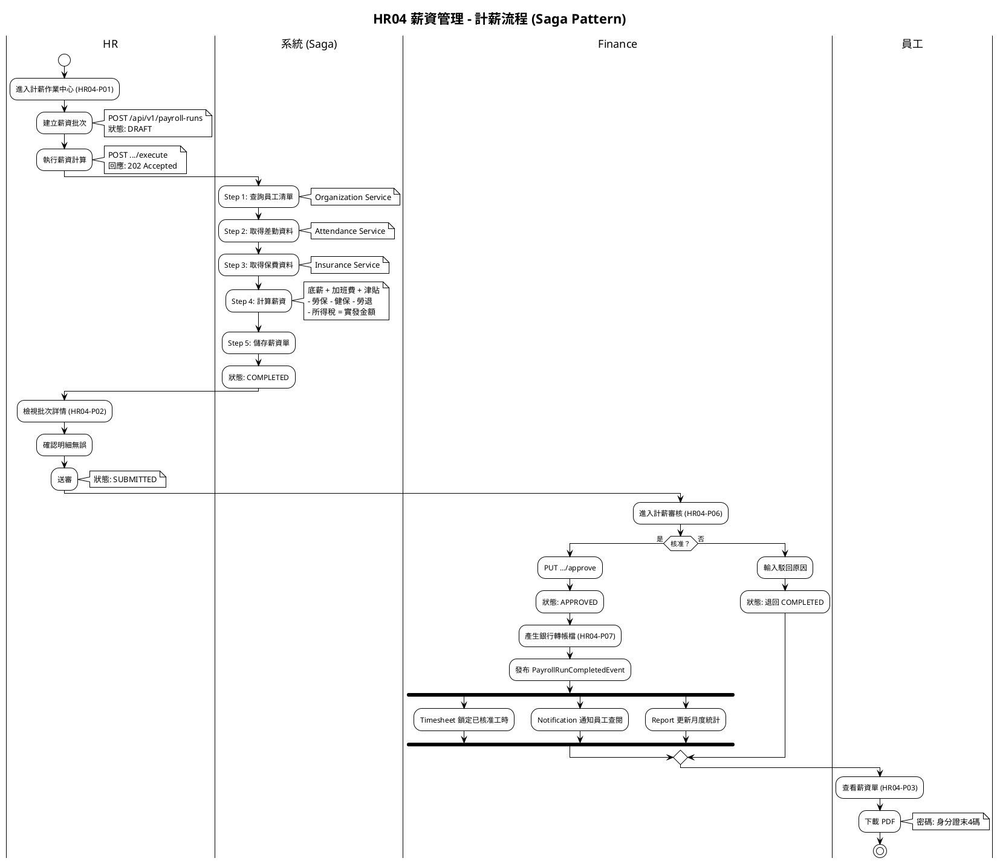

### 3.5 HR06/07 專案與工時 — 成本追蹤流程

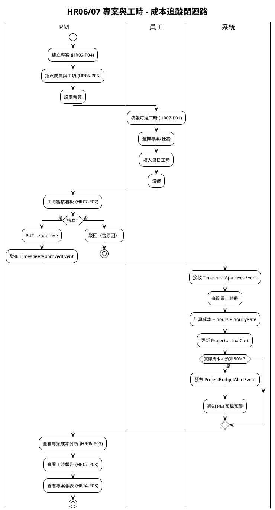

### 3.6 HR08 績效考核流程

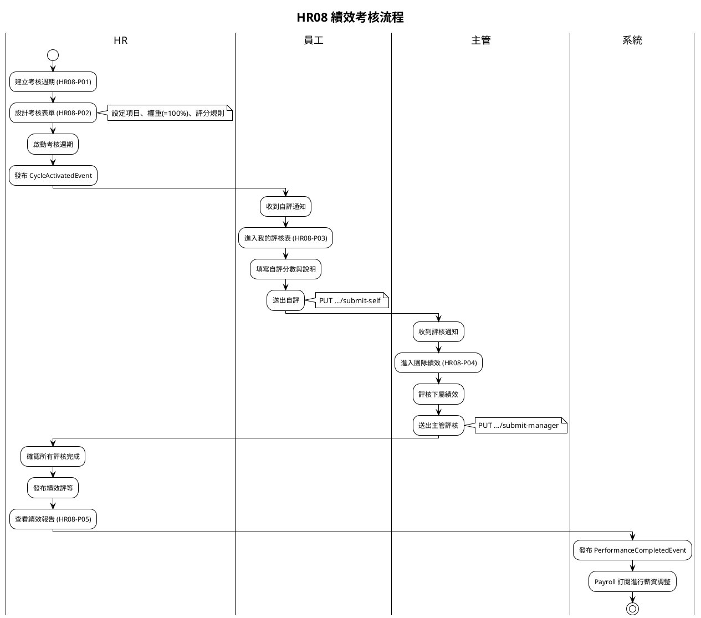

### 3.7 HR09 招募管理流程

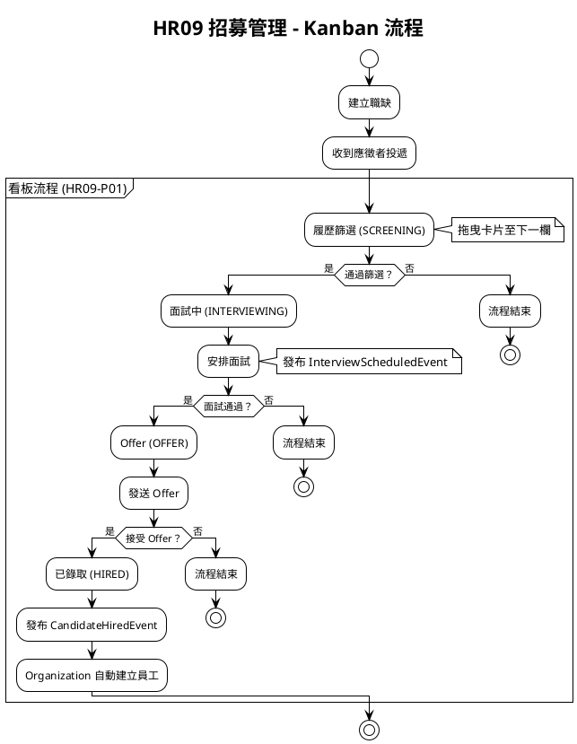

### 3.8 HR05 保險管理流程

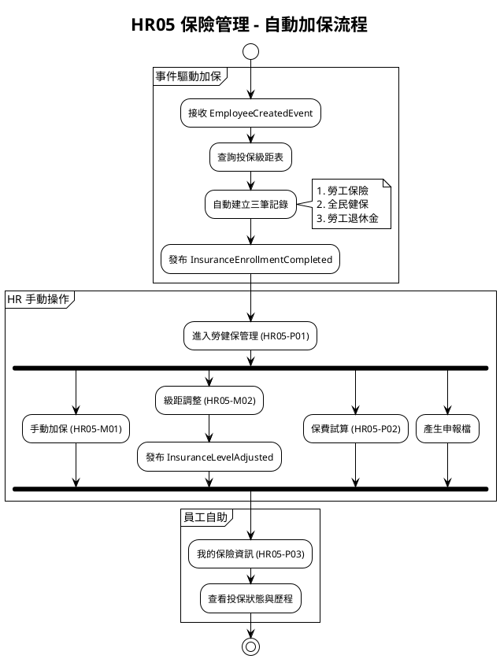

### 3.9 HR10~HR14 支援模組 UI Flow

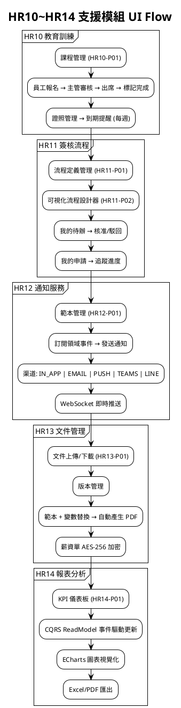

---

## 4. 跨模組流程

### 4.1 員工入職全流程

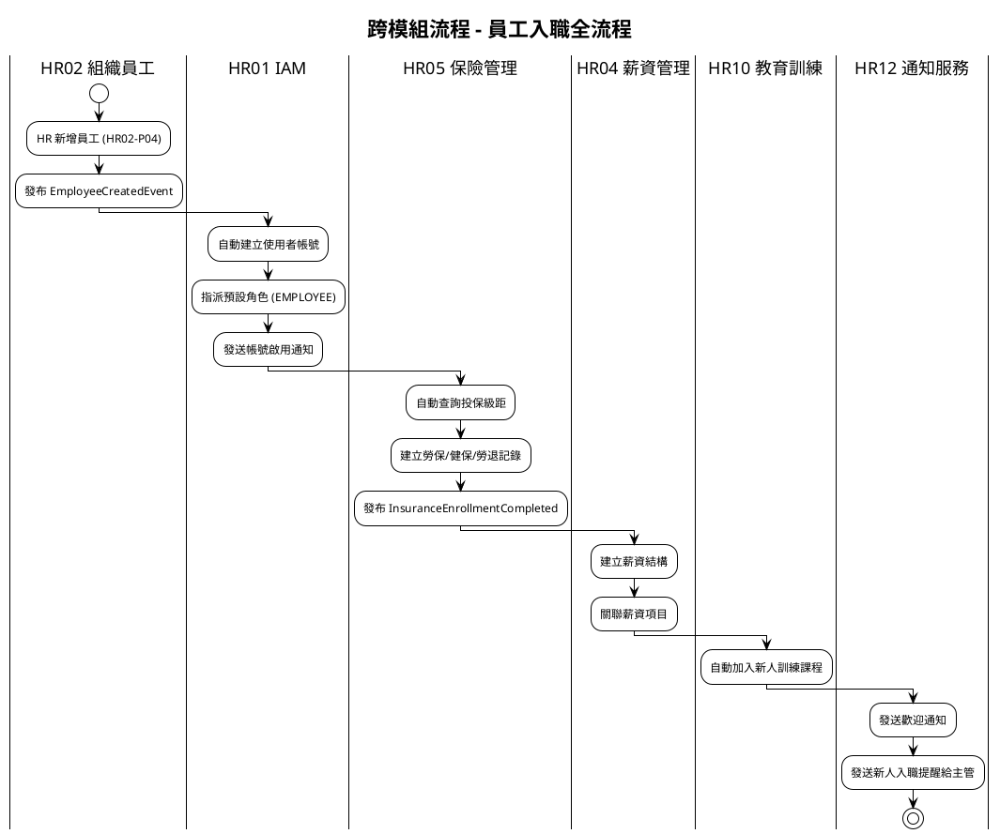

### 4.2 月底結算全流程

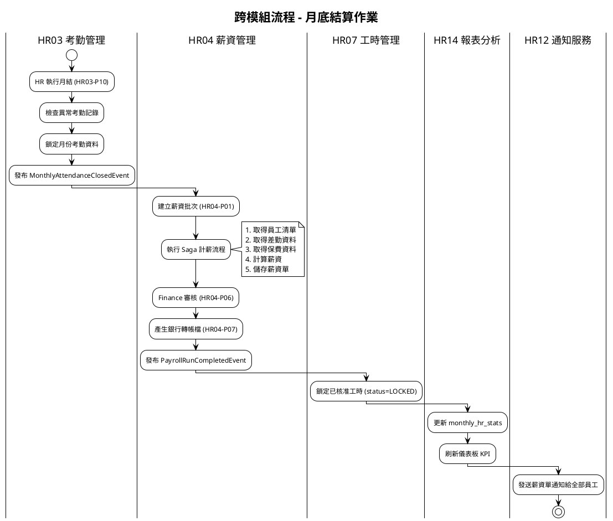

### 4.3 專案成本追蹤全流程

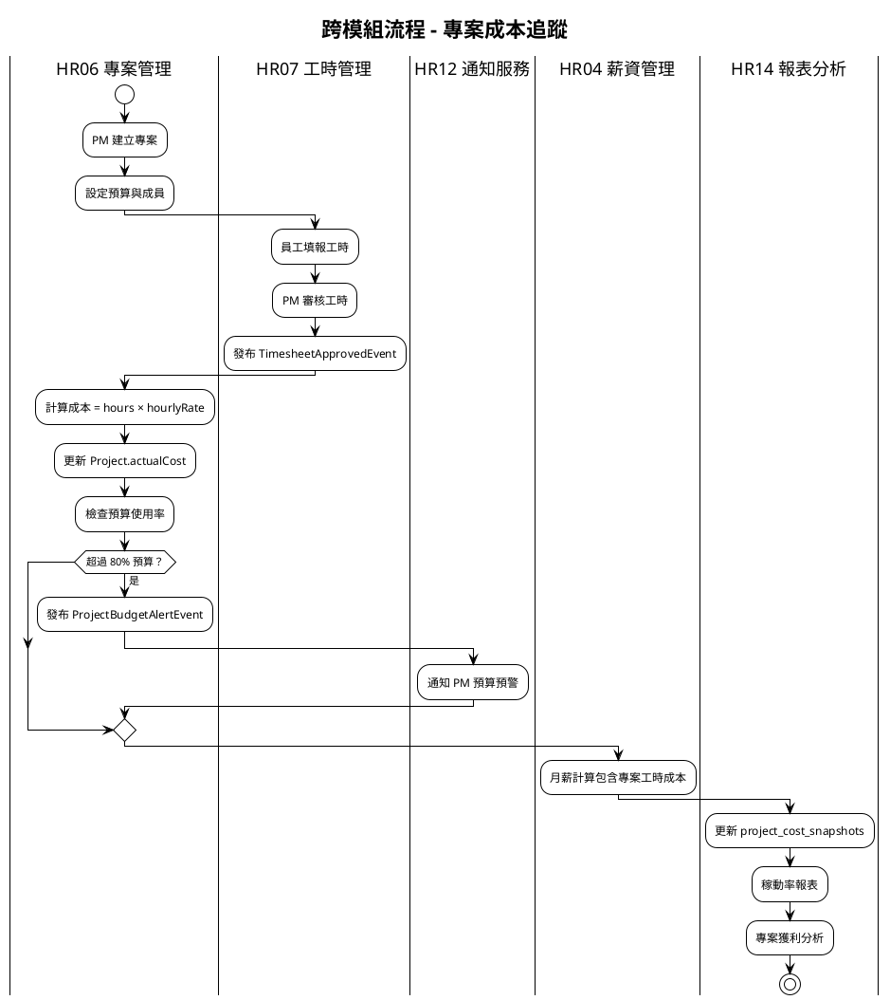

### 4.4 員工離職全流程

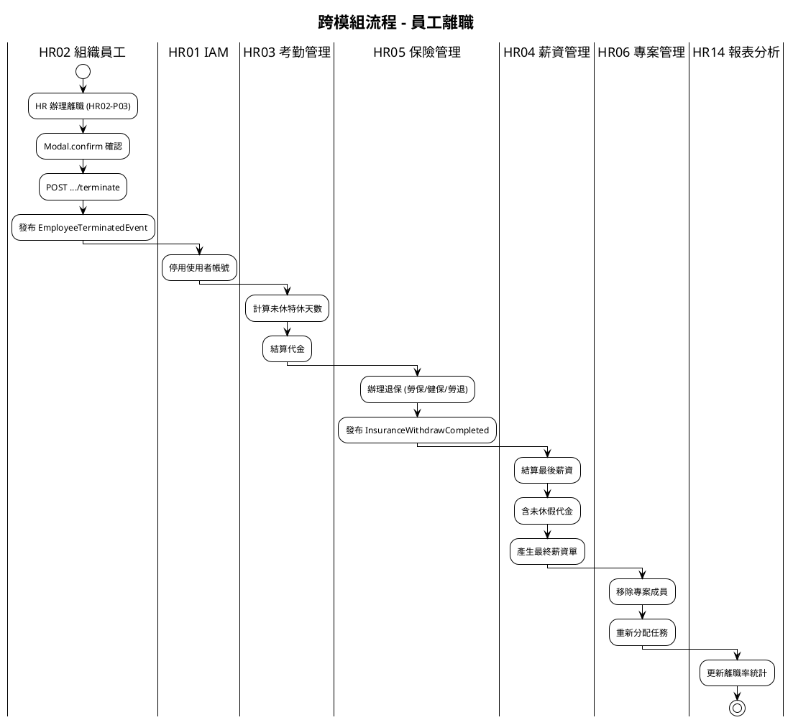
