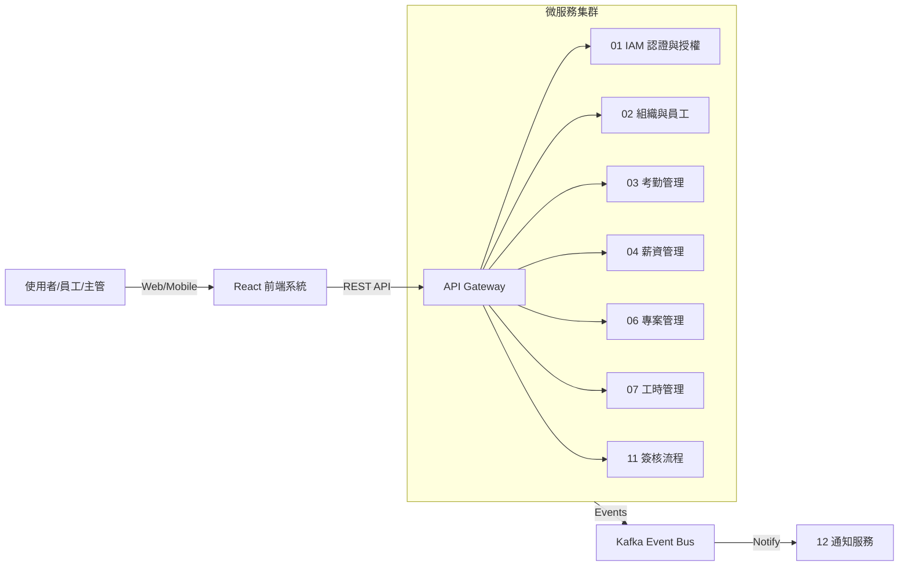
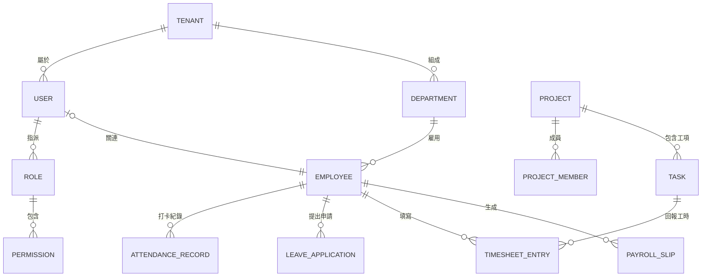
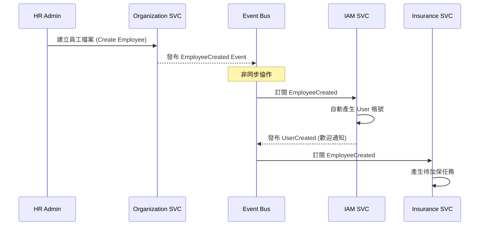
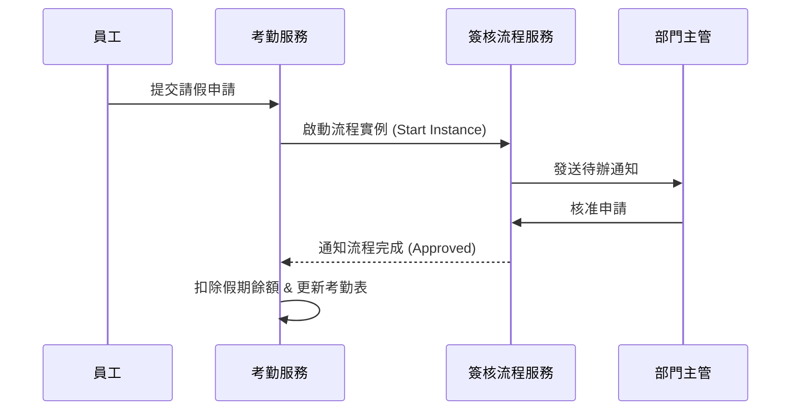
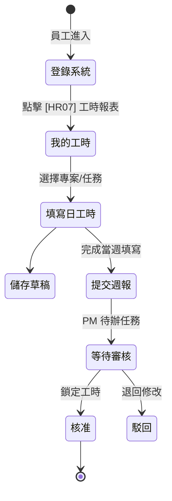
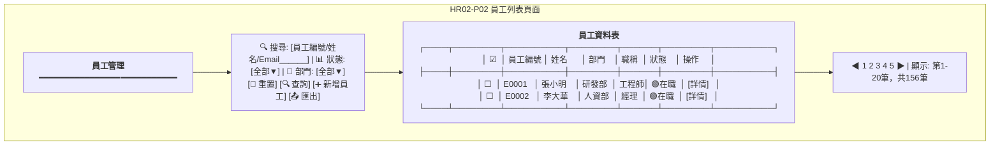
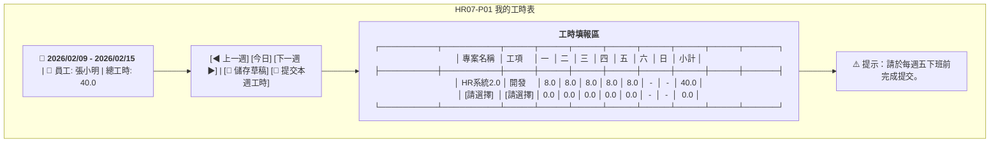
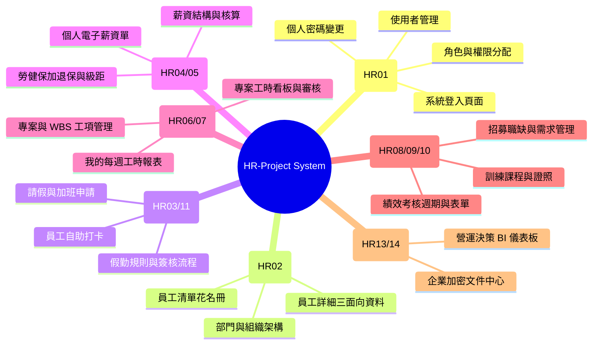

# 人力資源暨專案管理系統 - 綜合系統分析與邏輯驗證文件 (Consolidated System Analysis)

**版本:** 1.0  
**日期:** 2026-02-13  
**目的:** 本文件旨在提供系統全局的分析視圖，涵蓋使用案例、領域模型(ERD)、動態流程(Sequence)以及介面流程(UI Flow)，以確保研發、測試與產品團隊對系統邏輯的一致理解。

---

## 1. 系統全局視圖 (System Context & Vision)

本系統採微服務架構，旨在解決集團化公司的人事、考勤、計薪與專案成本追蹤之痛點。

### 1.1 系統上下文圖 (System Context Diagram)



---

## 2. 使用案例分析 (Use Case Analysis)

### 2.1 全域使用案例圖

```mermaid
useCaseDiagram
    actor "一般員工" as Emp
    actor "部門主管" as Mgr
    actor "專案經理 (PM)" as PM
    actor "人資/管理員" as Admin

    package "人員與權限" {
        usecase "登入與身分驗證" as UC1
        usecase "維護組織架構/員工檔案" as UC2
    }

    package "差勤與流程" {
        usecase "打卡/請假申請" as UC3
        usecase "簽核申請單" as UC4
    }

    package "專案與成本" {
        usecase "建立專案與工項" as UC5
        usecase "工時回報 (Timesheet)" as UC6
        usecase "查看專案成本/進度" as UC7
    }

    Emp --> UC1
    Emp --> UC3
    Emp --> UC6
    
    Mgr --> UC4
    
    PM --> UC5
    PM --> UC7
    
    Admin --> UC2
    Admin --> UC1
```

### 2.2 核心使用案例說明 (重點節錄)

| 使用案例編號 | 名稱 | 主要參與者 | 關鍵邏輯 |
|:---:|:---|:---|:---|
| **HR-UC-01** | 員工入職 (Onboarding) | HR | 建立員工檔案後，需同時觸發 IAM 建立帳號與保險加保流程。 |
| **HR-UC-02** | 請假核准 | 員工, 主管 | 需扣除對應特休/假別餘額，並連動考勤統計。 |
| **HR-UC-03** | 專案工時結算 | PM, 財務 | 依據 Timesheet 計算實際人力成本 (時薪 x 工時)。 |

---

## 3. 領域模型與實體關係圖 (Domain Model & ERD)

本系統採 DDD 建模，以下展示核心實體之關係。



---

## 4. 動態模型 (Interaction Sequences)

### 4.1 員工入職事件流 (跨服務協作)



### 4.2 請假流程與簽核引擎



---

## 5. UI Flow 與 網站地圖 (Sitemap)

### 5.1 前端功能模組地圖 (Site Map)

本系統前端介面依據業務領域 (Domain) 劃分，採模組化設計。以下為現行系統功能地圖：

- **身分認證與權限 (HR01 - IAM)**
    - [HR01-P01] 系統登入頁面
    - [HR01-P02] 使用者管理 (帳號控管、鎖定/解鎖)
    - [HR01-P03] 角色與權限分配 (RBAC 管理)
    - [HR01-P04] 個人密碼變更
- **組織與員工管理 (HR02 - Organization)**
    - [HR02-P01] 部門與組織架構管理
    - [HR02-P02] 員工清單 (花名冊、多維度篩選)
    - [HR02-P03] 員工詳細資料 (基本、職務、歷程、合約)
- **考勤管理服務 (HR03 - Attendance)**
    - [HR03-P01] 員工自助打卡 (Web/定位)
    - [HR03-P02] 請假與加班申請列表
    - [HR03-P03] 我的考勤記錄查詢
    - [HR03-P04] 考勤異常處理與審核
    - [HR03-P05] 假勤規則與班別設定
- **薪資與保險營運 (HR04, HR05 - Payroll/Insurance)**
    - [HR04-P01] 薪資核算與批次作業
    - [HR04-P02] 電子薪資單發布與查詢 (ESS)
    - [HR05-P01] 勞健保加退保管理
    - [HR05-P02] 保險費計算與級距管理
- **專案與工時追蹤 (HR06, HR07 - Project/Timesheet)**
    - [HR06-P01] 客戶與專案基礎資料
    - [HR06-P02] 專案詳情與 WBS 多層級工項
    - [HR07-P01] 每週工時填報 (Timesheet Entry)
    - [HR07-P02] 工時審核與看板 (PM 用)
- **績效、招募與訓練 (HR08, HR09, HR10)**
    - [HR08-P01] 考核週期與表單設計
    - [HR08-P02] 我的績效評核 (自評/主管評)
    - [HR09-P01] 招募需求與職缺管理
    - [HR10-P01] 教育訓練課程與證照管理
- **系統管理與決策 (HR11 - HR14)**
    - [HR11-P01] 簽核流程視覺化設計
    - [HR11-P02] 我的待辦與申請清單
    - [HR13-P01] 企業文件中心 (加密存儲)
    - [HR14-P01] 營運決策儀表板 (BI Dashboard)

### 5.2 核心介面流程：專案工時回報 (UI Flow)



### 5.3 系統畫面佈局 (Screen Layouts - Wireframes)

以下展示核心頁面的標準佈局規範。

#### 5.3.1 員工管理列表 (HR02-P02)



#### 5.3.2 專案工時填報 (HR07-P01)



### 5.4 完整網路功能地圖 (Detailed Sitemap)



---

## 6. 結論與邏輯檢查點 (Checkpoints)

1.  **資料一致性**: 使用者(User)與員工(Employee)帳號必須同步，IAM 負責安全性，Org 負責人事屬性。
2.  **法規遵循**: 所有加班計算、薪資扣項與休假餘額，必須引用 `regulatory_parameters` 中定義的法規參數。
3.  **流程解耦**: 業務服務不直接呼叫 Workflow Service 的私有邏輯，而是透過 `Business_Pipeline` 進行標準化組裝。
4.  **性能與快取**: 在報表與分析模組 (HR14) 中，複雜的成本計算應採讀寫分離 (CQRS)，建立預先計算的 Read Model 以提升回應速度。
