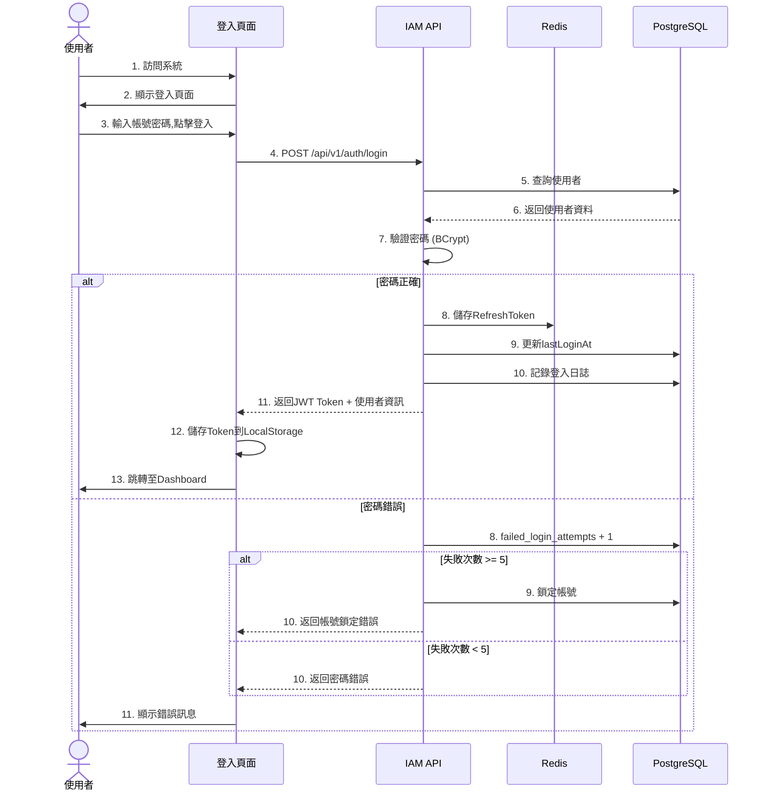
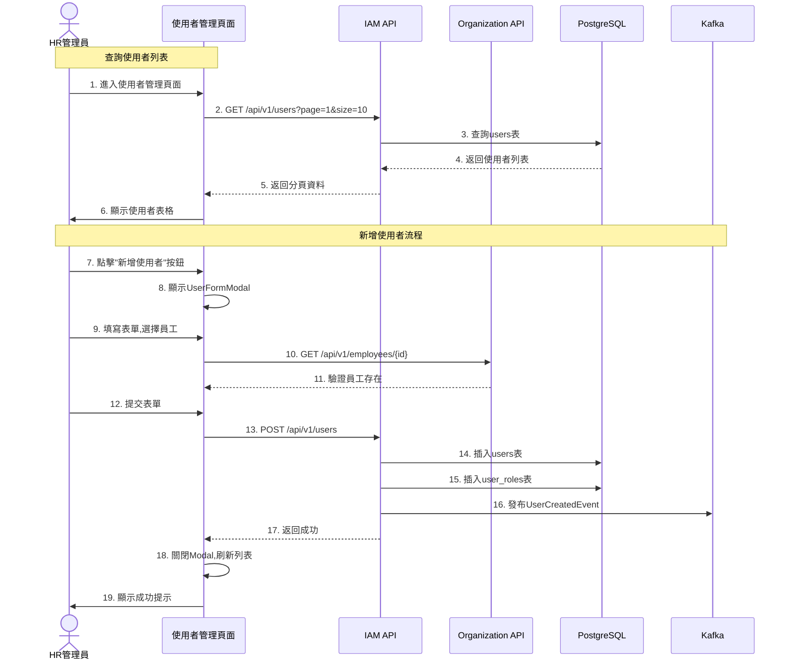

# IAM服務系統設計書

**版本:** 1.0  
**日期:** 2025-12-04  
**目標:** 提供工程師完整的系統實作規格,供PM建立工項清單

---

## 目錄

1. [服務概述](#1-服務概述)
2. [UI設計](#2-ui設計)
3. [UX流程設計](#3-ux流程設計)
4. [畫面事件說明](#4-畫面事件說明)
5. [Data Flow設計](#5-data-flow設計)
6. [資料庫設計](#6-資料庫設計)
7. [Domain設計](#7-domain設計)
8. [領域事件設計](#8-領域事件設計)
9. [API設計](#9-api設計)
10. [事件範例](#10-事件範例)

---

## 1. 服務概述

### 1.1 服務定位
IAM服務是整個HR系統的**基礎安全服務**,負責所有使用者的身份認證與授權管理。

### 1.2 核心功能
- ✅ 使用者登入認證
- ✅ Token核發與驗證
- ✅ 使用者帳號管理(CRUD)
- ✅ 角色權限管理(RBAC)
- ✅ 密碼安全管理
- ✅ 登入日誌審計
- ✅ 多租戶資料隔離

### 1.3 技術架構
- **前端**: ReactJS + Redux + Ant Design
- **後端**: Spring Boot 3.1.x + Spring Security
- **資料庫**: PostgreSQL 15.x
- **快取**: Redis 7.x
- **認證方式**: JWT Token

---

## 2. UI設計

### 2.1 頁面清單

| 頁面代碼 | 頁面名稱 | 路由 | 權限要求 |
|:---|:---|:---|:---:|
| `IAM-P01` | 登入頁面 | `/login` | - |
| `IAM-P02` | 使用者管理頁面 | `/admin/users` | user:read |
| `IAM-P03` | 角色權限管理頁面 | `/admin/roles` | role:read |
| `IAM-P04` | 密碼修改頁面 | `/profile/password` | - |
| `IAM-P05` | 使用者新增/編輯對話框 | (Modal) | user:create/write |
| `IAM-P06` | 角色新增/編輯對話框 | (Modal) | role:create/write |

### 2.2 UI線稿

#### 2.2.1 登入頁面 (IAM-P01)


**頁面元素:**
- **Header區域**
  - 公司Logo (左上)
  - 語言切換器 (右上): 繁體中文/English
  
- **主要內容區 (置中卡片)**
  - 系統標題: "人力資源暨專案管理系統"
  - 登入表單:
    - 使用者名稱輸入框 (帶帳號圖示)
    - 密碼輸入框 (帶鎖頭圖示,顯示/隱藏切換)
    - "記住我" 核取方塊
    - "忘記密碼?" 連結
    - "登入" 按鈕 (藍色, 100%寬度)
  - SSO選項:
    - "使用Google登入" 按鈕
    - "使用Microsoft登入" 按鈕
  
- **Footer區域**
  - 版權資訊: "© 2025 Company Name. All rights reserved."

**元件規格:**
```typescript
// 登入表單欄位
interface LoginFormData {
  username: string;      // 使用者名稱 (email格式)
  password: string;      // 密碼
  rememberMe: boolean;   // 記住我
  tenantId?: string;     // 租戶ID (多租戶情境)
}
```

#### 2.2.2 使用者管理頁面 (IAM-P02)


**頁面佈局:**
- **Left Sidebar**
  - Dashboard
  - 使用者管理 (當前選中)
  - 角色管理
  - 權限管理
  - 審計日誌

- **Main Content**
  - **工具列**
    - 頁面標題: "使用者管理"
    - 搜尋框 (placeholder: "搜尋使用者名稱、Email")
    - 篩選器:
      - 狀態下拉: 全部/啟用/停用/鎖定
      - 角色下拉: 全部/系統管理員/人資管理員...
      - 部門下拉: (動態載入)
    - "新增使用者" 按鈕 (主要按鈕, 藍色)
  
  - **使用者表格**
    | 欄位 | 說明 | 寬度 |
    |:---|:---|:---:|
    | ☑ | 批次選擇核取方塊 | 40px |
    | 頭像 | 使用者頭像 (圓形) | 50px |
    | 使用者名稱/Email | 主/副標題顯示 | 200px |
    | 員工姓名 | 關聯員工姓名 | 120px |
    | 部門 | 所屬部門 | 120px |
    | 角色 | 標籤形式顯示多個角色 | 180px |
    | 狀態 | 啟用(綠)/停用(灰)/鎖定(紅) | 80px |
    | 最後登入時間 | YYYY-MM-DD HH:mm | 150px |
    | 操作 | 編輯/停用/重置密碼按鈕 | 120px |
  
  - **批次操作工具列** (選擇項目時顯示)
    - 已選擇 N 個使用者
    - "批次停用" 按鈕
    - "批次匯出" 按鈕
  
  - **分頁控制**
    - 顯示: "第 1-10 筆，共 156 筆"
    - 頁碼切換
    - 每頁筆數選擇: 10/20/50/100

**元件規格:**
```typescript
interface UserTableRow {
  userId: string;
  username: string;
  email: string;
  employeeName: string;
  department: string;
  roles: Array<{roleId: string; roleName: string;}>;
  status: 'ACTIVE' | 'INACTIVE' | 'LOCKED';
  lastLoginAt: string;
  avatar?: string;
}
```

#### 2.2.3 角色權限管理頁面 (IAM-P03)


**頁面佈局:**

**左側面板 (30%寬度):**
- **Header**
  - "角色列表" 標題
  - "新增角色" 按鈕 (+ 圖示)

- **角色卡片列表**
  每個卡片顯示:
  - 角色名稱 (粗體)
  - 角色描述 (灰色小字)
  - 使用者數量徽章 (如: "15 users")
  - 系統/自訂標籤
  - 編輯圖示按鈕

**右側面板 (70%寬度):**
- **角色詳細資訊區**
  - 角色名稱 (大標題)
  - 角色描述
  - "編輯角色資訊" 按鈕

- **權限樹狀結構**
  可展開/收合的權限樹:
  ```
  ☑ 員工管理 ▼
    ☑ 查看員工資料
    ☑ 新增員工  
    ☐ 編輯員工
    ☐ 刪除員工
  
  ☑ 考勤管理 ▼
    ☑ 查看考勤記錄
    ☑ 審核請假
    ☐ 審核加班申請
  
  ☐ 薪資管理 ▼
    ☐ 查看薪資資料
    ☐ 處理薪資
  ```

- **操作按鈕區**
  - "儲存變更" 按鈕 (主要按鈕)
  - "取消" 按鈕 (次要按鈕)

**元件規格:**
```typescript
interface RoleDetailView {
  roleId: string;
  roleName: string;
  displayName: string;
  description: string;
  isSystemRole: boolean;
  userCount: number;
  permissions: PermissionTree[];
}

interface PermissionTree {
  category: string;              // 權限分類 (如: 員工管理)
  permissions: Array<{
    permissionId: string;
    permissionCode: string;      // 如: employee:profile:read
    displayName: string;
    checked: boolean;
  }>;
}
```

### 2.3 通用組件設計

#### 2.3.1 UserFormModal (使用者新增/編輯對話框)
```typescript
interface UserFormModalProps {
  visible: boolean;
  mode: 'create' | 'edit';
  userId?: string;
  onSubmit: (data: UserFormData) => Promise<void>;
  onCancel: () => void;
}

interface UserFormData {
  username: string;         // Email格式
  email: string;
  employeeId: string;       // 關聯員工ID
  tenantId: string;
  initialPassword?: string; // 僅新增時
  roleIds: string[];        // 指派角色
}
```

**表單欄位:**
- 使用者名稱 (必填, Email格式驗證)
- Email (必填, Email格式驗證)
- 關聯員工 (下拉選擇, 必填)
- 租戶 (下拉選擇, 預設母公司)
- 初始密碼 (新增時必填, 8字元以上)
- 角色 (多選下拉, 至少選一個)

#### 2.3.2 StatusBadge (狀態徽章)
```typescript
interface StatusBadgeProps {
  status: 'ACTIVE' | 'INACTIVE' | 'LOCKED';
}

// 顏色對應
const statusColors = {
  ACTIVE: 'green',    // 綠色
  INACTIVE: 'gray',   // 灰色
 LOCKED: 'red',      // 紅色
};
```

---

## 3. UX流程設計

### 3.1 使用者旅程圖

#### 3.1.1 登入流程



**關鍵點:**
- ✅ 密碼驗證使用BCrypt compare
- ✅ 連續失敗5次自動鎖定30分鐘
- ✅ 每次登入記錄IP與User Agent
- ✅ Token儲存於LocalStorage

#### 3.1.2 使用者管理流程



**關鍵點:**
- ✅ 新增使用者前驗證employeeId存在
- ✅ 初始密碼8字元以上,首次登入強制修改
- ✅ 發布UserCreatedEvent給Organization Service
- ✅ 至少指派一個角色

---

*（接下頁）*
