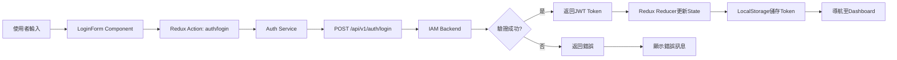
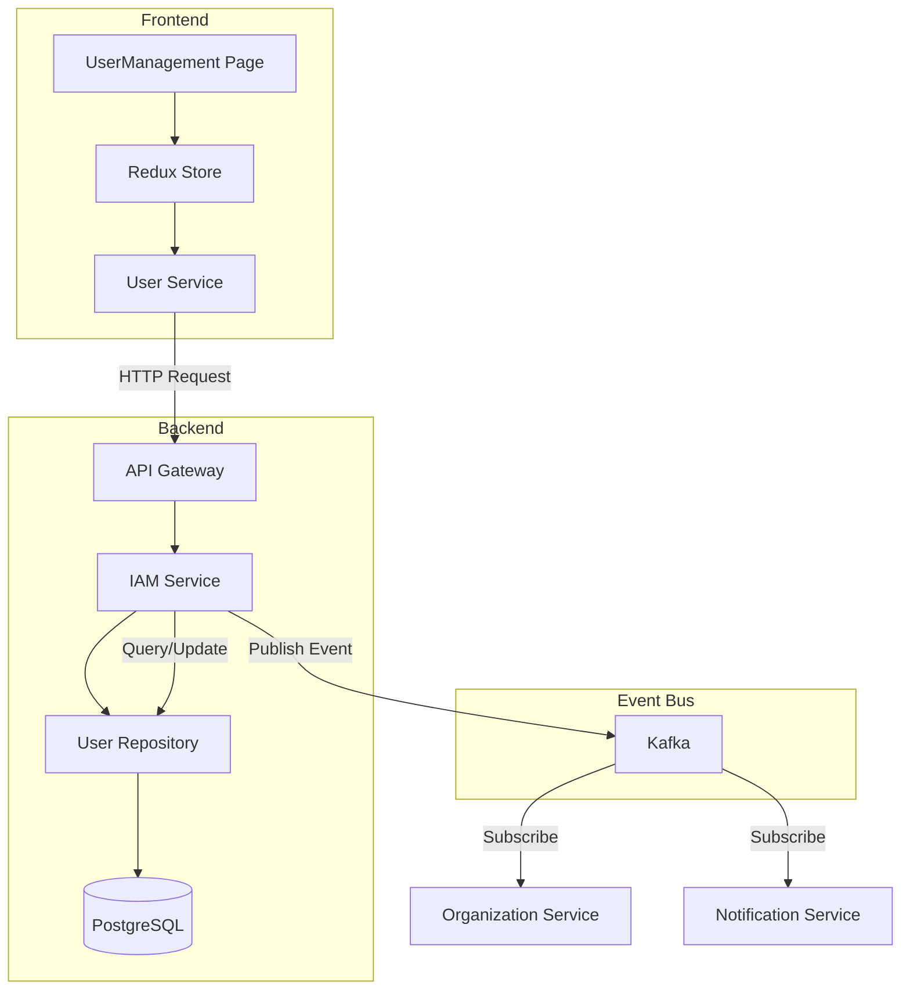
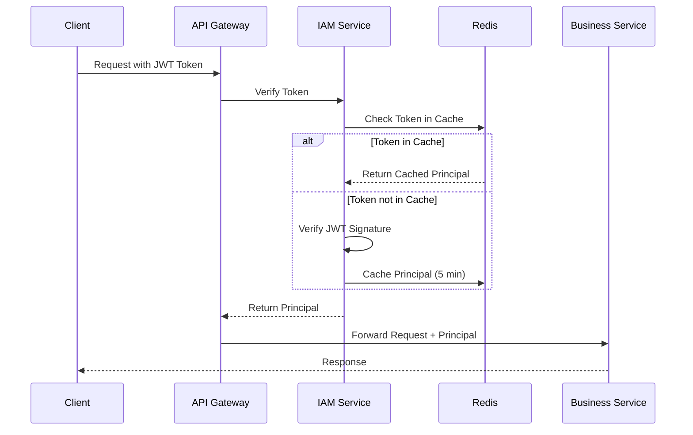
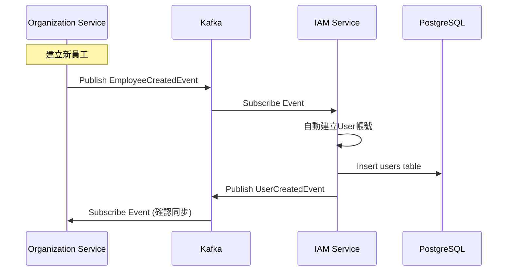

## 4. 畫面事件說明

### 4.1 登入頁面事件 (IAM-P01)

| 事件ID | 觸發元素 | 事件類型 | 事件處理 | 後端API |
|:---|:---|:---|:---|:---|
| `E-LOGIN-01` | 登入按鈕 | onClick | 驗證表單 → 呼叫登入API → 儲存Token → 跳轉 | POST /api/v1/auth/login |
| `E-LOGIN-02` | 忘記密碼連結 | onClick | 開啟密碼重置對話框 | - |
| `E-LOGIN-03` | Google登入按鈕 | onClick | 跳轉Google OAuth | GET /api/v1/auth/oauth/google |
| `E-LOGIN-04` | Microsoft登入按鈕 | onClick | 跳轉Microsoft OAuth | GET /api/v1/auth/oauth/microsoft |
| `E-LOGIN-05` | 語言切換器 | onChange | 切換i18n語言包 | - |
| `E-LOGIN-06` | 密碼顯示/隱藏 | onClick | 切換input type | - |

**E-LOGIN-01 詳細流程:**
```typescript
const handleLogin = async (values: LoginFormData) => {
  try {
    // 1. 表單驗證
    await form.validateFields();
    
    // 2. 呼叫登入API
    const response = await authService.login({
      username: values.username,
      password: values.password,
      tenantId: values.tenantId
    });
    
    // 3. 儲存Token
    localStorage.setItem('accessToken', response.accessToken);
    localStorage.setItem('refreshToken', response.refreshToken);
    
    // 4. 儲存使用者資訊到Redux
    dispatch(setCurrentUser(response.user));
    
    // 5. 跳轉至Dashboard
    navigate('/dashboard');
    
  } catch (error) {
    // 顯示錯誤訊息
    if (error.code === 'ACCOUNT_LOCKED') {
      message.error('帳號已被鎖定，請聯絡系統管理員');
    } else if (error.code === 'INVALID_CREDENTIALS') {
      message.error('使用者名稱或密碼錯誤');
    }
  }
};
```

### 4.2 使用者管理頁面事件 (IAM-P02)

| 事件ID | 觸發元素 | 事件類型 | 事件處理 | 後端API |
|:---|:---|:---|:---|:---|
| `E-USER-01` | 新增使用者按鈕 | onClick | 開啟UserFormModal (create模式) | - |
| `E-USER-02` | 搜尋框 | onChange (debounce 500ms) | 重新查詢使用者列表 | GET /api/v1/users?search={keyword} |
| `E-USER-03` | 狀態篩選器 | onChange | 重新查詢使用者列表 | GET /api/v1/users?status={status} |
| `E-USER-04` | 角色篩選器 | onChange | 重新查詢使用者列表 | GET /api/v1/users?roleId={roleId} |
| `E-USER-05` | 編輯按鈕 | onClick | 開啟UserFormModal (edit模式) | GET /api/v1/users/{userId} |
| `E-USER-06` | 停用按鈕 | onClick | 確認對話框 → 停用使用者 | PUT /api/v1/users/{userId}/deactivate |
| `E-USER-07` | 重置密碼按鈕 | onClick | 開啟重置密碼對話框 | PUT /api/v1/users/{userId}/reset-password |
| `E-USER-08` | 批次選擇 | onChange | 更新選中項目狀態 | - |
| `E-USER-09` | 批次停用按鈕 | onClick | 確認對話框 → 批次停用 | PUT /api/v1/users/batch-deactivate |
| `E-USER-10` | 分頁切換 | onChange | 重新查詢使用者列表 | GET /api/v1/users?page={page} |

**E-USER-06 詳細流程:**
```typescript
const handleDeactivateUser = async (userId: string) => {
  // 1. 顯示確認對話框
  Modal.confirm({
    title: '確認停用使用者',
    content: '停用後該使用者將無法登入系統，確定要繼續嗎？',
    onOk: async () => {
      try {
        // 2. 呼叫停用API
        await userService.deactivateUser(userId);
        
        // 3. 顯示成功訊息
        message.success('使用者已停用');
        
        // 4. 刷新列表
        await fetchUsers();
        
      } catch (error) {
        message.error('停用失敗: ' + error.message);
      }
    }
  });
};
```

### 4.3 角色權限管理頁面事件 (IAM-P03)

| 事件ID | 觸發元素 | 事件類型 | 事件處理 | 後端API |
|:---|:---|:---|:---|:---|
| `E-ROLE-01` | 新增角色按鈕 | onClick | 開啟RoleFormModal | - |
| `E-ROLE-02` | 角色卡片 | onClick | 載入角色詳細資訊與權限 | GET /api/v1/roles/{roleId} |
| `E-ROLE-03` | 編輯角色資訊按鈕 | onClick | 開啟RoleFormModal (edit模式) | - |
| `E-ROLE-04` | 權限核取方塊 | onChange | 更新權限選中狀態 | - |
| `E-ROLE-05` | 權限分類展開/收合 | onClick | 切換展開狀態 | - |
| `E-ROLE-06` | 儲存變更按鈕 | onClick | 儲存角色權限變更 | PUT /api/v1/roles/{roleId}/permissions |
| `E-ROLE-07` | 取消按鈕 | onClick | 重置權限狀態 | - |

**E-ROLE-06 詳細流程:**
```typescript
const handleSavePermissions = async () => {
  try {
    // 1. 收集選中的權限ID
    const selectedPermissionIds = permissions
      .filter(p => p.checked)
      .map(p => p.permissionId);
    
    // 2. 呼叫更新API
    await roleService.updateRolePermissions(currentRoleId, {
      permissionIds: selectedPermissionIds
    });
    
    // 3. 顯示成功訊息
    message.success('權限已更新');
    
    // 4. 發布權限變更事件 (清除快取)
    eventBus.emit('role:permissions:changed', currentRoleId);
    
  } catch (error) {
    message.error('更新失敗: ' + error.message);
  }
};
```

---

## 5. Data Flow設計

### 5.1 前端狀態管理 (Redux)

#### 5.1.1 State結構

```typescript
interface IAMState {
  // 認證狀態
  auth: {
    isAuthenticated: boolean;
    currentUser: User | null;
    accessToken: string | null;
    refreshToken: string | null;
    loading: boolean;
    error: string | null;
  };
  
  // 使用者管理
  users: {
    list: User[];
    total: number;
    currentPage: number;
    pageSize: number;
    filters: {
      search: string;
      status: UserStatus | null;
      roleId: string | null;
      departmentId: string | null;
    };
    selectedUserIds: string[];
    loading: boolean;
  };
  
  // 角色管理
  roles: {
    list: Role[];
    currentRole: RoleDetail | null;
    loading: boolean;
  };
  
  // 權限管理
  permissions: {
    allPermissions: Permission[];
    permissionTree: PermissionTree[];
    loading: boolean;
  };
}
```

#### 5.1.2 Redux Actions

```typescript
// 認證相關Actions
export const authActions = {
  login: createAsyncThunk('auth/login', async (credentials: LoginCredentials) => {
    const response = await authService.login(credentials);
    return response;
  }),
  
  logout: createAsyncThunk('auth/logout', async () => {
    await authService.logout();
  }),
  
  refreshToken: createAsyncThunk('auth/refreshToken', async (refreshToken: string) => {
    const response = await authService.refreshToken(refreshToken);
    return response;
  }),
};

// 使用者管理Actions
export const userActions = {
  fetchUsers: createAsyncThunk('users/fetchUsers', async (params: UserQueryParams) => {
    const response = await userService.getUsers(params);
    return response;
  }),
  
  createUser: createAsyncThunk('users/createUser', async (data: CreateUserRequest) => {
    const response = await userService.createUser(data);
    return response;
  }),
  
  updateUser: createAsyncThunk('users/updateUser', async ({userId, data}: {userId: string, data: UpdateUserRequest}) => {
    const response = await userService.updateUser(userId, data);
    return response;
  }),
  
  deactivateUser: createAsyncThunk('users/deactivateUser', async (userId: string) => {
    await userService.deactivateUser(userId);
    return userId;
  }),
};
```

### 5.2 前後端資料流

#### 5.2.1 登入流程資料流



#### 5.2.2 使用者CRUD資料流



### 5.3 服務間資料流

#### 5.3.1 Token驗證流程



#### 5.3.2 使用者建立同步流程



---

*（文件持續中，下一部分將包含資料庫設計、Domain設計、API規格等）*
