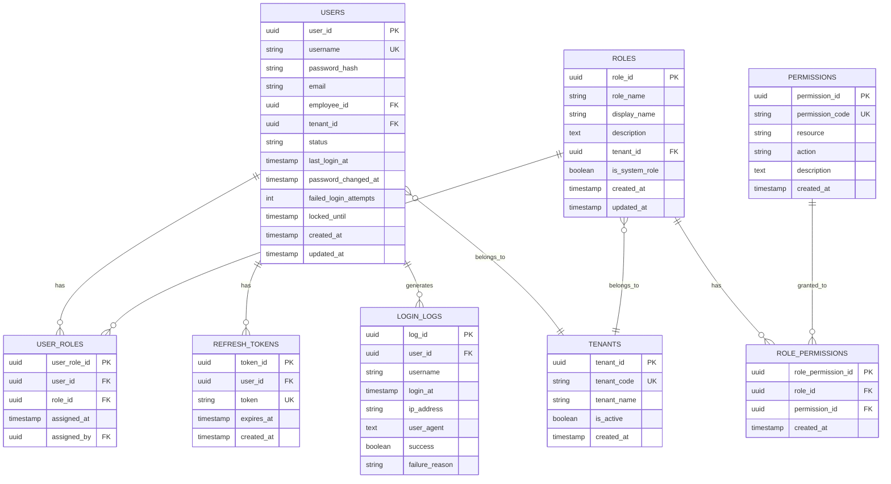

## 6. 資料庫設計

### 6.1 ER Diagram



### 6.2 表結構定義 (DDL)

#### 6.2.1 users (使用者表)

```sql
CREATE TABLE users (
    user_id UUID PRIMARY KEY DEFAULT gen_random_uuid(),
    username VARCHAR(255) UNIQUE NOT NULL,
    password_hash VARCHAR(255) NOT NULL,
    email VARCHAR(255) NOT NULL,
    employee_id UUID NOT NULL,
    tenant_id UUID NOT NULL,
    status VARCHAR(20) NOT NULL DEFAULT 'ACTIVE',
    last_login_at TIMESTAMP,
    password_changed_at TIMESTAMP,
    failed_login_attempts INTEGER DEFAULT 0,
    locked_until TIMESTAMP,
    created_at TIMESTAMP DEFAULT CURRENT_TIMESTAMP,
    updated_at TIMESTAMP DEFAULT CURRENT_TIMESTAMP,
    
    CONSTRAINT chk_status CHECK (status IN ('ACTIVE', 'INACTIVE', 'LOCKED')),
    CONSTRAINT chk_email_format CHECK (email ~* '^[A-Za-z0-9._%+-]+@[A-Za-z0-9.-]+\.[A-Za-z]{2,}$')
);

-- 索引
CREATE INDEX idx_users_username ON users(username);
CREATE INDEX idx_users_email ON users(email);
CREATE INDEX idx_users_employee_id ON users(employee_id);
CREATE INDEX idx_users_tenant_id ON users(tenant_id);
CREATE INDEX idx_users_status ON users(status);
CREATE INDEX idx_users_last_login_at ON users(last_login_at);

-- 註解
COMMENT ON TABLE users IS '使用者帳號表';
COMMENT ON COLUMN users.user_id IS '使用者ID (主鍵)';
COMMENT ON COLUMN users.username IS '登入帳號 (通常為email)';
COMMENT ON COLUMN users.password_hash IS 'BCrypt加密後的密碼';
COMMENT ON COLUMN users.employee_id IS '關聯員工ID (外鍵至Organization Service)';
COMMENT ON COLUMN users.tenant_id IS '所屬租戶ID';
COMMENT ON COLUMN users.status IS '帳號狀態: ACTIVE/INACTIVE/LOCKED';
COMMENT ON COLUMN users.failed_login_attempts IS '連續失敗登入次數';
COMMENT ON COLUMN users.locked_until IS '鎖定至何時 (null表示未鎖定)';
```

#### 6.2.2 roles (角色表)

```sql
CREATE TABLE roles (
    role_id UUID PRIMARY KEY DEFAULT gen_random_uuid(),
    role_name VARCHAR(100) NOT NULL,
    display_name VARCHAR(255) NOT NULL,
    description TEXT,
    tenant_id UUID,
    is_system_role BOOLEAN DEFAULT FALSE,
    created_at TIMESTAMP DEFAULT CURRENT_TIMESTAMP,
    updated_at TIMESTAMP DEFAULT CURRENT_TIMESTAMP,
    
    UNIQUE(role_name, tenant_id)
);

-- 索引
CREATE INDEX idx_roles_tenant_id ON roles(tenant_id);
CREATE INDEX idx_roles_is_system_role ON roles(is_system_role);

-- 註解
COMMENT ON TABLE roles IS '角色定義表';
COMMENT ON COLUMN roles.role_name IS '角色代碼 (如: SYSTEM_ADMIN)';
COMMENT ON COLUMN roles.display_name IS '角色顯示名稱';
COMMENT ON COLUMN roles.tenant_id IS '所屬租戶ID (null表示系統預設角色)';
COMMENT ON COLUMN roles.is_system_role IS '是否為系統預設角色 (不可刪除)';
```

#### 6.2.3 permissions (權限表)

```sql
CREATE TABLE permissions (
    permission_id UUID PRIMARY KEY DEFAULT gen_random_uuid(),
    permission_code VARCHAR(255) UNIQUE NOT NULL,
    resource VARCHAR(100) NOT NULL,
    action VARCHAR(100) NOT NULL,
    description TEXT,
    created_at TIMESTAMP DEFAULT CURRENT_TIMESTAMP
);

-- 索引
CREATE INDEX idx_permissions_code ON permissions(permission_code);
CREATE INDEX idx_permissions_resource ON permissions(resource);

-- 註解
COMMENT ON TABLE permissions IS '權限定義表';
COMMENT ON COLUMN permissions.permission_code IS '權限代碼 (格式: resource:action, 如: employee:profile:read)';
COMMENT ON COLUMN permissions.resource IS '資源名稱 (如: employee, attendance)';
COMMENT ON COLUMN permissions.action IS '操作名稱 (如: read, write, approve)';
```

#### 6.2.4 user_roles (使用者角色關聯表)

```sql
CREATE TABLE user_roles (
    user_role_id UUID PRIMARY KEY DEFAULT gen_random_uuid(),
    user_id UUID NOT NULL REFERENCES users(user_id) ON DELETE CASCADE,
    role_id UUID NOT NULL REFERENCES roles(role_id) ON DELETE CASCADE,
    assigned_at TIMESTAMP DEFAULT CURRENT_TIMESTAMP,
    assigned_by UUID REFERENCES users(user_id),
    
    UNIQUE(user_id, role_id)
);

-- 索引
CREATE INDEX idx_user_roles_user_id ON user_roles(user_id);
CREATE INDEX idx_user_roles_role_id ON user_roles(role_id);

-- 註解
COMMENT ON TABLE user_roles IS '使用者角色關聯表';
COMMENT ON COLUMN user_roles.assigned_by IS '指派者ID';
```

#### 6.2.5 role_permissions (角色權限關聯表)

```sql
CREATE TABLE role_permissions (
    role_permission_id UUID PRIMARY KEY DEFAULT gen_random_uuid(),
    role_id UUID NOT NULL REFERENCES roles(role_id) ON DELETE CASCADE,
    permission_id UUID NOT NULL REFERENCES permissions(permission_id) ON DELETE CASCADE,
    created_at TIMESTAMP DEFAULT CURRENT_TIMESTAMP,
    
    UNIQUE(role_id, permission_id)
);

-- 索引
CREATE INDEX idx_role_permissions_role_id ON role_permissions(role_id);
CREATE INDEX idx_role_permissions_permission_id ON role_permissions(permission_id);

-- 註解
COMMENT ON TABLE role_permissions IS '角色權限關聯表';
```

#### 6.2.6 refresh_tokens (刷新Token表)

```sql
CREATE TABLE refresh_tokens (
    token_id UUID PRIMARY KEY DEFAULT gen_random_uuid(),
    user_id UUID NOT NULL REFERENCES users(user_id) ON DELETE CASCADE,
    token VARCHAR(512) UNIQUE NOT NULL,
    expires_at TIMESTAMP NOT NULL,
    created_at TIMESTAMP DEFAULT CURRENT_TIMESTAMP
);

-- 索引
CREATE INDEX idx_refresh_tokens_user_id ON refresh_tokens(user_id);
CREATE INDEX idx_refresh_tokens_token ON refresh_tokens(token);
CREATE INDEX idx_refresh_tokens_expires_at ON refresh_tokens(expires_at);

-- 註解
COMMENT ON TABLE refresh_tokens IS 'Refresh Token儲存表';
COMMENT ON COLUMN refresh_tokens.token IS 'Refresh Token字串';
COMMENT ON COLUMN refresh_tokens.expires_at IS '過期時間 (通常7天)';
```

#### 6.2.7 login_logs (登入日誌表)

```sql
CREATE TABLE login_logs (
    log_id UUID PRIMARY KEY DEFAULT gen_random_uuid(),
    user_id UUID REFERENCES users(user_id),
    username VARCHAR(255) NOT NULL,
    login_at TIMESTAMP DEFAULT CURRENT_TIMESTAMP,
    ip_address VARCHAR(50),
    user_agent TEXT,
    success BOOLEAN NOT NULL,
    failure_reason VARCHAR(255)
);

-- 索引
CREATE INDEX idx_login_logs_user_id ON login_logs(user_id);
CREATE INDEX idx_login_logs_username ON login_logs(username);
CREATE INDEX idx_login_logs_login_at ON login_logs(login_at);
CREATE INDEX idx_login_logs_success ON login_logs(success);
CREATE INDEX idx_login_logs_ip_address ON login_logs(ip_address);

-- 註解
COMMENT ON TABLE login_logs IS '登入日誌表 (用於審計)';
COMMENT ON COLUMN login_logs.success IS '登入是否成功';
COMMENT ON COLUMN login_logs.failure_reason IS '失敗原因 (如: INVALID_PASSWORD, ACCOUNT_LOCKED)';

-- 分區表 (按月分區，提升查詢效能)
CREATE TABLE login_logs_y2025m01 PARTITION OF login_logs
    FOR VALUES FROM ('2025-01-01') TO ('2025-02-01');
```

### 6.3 資料字典

| 表名 | 說明 | 預估資料量 | 成長速度 | 保留策略 |
|:---|:---|:---:|:---|:---|
| `users` | 使用者帳號 | 200 | 年增50筆 | 永久保留 |
| `roles` | 角色定義 | 30 | 年增5筆 | 永久保留 |
| `permissions` | 權限定義 | 150 | 年增20筆 | 永久保留 |
| `user_roles` | 使用者角色關聯 | 400 | 年增100筆 | 永久保留 |
| `role_permissions` | 角色權限關聯 | 800 | 年增100筆 | 永久保留 |
| `refresh_tokens` | Refresh Token | 500 | - | 自動過期清理 |
| `login_logs` | 登入日誌 | 10,000 | 月增10,000筆 | 保留2年後歸檔 |

### 6.4 初始化資料腳本

#### 6.4.1 系統預設角色

```sql
-- 插入系統預設角色
INSERT INTO roles (role_id, role_name, display_name, description, tenant_id, is_system_role) VALUES
('00000000-0000-0000-0000-000000000001', 'SYSTEM_ADMIN', '系統管理員', '最高權限，可管理所有功能', NULL, TRUE),
('00000000-0000-0000-0000-000000000002', 'HR_ADMIN', '人資管理員', '人資全功能權限', NULL, TRUE),
('00000000-0000-0000-0000-000000000003', 'HR_STAFF', '人資專員', '人資部分功能權限', NULL, TRUE),
('00000000-0000-0000-0000-000000000004', 'FINANCE_ADMIN', '財務管理員', '財務全功能權限', NULL, TRUE),
('00000000-0000-0000-0000-000000000005', 'DEPT_MANAGER', '部門主管', '部門管理權限', NULL, TRUE),
('00000000-0000-0000-0000-000000000006', 'PM', '專案經理', '專案管理權限', NULL, TRUE),
('00000000-0000-0000-0000-000000000007', 'EMPLOYEE', '一般員工', '基本功能權限', NULL, TRUE);
```

#### 6.4.2 系統預設權限

```sql
-- IAM相關權限
INSERT INTO permissions (permission_code, resource, action, description) VALUES
('user:read', 'user', 'read', '查看使用者資料'),
('user:create', 'user', 'create', '建立使用者'),
('user:write', 'user', 'write', '編輯使用者'),
('user:delete', 'user', 'delete', '刪除使用者'),
('user:deactivate', 'user', 'deactivate', '停用使用者'),
('user:reset-password', 'user', 'reset-password', '重置使用者密碼'),
('user:assign-role', 'user', 'assign-role', '指派角色給使用者'),

('role:read', 'role', 'read', '查看角色'),
('role:create', 'role', 'create', '建立角色'),
('role:write', 'role', 'write', '編輯角色'),
('role:delete', 'role', 'delete', '刪除角色'),
('role:manage-permission', 'role', 'manage-permission', '管理角色權限'),

('permission:read', 'permission', 'read', '查看權限列表');

-- 員工管理相關權限
INSERT INTO permissions (permission_code, resource, action, description) VALUES
('employee:profile:read', 'employee', 'profile:read', '查看員工資料'),
('employee:profile:write', 'employee', 'profile:write', '編輯員工資料'),
('employee:profile:delete', 'employee', 'profile:delete', '刪除員工'),
('employee:salary:read', 'employee', 'salary:read', '查看員工薪資');

-- 考勤管理相關權限
INSERT INTO permissions (permission_code, resource, action, description) VALUES
('attendance:leave:read', 'attendance', 'leave:read', '查看請假記錄'),
('attendance:leave:apply', 'attendance', 'leave:apply', '申請請假'),
('attendance:leave:approve', 'attendance', 'leave:approve', '審核請假'),
('attendance:overtime:read', 'attendance', 'overtime:read', '查看加班記錄'),
('attendance:overtime:apply', 'attendance', 'overtime:apply', '申請加班'),
('attendance:overtime:approve', 'attendance', 'overtime:approve', '審核加班');
```

---

## 7. Domain設計

### 7.1 聚合根 (Aggregate Root)

#### 7.1.1 User聚合根

**職責:** 管理使用者帳號、密碼、狀態與登入行為

**屬性:**
```java
@Entity
@Table(name = "users")
public class User {
    @EmbeddedId
    private UserId id;
    
    @Column(unique = true, nullable = false)
    private String username;
    
    @Embedded
    private Password password;
    
    @Embedded
    private Email email;
    
    @Column(name = "employee_id", nullable = false)
    private UUID employeeId;
    
    @Column(name = "tenant_id", nullable = false)
    private UUID tenantId;
    
    @Enumerated(EnumType.STRING)
    private UserStatus status;
    
    @Column(name = "last_login_at")
    private LocalDateTime lastLoginAt;
    
    @Column(name = "password_changed_at")
    private LocalDateTime passwordChangedAt;
    
    @Column(name = "failed_login_attempts")
    private int failedLoginAttempts;
    
    @Column(name = "locked_until")
    private LocalDateTime lockedUntil;
    
    @Column(name = "created_at")
    private LocalDateTime createdAt;
    
    @Column(name = "updated_at")
    private LocalDateTime updatedAt;
    
    // Domain行為
    public void authenticate(String rawPassword, PasswordEncoder encoder) {
        if (!status.canLogin()) {
            throw new DomainException("帳號狀態不允許登入");
        }
        
        if (isLocked()) {
            throw new AccountLockedException("帳號已被鎖定至 " + lockedUntil);
        }
        
        if (!password.matches(rawPassword, encoder)) {
            recordLoginFailure();
            throw new InvalidCredentialsException("密碼錯誤");
        }
        
        recordLoginSuccess();
    }
    
    public void changePassword(String oldPassword, String newPassword, PasswordEncoder encoder) {
        // 驗證舊密碼
        if (!password.matches(oldPassword, encoder)) {
            throw new DomainException("舊密碼錯誤");
        }
        
        // 驗證新密碼強度
        Password newPasswordObj = Password.create(newPassword);
        
        // 新密碼不能與舊密碼相同
        if (password.equals(newPasswordObj)) {
            throw new DomainException("新密碼不能與舊密碼相同");
        }
        
        this.password = newPasswordObj.encode(encoder);
        this.passwordChangedAt = LocalDateTime.now();
        this.updatedAt = LocalDateTime.now();
    }
    
    public void resetPassword(String newPassword, PasswordEncoder encoder) {
        Password newPasswordObj = Password.create(newPassword);
        this.password = newPasswordObj.encode(encoder);
        this.passwordChangedAt = LocalDateTime.now();
        this.updatedAt = LocalDateTime.now();
    }
    
    public void deactivate() {
        if (status == UserStatus.INACTIVE) {
            throw new DomainException("帳號已停用");
        }
        this.status = UserStatus.INACTIVE;
        this.updatedAt = LocalDateTime.now();
    }
    
    public void activate() {
        this.status = UserStatus.ACTIVE;
        this.failedLoginAttempts = 0;
        this.lockedUntil = null;
        this.updatedAt = LocalDateTime.now();
    }
    
    private void recordLoginSuccess() {
        this.lastLoginAt = LocalDateTime.now();
        this.failedLoginAttempts = 0;
        this.lockedUntil = null;
        this.updatedAt = LocalDateTime.now();
    }
    
    private void recordLoginFailure() {
        this.failedLoginAttempts++;
        
        // 連續失敗5次，鎖定30分鐘
        if (this.failedLoginAttempts >= 5) {
            this.status = UserStatus.LOCKED;
            this.lockedUntil = LocalDateTime.now().plusMinutes(30);
        }
        
        this.updatedAt = LocalDateTime.now();
    }
    
    private boolean isLocked() {
        if (status == UserStatus.LOCKED && lockedUntil != null) {
            if (LocalDateTime.now().isAfter(lockedUntil)) {
                // 鎖定時間已過，自動解鎖
                activate();
                return false;
            }
            return true;
        }
        return false;
    }
}
```

**不變性規則 (Invariants):**
- ✅ username必須唯一且不可為空
- ✅ 密碼必須符合強度規則（至少8字元、含大小寫字母、數字）
- ✅ 連續失敗登入5次後自動鎖定帳號30分鐘
- ✅ INACTIVE或LOCKED狀態的使用者不可登入
- ✅ employeeId必須存在於Organization Service

---

*（文件持續中，下一部分將包含Role聚合根、值對象、領域事件、完整API規格等）*
