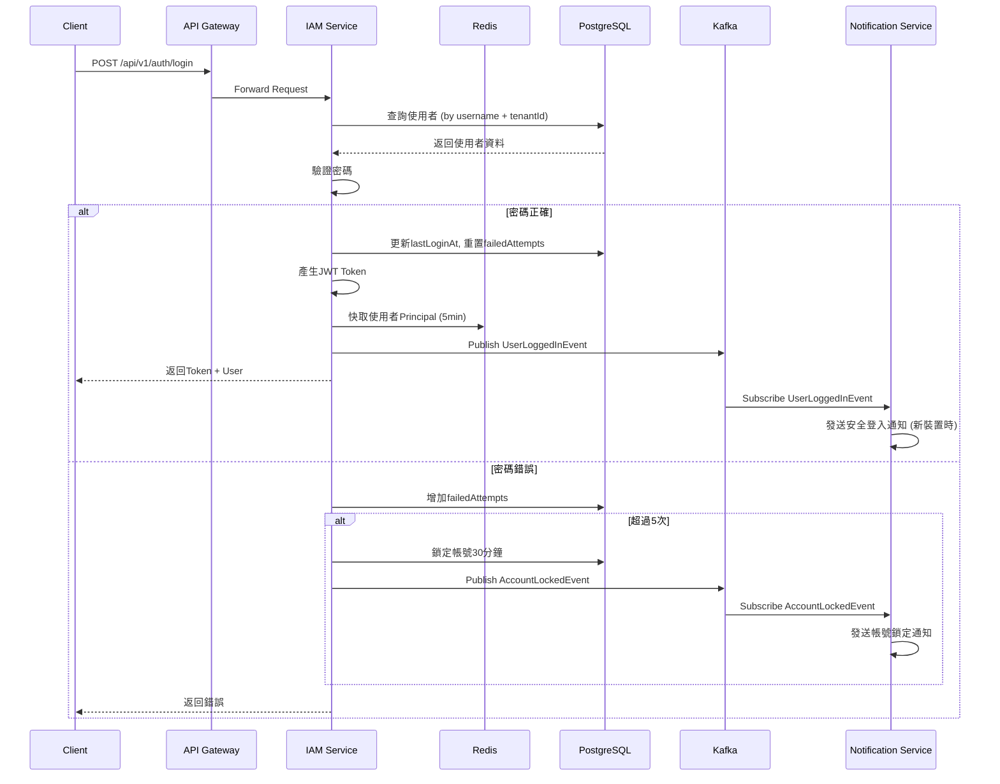
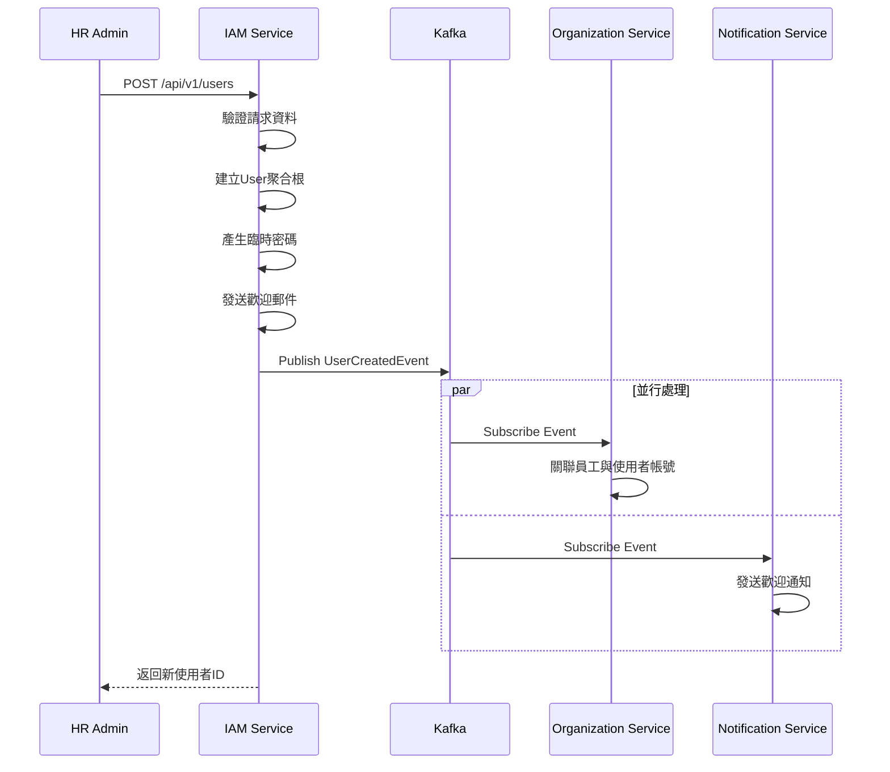

## 7.2 Role聚合根

**職責:** 管理角色定義與權限分配

**屬性:**
```java
@Entity
@Table(name = "roles")
public class Role {
    @EmbeddedId
    private RoleId id;

    @Column(name = "role_name", nullable = false)
    private String roleName;

    @Column(name = "display_name", nullable = false)
    private String displayName;

    @Column(name = "description")
    private String description;

    @Column(name = "tenant_id")
    private UUID tenantId;

    @Column(name = "is_system_role")
    private boolean isSystemRole;

    @OneToMany(cascade = CascadeType.ALL, orphanRemoval = true)
    @JoinColumn(name = "role_id")
    private Set<RolePermission> permissions = new HashSet<>();

    @Column(name = "created_at")
    private LocalDateTime createdAt;

    @Column(name = "updated_at")
    private LocalDateTime updatedAt;

    // ========== Factory Method ==========

    public static Role create(CreateRoleCommand cmd) {
        Objects.requireNonNull(cmd.getRoleName(), "角色代碼不可為空");
        Objects.requireNonNull(cmd.getDisplayName(), "角色名稱不可為空");

        Role role = new Role();
        role.id = RoleId.generate();
        role.roleName = cmd.getRoleName();
        role.displayName = cmd.getDisplayName();
        role.description = cmd.getDescription();
        role.tenantId = cmd.getTenantId();
        role.isSystemRole = false;
        role.createdAt = LocalDateTime.now();
        role.updatedAt = LocalDateTime.now();

        DomainEventPublisher.publish(new RoleCreatedEvent(
            role.id.getValue(),
            role.roleName,
            role.displayName
        ));

        return role;
    }

    // ========== Domain行為 ==========

    /**
     * 新增權限
     */
    public void grantPermission(Permission permission) {
        if (this.permissions.stream().anyMatch(p ->
            p.getPermissionId().equals(permission.getId()))) {
            return; // 已存在則跳過
        }

        RolePermission rp = new RolePermission(this.id, permission.getId());
        this.permissions.add(rp);
        this.updatedAt = LocalDateTime.now();

        DomainEventPublisher.publish(new RolePermissionChangedEvent(
            this.id.getValue(),
            "GRANT",
            permission.getPermissionCode()
        ));
    }

    /**
     * 移除權限
     */
    public void revokePermission(PermissionId permissionId) {
        boolean removed = this.permissions.removeIf(p ->
            p.getPermissionId().equals(permissionId));

        if (removed) {
            this.updatedAt = LocalDateTime.now();

            DomainEventPublisher.publish(new RolePermissionChangedEvent(
                this.id.getValue(),
                "REVOKE",
                permissionId.getValue().toString()
            ));
        }
    }

    /**
     * 批次更新權限
     */
    public void updatePermissions(Set<Permission> newPermissions) {
        this.permissions.clear();
        newPermissions.forEach(this::grantPermission);
        this.updatedAt = LocalDateTime.now();
    }

    /**
     * 更新角色資訊
     */
    public void update(UpdateRoleCommand cmd) {
        if (this.isSystemRole) {
            throw new DomainException("系統預設角色不可修改");
        }

        if (cmd.getDisplayName() != null) {
            this.displayName = cmd.getDisplayName();
        }
        if (cmd.getDescription() != null) {
            this.description = cmd.getDescription();
        }
        this.updatedAt = LocalDateTime.now();
    }

    /**
     * 刪除檢查
     */
    public void validateDeletion() {
        if (this.isSystemRole) {
            throw new DomainException("系統預設角色不可刪除");
        }
    }

    /**
     * 檢查是否擁有指定權限
     */
    public boolean hasPermission(String permissionCode) {
        return this.permissions.stream()
            .anyMatch(p -> p.getPermissionCode().equals(permissionCode));
    }
}
```

**不變性規則 (Invariants):**
- ✅ roleName在同一tenant內必須唯一
- ✅ 系統預設角色(isSystemRole=true)不可修改或刪除
- ✅ 角色至少需要一個權限才能使用

---

## 7.3 值對象 (Value Objects)

### 7.3.1 UserId

```java
@Embeddable
public class UserId implements Serializable {
    @Column(name = "user_id")
    private UUID value;

    protected UserId() {}

    private UserId(UUID value) {
        this.value = Objects.requireNonNull(value, "UserId不可為空");
    }

    public static UserId generate() {
        return new UserId(UUID.randomUUID());
    }

    public static UserId of(String id) {
        return new UserId(UUID.fromString(id));
    }

    public static UserId of(UUID id) {
        return new UserId(id);
    }

    public UUID getValue() {
        return value;
    }

    @Override
    public boolean equals(Object o) {
        if (this == o) return true;
        if (o == null || getClass() != o.getClass()) return false;
        UserId userId = (UserId) o;
        return Objects.equals(value, userId.value);
    }

    @Override
    public int hashCode() {
        return Objects.hash(value);
    }

    @Override
    public String toString() {
        return value.toString();
    }
}
```

### 7.3.2 Email

```java
@Embeddable
public class Email implements Serializable {
    private static final String EMAIL_REGEX = "^[A-Za-z0-9+_.-]+@(.+)$";
    private static final Pattern EMAIL_PATTERN = Pattern.compile(EMAIL_REGEX);

    @Column(name = "email")
    private String value;

    protected Email() {}

    public Email(String value) {
        Objects.requireNonNull(value, "Email不可為空");

        if (!EMAIL_PATTERN.matcher(value).matches()) {
            throw new InvalidEmailException("Email格式不正確: " + value);
        }

        this.value = value.toLowerCase().trim();
    }

    public String getValue() {
        return value;
    }

    public String getDomain() {
        return value.substring(value.indexOf("@") + 1);
    }

    @Override
    public boolean equals(Object o) {
        if (this == o) return true;
        if (o == null || getClass() != o.getClass()) return false;
        Email email = (Email) o;
        return Objects.equals(value, email.value);
    }

    @Override
    public int hashCode() {
        return Objects.hash(value);
    }

    @Override
    public String toString() {
        return value;
    }
}
```

### 7.3.3 Password

```java
@Embeddable
public class Password implements Serializable {
    private static final int MIN_LENGTH = 8;
    private static final int MAX_LENGTH = 128;
    private static final String PATTERN = "^(?=.*[a-z])(?=.*[A-Z])(?=.*\\d).+$";

    @Column(name = "password_hash")
    private String hash;

    protected Password() {}

    private Password(String hash) {
        this.hash = hash;
    }

    /**
     * 建立密碼（未加密）
     */
    public static Password create(String rawPassword) {
        Objects.requireNonNull(rawPassword, "密碼不可為空");

        if (rawPassword.length() < MIN_LENGTH) {
            throw new WeakPasswordException("密碼長度至少需要" + MIN_LENGTH + "個字元");
        }

        if (rawPassword.length() > MAX_LENGTH) {
            throw new WeakPasswordException("密碼長度不可超過" + MAX_LENGTH + "個字元");
        }

        if (!rawPassword.matches(PATTERN)) {
            throw new WeakPasswordException("密碼必須包含大小寫字母和數字");
        }

        return new Password(rawPassword); // 暫存未加密密碼
    }

    /**
     * 加密密碼
     */
    public Password encode(PasswordEncoder encoder) {
        return new Password(encoder.encode(this.hash));
    }

    /**
     * 驗證密碼
     */
    public boolean matches(String rawPassword, PasswordEncoder encoder) {
        return encoder.matches(rawPassword, this.hash);
    }

    public String getHash() {
        return hash;
    }

    @Override
    public boolean equals(Object o) {
        if (this == o) return true;
        if (o == null || getClass() != o.getClass()) return false;
        Password password = (Password) o;
        return Objects.equals(hash, password.hash);
    }

    @Override
    public int hashCode() {
        return Objects.hash(hash);
    }
}
```

### 7.3.4 RoleId

```java
@Embeddable
public class RoleId implements Serializable {
    @Column(name = "role_id")
    private UUID value;

    protected RoleId() {}

    private RoleId(UUID value) {
        this.value = Objects.requireNonNull(value, "RoleId不可為空");
    }

    public static RoleId generate() {
        return new RoleId(UUID.randomUUID());
    }

    public static RoleId of(String id) {
        return new RoleId(UUID.fromString(id));
    }

    public static RoleId of(UUID id) {
        return new RoleId(id);
    }

    public UUID getValue() {
        return value;
    }

    @Override
    public boolean equals(Object o) {
        if (this == o) return true;
        if (o == null || getClass() != o.getClass()) return false;
        RoleId roleId = (RoleId) o;
        return Objects.equals(value, roleId.value);
    }

    @Override
    public int hashCode() {
        return Objects.hash(value);
    }
}
```

### 7.3.5 UserStatus

```java
public enum UserStatus {
    ACTIVE("啟用", true),
    INACTIVE("停用", false),
    LOCKED("鎖定", false);

    private final String displayName;
    private final boolean canLogin;

    UserStatus(String displayName, boolean canLogin) {
        this.displayName = displayName;
        this.canLogin = canLogin;
    }

    public String getDisplayName() {
        return displayName;
    }

    public boolean canLogin() {
        return canLogin;
    }
}
```

---

## 7.4 領域服務 (Domain Services)

### 7.4.1 AuthenticationDomainService

```java
@Service
public class AuthenticationDomainService {

    private final IUserRepository userRepository;
    private final PasswordEncoder passwordEncoder;
    private final JwtTokenProvider tokenProvider;

    /**
     * 執行登入驗證
     */
    public AuthResult authenticate(String username, String password, UUID tenantId) {
        // 1. 查找使用者
        User user = userRepository.findByUsernameAndTenantId(username, tenantId)
            .orElseThrow(() -> new InvalidCredentialsException("使用者名稱或密碼錯誤"));

        // 2. 驗證密碼（Domain行為）
        user.authenticate(password, passwordEncoder);

        // 3. 儲存更新（lastLoginAt等）
        userRepository.save(user);

        // 4. 產生Token
        String accessToken = tokenProvider.generateAccessToken(user);
        String refreshToken = tokenProvider.generateRefreshToken(user);

        // 5. 記錄登入日誌
        DomainEventPublisher.publish(new UserLoggedInEvent(
            user.getId().getValue(),
            user.getUsername(),
            LocalDateTime.now()
        ));

        return new AuthResult(accessToken, refreshToken, user);
    }

    /**
     * 刷新Token
     */
    public AuthResult refreshToken(String refreshToken) {
        // 驗證refresh token
        Claims claims = tokenProvider.validateRefreshToken(refreshToken);
        UUID userId = UUID.fromString(claims.getSubject());

        User user = userRepository.findById(UserId.of(userId))
            .orElseThrow(() -> new InvalidTokenException("無效的Token"));

        if (!user.getStatus().canLogin()) {
            throw new AccountDisabledException("帳號已停用");
        }

        String newAccessToken = tokenProvider.generateAccessToken(user);
        String newRefreshToken = tokenProvider.generateRefreshToken(user);

        return new AuthResult(newAccessToken, newRefreshToken, user);
    }
}
```

### 7.4.2 AccountLockingDomainService

```java
@Service
public class AccountLockingDomainService {

    private static final int MAX_FAILED_ATTEMPTS = 5;
    private static final int LOCK_DURATION_MINUTES = 30;

    private final IUserRepository userRepository;

    /**
     * 記錄登入失敗
     */
    public void recordLoginFailure(String username, UUID tenantId) {
        userRepository.findByUsernameAndTenantId(username, tenantId)
            .ifPresent(user -> {
                user.recordLoginFailure();
                userRepository.save(user);

                if (user.getStatus() == UserStatus.LOCKED) {
                    DomainEventPublisher.publish(new AccountLockedEvent(
                        user.getId().getValue(),
                        user.getUsername(),
                        user.getLockedUntil()
                    ));
                }
            });
    }

    /**
     * 手動解鎖帳號
     */
    public void unlockAccount(UserId userId) {
        User user = userRepository.findById(userId)
            .orElseThrow(() -> new UserNotFoundException("使用者不存在"));

        user.activate();
        userRepository.save(user);

        DomainEventPublisher.publish(new AccountUnlockedEvent(
            user.getId().getValue(),
            user.getUsername()
        ));
    }
}
```

---

## 8. 領域事件設計

### 8.1 事件清單

| 事件名稱 | 觸發時機 | 發布服務 | 訂閱服務 |
|:---|:---|:---|:---|
| `UserCreatedEvent` | 建立使用者 | IAM | Organization, Notification |
| `UserUpdatedEvent` | 更新使用者資料 | IAM | - |
| `UserDeactivatedEvent` | 停用使用者 | IAM | Notification |
| `UserActivatedEvent` | 啟用使用者 | IAM | - |
| `UserLoggedInEvent` | 登入成功 | IAM | Notification (安全通知) |
| `AccountLockedEvent` | 帳號鎖定 | IAM | Notification |
| `AccountUnlockedEvent` | 帳號解鎖 | IAM | - |
| `PasswordChangedEvent` | 修改密碼 | IAM | Notification |
| `PasswordResetEvent` | 重置密碼 | IAM | Notification |
| `RoleCreatedEvent` | 建立角色 | IAM | - |
| `RoleUpdatedEvent` | 更新角色 | IAM | - |
| `RoleDeletedEvent` | 刪除角色 | IAM | - |
| `RolePermissionChangedEvent` | 角色權限變更 | IAM | - |
| `UserRoleAssignedEvent` | 指派角色給使用者 | IAM | - |
| `UserRoleRevokedEvent` | 移除使用者角色 | IAM | - |

### 8.2 事件Schema

#### UserCreatedEvent

```json
{
  "eventId": "uuid",
  "eventType": "UserCreatedEvent",
  "occurredAt": "2025-01-15T10:30:00Z",
  "aggregateId": "user-uuid",
  "aggregateType": "User",
  "payload": {
    "userId": "uuid",
    "username": "john.doe@company.com",
    "email": "john.doe@company.com",
    "employeeId": "employee-uuid",
    "tenantId": "tenant-uuid",
    "roleIds": ["role-uuid-1", "role-uuid-2"]
  }
}
```

#### UserLoggedInEvent

```json
{
  "eventId": "uuid",
  "eventType": "UserLoggedInEvent",
  "occurredAt": "2025-01-15T10:30:00Z",
  "aggregateId": "user-uuid",
  "aggregateType": "User",
  "payload": {
    "userId": "uuid",
    "username": "john.doe@company.com",
    "loginAt": "2025-01-15T10:30:00Z",
    "ipAddress": "192.168.1.100",
    "userAgent": "Mozilla/5.0..."
  }
}
```

#### AccountLockedEvent

```json
{
  "eventId": "uuid",
  "eventType": "AccountLockedEvent",
  "occurredAt": "2025-01-15T10:30:00Z",
  "aggregateId": "user-uuid",
  "aggregateType": "User",
  "payload": {
    "userId": "uuid",
    "username": "john.doe@company.com",
    "lockedUntil": "2025-01-15T11:00:00Z",
    "reason": "連續登入失敗5次"
  }
}
```

#### RolePermissionChangedEvent

```json
{
  "eventId": "uuid",
  "eventType": "RolePermissionChangedEvent",
  "occurredAt": "2025-01-15T10:30:00Z",
  "aggregateId": "role-uuid",
  "aggregateType": "Role",
  "payload": {
    "roleId": "uuid",
    "roleName": "HR_STAFF",
    "action": "GRANT",
    "permissionCode": "employee:profile:read"
  }
}
```

---

## 9. API設計

### 9.1 Controller命名對照

| Controller | 說明 | 負責頁面 |
|:---|:---|:---|
| `HR01AuthCmdController` | 認證Command操作 | IAM-P01 |
| `HR01UserCmdController` | 使用者Command操作 | IAM-P02 |
| `HR01UserQryController` | 使用者Query操作 | IAM-P02 |
| `HR01RoleCmdController` | 角色Command操作 | IAM-P03 |
| `HR01RoleQryController` | 角色Query操作 | IAM-P03 |
| `HR01PermissionQryController` | 權限Query操作 | IAM-P03 |
| `HR01ProfileCmdController` | 個人資料Command操作 | IAM-P04 |
| `HR01ProfileQryController` | 個人資料Query操作 | IAM-P04 |

### 9.2 API總覽 (24個端點)

| 端點 | 方法 | Controller | 說明 |
|:---|:---:|:---|:---|
| `/api/v1/auth/login` | POST | HR01AuthCmdController | 登入 |
| `/api/v1/auth/logout` | POST | HR01AuthCmdController | 登出 |
| `/api/v1/auth/refresh-token` | POST | HR01AuthCmdController | 刷新Token |
| `/api/v1/auth/forgot-password` | POST | HR01AuthCmdController | 忘記密碼 |
| `/api/v1/auth/reset-password` | POST | HR01AuthCmdController | 重置密碼 |
| `/api/v1/auth/oauth/google` | GET | HR01AuthCmdController | Google OAuth |
| `/api/v1/auth/oauth/google/callback` | GET | HR01AuthCmdController | Google回調 |
| `/api/v1/auth/oauth/microsoft` | GET | HR01AuthCmdController | Microsoft OAuth |
| `/api/v1/auth/oauth/microsoft/callback` | GET | HR01AuthCmdController | Microsoft回調 |
| `/api/v1/users` | GET | HR01UserQryController | 查詢使用者列表 |
| `/api/v1/users/{id}` | GET | HR01UserQryController | 查詢使用者詳情 |
| `/api/v1/users` | POST | HR01UserCmdController | 建立使用者 |
| `/api/v1/users/{id}` | PUT | HR01UserCmdController | 更新使用者 |
| `/api/v1/users/{id}/deactivate` | PUT | HR01UserCmdController | 停用使用者 |
| `/api/v1/users/{id}/activate` | PUT | HR01UserCmdController | 啟用使用者 |
| `/api/v1/users/{id}/reset-password` | PUT | HR01UserCmdController | 管理員重置密碼 |
| `/api/v1/users/{id}/roles` | PUT | HR01UserCmdController | 指派角色 |
| `/api/v1/users/batch-deactivate` | PUT | HR01UserCmdController | 批次停用 |
| `/api/v1/roles` | GET | HR01RoleQryController | 查詢角色列表 |
| `/api/v1/roles/{id}` | GET | HR01RoleQryController | 查詢角色詳情 |
| `/api/v1/roles` | POST | HR01RoleCmdController | 建立角色 |
| `/api/v1/roles/{id}` | PUT | HR01RoleCmdController | 更新角色 |
| `/api/v1/roles/{id}` | DELETE | HR01RoleCmdController | 刪除角色 |
| `/api/v1/roles/{id}/permissions` | PUT | HR01RoleCmdController | 更新角色權限 |
| `/api/v1/permissions` | GET | HR01PermissionQryController | 查詢權限列表 |
| `/api/v1/permissions/tree` | GET | HR01PermissionQryController | 查詢權限樹 |
| `/api/v1/profile` | GET | HR01ProfileQryController | 查詢個人資料 |
| `/api/v1/profile` | PUT | HR01ProfileCmdController | 更新個人資料 |
| `/api/v1/profile/change-password` | PUT | HR01ProfileCmdController | 修改密碼 |

### 9.3 API詳細規格

#### 9.3.1 登入API

**請求:**
```http
POST /api/v1/auth/login
Content-Type: application/json

{
  "username": "john.doe@company.com",
  "password": "Password123!",
  "tenantId": "tenant-uuid"
}
```

**成功回應:**
```json
{
  "code": "SUCCESS",
  "message": "登入成功",
  "data": {
    "accessToken": "eyJhbGciOiJIUzI1NiIs...",
    "refreshToken": "eyJhbGciOiJIUzI1NiIs...",
    "expiresIn": 3600,
    "user": {
      "userId": "uuid",
      "username": "john.doe@company.com",
      "displayName": "John Doe",
      "roles": ["HR_ADMIN", "EMPLOYEE"],
      "permissions": ["user:read", "user:write", ...]
    }
  }
}
```

**錯誤回應:**
```json
{
  "code": "INVALID_CREDENTIALS",
  "message": "使用者名稱或密碼錯誤"
}
```

```json
{
  "code": "ACCOUNT_LOCKED",
  "message": "帳號已被鎖定，請30分鐘後再試",
  "data": {
    "lockedUntil": "2025-01-15T11:00:00Z"
  }
}
```

#### 9.3.2 建立使用者API

**請求:**
```http
POST /api/v1/users
Content-Type: application/json
Authorization: Bearer {accessToken}

{
  "username": "jane.doe@company.com",
  "email": "jane.doe@company.com",
  "employeeId": "employee-uuid",
  "roleIds": ["role-uuid-1", "role-uuid-2"],
  "sendWelcomeEmail": true
}
```

**成功回應:**
```json
{
  "code": "SUCCESS",
  "message": "使用者建立成功",
  "data": {
    "userId": "new-user-uuid"
  }
}
```

#### 9.3.3 更新角色權限API

**請求:**
```http
PUT /api/v1/roles/{roleId}/permissions
Content-Type: application/json
Authorization: Bearer {accessToken}

{
  "permissionIds": [
    "permission-uuid-1",
    "permission-uuid-2",
    "permission-uuid-3"
  ]
}
```

**成功回應:**
```json
{
  "code": "SUCCESS",
  "message": "角色權限更新成功"
}
```

---

## 10. 事件範例

### 10.1 登入流程完整事件



### 10.2 使用者建立與同步事件



---

## 11. 工項清單摘要

### 前端開發工項

| 工項編號 | 工項名稱 | 估計工時 | 優先順序 |
|:---|:---|:---:|:---:|
| FE-01-01 | IAM-P01 登入頁面 | 8h | P0 |
| FE-01-02 | IAM-P02 使用者管理頁面 | 16h | P0 |
| FE-01-03 | IAM-P03 角色權限管理頁面 | 16h | P0 |
| FE-01-04 | IAM-P04 個人資料頁面 | 8h | P1 |
| FE-01-05 | IAM-M01 使用者編輯對話框 | 4h | P0 |
| FE-01-06 | IAM-M02 角色編輯對話框 | 4h | P0 |
| FE-01-07 | IAM-M03 修改密碼對話框 | 4h | P1 |
| FE-01-08 | 權限樹元件開發 | 8h | P0 |
| FE-01-09 | Redux Auth模組 | 8h | P0 |
| FE-01-10 | UserViewModelFactory | 4h | P0 |
| FE-01-11 | RoleViewModelFactory | 4h | P0 |
| **小計** | | **84h** | |

### 後端開發工項

| 工項編號 | 工項名稱 | 估計工時 | 優先順序 |
|:---|:---|:---:|:---:|
| BE-01-01 | User聚合根與Repository | 16h | P0 |
| BE-01-02 | Role聚合根與Repository | 8h | P0 |
| BE-01-03 | Permission Entity與Repository | 4h | P0 |
| BE-01-04 | 值對象實作 (Email, Password等) | 8h | P0 |
| BE-01-05 | AuthenticationDomainService | 8h | P0 |
| BE-01-06 | AccountLockingDomainService | 4h | P0 |
| BE-01-07 | JwtTokenProvider | 8h | P0 |
| BE-01-08 | 認證API (5端點) | 16h | P0 |
| BE-01-09 | 使用者API (8端點) | 16h | P0 |
| BE-01-10 | 角色API (5端點) | 8h | P0 |
| BE-01-11 | 權限API (2端點) | 4h | P1 |
| BE-01-12 | 個人資料API (3端點) | 4h | P1 |
| BE-01-13 | OAuth2整合 (Google, Microsoft) | 16h | P2 |
| BE-01-14 | 領域事件發布 | 8h | P0 |
| BE-01-15 | Swagger文件 | 4h | P1 |
| **小計** | | **132h** | |

### 資料庫開發工項

| 工項編號 | 工項名稱 | 估計工時 | 優先順序 |
|:---|:---|:---:|:---:|
| DB-01-01 | 建立7個資料表DDL | 4h | P0 |
| DB-01-02 | 建立索引 | 2h | P0 |
| DB-01-03 | 初始化系統角色資料 | 2h | P0 |
| DB-01-04 | 初始化權限資料 | 2h | P0 |
| DB-01-05 | 登入日誌分區表 | 2h | P1 |
| **小計** | | **12h** | |

### 測試開發工項

| 工項編號 | 工項名稱 | 估計工時 | 優先順序 |
|:---|:---|:---:|:---:|
| TE-01-01 | User聚合根單元測試 | 8h | P0 |
| TE-01-02 | Role聚合根單元測試 | 4h | P0 |
| TE-01-03 | 值對象單元測試 | 4h | P0 |
| TE-01-04 | 認證API整合測試 | 8h | P0 |
| TE-01-05 | 使用者API整合測試 | 8h | P0 |
| TE-01-06 | 角色API整合測試 | 4h | P0 |
| TE-01-07 | 前端Factory測試 | 4h | P0 |
| TE-01-08 | 前端Component測試 | 8h | P0 |
| TE-01-09 | E2E登入流程測試 | 8h | P1 |
| **小計** | | **56h** | |

### 總計

| 類別 | 工時 |
|:---|:---:|
| 前端開發 | 84h |
| 後端開發 | 132h |
| 資料庫開發 | 12h |
| 測試開發 | 56h |
| **合計** | **284h** |

---

**文件完成日期:** 2025-12-26
**版本:** 1.0
