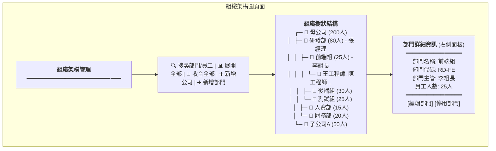
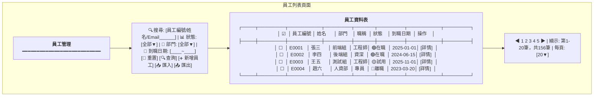
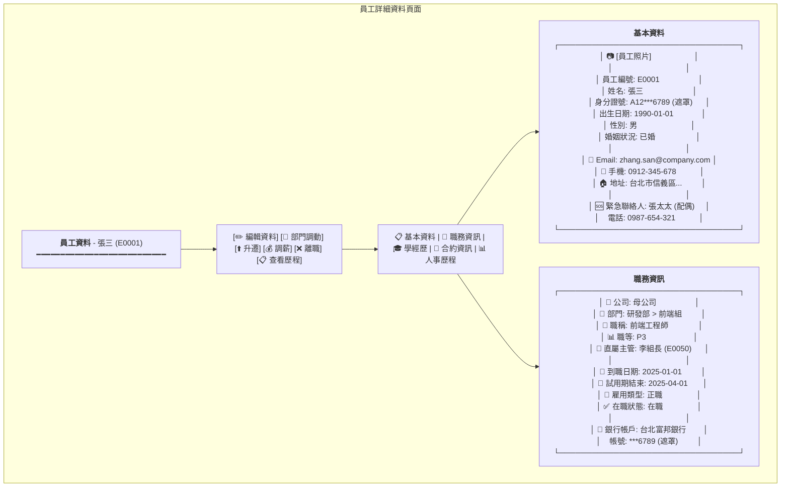
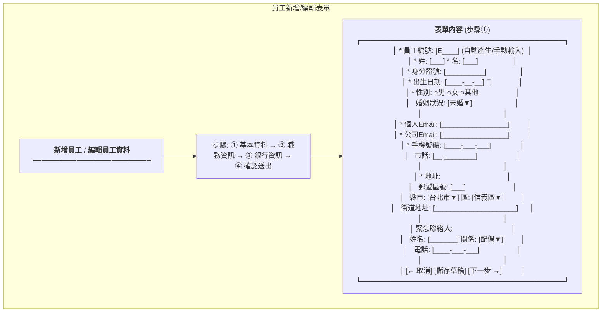
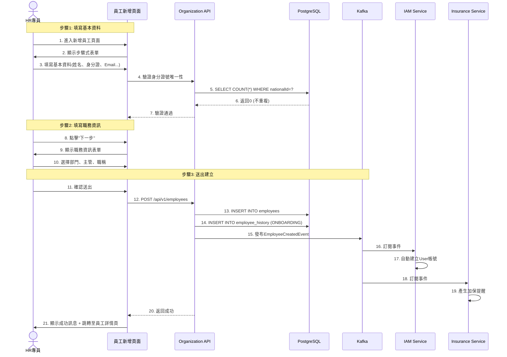
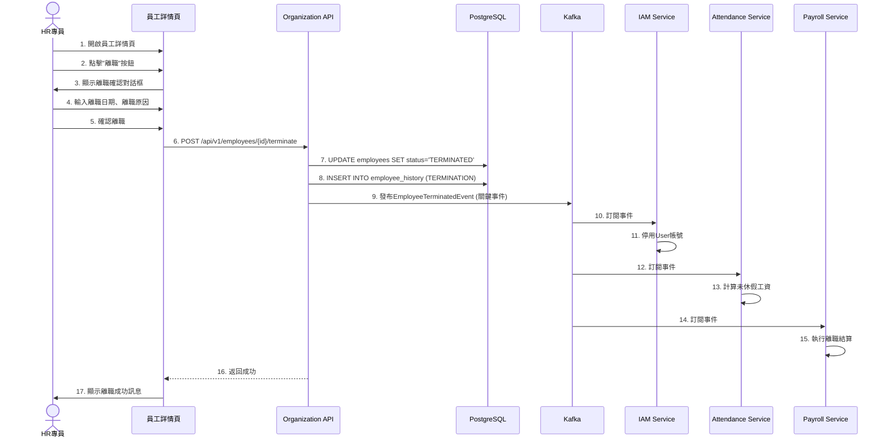

# 組織員工服務系統設計書

**版本:** 1.0  
**日期:** 2025-12-05  
**目標:** 提供工程師完整的系統實作規格,供PM建立工項清單

---

## 目錄

1. [服務概述](#1-服務概述)
2. [UI設計](#2-ui設計)
3. [UX流程設計](#3-ux流程設計)
4. [畫面事件說明](#4-畫面事件說明)
5. [Data Flow設計](#5-data-flow設計)
6. [資料庫設計](#6-資料庫設計)
7. [Domain設計](#7-domain設計)
8. [領域事件設計](#8-領域事件設計)
9. [API設計](#9-api設計)
10. [事件範例](#10-事件範例)

---

## 1. 服務概述

### 1.1 服務定位
組織員工服務是HR系統的**核心主數據服務**,負責管理集團組織架構與員工全生命週期資料。這是整個系統的**資料源頭**。

### 1.2 核心功能
- ✅ 組織架構管理(母子公司、多層級部門)
- ✅ 員工主檔管理(基本資料、聯絡方式、學經歷)
- ✅ 員工生命週期(到職、試用、轉正、調薪、升遷、調動、離職)
- ✅ 合約管理(員工合約類型、期限、附件)
- ✅ ESS員工自助服務(個人資料變更、證明文件申請)
- ✅ 數據同步(發布員工異動事件)

### 1.3 技術架構
- **前端**: ReactJS + Redux + Ant Design + Ant Design Pro
- **後端**: Spring Boot 3.1.x + MyBatis
- **資料庫**: PostgreSQL 15.x
- **檔案儲存**: MinIO / AWS S3
- **事件匯流排**: Kafka

---

## 2. UI設計

### 2.1 頁面清單

| 頁面代碼 | 頁面名稱 | 路由 | 權限要求 |
|:---|:---|:---|:---:|
| `HR02-P01` | 組織架構圖頁面 | `/admin/organization` | organization:read |
| `HR02-P02` | 部門管理頁面 | `/admin/departments` | department:read |
| `HR02-P03` | 員工列表頁面 | `/admin/employees` | employee:read |
| `HR02-P04` | 員工詳細資料頁面 | `/admin/employees/:id` | employee:read |
| `HR02-P05` | 員工新增頁面 | `/admin/employees/new` | employee:create |
| `HR02-P06` | 員工編輯頁面 | `/admin/employees/:id/edit` | employee:update |
| `HR02-P07` | 員工人事歷程頁面 | `/admin/employees/:id/history` | employee:read |
| `HR02-P08` | 我的資料頁面(ESS) | `/profile` | - |
| `HR02-P09` | 證明文件申請頁面(ESS) | `/profile/certificates` | -|


### 2.2 UI線稿 (Mermaid)

#### 2.2.1 組織架構圖頁面 (HR02-P01)



**頁面元素說明:**
- **工具列**
  - 搜尋框: 可搜尋部門名稱或員工姓名
  - 展開/收合按鈕: 控制樹狀結構展開層級
  - 新增公司按鈕: 開啟新增公司對話框
  - 新增部門按鈕: 開啟新增部門對話框

- **組織樹**
  - 樹狀結構顯示: 公司 > 部門 > 子部門 > 員工
  - 每個節點顯示: 圖示 + 名稱 + 人數 + 主管
  - 可拖曳調整部門順序
  - 點擊節點顯示詳細資訊

- **詳細資訊面板** (右側)
  - 顯示選中部門的詳細資訊
  - 編輯/停用按鈕

**元件規格:**
```typescript
interface OrganizationTreeNode {
  id: string;
  type: 'organization' | 'department' | 'employee';
  name: string;
  code?: string;
  managerId?: string;
  managerName?: string;
  employeeCount: number;
  level: number;
  children?: OrganizationTreeNode[];
}
```

#### 2.2.2 員工列表頁面 (HR02-P03)



**頁面元素說明:**
- **篩選工具列**
  - 搜尋框: 支援員工編號、姓名、Email模糊搜尋
  - 狀態下拉: 全部/在職/試用/留停/離職
  - 部門下拉: 動態載入部門樹
  - 到職日期範圍選擇器
  - 新增員工按鈕: 跳轉至新增頁面
  - 匯入/匯出按鈕: Excel批次處理

- **員工表格**
  - 批次選擇核取方塊
  - 員工編號 (可點擊查看詳情)
  - 姓名 (可點擊查看詳情)
  - 部門 (顯示完整路徑: 研發部>前端組)
  - 職稱
  - 狀態徽章 (不同顏色)
  - 到職日期
  - 操作按鈕: 詳情/編輯/調動/離職

- **分頁控制**
  - 頁碼切換
  - 總筆數顯示
  - 每頁筆數選擇

**元件規格:**
```typescript
interface EmployeeListItem {
  employeeId: string;
  employeeNumber: string;
  fullName: string;
  departmentPath: string;  // "研發部 > 前端組"
  jobTitle: string;
  employmentStatus: EmploymentStatus;
  hireDate: string;
  photoUrl?: string;
}

interface EmployeeQueryParams {
  search?: string;
  status?: EmploymentStatus;
  departmentId?: string;
  hireDateFrom?: string;
  hireDateTo?: string;
  page: number;
  size: number;
}
```

#### 2.2.3 員工詳細資料頁面 (HR02-P04)



**頁面元素說明:**
- **操作按鈕列**
  - 編輯資料: 跳轉至編輯頁面
  - 部門調動: 開啟調動對話框
  - 升遷: 開啟升遷對話框
  - 調薪: 開啟調薪對話框
  - 離職: 開啟離職確認對話框
  - 查看歷程: 切換至人事歷程Tab

- **Tab頁籤**
  - 基本資料: 個人資訊、聯絡方式
  - 職務資訊: 組織關係、職務、薪資
  - 學經歷: 教育背景、工作經驗
  - 合約資訊: 勞動合約詳情
  - 人事歷程: 所有異動記錄

- **資料顯示**
  - 敏感資料遮罩 (身分證號、銀行帳號)
  - 員工照片顯示
  - 關聯資料可點擊 (如主管、部門)

**元件規格:**
```typescript
interface EmployeeDetail {
  // 基本資料
  employeeId: string;
  employeeNumber: string;
  fullName: string;
  nationalId: string;  // 後端已遮罩
  dateOfBirth: string;
  gender: Gender;
  maritalStatus: MaritalStatus;
  photoUrl?: string;
  
  // 聯絡方式
  companyEmail: string;
  personalEmail: string;
  mobilePhone: string;
  address: Address;
  emergencyContact: EmergencyContact;
  
  // 職務資訊
  organization: {
    organizationId: string;
    organizationName: string;
  };
  department: {
    departmentId: string;
    departmentPath: string;
  };
  manager?: {
    employeeId: string;
    fullName: string;
  };
  jobTitle: string;
  jobLevel: string;
  employmentType: EmploymentType;
  employmentStatus: EmploymentStatus;
  hireDate: string;
  probationEndDate?: string;
  
  // 銀行資訊
  bankAccount: {
    bankName: string;
    accountNumber: string;  // 後端已遮罩
  };
}
```

#### 2.2.4 員工新增/編輯表單 (HR02-P05/HR02-P06)



**表單步驟說明:**

**步驟①: 基本資料**
- 員工編號 (必填): 自動產生或手動輸入
- 姓名 (必填): 分姓、名兩欄
- 身分證號 (必填): 格式驗證
- 出生日期 (必填): 日期選擇器
- 性別 (必填): 單選
- 婚姻狀況: 下拉選擇
- Email (必填): 格式驗證、唯一性檢查
- 手機 (必填): 格式驗證
- 地址 (必填): 郵遞區號、縣市區、街道
- 緊急聯絡人: 姓名、關係、電話

**步驟②: 職務資訊**
```
* 公司: [母公司▼]
* 部門: [研發部 > 前端組▼] (樹狀選擇器)
* 直屬主管: [李組長▼] (搜尋選擇)
* 職稱: [前端工程師]
* 職等: [P3▼]
* 雇用類型: ○正職 ○約聘 ○兼職 ○實習
* 到職日期: [____-__-__] 📅
* 試用期: [3] 個月
```

**步驟③: 銀行資訊**
```
* 銀行: [台北富邦銀行▼]
* 分行代碼: [___]
* 帳號: [______________]
* 戶名: [張三] (自動帶入姓名)
```

**步驟④: 確認送出**
- 顯示所有填寫資料摘要
- 確認無誤後送出

**表單驗證規則:**
```typescript
interface EmployeeFormValidation {
  employeeNumber: {
    required: true;
    pattern: /^E\d{4}$/;
    unique: true;  // 後端檢查
  };
  nationalId: {
    required: true;
    pattern: /^[A-Z]\d{9}$/;
    unique: true;
  };
  companyEmail: {
    required: true;
    email: true;
    unique: true;
  };
  mobilePhone: {
    required: true;
    pattern: /^09\d{8}$/;
  };
  hireDate: {
    required: true;
    notFuture: true;  // 不可為未來日期
  };
}
```

---

## 3. UX流程設計

### 3.1 員工到職流程



**關鍵點:**
- ✅ 步驟式表單提升使用者體驗
- ✅ 即時驗證身分證號、Email唯一性
- ✅ 自動發布EmployeeCreatedEvent
- ✅ IAM Service自動建立使用者帳號
- ✅ Insurance Service自動產生加保提醒

### 3.2 員工離職流程



**關鍵點:**
- ✅ 離職需二次確認
- ✅ EmployeeTerminatedEvent是系統中最重要的事件之一
- ✅ 觸發多個服務的連鎖反應
- ✅ IAM停用帳號、Attendance計算未休假、Payroll執行結算

---

*（文件持續，下一部分包含畫面事件、資料庫設計、Domain設計、API規格等）*
