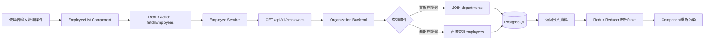
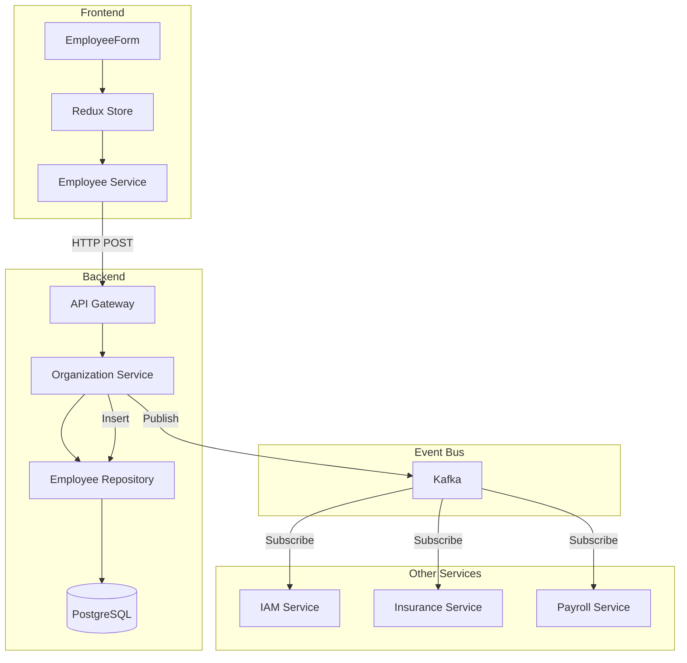
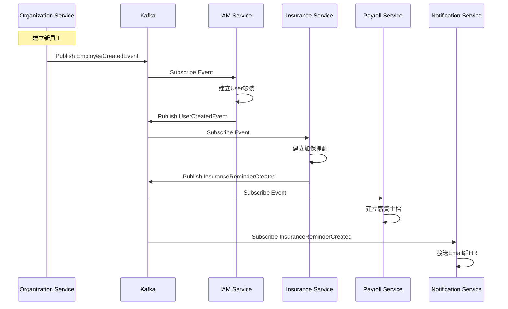
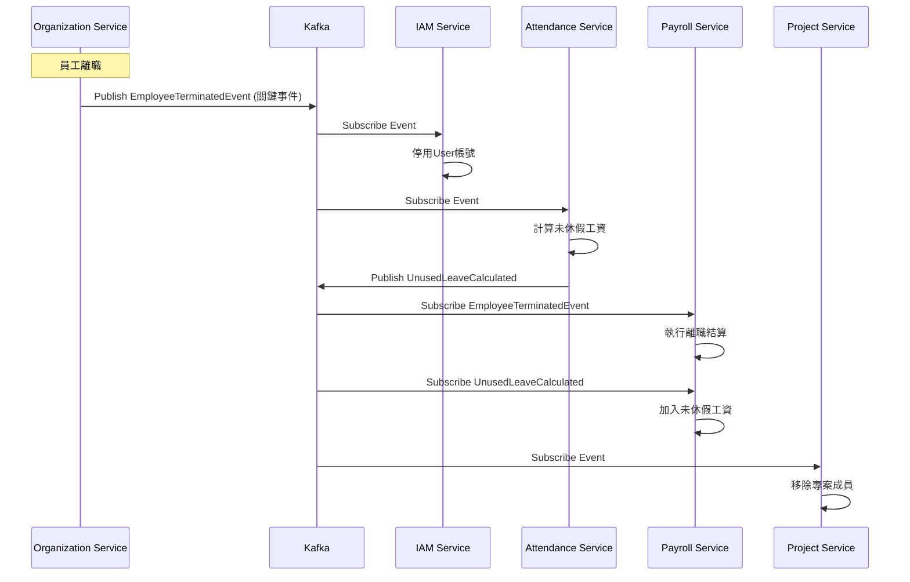

## 4. 畫面事件說明

### 4.1 組織架構圖頁面事件 (ORG-P01)

| 事件ID | 觸發元素 | 事件類型 | 事件處理 | 後端API |
|:---|:---|:---|:---|:---|
| `E-ORG-01` | 搜尋框 | onChange (debounce 300ms) | 過濾組織樹節點 | - (前端過濾) |
| `E-ORG-02` | 展開全部按鈕 | onClick | 展開所有樹節點 | - |
| `E-ORG-03` | 收合全部按鈕 | onClick | 收合所有樹節點 | - |
| `E-ORG-04` | 新增公司按鈕 | onClick | 開啟新增公司對話框 | - |
| `E-ORG-05` | 新增部門按鈕 | onClick | 開啟新增部門對話框 | - |
| `E-ORG-06` | 樹節點點擊 | onClick | 載入節點詳細資訊 | GET /api/v1/departments/{id} |
| `E-ORG-07` | 樹節點拖曳 | onDrop | 調整部門順序/層級 | PUT /api/v1/departments/{id}/reorder |
| `E-ORG-08` | 編輯部門按鈕 | onClick | 開啟編輯部門對話框 | - |
| `E-ORG-09` | 停用部門按鈕 | onClick | 確認對話框 → 停用部門 | PUT /api/v1/departments/{id}/deactivate |

**E-ORG-06 詳細流程:**
```typescript
const handleNodeClick = async (node: OrganizationTreeNode) => {
  if (node.type === 'department') {
    try {
      // 載入部門詳細資訊
      const response = await departmentService.getDepartmentDetail(node.id);
      
      // 更新右側面板
      setSelectedDepartment(response);
      
      // 載入部門員工列表
      const employees = await employeeService.getEmployeesByDepartment(node.id);
      setDepartmentEmployees(employees);
      
    } catch (error) {
      message.error('載入部門資訊失敗');
    }
  }
};
```

### 4.2 員工列表頁面事件 (ORG-P03)

| 事件ID | 觸發元素 | 事件類型 | 事件處理 | 後端API |
|:---|:---|:---|:---|:---|
| `E-EMP-01` | 搜尋框 | onChange (debounce 500ms) | 重新查詢員工列表 | GET /api/v1/employees?search={keyword} |
| `E-EMP-02` | 狀態篩選器 | onChange | 重新查詢員工列表 | GET /api/v1/employees?status={status} |
| `E-EMP-03` | 部門篩選器 | onChange | 重新查詢員工列表 | GET /api/v1/employees?departmentId={id} |
| `E-EMP-04` | 到職日期範圍 | onChange | 重新查詢員工列表 | GET /api/v1/employees?hireDateFrom=&hireDateTo= |
| `E-EMP-05` | 重置按鈕 | onClick | 清空所有篩選條件 | - |
| `E-EMP-06` | 查詢按鈕 | onClick | 執行查詢 | GET /api/v1/employees |
| `E-EMP-07` | 新增員工按鈕 | onClick | 跳轉至新增頁面 | - (路由跳轉) |
| `E-EMP-08` | 匯入按鈕 | onClick | 開啟Excel匯入對話框 | POST /api/v1/employees/import |
| `E-EMP-09` | 匯出按鈕 | onClick | 下載Excel檔案 | GET /api/v1/employees/export |
| `E-EMP-10` | 員工姓名點擊 | onClick | 跳轉至員工詳情頁 | - (路由跳轉) |
| `E-EMP-11` | 詳情按鈕 | onClick | 跳轉至員工詳情頁 | - (路由跳轉) |
| `E-EMP-12` | 分頁切換 | onChange | 重新查詢員工列表 | GET /api/v1/employees?page={page} |

**E-EMP-01 詳細流程:**
```typescript
const handleSearch = useDebouncedCallback(async (keyword: string) => {
  try {
    setLoading(true);
    
    // 更新查詢參數
    const params = {
      ...queryParams,
      search: keyword,
      page: 1  // 重置到第一頁
    };
    
    // 呼叫API
    const response = await employeeService.getEmployees(params);
    
    // 更新Redux State
    dispatch(setEmployeeList(response.data));
    dispatch(setTotalCount(response.total));
    
  } catch (error) {
    message.error('查詢失敗');
  } finally {
    setLoading(false);
  }
}, 500);
```

### 4.3 員工詳細資料頁面事件 (ORG-P04)

| 事件ID | 觸發元素 | 事件類型 | 事件處理 | 後端API |
|:---|:---|:---|:---|:---|
| `E-DETAIL-01` | 編輯資料按鈕 | onClick | 跳轉至編輯頁面 | - |
| `E-DETAIL-02` | 部門調動按鈕 | onClick | 開啟調動對話框 | - |
| `E-DETAIL-03` | 升遷按鈕 | onClick | 開啟升遷對話框 | - |
| `E-DETAIL-04` | 調薪按鈕 | onClick | 開啟調薪對話框 | - |
| `E-DETAIL-05` | 離職按鈕 | onClick | 開啟離職確認對話框 | - |
| `E-DETAIL-06` | 查看歷程按鈕 | onClick | 切換至人事歷程Tab | - |
| `E-DETAIL-07` | Tab切換 | onChange | 載入對應Tab資料 | GET /api/v1/employees/{id}/educations 等 |
| `E-DETAIL-08` | 調動確認 | onClick | 執行部門調動 | POST /api/v1/employees/{id}/transfer |
| `E-DETAIL-09` | 升遷確認 | onClick | 執行升遷 | POST /api/v1/employees/{id}/promote |
| `E-DETAIL-10` | 調薪確認 | onClick | 執行調薪 | POST /api/v1/employees/{id}/adjust-salary |
| `E-DETAIL-11` | 離職確認 | onClick | 執行離職 | POST /api/v1/employees/{id}/terminate |

**E-DETAIL-08 詳細流程:**
```typescript
const handleTransfer = async (values: TransferFormData) => {
  try {
    // 1. 顯示確認對話框
    Modal.confirm({
      title: '確認部門調動',
      content: `確定要將 ${employee.fullName} 從 ${employee.department.name} 調動至 ${values.newDepartmentName} 嗎？`,
      onOk: async () => {
        // 2. 呼叫調動API
        await employeeService.transferEmployee(employeeId, {
          newDepartmentId: values.newDepartmentId,
          newManagerId: values.newManagerId,
          effectiveDate: values.effectiveDate,
          reason: values.reason
        });
        
        // 3. 顯示成功訊息
        message.success('部門調動成功');
        
        // 4. 重新載入員工資料
        await fetchEmployeeDetail();
        
        // 5. 關閉對話框
        setTransferModalVisible(false);
      }
    });
  } catch (error) {
    message.error('調動失敗: ' + error.message);
  }
};
```

### 4.4 員工新增/編輯表單事件 (ORG-P05/P06)

| 事件ID | 觸發元素 | 事件類型 | 事件處理 | 後端API |
|:---|:---|:---|:---|:---|
| `E-FORM-01` | 員工編號輸入 | onBlur | 檢查編號唯一性 | GET /api/v1/employees/check-number?number={number} |
| `E-FORM-02` | 身分證號輸入 | onBlur | 檢查身分證號唯一性 | GET /api/v1/employees/check-national-id?id={id} |
| `E-FORM-03` | 公司Email輸入 | onBlur | 檢查Email唯一性 | GET /api/v1/employees/check-email?email={email} |
| `E-FORM-04` | 部門選擇器 | onChange | 載入該部門的主管列表 | GET /api/v1/departments/{id}/managers |
| `E-FORM-05` | 下一步按鈕 | onClick | 驗證當前步驟 → 進入下一步 | - |
| `E-FORM-06` | 上一步按鈕 | onClick | 返回上一步 | - |
| `E-FORM-07` | 儲存草稿按鈕 | onClick | 儲存表單至LocalStorage | - |
| `E-FORM-08` | 取消按鈕 | onClick | 確認對話框 → 返回列表頁 | - |
| `E-FORM-09` | 送出按鈕 | onClick | 驗證所有步驟 → 建立員工 | POST /api/v1/employees |

**E-FORM-09 詳細流程:**
```typescript
const handleSubmit = async () => {
  try {
    // 1. 驗證所有步驟的表單
    await Promise.all([
      basicInfoForm.validateFields(),
      jobInfoForm.validateFields(),
      bankInfoForm.validateFields()
    ]);
    
    // 2. 組合完整資料
    const employeeData = {
      ...basicInfoForm.getFieldsValue(),
      ...jobInfoForm.getFieldsValue(),
      ...bankInfoForm.getFieldsValue()
    };
    
    // 3. 呼叫建立API
    setSubmitting(true);
    const response = await employeeService.createEmployee(employeeData);
    
    // 4. 顯示成功訊息
    message.success('員工建立成功');
    
    // 5. 清除草稿
    localStorage.removeItem('employee_draft');
    
    // 6. 跳轉至員工詳情頁
    navigate(`/admin/employees/${response.employeeId}`);
    
  } catch (error) {
    if (error.name === 'ValidationError') {
      message.error('請檢查表單欄位');
    } else {
      message.error('建立失敗: ' + error.message);
    }
  } finally {
    setSubmitting(false);
  }
};
```

---

## 5. Data Flow設計

### 5.1 前端狀態管理 (Redux)

#### 5.1.1 State結構

```typescript
interface OrganizationState {
  // 組織架構
  organizations: {
    list: Organization[];
    tree: OrganizationTreeNode[];
    selectedNode: OrganizationTreeNode | null;
    loading: boolean;
  };
  
  // 部門管理
  departments: {
    list: Department[];
    currentDepartment: DepartmentDetail | null;
    loading: boolean;
  };
  
  // 員工管理
  employees: {
    list: Employee[];
    total: number;
    currentPage: number;
    pageSize: number;
    filters: EmployeeQueryParams;
    selectedEmployee: EmployeeDetail | null;
    loading: boolean;
  };
  
  // 員工歷程
  employeeHistory: {
    records: EmployeeHistoryRecord[];
    loading: boolean;
  };
  
  // 合約管理
  contracts: {
    list: EmployeeContract[];
    expiringContracts: EmployeeContract[];
    loading: boolean;
  };
}
```

#### 5.1.2 Redux Actions

```typescript
// 組織架構Actions
export const organizationActions = {
  fetchOrganizationTree: createAsyncThunk(
    'organization/fetchTree',
    async (organizationId: string) => {
      const response = await organizationService.getOrganizationTree(organizationId);
      return response;
    }
  ),
  
  createDepartment: createAsyncThunk(
    'organization/createDepartment',
    async (data: CreateDepartmentRequest) => {
      const response = await departmentService.createDepartment(data);
      return response;
    }
  ),
};

// 員工管理Actions
export const employeeActions = {
  fetchEmployees: createAsyncThunk(
    'employees/fetchList',
    async (params: EmployeeQueryParams) => {
      const response = await employeeService.getEmployees(params);
      return response;
    }
  ),
  
  createEmployee: createAsyncThunk(
    'employees/create',
    async (data: CreateEmployeeRequest) => {
      const response = await employeeService.createEmployee(data);
      return response;
    }
  ),
  
  transferEmployee: createAsyncThunk(
    'employees/transfer',
    async ({employeeId, data}: {employeeId: string, data: TransferRequest}) => {
      const response = await employeeService.transferEmployee(employeeId, data);
      return response;
    }
  ),
  
  terminateEmployee: createAsyncThunk(
    'employees/terminate',
    async ({employeeId, data}: {employeeId: string, data: TerminateRequest}) => {
      await employeeService.terminateEmployee(employeeId, data);
      return employeeId;
    }
  ),
};
```

### 5.2 前後端資料流

#### 5.2.1 員工查詢流程



#### 5.2.2 員工建立資料流



### 5.3 服務間資料流

#### 5.3.1 員工到職事件流



#### 5.3.2 員工離職事件流



---

*（文件持續，下一部分包含資料庫設計、Domain設計、API規格等）*
