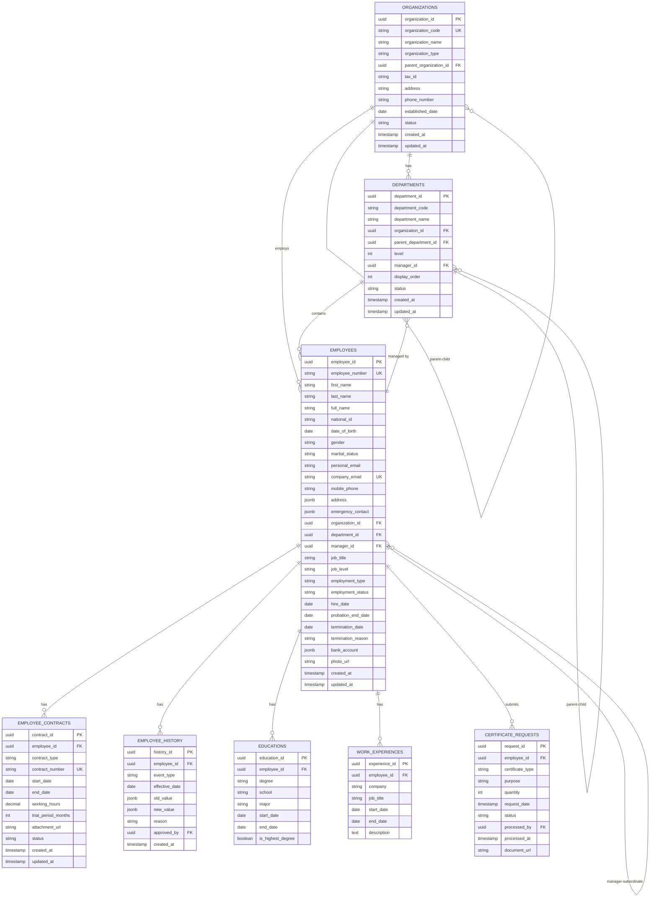

## 6. 資料庫設計

### 6.1 ER Diagram



### 6.2 表結構定義 (DDL)

#### 6.2.1 organizations (組織/公司表)

```sql
CREATE TABLE organizations (
    organization_id UUID PRIMARY KEY DEFAULT gen_random_uuid(),
    organization_code VARCHAR(50) UNIQUE NOT NULL,
    organization_name VARCHAR(255) NOT NULL,
    organization_type VARCHAR(20) NOT NULL,
    parent_organization_id UUID REFERENCES organizations(organization_id),
    tax_id VARCHAR(20),
    address TEXT,
    phone_number VARCHAR(50),
    established_date DATE,
    status VARCHAR(20) DEFAULT 'ACTIVE',
    created_at TIMESTAMP DEFAULT CURRENT_TIMESTAMP,
    updated_at TIMESTAMP DEFAULT CURRENT_TIMESTAMP,
    
    CONSTRAINT chk_org_type CHECK (organization_type IN ('PARENT', 'SUBSIDIARY')),
    CONSTRAINT chk_org_status CHECK (status IN ('ACTIVE', 'INACTIVE'))
);

CREATE INDEX idx_organizations_parent_id ON organizations(parent_organization_id);
CREATE INDEX idx_organizations_status ON organizations(status);

COMMENT ON TABLE organizations IS '組織/公司表';
COMMENT ON COLUMN organizations.organization_code IS '公司代號 (唯一)';
COMMENT ON COLUMN organizations.organization_type IS '組織類型: PARENT(母公司)/SUBSIDIARY(子公司)';
COMMENT ON COLUMN organizations.tax_id IS '統一編號';
```

#### 6.2.2 departments (部門表)

```sql
CREATE TABLE departments (
    department_id UUID PRIMARY KEY DEFAULT gen_random_uuid(),
    department_code VARCHAR(50) NOT NULL,
    department_name VARCHAR(255) NOT NULL,
    organization_id UUID NOT NULL REFERENCES organizations(organization_id),
    parent_department_id UUID REFERENCES departments(department_id),
    level INTEGER NOT NULL DEFAULT 1,
    manager_id UUID REFERENCES employees(employee_id),
    display_order INTEGER DEFAULT 0,
    status VARCHAR(20) DEFAULT 'ACTIVE',
    created_at TIMESTAMP DEFAULT CURRENT_TIMESTAMP,
    updated_at TIMESTAMP DEFAULT CURRENT_TIMESTAMP,
    
    UNIQUE(department_code, organization_id),
    CONSTRAINT chk_dept_status CHECK (status IN ('ACTIVE', 'INACTIVE')),
    CONSTRAINT chk_dept_level CHECK (level >= 1 AND level <= 5)
);

CREATE INDEX idx_departments_org_id ON departments(organization_id);
CREATE INDEX idx_departments_parent_id ON departments(parent_department_id);
CREATE INDEX idx_departments_manager_id ON departments(manager_id);
CREATE INDEX idx_departments_status ON departments(status);

COMMENT ON TABLE departments IS '部門表 (支援最多5層)';
COMMENT ON COLUMN departments.level IS '部門層級 (1-5)';
COMMENT ON COLUMN departments.display_order IS '顯示順序';
```

#### 6.2.3 employees (員工表) - 核心表

```sql
CREATE TABLE employees (
    employee_id UUID PRIMARY KEY DEFAULT gen_random_uuid(),
    employee_number VARCHAR(50) UNIQUE NOT NULL,
    
    -- 基本資料
    first_name VARCHAR(100) NOT NULL,
    last_name VARCHAR(100) NOT NULL,
    full_name VARCHAR(255) NOT NULL,
    national_id VARCHAR(255) NOT NULL,  -- 加密欄位
    date_of_birth DATE NOT NULL,
    gender VARCHAR(10) NOT NULL,
    marital_status VARCHAR(20),
    
    -- 聯絡方式
    personal_email VARCHAR(255),
    company_email VARCHAR(255) UNIQUE NOT NULL,
    mobile_phone VARCHAR(50),
    home_phone VARCHAR(50),
    
    -- 地址 (JSON)
    address JSONB,
    
    -- 緊急聯絡人 (JSON)
    emergency_contact JSONB,
    
    -- 組織關係
    organization_id UUID NOT NULL REFERENCES organizations(organization_id),
    department_id UUID NOT NULL REFERENCES departments(department_id),
    manager_id UUID REFERENCES employees(employee_id),
    
    -- 職務資訊
    job_title VARCHAR(255),
    job_level VARCHAR(50),
    employment_type VARCHAR(20) NOT NULL,
    employment_status VARCHAR(20) NOT NULL DEFAULT 'PROBATION',
    
    -- 到離職資訊
    hire_date DATE NOT NULL,
    probation_end_date DATE,
    termination_date DATE,
    termination_reason TEXT,
    
    -- 銀行資訊 (JSON, 加密)
    bank_account JSONB,
    
    -- 照片
    photo_url VARCHAR(500),
    
    -- 審計
    created_at TIMESTAMP DEFAULT CURRENT_TIMESTAMP,
    updated_at TIMESTAMP DEFAULT CURRENT_TIMESTAMP,
    
    CONSTRAINT chk_gender CHECK (gender IN ('MALE', 'FEMALE', 'OTHER')),
    CONSTRAINT chk_marital_status CHECK (marital_status IN ('SINGLE', 'MARRIED', 'DIVORCED', 'WIDOWED')),
    CONSTRAINT chk_employment_type CHECK (employment_type IN ('FULL_TIME', 'CONTRACT', 'PART_TIME', 'INTERN')),
    CONSTRAINT chk_employment_status CHECK (employment_status IN ('PROBATION', 'ACTIVE', 'PARENTAL_LEAVE', 'UNPAID_LEAVE', 'TERMINATED')),
    CONSTRAINT chk_termination_date CHECK (termination_date IS NULL OR termination_date >= hire_date)
);

-- 索引
CREATE INDEX idx_employees_employee_number ON employees(employee_number);
CREATE INDEX idx_employees_company_email ON employees(company_email);
CREATE INDEX idx_employees_national_id ON employees(national_id);  -- 加密欄位索引
CREATE INDEX idx_employees_organization_id ON employees(organization_id);
CREATE INDEX idx_employees_department_id ON employees(department_id);
CREATE INDEX idx_employees_manager_id ON employees(manager_id);
CREATE INDEX idx_employees_employment_status ON employees(employment_status);
CREATE INDEX idx_employees_hire_date ON employees(hire_date);
CREATE INDEX idx_employees_full_name ON employees(full_name);

-- 全文搜尋索引
CREATE INDEX idx_employees_fulltext ON employees USING gin(to_tsvector('simple', full_name || ' ' || employee_number || ' ' || company_email));

-- 註解
COMMENT ON TABLE employees IS '員工主檔表';
COMMENT ON COLUMN employees.national_id IS '身分證號 (加密儲存)';
COMMENT ON COLUMN employees.address IS 'JSON格式: {postalCode, city, district, street}';
COMMENT ON COLUMN employees.emergency_contact IS 'JSON格式: {name, relationship, phoneNumber}';
COMMENT ON COLUMN employees.bank_account IS 'JSON格式: {bankCode, bankName, accountNumber(加密)}';
COMMENT ON COLUMN employees.employment_status IS 'PROBATION(試用)/ACTIVE(在職)/PARENTAL_LEAVE(育嬰留停)/UNPAID_LEAVE(留職停薪)/TERMINATED(離職)';
```

#### 6.2.4 employee_contracts (員工合約表)

```sql
CREATE TABLE employee_contracts (
    contract_id UUID PRIMARY KEY DEFAULT gen_random_uuid(),
    employee_id UUID NOT NULL REFERENCES employees(employee_id) ON DELETE CASCADE,
    contract_type VARCHAR(20) NOT NULL,
    contract_number VARCHAR(100) UNIQUE NOT NULL,
    start_date DATE NOT NULL,
    end_date DATE,  -- NULL表示不定期契約
    working_hours DECIMAL(5,2) NOT NULL DEFAULT 40,
    trial_period_months INTEGER DEFAULT 0,
    attachment_url VARCHAR(500),
    status VARCHAR(20) DEFAULT 'ACTIVE',
    created_at TIMESTAMP DEFAULT CURRENT_TIMESTAMP,
    updated_at TIMESTAMP DEFAULT CURRENT_TIMESTAMP,
    
    CONSTRAINT chk_contract_type CHECK (contract_type IN ('INDEFINITE', 'FIXED_TERM')),
    CONSTRAINT chk_contract_status CHECK (status IN ('ACTIVE', 'EXPIRED', 'TERMINATED')),
    CONSTRAINT chk_end_date CHECK (end_date IS NULL OR end_date > start_date)
);

CREATE INDEX idx_contracts_employee_id ON employee_contracts(employee_id);
CREATE INDEX idx_contracts_status ON employee_contracts(status);
CREATE INDEX idx_contracts_end_date ON employee_contracts(end_date);

COMMENT ON TABLE employee_contracts IS '員工合約表';
COMMENT ON COLUMN employee_contracts.contract_type IS 'INDEFINITE(不定期)/FIXED_TERM(定期)';
COMMENT ON COLUMN employee_contracts.working_hours IS '每週工時';
```

#### 6.2.5 employee_history (員工人事歷程表)

```sql
CREATE TABLE employee_history (
    history_id UUID PRIMARY KEY DEFAULT gen_random_uuid(),
    employee_id UUID NOT NULL REFERENCES employees(employee_id) ON DELETE CASCADE,
    event_type VARCHAR(50) NOT NULL,
    effective_date DATE NOT NULL,
    old_value JSONB,
    new_value JSONB,
    reason TEXT,
    approved_by UUID REFERENCES employees(employee_id),
    created_at TIMESTAMP DEFAULT CURRENT_TIMESTAMP,
    
    CONSTRAINT chk_event_type CHECK (event_type IN (
        'ONBOARDING', 'PROBATION_PASSED', 'DEPARTMENT_TRANSFER', 
        'JOB_CHANGE', 'PROMOTION', 'SALARY_ADJUSTMENT', 
        'TERMINATION', 'REHIRE'
    ))
);

CREATE INDEX idx_history_employee_id ON employee_history(employee_id);
CREATE INDEX idx_history_event_type ON employee_history(event_type);
CREATE INDEX idx_history_effective_date ON employee_history(effective_date);

COMMENT ON TABLE employee_history IS '員工人事歷程記錄表';
COMMENT ON COLUMN employee_history.old_value IS '變更前資料 (JSON格式)';
COMMENT ON COLUMN employee_history.new_value IS '變更後資料 (JSON格式)';
```

#### 6.2.6 educations (學歷表)

```sql
CREATE TABLE educations (
    education_id UUID PRIMARY KEY DEFAULT gen_random_uuid(),
    employee_id UUID NOT NULL REFERENCES employees(employee_id) ON DELETE CASCADE,
    degree VARCHAR(50) NOT NULL,
    school VARCHAR(255) NOT NULL,
    major VARCHAR(255),
    start_date DATE,
    end_date DATE,
    is_highest_degree BOOLEAN DEFAULT FALSE,
    
    CONSTRAINT chk_degree CHECK (degree IN ('高中', '專科', '學士', '碩士', '博士'))
);

CREATE INDEX idx_educations_employee_id ON educations(employee_id);

COMMENT ON TABLE educations IS '員工學歷表';
```

#### 6.2.7 work_experiences (工作經歷表)

```sql
CREATE TABLE work_experiences (
    experience_id UUID PRIMARY KEY DEFAULT gen_random_uuid(),
    employee_id UUID NOT NULL REFERENCES employees(employee_id) ON DELETE CASCADE,
    company VARCHAR(255) NOT NULL,
    job_title VARCHAR(255) NOT NULL,
    start_date DATE NOT NULL,
    end_date DATE,  -- NULL表示目前在職
    description TEXT
);

CREATE INDEX idx_work_experiences_employee_id ON work_experiences(employee_id);

COMMENT ON TABLE work_experiences IS '員工工作經歷表';
```

#### 6.2.8 certificate_requests (證明文件申請表)

```sql
CREATE TABLE certificate_requests (
    request_id UUID PRIMARY KEY DEFAULT gen_random_uuid(),
    employee_id UUID NOT NULL REFERENCES employees(employee_id) ON DELETE CASCADE,
    certificate_type VARCHAR(50) NOT NULL,
    purpose VARCHAR(500),
    quantity INTEGER DEFAULT 1,
    request_date TIMESTAMP DEFAULT CURRENT_TIMESTAMP,
    status VARCHAR(20) DEFAULT 'PENDING',
    processed_by UUID REFERENCES employees(employee_id),
    processed_at TIMESTAMP,
    document_url VARCHAR(500),
    
    CONSTRAINT chk_certificate_type CHECK (certificate_type IN (
        'EMPLOYMENT_CERTIFICATE', 'SALARY_CERTIFICATE', 'TAX_WITHHOLDING'
    )),
    CONSTRAINT chk_request_status CHECK (status IN ('PENDING', 'APPROVED', 'REJECTED', 'COMPLETED'))
);

CREATE INDEX idx_certificate_requests_employee_id ON certificate_requests(employee_id);
CREATE INDEX idx_certificate_requests_status ON certificate_requests(status);
CREATE INDEX idx_certificate_requests_request_date ON certificate_requests(request_date);

COMMENT ON TABLE certificate_requests IS '員工證明文件申請表';
COMMENT ON COLUMN certificate_requests.certificate_type IS 'EMPLOYMENT_CERTIFICATE(在職證明)/SALARY_CERTIFICATE(薪資證明)/TAX_WITHHOLDING(扣繳憑單)';
```

### 6.3 資料字典

| 表名 | 說明 | 預估資料量 | 成長速度 | 保留策略 |
|:---|:---|:---:|:---|:---|
| `organizations` | 組織/公司 | 10 | 年增2-3筆 | 永久保留 |
| `departments` | 部門 | 100 | 年增10-20筆 | 永久保留 |
| `employees` | 員工主檔 | 200 | 年增50筆 | 永久保留 |
| `employee_contracts` | 員工合約 | 250 | 年增60筆 | 永久保留 |
| `employee_history` | 人事歷程 | 1,000 | 年增500筆 | 永久保留 |
| `educations` | 學歷 | 400 | 年增100筆 | 永久保留 |
| `work_experiences` | 工作經歷 | 600 | 年增150筆 | 永久保留 |
| `certificate_requests` | 證明文件申請 | 500 | 月增50筆 | 保留3年 |

### 6.4 資料加密策略

**敏感欄位加密:**
- `employees.national_id`: AES-256加密
- `employees.bank_account.accountNumber`: AES-256加密

**加密實作 (Application Level):**
```java
@Component
public class EncryptionService {
    
    @Value("${encryption.secret-key}")
    private String secretKey;
    
    public String encrypt(String plainText) {
        // AES-256 加密
        Cipher cipher = Cipher.getInstance("AES/GCM/NoPadding");
        // ... 加密邏輯
        return Base64.getEncoder().encodeToString(encrypted);
    }
    
    public String decrypt(String encryptedText) {
        // AES-256 解密
        byte[] decoded = Base64.getDecoder().decode(encryptedText);
        // ... 解密邏輯
        return new String(decrypted);
    }
}
```

---

## 7. Domain設計

### 7.1 聚合根 (Aggregate Root)

#### 7.1.1 Organization聚合根

**職責:** 代表一個法人公司（母公司或子公司）

**Java實作:**
```java
@Entity
@Table(name = "organizations")
public class Organization {
    @EmbeddedId
    private OrganizationId id;
    
    @Column(name = "organization_code", unique = true, nullable = false)
    private String organizationCode;
    
    @Column(name = "organization_name", nullable = false)
    private String organizationName;
    
    @Enumerated(EnumType.STRING)
    @Column(name = "organization_type", nullable = false)
    private OrganizationType organizationType;
    
    @Column(name = "parent_organization_id")
    private UUID parentOrganizationId;
    
    @Column(name = "tax_id")
    private String taxId;
    
    @Column(name = "address")
    private String address;
    
    @Enumerated(EnumType.STRING)
    private OrganizationStatus status;
    
    // Domain行為
    public void deactivate() {
        if (hasActiveEmployees()) {
            throw new DomainException("無法停用有在職員工的公司");
        }
        this.status = OrganizationStatus.INACTIVE;
    }
    
    private boolean hasActiveEmployees() {
        // 由Repository查詢
        return false;  // 實際實作需注入Repository
    }
}

enum OrganizationType {
    PARENT,      // 母公司
    SUBSIDIARY   // 子公司
}

enum OrganizationStatus {
    ACTIVE,
    INACTIVE
}
```

#### 7.1.2 Department聚合根

**職責:** 代表組織內的部門，支援多層級結構

**Java實作:**
```java
@Entity
@Table(name = "departments")
public class Department {
    @EmbeddedId
    private DepartmentId id;
    
    @Column(name = "department_code", nullable = false)
    private String departmentCode;
    
    @Column(name = "department_name", nullable = false)
    private String departmentName;
    
    @Column(name = "organization_id", nullable = false)
    private UUID organizationId;
    
    @Column(name = "parent_department_id")
    private UUID parentDepartmentId;
    
    @Column(name = "level", nullable = false)
    private Integer level;
    
    @Column(name = "manager_id")
    private UUID managerId;
    
    @Column(name = "display_order")
    private Integer displayOrder;
    
    @Enumerated(EnumType.STRING)
    private DepartmentStatus status;
    
    // Domain行為
    public void addSubDepartment(Department subDepartment) {
        if (this.level >= 5) {
            throw new DomainException("部門層級不可超過5層");
        }
        
        subDepartment.setParentDepartmentId(this.id.getValue());
        subDepartment.setLevel(this.level + 1);
        subDepartment.setOrganizationId(this.organizationId);
    }
    
    public void assignManager(UUID employeeId) {
        // 驗證員工是否屬於此部門
        this.managerId = employeeId;
    }
    
    public void deactivate() {
        if (hasActiveSubDepartments()) {
            throw new DomainException("無法停用有啟用中子部門的部門");
        }
        if (hasActiveEmployees()) {
            throw new DomainException("無法停用有在職員工的部門");
        }
        this.status = DepartmentStatus.INACTIVE;
    }
    
    private boolean hasActiveSubDepartments() {
        // 由Repository查詢
        return false;
    }
    
    private boolean hasActiveEmployees() {
        // 由Repository查詢
        return false;
    }
}
```

---

*（文件持續，下一部分包含Employee聚合根、值對象、領域事件、完整API規格等）*
