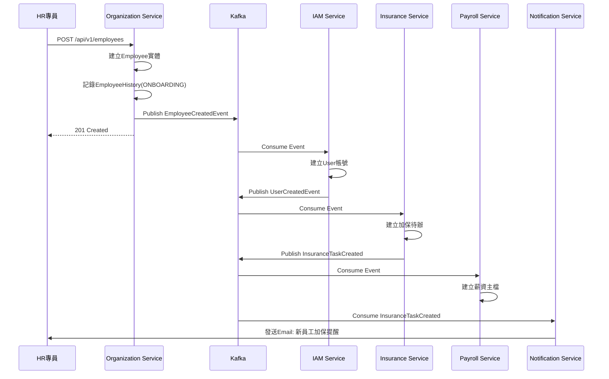

#### 7.1.3 Employee聚合根 (核心聚合根)

**職責:** 員工主檔，包含完整的個人資料與人事歷程管理

**Java實作:**
```java
@Entity
@Table(name = "employees")
public class Employee {
    @EmbeddedId
    private EmployeeId id;
    
    @Column(name = "employee_number", unique = true, nullable = false)
    private String employeeNumber;
    
    // 基本資料
    @Column(name = "first_name", nullable = false)
    private String firstName;
    
    @Column(name = "last_name", nullable = false)
    private String lastName;
    
    @Column(name = "full_name", nullable = false)
    private String fullName;
    
    @Embedded
    private NationalId nationalId;  // 值對象，加密處理
    
    @Column(name = "date_of_birth", nullable = false)
    private LocalDate dateOfBirth;
    
    @Enumerated(EnumType.STRING)
    private Gender gender;
    
    @Enumerated(EnumType.STRING)
    private MaritalStatus maritalStatus;
    
    // 聯絡方式
    @Embedded
    private Email companyEmail;
    
    @Column(name = "personal_email")
    private String personalEmail;
    
    @Column(name = "mobile_phone")
    private String mobilePhone;
    
    @Embedded
    private Address address;
    
    @Embedded
    private EmergencyContact emergencyContact;
    
    // 組織關係
    @Column(name = "organization_id", nullable = false)
    private UUID organizationId;
    
    @Column(name = "department_id", nullable = false)
    private UUID departmentId;
    
    @Column(name = "manager_id")
    private UUID managerId;
    
    // 職務資訊
    @Column(name = "job_title")
    private String jobTitle;
    
    @Column(name = "job_level")
    private String jobLevel;
    
    @Enumerated(EnumType.STRING)
    @Column(name = "employment_type", nullable = false)
    private EmploymentType employmentType;
    
    @Enumerated(EnumType.STRING)
    @Column(name = "employment_status", nullable = false)
    private EmploymentStatus employmentStatus;
    
    // 到離職資訊
    @Column(name = "hire_date", nullable = false)
    private LocalDate hireDate;
    
    @Column(name = "probation_end_date")
    private LocalDate probationEndDate;
    
    @Column(name = "termination_date")
    private LocalDate terminationDate;
    
    @Column(name = "termination_reason")
    private String terminationReason;
    
    // 銀行資訊
    @Embedded
    private BankAccount bankAccount;
    
    // ========== Domain行為 ==========
    
    /**
     * 到職 - 建立新員工
     */
    public static Employee onboard(CreateEmployeeCommand command) {
        Employee employee = new Employee();
        employee.id = EmployeeId.generate();
        employee.employeeNumber = command.getEmployeeNumber();
        employee.firstName = command.getFirstName();
        employee.lastName = command.getLastName();
        employee.fullName = command.getLastName() + command.getFirstName();
        employee.nationalId = new NationalId(command.getNationalId());
        employee.dateOfBirth = command.getDateOfBirth();
        employee.gender = command.getGender();
        employee.companyEmail = new Email(command.getCompanyEmail());
        employee.organizationId = command.getOrganizationId();
        employee.departmentId = command.getDepartmentId();
        employee.managerId = command.getManagerId();
        employee.jobTitle = command.getJobTitle();
        employee.jobLevel = command.getJobLevel();
        employee.employmentType = command.getEmploymentType();
        employee.employmentStatus = EmploymentStatus.PROBATION;
        employee.hireDate = command.getHireDate();
        employee.probationEndDate = command.getHireDate().plusMonths(command.getProbationMonths());
        employee.bankAccount = command.getBankAccount();
        
        // 發布領域事件
        DomainEventPublisher.publish(new EmployeeCreatedEvent(
            employee.id.getValue(),
            employee.employeeNumber,
            employee.companyEmail.getValue(),
            employee.organizationId,
            employee.departmentId,
            employee.hireDate
        ));
        
        return employee;
    }
    
    /**
     * 試用期轉正
     */
    public void completeProbation() {
        if (this.employmentStatus != EmploymentStatus.PROBATION) {
            throw new DomainException("只有試用期員工可以轉正");
        }
        
        this.employmentStatus = EmploymentStatus.ACTIVE;
        
        DomainEventPublisher.publish(new EmployeeProbationPassedEvent(
            this.id.getValue(),
            LocalDate.now()
        ));
    }
    
    /**
     * 部門調動
     */
    public void transferDepartment(UUID newDepartmentId, UUID newManagerId, 
                                   LocalDate effectiveDate, String reason) {
        UUID oldDepartmentId = this.departmentId;
        
        this.departmentId = newDepartmentId;
        this.managerId = newManagerId;
        
        DomainEventPublisher.publish(new EmployeeDepartmentChangedEvent(
            this.id.getValue(),
            oldDepartmentId,
            newDepartmentId,
            effectiveDate,
            reason
        ));
    }
    
    /**
     * 升遷
     */
    public void promote(String newJobTitle, String newJobLevel, 
                        LocalDate effectiveDate, String reason) {
        String oldJobTitle = this.jobTitle;
        String oldJobLevel = this.jobLevel;
        
        this.jobTitle = newJobTitle;
        this.jobLevel = newJobLevel;
        
        DomainEventPublisher.publish(new EmployeePromotedEvent(
            this.id.getValue(),
            oldJobTitle,
            newJobTitle,
            oldJobLevel,
            newJobLevel,
            effectiveDate,
            reason
        ));
    }
    
    /**
     * 離職
     */
    public void terminate(LocalDate terminationDate, String reason) {
        if (this.employmentStatus == EmploymentStatus.TERMINATED) {
            throw new DomainException("員工已離職");
        }
        
        if (terminationDate.isBefore(this.hireDate)) {
            throw new DomainException("離職日期不可早於到職日期");
        }
        
        this.employmentStatus = EmploymentStatus.TERMINATED;
        this.terminationDate = terminationDate;
        this.terminationReason = reason;
        
        // 發布關鍵事件
        DomainEventPublisher.publish(new EmployeeTerminatedEvent(
            this.id.getValue(),
            this.employeeNumber,
            terminationDate,
            reason
        ));
    }
    
    /**
     * 更新個人資料
     */
    public void updatePersonalInfo(UpdatePersonalInfoCommand command) {
        if (command.getMobilePhone() != null) {
            this.mobilePhone = command.getMobilePhone();
        }
        if (command.getAddress() != null) {
            this.address = command.getAddress();
        }
        if (command.getEmergencyContact() != null) {
            this.emergencyContact = command.getEmergencyContact();
        }
    }
    
    /**
     * 是否在職
     */
    public boolean isActive() {
        return this.employmentStatus == EmploymentStatus.ACTIVE ||
               this.employmentStatus == EmploymentStatus.PROBATION;
    }
}
```

**不變性規則 (Invariants):**
- ✅ employeeNumber必須唯一且不可變更
- ✅ companyEmail必須唯一
- ✅ nationalId必須加密儲存
- ✅ 離職日期不可早於到職日期
- ✅ 試用期結束日必須晚於到職日
- ✅ 只有試用期員工可以轉正

#### 7.1.4 EmployeeContract聚合根

**職責:** 管理員工的勞動合約

**Java實作:**
```java
@Entity
@Table(name = "employee_contracts")
public class EmployeeContract {
    @EmbeddedId
    private ContractId id;
    
    @Column(name = "employee_id", nullable = false)
    private UUID employeeId;
    
    @Enumerated(EnumType.STRING)
    @Column(name = "contract_type", nullable = false)
    private ContractType contractType;
    
    @Column(name = "contract_number", unique = true, nullable = false)
    private String contractNumber;
    
    @Column(name = "start_date", nullable = false)
    private LocalDate startDate;
    
    @Column(name = "end_date")
    private LocalDate endDate;  // NULL表示不定期契約
    
    @Column(name = "working_hours", nullable = false)
    private BigDecimal workingHours;
    
    @Column(name = "trial_period_months")
    private Integer trialPeriodMonths;
    
    @Column(name = "attachment_url")
    private String attachmentUrl;
    
    @Enumerated(EnumType.STRING)
    private ContractStatus status;
    
    // ========== Domain行為 ==========
    
    /**
     * 續約
     */
    public void renew(LocalDate newEndDate) {
        if (this.contractType == ContractType.INDEFINITE) {
            throw new DomainException("不定期契約無需續約");
        }
        
        if (newEndDate.isBefore(this.endDate)) {
            throw new DomainException("新合約結束日必須晚於現有結束日");
        }
        
        this.endDate = newEndDate;
        this.status = ContractStatus.ACTIVE;
        
        DomainEventPublisher.publish(new ContractRenewedEvent(
            this.id.getValue(),
            this.employeeId,
            newEndDate
        ));
    }
    
    /**
     * 終止合約
     */
    public void terminate(LocalDate terminationDate) {
        this.status = ContractStatus.TERMINATED;
        this.endDate = terminationDate;
    }
    
    /**
     * 檢查是否即將到期
     */
    public boolean isExpiringSoon(int daysBeforeExpiry) {
        if (this.endDate == null) return false;  // 不定期契約
        if (this.status != ContractStatus.ACTIVE) return false;
        
        LocalDate threshold = LocalDate.now().plusDays(daysBeforeExpiry);
        return this.endDate.isBefore(threshold) || this.endDate.isEqual(threshold);
    }
}

enum ContractType {
    INDEFINITE,  // 不定期契約
    FIXED_TERM   // 定期契約
}

enum ContractStatus {
    ACTIVE,
    EXPIRED,
    TERMINATED
}
```

### 7.2 值對象 (Value Object)

#### 7.2.1 Address (地址)

```java
@Embeddable
public class Address {
    @Column(name = "postal_code")
    private String postalCode;
    
    @Column(name = "city")
    private String city;
    
    @Column(name = "district")
    private String district;
    
    @Column(name = "street")
    private String street;
    
    // 不可變，無setter
    protected Address() {}
    
    public Address(String postalCode, String city, String district, String street) {
        this.postalCode = postalCode;
        this.city = city;
        this.district = district;
        this.street = street;
    }
    
    public String getFullAddress() {
        return String.format("%s%s%s%s", postalCode, city, district, street);
    }
    
    // equals, hashCode 基於所有屬性
}
```

#### 7.2.2 EmergencyContact (緊急聯絡人)

```java
@Embeddable
public class EmergencyContact {
    @Column(name = "emergency_contact_name")
    private String name;
    
    @Column(name = "emergency_contact_relationship")
    private String relationship;
    
    @Column(name = "emergency_contact_phone")
    private String phoneNumber;
    
    protected EmergencyContact() {}
    
    public EmergencyContact(String name, String relationship, String phoneNumber) {
        if (name == null || name.isBlank()) {
            throw new IllegalArgumentException("緊急聯絡人姓名不可為空");
        }
        this.name = name;
        this.relationship = relationship;
        this.phoneNumber = phoneNumber;
    }
}
```

#### 7.2.3 BankAccount (銀行帳戶)

```java
@Embeddable
public class BankAccount {
    @Column(name = "bank_code")
    private String bankCode;
    
    @Column(name = "bank_name")
    private String bankName;
    
    @Column(name = "branch_code")
    private String branchCode;
    
    @Column(name = "account_number")
    @Convert(converter = EncryptedStringConverter.class)  // 加密
    private String accountNumber;
    
    @Column(name = "account_name")
    private String accountName;
    
    protected BankAccount() {}
    
    public BankAccount(String bankCode, String bankName, String accountNumber, String accountName) {
        this.bankCode = bankCode;
        this.bankName = bankName;
        this.accountNumber = accountNumber;
        this.accountName = accountName;
    }
    
    // 遮罩帳號 (顯示用)
    public String getMaskedAccountNumber() {
        if (accountNumber == null || accountNumber.length() < 4) {
            return "****";
        }
        return "***" + accountNumber.substring(accountNumber.length() - 4);
    }
}
```

#### 7.2.4 NationalId (身分證號)

```java
@Embeddable
public class NationalId {
    @Column(name = "national_id")
    @Convert(converter = EncryptedStringConverter.class)  // 加密
    private String value;
    
    protected NationalId() {}
    
    public NationalId(String value) {
        if (!isValidFormat(value)) {
            throw new IllegalArgumentException("身分證號格式錯誤");
        }
        this.value = value;
    }
    
    private boolean isValidFormat(String id) {
        return id != null && id.matches("^[A-Z][12]\\d{8}$");
    }
    
    // 遮罩顯示
    public String getMaskedValue() {
        if (value == null || value.length() < 10) {
            return "**********";
        }
        return value.substring(0, 3) + "***" + value.substring(6);
    }
}
```

### 7.3 Repository介面

```java
// Employee Repository
public interface EmployeeRepository {
    Employee findById(EmployeeId id);
    Employee findByEmployeeNumber(String employeeNumber);
    Employee findByCompanyEmail(String email);
    List<Employee> findByDepartmentId(UUID departmentId);
    List<Employee> findByManagerId(UUID managerId);
    List<Employee> findByStatus(EmploymentStatus status);
    Page<Employee> findAll(EmployeeQueryCriteria criteria, Pageable pageable);
    void save(Employee employee);
    boolean existsByEmployeeNumber(String employeeNumber);
    boolean existsByNationalId(String nationalId);
    boolean existsByCompanyEmail(String email);
    int countByDepartmentIdAndStatus(UUID departmentId, EmploymentStatus status);
}

// Department Repository
public interface DepartmentRepository {
    Department findById(DepartmentId id);
    List<Department> findByOrganizationId(UUID organizationId);
    List<Department> findByParentDepartmentId(UUID parentId);
    List<Department> findSubDepartments(UUID departmentId);
    void save(Department department);
    int countActiveEmployees(UUID departmentId);
    int countActiveSubDepartments(UUID departmentId);
}

// Organization Repository
public interface OrganizationRepository {
    Organization findById(OrganizationId id);
    List<Organization> findAll();
    void save(Organization organization);
}
```

---

## 8. 領域事件設計

### 8.1 事件清單

| 事件名稱 | 觸發時機 | 發布服務 | 訂閱服務 |
|:---|:---|:---|:---|
| `EmployeeCreated` | 新員工到職 | Organization | IAM, Insurance, Payroll |
| `EmployeeProbationPassed` | 試用期轉正 | Organization | Payroll |
| `EmployeeTerminated` | 員工離職 | Organization | IAM, Attendance, Insurance, Payroll, Project |
| `EmployeeDepartmentChanged` | 部門調動 | Organization | Attendance, Payroll |
| `EmployeeJobChanged` | 職務異動 | Organization | Payroll |
| `EmployeePromoted` | 員工升遷 | Organization | Payroll, Performance |
| `EmployeeSalaryChanged` | 調薪 | Organization | Payroll, Insurance |
| `EmployeeEmailChanged` | Email變更 | Organization | IAM |
| `DepartmentCreated` | 新增部門 | Organization | - |
| `DepartmentManagerChanged` | 主管異動 | Organization | Attendance |
| `ContractExpiring` | 合約即將到期 | Organization | Notification |
| `ContractRenewed` | 合約續約 | Organization | - |
| `CertificateRequested` | 證明文件申請 | Organization | Notification |
| `CertificateCompleted` | 證明文件完成 | Organization | Notification |

### 8.2 事件Schema

#### 8.2.1 EmployeeCreatedEvent

```java
public class EmployeeCreatedEvent implements DomainEvent {
    private String eventId;
    private String eventType = "EmployeeCreated";
    private Instant timestamp;
    
    // Payload
    private UUID employeeId;
    private String employeeNumber;
    private String companyEmail;
    private UUID organizationId;
    private UUID departmentId;
    private LocalDate hireDate;
    private List<String> roles;  // 預設角色
}
```

**JSON範例:**
```json
{
  "eventId": "evt-550e8400-e29b-41d4-a716-446655440001",
  "eventType": "EmployeeCreated",
  "timestamp": "2025-12-06T10:00:00Z",
  "payload": {
    "employeeId": "550e8400-e29b-41d4-a716-446655440000",
    "employeeNumber": "E0001",
    "companyEmail": "zhang.san@company.com",
    "organizationId": "org-001",
    "departmentId": "dept-rd-fe",
    "hireDate": "2025-01-01",
    "roles": ["EMPLOYEE"]
  }
}
```

#### 8.2.2 EmployeeTerminatedEvent (關鍵事件)

```java
public class EmployeeTerminatedEvent implements DomainEvent {
    private String eventId;
    private String eventType = "EmployeeTerminated";
    private Instant timestamp;
    
    // Payload
    private UUID employeeId;
    private String employeeNumber;
    private LocalDate terminationDate;
    private String reason;
}
```

**JSON範例:**
```json
{
  "eventId": "evt-550e8400-e29b-41d4-a716-446655440002",
  "eventType": "EmployeeTerminated",
  "timestamp": "2025-12-06T15:30:00Z",
  "payload": {
    "employeeId": "550e8400-e29b-41d4-a716-446655440000",
    "employeeNumber": "E0001",
    "terminationDate": "2025-12-31",
    "reason": "個人生涯規劃"
  }
}
```

#### 8.2.3 EmployeeDepartmentChangedEvent

```json
{
  "eventId": "evt-550e8400-e29b-41d4-a716-446655440003",
  "eventType": "EmployeeDepartmentChanged",
  "timestamp": "2025-12-06T09:00:00Z",
  "payload": {
    "employeeId": "550e8400-e29b-41d4-a716-446655440000",
    "oldDepartmentId": "dept-rd-fe",
    "newDepartmentId": "dept-rd-be",
    "oldManagerId": "mgr-001",
    "newManagerId": "mgr-002",
    "effectiveDate": "2026-01-01",
    "reason": "組織調整"
  }
}
```

---

## 9. API設計

### 9.1 API總覽

| 模組 | API數量 | 說明 |
|:---|:---:|:---|
| 組織管理 | 5 | 公司CRUD、組織樹查詢 |
| 部門管理 | 6 | 部門CRUD、主管指派、停用 |
| 員工管理 | 12 | 員工CRUD、調動、升遷、離職等 |
| ESS自助 | 4 | 個人資料查詢/變更、證明申請 |
| 合約管理 | 4 | 合約CRUD、到期查詢 |
| **合計** | **31** | |

### 9.2 組織管理API

#### 9.2.1 建立公司

**端點:** `POST /api/v1/organizations`

**權限:** `organization:create`

**作用說明:** 建立新的公司實體（母公司或子公司）

**業務邏輯:**
1. 驗證organizationCode唯一性
2. 若為子公司，驗證parentOrganizationId存在
3. 建立Organization實體
4. 返回新建公司資訊

**Request:**
```json
{
  "organizationCode": "SUB_A",
  "organizationName": "子公司A",
  "organizationType": "SUBSIDIARY",
  "parentOrganizationId": "550e8400-e29b-41d4-a716-446655440000",
  "taxId": "12345678",
  "address": "台北市信義區信義路五段7號",
  "phoneNumber": "02-12345678",
  "establishedDate": "2020-01-01"
}
```

**Response 201:**
```json
{
  "organizationId": "550e8400-e29b-41d4-a716-446655440001",
  "organizationCode": "SUB_A",
  "organizationName": "子公司A",
  "organizationType": "SUBSIDIARY",
  "status": "ACTIVE",
  "createdAt": "2025-12-06T10:00:00Z"
}
```

**錯誤碼:**
| HTTP狀態碼 | 錯誤碼 | 說明 |
|:---:|:---|:---|
| 400 | DUPLICATE_ORG_CODE | 公司代號已存在 |
| 404 | PARENT_ORG_NOT_FOUND | 母公司不存在 |

---

#### 9.2.2 查詢組織樹

**端點:** `GET /api/v1/organizations/{organizationId}/tree`

**權限:** `organization:read`

**作用說明:** 查詢完整組織架構樹（含所有部門層級）

**Response 200:**
```json
{
  "organizationId": "550e8400-e29b-41d4-a716-446655440000",
  "organizationName": "母公司",
  "organizationType": "PARENT",
  "employeeCount": 200,
  "departments": [
    {
      "departmentId": "dept-001",
      "departmentCode": "RD",
      "departmentName": "研發部",
      "level": 1,
      "managerId": "mgr-001",
      "managerName": "張經理",
      "employeeCount": 80,
      "subDepartments": [
        {
          "departmentId": "dept-002",
          "departmentCode": "RD-FE",
          "departmentName": "前端組",
          "level": 2,
          "managerId": "mgr-002",
          "managerName": "李組長",
          "employeeCount": 25,
          "subDepartments": []
        }
      ]
    }
  ]
}
```

---

### 9.3 員工管理API

#### 9.3.1 建立員工（到職）

**端點:** `POST /api/v1/employees`

**權限:** `employee:create`

**作用說明:** 建立新員工記錄，觸發到職流程

**業務邏輯:**
1. 驗證employeeNumber、nationalId、companyEmail唯一性
2. 驗證departmentId和managerId存在
3. 建立Employee實體
4. 記錄EmployeeHistory (ONBOARDING)
5. 發布EmployeeCreatedEvent
6. 返回新建員工資訊

**Request:**
```json
{
  "employeeNumber": "E0001",
  "firstName": "三",
  "lastName": "張",
  "nationalId": "A123456789",
  "dateOfBirth": "1990-01-01",
  "gender": "MALE",
  "maritalStatus": "MARRIED",
  "personalEmail": "zhang.san@gmail.com",
  "companyEmail": "zhang.san@company.com",
  "mobilePhone": "0912345678",
  "address": {
    "postalCode": "110",
    "city": "台北市",
    "district": "信義區",
    "street": "信義路五段7號"
  },
  "emergencyContact": {
    "name": "張太太",
    "relationship": "配偶",
    "phoneNumber": "0987654321"
  },
  "organizationId": "550e8400-e29b-41d4-a716-446655440000",
  "departmentId": "550e8400-e29b-41d4-a716-446655440001",
  "managerId": "550e8400-e29b-41d4-a716-446655440002",
  "jobTitle": "前端工程師",
  "jobLevel": "P3",
  "employmentType": "FULL_TIME",
  "hireDate": "2025-01-01",
  "probationMonths": 3,
  "bankAccount": {
    "bankCode": "012",
    "bankName": "台北富邦銀行",
    "accountNumber": "123456789012",
    "accountName": "張三"
  }
}
```

**Response 201:**
```json
{
  "employeeId": "550e8400-e29b-41d4-a716-446655440003",
  "employeeNumber": "E0001",
  "fullName": "張三",
  "companyEmail": "zhang.san@company.com",
  "employmentStatus": "PROBATION",
  "hireDate": "2025-01-01",
  "probationEndDate": "2025-04-01",
  "createdAt": "2025-12-06T10:00:00Z"
}
```

**後續事件:**
- ✅ 發布 `EmployeeCreatedEvent`
- ✅ IAM Service自動建立User帳號
- ✅ Insurance Service產生加保提醒
- ✅ Payroll Service建立薪資主檔

**錯誤碼:**
| HTTP狀態碼 | 錯誤碼 | 說明 |
|:---:|:---|:---|
| 400 | DUPLICATE_EMPLOYEE_NUMBER | 員工編號已存在 |
| 400 | DUPLICATE_NATIONAL_ID | 身分證號已存在 |
| 400 | DUPLICATE_EMAIL | 公司Email已存在 |
| 404 | DEPARTMENT_NOT_FOUND | 部門不存在 |
| 404 | MANAGER_NOT_FOUND | 主管不存在 |

---

#### 9.3.2 查詢員工列表

**端點:** `GET /api/v1/employees`

**權限:** `employee:read`

**Query Parameters:**
| 參數 | 類型 | 必填 | 說明 |
|:---|:---|:---:|:---|
| search | string | 否 | 搜尋關鍵字(編號/姓名/Email) |
| status | string | 否 | 在職狀態篩選 |
| departmentId | uuid | 否 | 部門篩選 |
| hireDateFrom | date | 否 | 到職日期起 |
| hireDateTo | date | 否 | 到職日期迄 |
| page | int | 否 | 頁碼，預設1 |
| size | int | 否 | 每頁筆數，預設20 |

**Response 200:**
```json
{
  "data": [
    {
      "employeeId": "550e8400-e29b-41d4-a716-446655440003",
      "employeeNumber": "E0001",
      "fullName": "張三",
      "departmentPath": "研發部 > 前端組",
      "jobTitle": "前端工程師",
      "employmentStatus": "ACTIVE",
      "hireDate": "2025-01-01",
      "photoUrl": "/photos/e0001.jpg"
    }
  ],
  "pagination": {
    "page": 1,
    "size": 20,
    "total": 156,
    "totalPages": 8
  }
}
```

---

#### 9.3.3 員工離職

**端點:** `POST /api/v1/employees/{employeeId}/terminate`

**權限:** `employee:terminate`

**作用說明:** 執行員工離職流程，觸發系統連鎖反應

**業務邏輯:**
1. 驗證員工存在且非已離職狀態
2. 驗證離職日期不早於到職日期
3. 更新員工狀態為TERMINATED
4. 記錄EmployeeHistory (TERMINATION)
5. 發布EmployeeTerminatedEvent (**關鍵事件**)
6. 返回離職確認資訊

**Request:**
```json
{
  "terminationDate": "2025-12-31",
  "reason": "個人生涯規劃"
}
```

**Response 200:**
```json
{
  "employeeId": "550e8400-e29b-41d4-a716-446655440003",
  "employeeNumber": "E0001",
  "fullName": "張三",
  "terminationDate": "2025-12-31",
  "employmentStatus": "TERMINATED",
  "updatedAt": "2025-12-06T15:30:00Z"
}
```

**後續事件 (關鍵):**
- ✅ 發布 `EmployeeTerminatedEvent`
- ✅ IAM Service停用User帳號
- ✅ Attendance Service計算未休假工資
- ✅ Insurance Service產生退保提醒
- ✅ Payroll Service執行離職結算
- ✅ Project Service移除專案成員

**錯誤碼:**
| HTTP狀態碼 | 錯誤碼 | 說明 |
|:---:|:---|:---|
| 400 | ALREADY_TERMINATED | 員工已離職 |
| 400 | INVALID_TERMINATION_DATE | 離職日期早於到職日期 |
| 404 | EMPLOYEE_NOT_FOUND | 員工不存在 |

---

#### 9.3.4 部門調動

**端點:** `POST /api/v1/employees/{employeeId}/transfer`

**權限:** `employee:transfer`

**Request:**
```json
{
  "newDepartmentId": "550e8400-e29b-41d4-a716-446655440005",
  "newManagerId": "550e8400-e29b-41d4-a716-446655440006",
  "effectiveDate": "2026-01-01",
  "reason": "組織調整"
}
```

**Response 200:**
```json
{
  "employeeId": "550e8400-e29b-41d4-a716-446655440003",
  "oldDepartment": {
    "departmentId": "dept-001",
    "departmentName": "前端組"
  },
  "newDepartment": {
    "departmentId": "dept-002",
    "departmentName": "後端組"
  },
  "effectiveDate": "2026-01-01"
}
```

---

#### 9.3.5 員工升遷

**端點:** `POST /api/v1/employees/{employeeId}/promote`

**權限:** `employee:promote`

**Request:**
```json
{
  "newJobTitle": "資深前端工程師",
  "newJobLevel": "P4",
  "effectiveDate": "2026-01-01",
  "reason": "2025年度績效優異"
}
```

**Response 200:**
```json
{
  "employeeId": "550e8400-e29b-41d4-a716-446655440003",
  "oldJobTitle": "前端工程師",
  "newJobTitle": "資深前端工程師",
  "oldJobLevel": "P3",
  "newJobLevel": "P4",
  "effectiveDate": "2026-01-01"
}
```

---

### 9.4 ESS員工自助服務API

#### 9.4.1 查詢個人資料

**端點:** `GET /api/v1/employees/me`

**權限:** 登入即可

**Response 200:**
```json
{
  "employeeId": "550e8400-e29b-41d4-a716-446655440003",
  "employeeNumber": "E0001",
  "fullName": "張三",
  "nationalId": "A12***789",
  "dateOfBirth": "1990-01-01",
  "gender": "MALE",
  "companyEmail": "zhang.san@company.com",
  "mobilePhone": "0912345678",
  "address": {
    "city": "台北市",
    "district": "信義區",
    "street": "信義路五段7號"
  },
  "department": {
    "departmentId": "dept-001",
    "departmentPath": "研發部 > 前端組"
  },
  "jobTitle": "前端工程師",
  "jobLevel": "P3",
  "hireDate": "2025-01-01",
  "bankAccount": {
    "bankName": "台北富邦銀行",
    "accountNumber": "***9012"
  }
}
```

---

#### 9.4.2 申請證明文件

**端點:** `POST /api/v1/employees/me/certificate-requests`

**權限:** 登入即可

**Request:**
```json
{
  "certificateType": "EMPLOYMENT_CERTIFICATE",
  "purpose": "申請房貸",
  "quantity": 2
}
```

**Response 201:**
```json
{
  "requestId": "550e8400-e29b-41d4-a716-446655440010",
  "certificateType": "EMPLOYMENT_CERTIFICATE",
  "status": "PENDING",
  "requestDate": "2025-12-06T10:00:00Z",
  "estimatedCompletionDate": "2025-12-09T17:00:00Z"
}
```

---

## 10. 事件範例

### 10.1 完整事件流程範例

#### 範例1: 新員工到職完整流程



#### 範例2: 員工離職完整流程

```json
// Step 1: HR執行離職API
POST /api/v1/employees/E0001/terminate
{
  "terminationDate": "2025-12-31",
  "reason": "個人生涯規劃"
}

// Step 2: Organization Service發布事件
{
  "eventId": "evt-001",
  "eventType": "EmployeeTerminated",
  "timestamp": "2025-12-06T15:30:00Z",
  "payload": {
    "employeeId": "emp-001",
    "employeeNumber": "E0001",
    "terminationDate": "2025-12-31",
    "reason": "個人生涯規劃"
  }
}

// Step 3: IAM Service收到事件，停用帳號
// Step 4: Attendance Service計算未休假工資
{
  "eventId": "evt-002",
  "eventType": "UnusedLeaveCalculated",
  "payload": {
    "employeeId": "emp-001",
    "unusedDays": 5,
    "unusedLeaveAmount": 8333
  }
}

// Step 5: Payroll Service執行離職結算
// Step 6: Project Service移除專案成員
```

---

## 附錄: 工項清單摘要

供PM建立開發工項參考:

### 前端開發工項
1. ORG-P01 組織架構圖頁面
2. ORG-P02 部門管理頁面
3. ORG-P03 員工列表頁面
4. ORG-P04 員工詳細資料頁面
5. ORG-P05 員工新增頁面(步驟式表單)
6. ORG-P06 員工編輯頁面
7. ORG-P07 員工人事歷程頁面
8. ORG-P08 ESS我的資料頁面
9. ORG-P09 ESS證明文件申請頁面
10. 通用組件: 部門樹選擇器、員工選擇器

### 後端開發工項
1. Organization聚合根與Repository
2. Department聚合根與Repository
3. Employee聚合根與Repository
4. EmployeeContract聚合根與Repository
5. 組織管理API (5個端點)
6. 部門管理API (6個端點)
7. 員工管理API (12個端點)
8. ESS自助API (4個端點)
9. 合約管理API (4個端點)
10. 領域事件發布與訂閱
11. 資料加密服務
12. Excel匯入匯出功能

### 資料庫開發工項
1. 建立8個資料表DDL
2. 建立索引
3. 初始化預設資料
4. 資料遷移腳本

---

**文件完成日期:** 2025-12-06  
**版本:** 1.0
