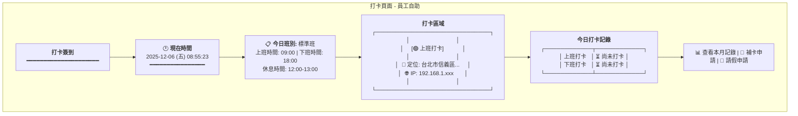
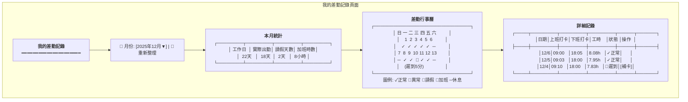
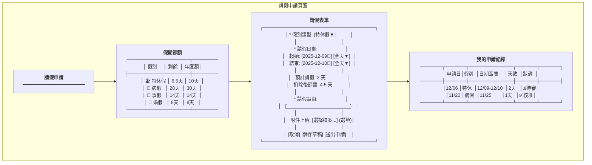
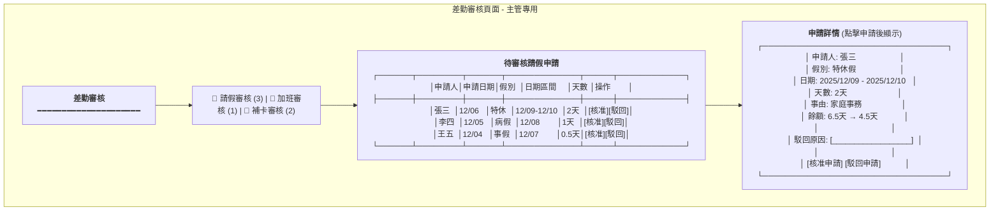
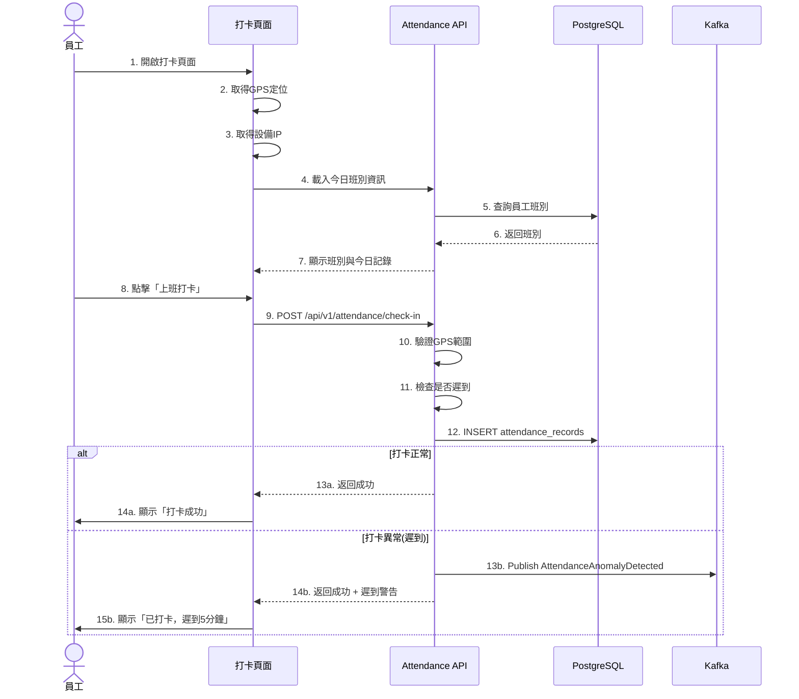
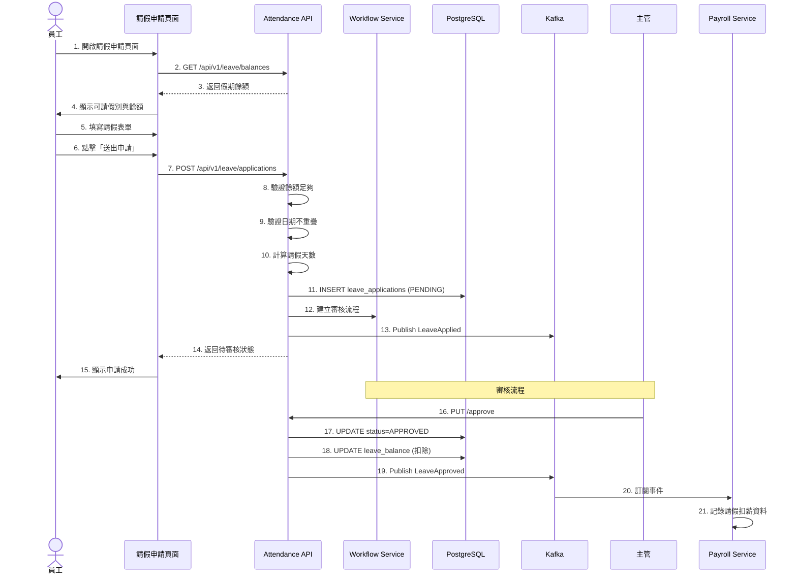
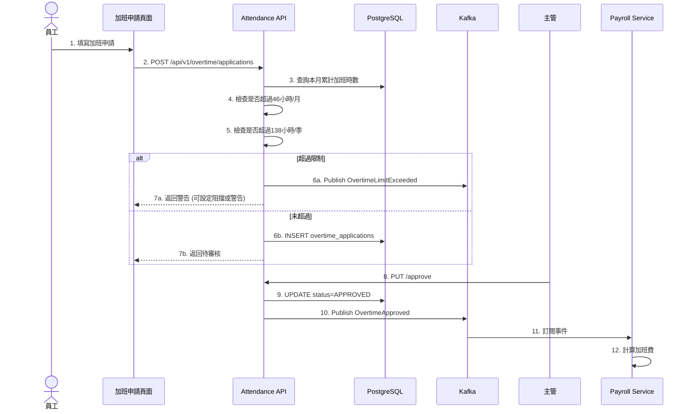

# 考勤管理服務系統設計書

**版本:** 1.0  
**日期:** 2025-12-06  
**Domain代號:** 03 (ATT)  
**目標:** 提供工程師完整的系統實作規格，供PM建立工項清單

---

## 目錄

1. [服務概述](#1-服務概述)
2. [UI設計](#2-ui設計)
3. [UX流程設計](#3-ux流程設計)
4. [畫面事件說明](#4-畫面事件說明)
5. [Data Flow設計](#5-data-flow設計)
6. [資料庫設計](#6-資料庫設計)
7. [Domain設計](#7-domain設計)
8. [領域事件設計](#8-領域事件設計)
9. [API設計](#9-api設計)
10. [事件範例](#10-事件範例)

---

## 1. 服務概述

### 1.1 服務定位
考勤管理服務負責員工的出勤管理、假勤申請與審核，以及加班管理。本服務必須確保**符合台灣勞動基準法**的所有規定。

### 1.2 核心功能
- ✅ **打卡管理:** 多元打卡方式、打卡異常偵測、補卡申請
- ✅ **班別設定:** 彈性班別、輪班、彈性工時管理
- ✅ **假勤管理:** 20+種假別設定、請假申請與審核、假期餘額計算
- ✅ **特休假管理:** 依勞基法自動計算特休、到期提醒、未休補償
- ✅ **加班管理:** 加班申請審核、加班時數管控（46小時/月、138小時/3月）
- ✅ **變形工時:** 支援二週/四週/八週變形工時排班
- ✅ **法規遵循:** 女性員工保護、職業災害管理
- ✅ **差勤報表:** 個人/部門月度差勤統計

### 1.3 技術架構
- **前端:** ReactJS + Redux + Ant Design
- **後端:** Spring Boot 3.1.x + MyBatis
- **資料庫:** PostgreSQL 15.x
- **事件匯流排:** Kafka
- **排程任務:** Quartz Scheduler

### 1.4 服務邊界

| 屬於本服務 | 不屬於本服務 |
|:---|:---|
| 打卡記錄 | 薪資計算 (Payroll Service使用本服務數據) |
| 請假申請與審核 | 員工基本資料 (Organization Service) |
| 加班申請與審核 | 審核流程引擎 (Workflow Service) |
| 假期餘額計算 | |
| 班別與假別規則設定 | |

---

## 2. UI設計

### 2.1 頁面清單

| 頁面代碼 | 頁面名稱 | 路由 | 權限要求 |
|:---|:---|:---|:---:|
| `HR03-P01` | 打卡頁面 | `/attendance/check-in` | - |
| `HR03-P02` | 我的差勤記錄頁面 | `/attendance/my-records` | - |
| `HR03-P03` | 請假申請頁面 | `/attendance/leave/apply` | - |
| `HR03-P04` | 我的假期餘額頁面 | `/attendance/leave/balance` | - |
| `HR03-P05` | 加班申請頁面 | `/attendance/overtime/apply` | - |
| `HR03-P06` | 差勤審核頁面 (主管) | `/admin/attendance/approvals` | attendance:approve |
| `HR03-P07` | 班別管理頁面 | `/admin/attendance/shifts` | shift:manage |
| `HR03-P08` | 假別管理頁面 | `/admin/attendance/leave-types` | leave-type:manage |
| `HR03-P09` | 部門差勤報表頁面 | `/admin/attendance/reports` | attendance:report |
| `HR03-P10` | 月度差勤結算頁面 | `/admin/attendance/monthly-close` | attendance:close |

### 2.2 UI線稿 (Mermaid)

#### 2.2.1 打卡頁面 (HR03-P01)



**頁面元素說明:**
- **時間顯示:** 即時更新的系統時間
- **班別資訊:** 顯示員工今日排定的班別
- **打卡按鈕:** 
  - 上班時段顯示「上班打卡」（綠色）
  - 下班時段顯示「下班打卡」（藍色）
  - 已打卡顯示「已打卡 ✓」（灰色）
- **定位資訊:** 顯示GPS定位與IP
- **今日記錄:** 即時顯示上/下班打卡狀態

**元件規格:**
```typescript
interface CheckInPageData {
  currentTime: Date;
  shift: {
    shiftName: string;
    workStartTime: string;
    workEndTime: string;
    breakStartTime: string;
    breakEndTime: string;
  };
  todayRecord: {
    checkInTime: string | null;
    checkOutTime: string | null;
    isLate: boolean;
    lateMinutes: number;
  };
  location: {
    latitude: number;
    longitude: number;
    address: string;
  };
  ipAddress: string;
}
```

#### 2.2.2 我的差勤記錄頁面 (HR03-P02)



#### 2.2.3 請假申請頁面 (HR03-P03)



#### 2.2.4 差勤審核頁面 (HR03-P06)



---

## 3. UX流程設計

### 3.1 員工打卡流程



**關鍵點:**
- ✅ GPS定位驗證 (誤差<50m)
- ✅ 自動偵測遲到/早退
- ✅ 異常打卡發布事件通知

### 3.2 請假申請流程



**關鍵點:**
- ✅ 即時餘額驗證
- ✅ 重疊日期檢查
- ✅ 整合Workflow審核流程
- ✅ 核准後自動扣除餘額
- ✅ 發布事件供Payroll計算

### 3.3 加班申請流程



**關鍵點:**
- ✅ 勞基法加班時數管控 (46h/月、138h/季)
- ✅ 超時申請預警機制
- ✅ 審核後自動計算加班費/補休

---

*(文件持續，下一部分包含畫面事件說明、資料庫設計、Domain設計、API規格等)*
