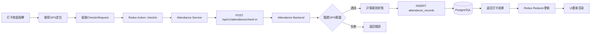
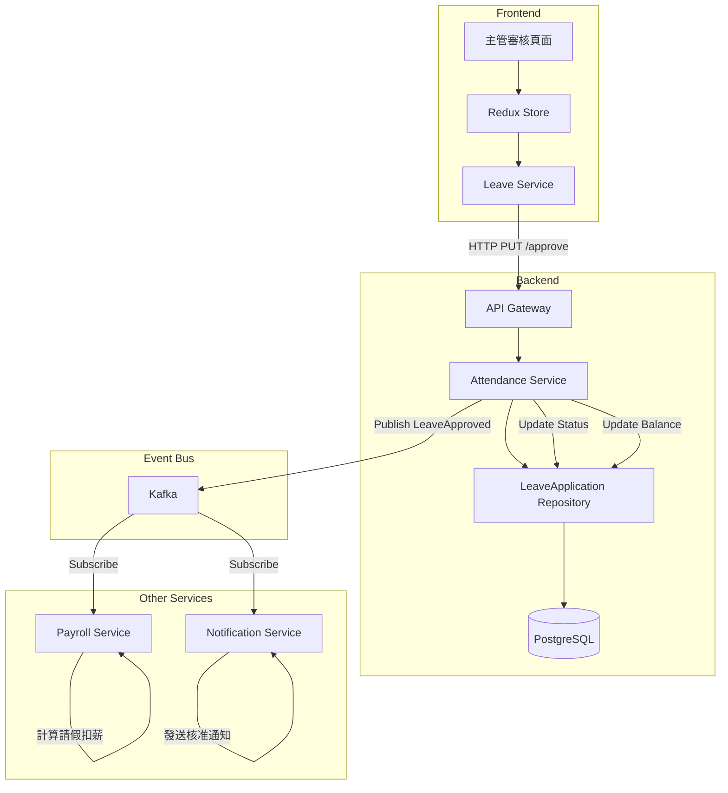
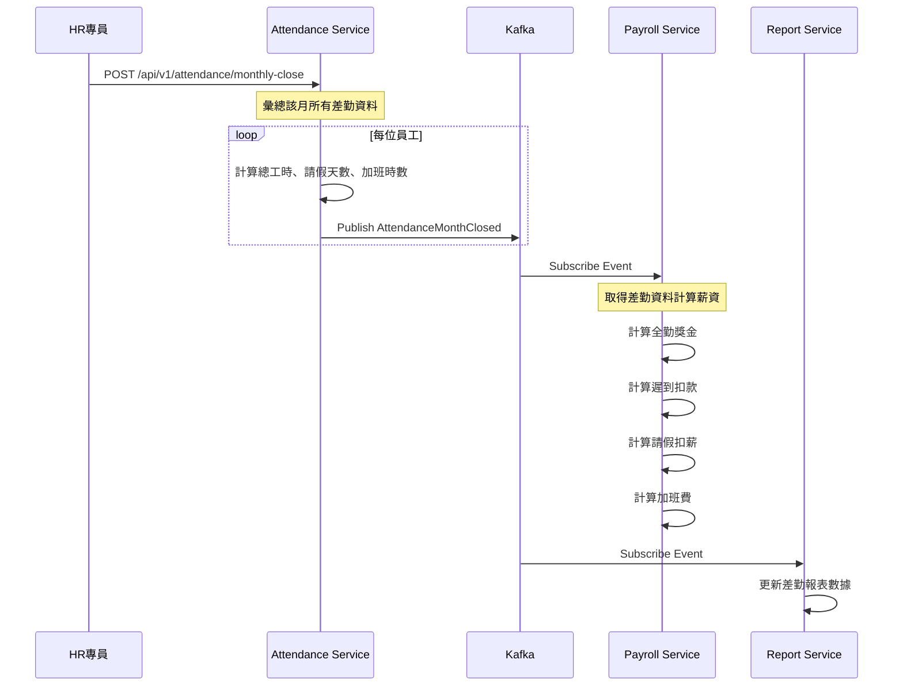
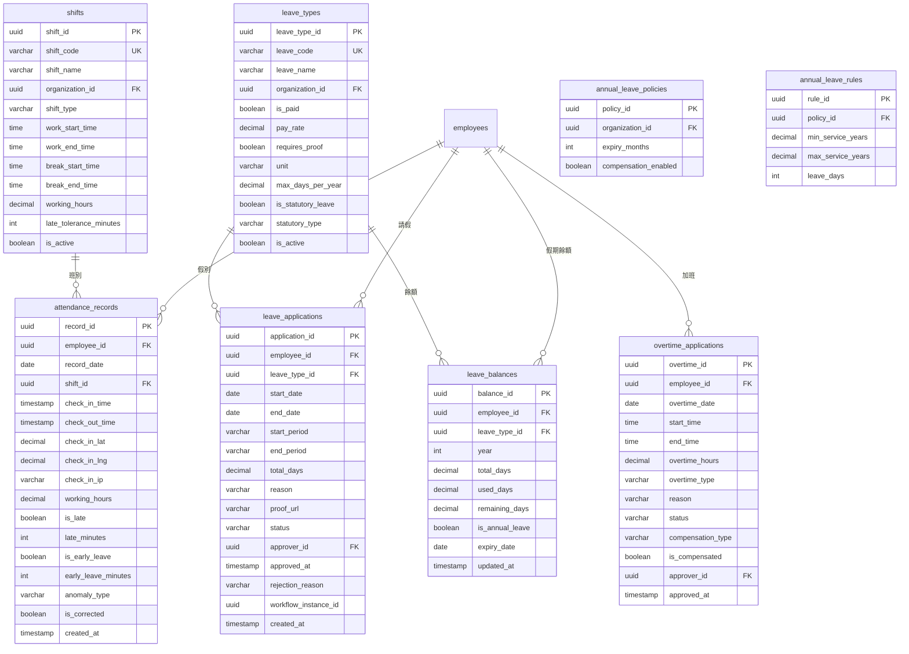

## 4. 畫面事件說明

### 4.1 打卡頁面事件 (HR03-P01)

| 事件ID | 觸發元素 | 事件類型 | 事件處理 | 後端API |
|:---|:---|:---|:---|:---|
| `E-ATT-01` | 頁面載入 | onMount | 取得GPS定位 + 載入班別 | GET /api/v1/attendance/today |
| `E-ATT-02` | 上班打卡按鈕 | onClick | 執行上班打卡 | POST /api/v1/attendance/check-in |
| `E-ATT-03` | 下班打卡按鈕 | onClick | 執行下班打卡 | POST /api/v1/attendance/check-out |
| `E-ATT-04` | 查看本月記錄 | onClick | 路由跳轉 | - |
| `E-ATT-05` | 補卡申請 | onClick | 開啟補卡對話框 | - |

**E-ATT-02 詳細流程:**
```typescript
const handleCheckIn = async () => {
  try {
    // 1. 取得當前位置
    const position = await getCurrentPosition();
    
    // 2. 組裝請求資料
    const request = {
      employeeId: currentUser.employeeId,
      checkInTime: new Date().toISOString(),
      location: {
        latitude: position.coords.latitude,
        longitude: position.coords.longitude
      },
      ipAddress: await getClientIP()
    };
    
    // 3. 呼叫API
    setLoading(true);
    const response = await attendanceService.checkIn(request);
    
    // 4. 更新本地狀態
    dispatch(setTodayRecord(response));
    
    // 5. 顯示結果
    if (response.isLate) {
      message.warning(`打卡成功，遲到 ${response.lateMinutes} 分鐘`);
    } else {
      message.success('打卡成功！');
    }
    
  } catch (error) {
    if (error.code === 'LOCATION_OUT_OF_RANGE') {
      message.error('您的位置不在允許的打卡範圍內');
    } else {
      message.error('打卡失敗，請稍後重試');
    }
  } finally {
    setLoading(false);
  }
};
```

### 4.2 差勤記錄頁面事件 (HR03-P02)

| 事件ID | 觸發元素 | 事件類型 | 事件處理 | 後端API |
|:---|:---|:---|:---|:---|
| `E-REC-01` | 月份選擇器 | onChange | 重新載入該月記錄 | GET /api/v1/attendance/records?month={month} |
| `E-REC-02` | 日曆日期點擊 | onClick | 顯示該日詳情 | - (本地篩選) |
| `E-REC-03` | 補卡按鈕 | onClick | 開啟補卡申請對話框 | - |
| `E-REC-04` | 補卡送出 | onClick | 提交補卡申請 | POST /api/v1/attendance/corrections |

### 4.3 請假申請頁面事件 (HR03-P03)

| 事件ID | 觸發元素 | 事件類型 | 事件處理 | 後端API |
|:---|:---|:---|:---|:---|
| `E-LV-01` | 頁面載入 | onMount | 載入假期餘額 | GET /api/v1/leave/balances |
| `E-LV-02` | 假別選擇器 | onChange | 更新表單驗證規則 | - |
| `E-LV-03` | 日期選擇器 | onChange | 計算請假天數 | GET /api/v1/leave/calculate-days |
| `E-LV-04` | 附件上傳 | onUpload | 上傳附件 | POST /api/v1/files/upload |
| `E-LV-05` | 儲存草稿 | onClick | 儲存至LocalStorage | - |
| `E-LV-06` | 送出申請 | onClick | 提交請假申請 | POST /api/v1/leave/applications |

**E-LV-06 詳細流程:**
```typescript
const handleSubmitLeave = async (values: LeaveFormData) => {
  try {
    // 1. 表單驗證
    await form.validateFields();
    
    // 2. 餘額檢查
    const selectedType = leaveTypes.find(t => t.leaveTypeId === values.leaveTypeId);
    const balance = balances.find(b => b.leaveTypeId === values.leaveTypeId);
    
    if (balance && values.totalDays > balance.remainingDays) {
      message.error(`剩餘餘額不足，目前剩餘 ${balance.remainingDays} 天`);
      return;
    }
    
    // 3. 組裝請求
    const request: CreateLeaveRequest = {
      employeeId: currentUser.employeeId,
      leaveTypeId: values.leaveTypeId,
      startDate: values.dateRange[0].format('YYYY-MM-DD'),
      endDate: values.dateRange[1].format('YYYY-MM-DD'),
      startPeriod: values.startPeriod,
      endPeriod: values.endPeriod,
      reason: values.reason,
      proofAttachmentUrl: values.attachmentUrl
    };
    
    // 4. 提交申請
    setSubmitting(true);
    const response = await leaveService.createApplication(request);
    
    // 5. 更新Redux狀態
    dispatch(addLeaveApplication(response));
    dispatch(refreshLeaveBalances());
    
    // 6. 顯示成功
    message.success('請假申請已送出，待主管審核');
    form.resetFields();
    
  } catch (error) {
    message.error('申請失敗: ' + error.message);
  } finally {
    setSubmitting(false);
  }
};
```

### 4.4 差勤審核頁面事件 (HR03-P06)

| 事件ID | 觸發元素 | 事件類型 | 事件處理 | 後端API |
|:---|:---|:---|:---|:---|
| `E-APR-01` | Tab切換 | onChange | 載入對應類型的待審清單 | GET /api/v1/attendance/approvals?type={type} |
| `E-APR-02` | 申請項目點擊 | onClick | 顯示申請詳情 | - |
| `E-APR-03` | 核准按鈕 | onClick | 確認核准 | PUT /api/v1/leave/applications/{id}/approve |
| `E-APR-04` | 駁回按鈕 | onClick | 開啟駁回原因對話框 | - |
| `E-APR-05` | 駁回確認 | onClick | 執行駁回 | PUT /api/v1/leave/applications/{id}/reject |
| `E-APR-06` | 批次核准 | onClick | 批次核准選中項目 | PUT /api/v1/leave/applications/batch-approve |

---

## 5. Data Flow設計

### 5.1 前端狀態管理 (Redux)

#### 5.1.1 State結構

```typescript
interface AttendanceState {
  // 打卡相關
  checkIn: {
    todayRecord: AttendanceRecord | null;
    shift: Shift | null;
    loading: boolean;
  };
  
  // 差勤記錄
  records: {
    list: AttendanceRecord[];
    selectedMonth: string;
    statistics: MonthlyStatistics | null;
    loading: boolean;
  };
  
  // 請假相關
  leave: {
    balances: LeaveBalance[];
    leaveTypes: LeaveType[];
    applications: LeaveApplication[];
    loading: boolean;
  };
  
  // 加班相關
  overtime: {
    applications: OvertimeApplication[];
    monthlyStatistics: OvertimeStatistics | null;
    loading: boolean;
  };
  
  // 審核相關 (主管)
  approvals: {
    pendingLeaves: LeaveApplication[];
    pendingOvertimes: OvertimeApplication[];
    pendingCorrections: CorrectionRequest[];
    loading: boolean;
  };
}

interface MonthlyStatistics {
  month: string;
  totalWorkDays: number;
  actualWorkDays: number;
  totalLeaveDays: number;
  totalOvertimeHours: number;
  lateCount: number;
  earlyLeaveCount: number;
}
```

#### 5.1.2 Redux Actions

```typescript
// 打卡相關Actions
export const attendanceActions = {
  loadTodayRecord: createAsyncThunk(
    'attendance/loadToday',
    async (employeeId: string) => {
      const response = await attendanceService.getTodayRecord(employeeId);
      return response;
    }
  ),
  
  checkIn: createAsyncThunk(
    'attendance/checkIn',
    async (request: CheckInRequest) => {
      const response = await attendanceService.checkIn(request);
      return response;
    }
  ),
  
  checkOut: createAsyncThunk(
    'attendance/checkOut',
    async (request: CheckOutRequest) => {
      const response = await attendanceService.checkOut(request);
      return response;
    }
  ),
};

// 請假相關Actions
export const leaveActions = {
  loadBalances: createAsyncThunk(
    'leave/loadBalances',
    async (employeeId: string) => {
      const response = await leaveService.getBalances(employeeId);
      return response;
    }
  ),
  
  createApplication: createAsyncThunk(
    'leave/createApplication',
    async (request: CreateLeaveRequest) => {
      const response = await leaveService.createApplication(request);
      return response;
    }
  ),
  
  approveLeave: createAsyncThunk(
    'leave/approve',
    async (applicationId: string) => {
      await leaveService.approveApplication(applicationId);
      return applicationId;
    }
  ),
};
```

### 5.2 前後端資料流

#### 5.2.1 打卡流程資料流



#### 5.2.2 請假審核資料流



### 5.3 服務間資料流

#### 5.3.1 月度差勤結算事件流



---

## 6. 資料庫設計

### 6.1 ER Diagram



### 6.2 DDL Script

```sql
-- 班別表
CREATE TABLE shifts (
    shift_id UUID PRIMARY KEY DEFAULT gen_random_uuid(),
    shift_code VARCHAR(50) UNIQUE NOT NULL,
    shift_name VARCHAR(255) NOT NULL,
    organization_id UUID NOT NULL,
    shift_type VARCHAR(20) NOT NULL CHECK (shift_type IN ('STANDARD', 'FLEXIBLE', 'ROTATING')),
    work_start_time TIME NOT NULL,
    work_end_time TIME NOT NULL,
    break_start_time TIME,
    break_end_time TIME,
    working_hours DECIMAL(4,2) NOT NULL,
    late_tolerance_minutes INTEGER DEFAULT 0,
    early_leave_tolerance_minutes INTEGER DEFAULT 0,
    is_active BOOLEAN DEFAULT TRUE,
    created_at TIMESTAMP DEFAULT CURRENT_TIMESTAMP,
    updated_at TIMESTAMP DEFAULT CURRENT_TIMESTAMP
);

CREATE INDEX idx_shifts_org ON shifts(organization_id);
CREATE INDEX idx_shifts_active ON shifts(is_active) WHERE is_active = TRUE;

COMMENT ON TABLE shifts IS '班別設定表';
COMMENT ON COLUMN shifts.shift_type IS '班別類型: STANDARD標準班, FLEXIBLE彈性班, ROTATING輪班';
COMMENT ON COLUMN shifts.late_tolerance_minutes IS '遲到容許分鐘數';

-- 假別表
CREATE TABLE leave_types (
    leave_type_id UUID PRIMARY KEY DEFAULT gen_random_uuid(),
    leave_code VARCHAR(50) UNIQUE NOT NULL,
    leave_name VARCHAR(255) NOT NULL,
    organization_id UUID,
    is_paid BOOLEAN DEFAULT FALSE,
    pay_rate DECIMAL(3,2) DEFAULT 0 CHECK (pay_rate >= 0 AND pay_rate <= 1),
    requires_proof BOOLEAN DEFAULT FALSE,
    proof_description TEXT,
    unit VARCHAR(20) NOT NULL CHECK (unit IN ('HOUR', 'HALF_DAY', 'FULL_DAY')),
    max_days_per_year DECIMAL(5,2),
    can_carryover BOOLEAN DEFAULT FALSE,
    is_statutory_leave BOOLEAN DEFAULT FALSE,
    statutory_type VARCHAR(50),
    is_active BOOLEAN DEFAULT TRUE,
    created_at TIMESTAMP DEFAULT CURRENT_TIMESTAMP
);

CREATE INDEX idx_leave_types_org ON leave_types(organization_id);
CREATE INDEX idx_leave_types_statutory ON leave_types(is_statutory_leave);

COMMENT ON TABLE leave_types IS '假別設定表';
COMMENT ON COLUMN leave_types.is_paid IS '是否支薪';
COMMENT ON COLUMN leave_types.pay_rate IS '支薪比例 (1=全薪, 0.5=半薪)';
COMMENT ON COLUMN leave_types.statutory_type IS '法定假別類型: ANNUAL_LEAVE, SICK_LEAVE, MARRIAGE_LEAVE等';

-- 打卡記錄表
CREATE TABLE attendance_records (
    record_id UUID PRIMARY KEY DEFAULT gen_random_uuid(),
    employee_id UUID NOT NULL,
    record_date DATE NOT NULL,
    shift_id UUID REFERENCES shifts(shift_id),
    check_in_time TIMESTAMP,
    check_out_time TIMESTAMP,
    check_in_latitude DECIMAL(10,7),
    check_in_longitude DECIMAL(10,7),
    check_in_ip VARCHAR(50),
    check_out_latitude DECIMAL(10,7),
    check_out_longitude DECIMAL(10,7),
    check_out_ip VARCHAR(50),
    working_hours DECIMAL(5,2),
    is_late BOOLEAN DEFAULT FALSE,
    late_minutes INTEGER DEFAULT 0,
    is_early_leave BOOLEAN DEFAULT FALSE,
    early_leave_minutes INTEGER DEFAULT 0,
    anomaly_type VARCHAR(30) CHECK (anomaly_type IN ('LATE', 'EARLY_LEAVE', 'MISSING_CHECK_IN', 'MISSING_CHECK_OUT', 'ABNORMAL_LOCATION')),
    anomaly_note TEXT,
    is_corrected BOOLEAN DEFAULT FALSE,
    created_at TIMESTAMP DEFAULT CURRENT_TIMESTAMP,
    updated_at TIMESTAMP DEFAULT CURRENT_TIMESTAMP,
    
    CONSTRAINT uk_attendance_employee_date UNIQUE (employee_id, record_date)
);

CREATE INDEX idx_attendance_employee ON attendance_records(employee_id);
CREATE INDEX idx_attendance_date ON attendance_records(record_date);
CREATE INDEX idx_attendance_anomaly ON attendance_records(anomaly_type) WHERE anomaly_type IS NOT NULL;

COMMENT ON TABLE attendance_records IS '打卡記錄表';
COMMENT ON COLUMN attendance_records.anomaly_type IS '異常類型: LATE遲到, EARLY_LEAVE早退, MISSING_CHECK_IN忘打上班卡等';

-- 請假申請表
CREATE TABLE leave_applications (
    application_id UUID PRIMARY KEY DEFAULT gen_random_uuid(),
    employee_id UUID NOT NULL,
    leave_type_id UUID NOT NULL REFERENCES leave_types(leave_type_id),
    start_date DATE NOT NULL,
    end_date DATE NOT NULL,
    start_period VARCHAR(10) NOT NULL CHECK (start_period IN ('AM', 'PM', 'FULL_DAY')),
    end_period VARCHAR(10) NOT NULL CHECK (end_period IN ('AM', 'PM', 'FULL_DAY')),
    total_days DECIMAL(4,1) NOT NULL,
    total_hours DECIMAL(5,1),
    reason TEXT NOT NULL,
    proof_attachment_url VARCHAR(500),
    applied_at TIMESTAMP DEFAULT CURRENT_TIMESTAMP,
    status VARCHAR(20) NOT NULL DEFAULT 'PENDING' CHECK (status IN ('DRAFT', 'PENDING', 'APPROVED', 'REJECTED', 'CANCELLED')),
    approver_id UUID,
    approved_at TIMESTAMP,
    rejection_reason TEXT,
    workflow_instance_id UUID,
    created_at TIMESTAMP DEFAULT CURRENT_TIMESTAMP,
    updated_at TIMESTAMP DEFAULT CURRENT_TIMESTAMP,
    
    CONSTRAINT chk_leave_dates CHECK (end_date >= start_date)
);

CREATE INDEX idx_leave_app_employee ON leave_applications(employee_id);
CREATE INDEX idx_leave_app_status ON leave_applications(status);
CREATE INDEX idx_leave_app_dates ON leave_applications(start_date, end_date);
CREATE INDEX idx_leave_app_approver ON leave_applications(approver_id) WHERE status = 'PENDING';

COMMENT ON TABLE leave_applications IS '請假申請表';
COMMENT ON COLUMN leave_applications.start_period IS '起始時段: AM上午, PM下午, FULL_DAY全天';

-- 加班申請表
CREATE TABLE overtime_applications (
    overtime_id UUID PRIMARY KEY DEFAULT gen_random_uuid(),
    employee_id UUID NOT NULL,
    overtime_date DATE NOT NULL,
    start_time TIME NOT NULL,
    end_time TIME NOT NULL,
    overtime_hours DECIMAL(4,1) NOT NULL,
    overtime_type VARCHAR(20) NOT NULL CHECK (overtime_type IN ('WEEKDAY', 'REST_DAY', 'HOLIDAY')),
    reason TEXT NOT NULL,
    applied_at TIMESTAMP DEFAULT CURRENT_TIMESTAMP,
    status VARCHAR(20) NOT NULL DEFAULT 'PENDING' CHECK (status IN ('DRAFT', 'PENDING', 'APPROVED', 'REJECTED', 'CANCELLED')),
    approver_id UUID,
    approved_at TIMESTAMP,
    rejection_reason TEXT,
    compensation_type VARCHAR(20) CHECK (compensation_type IN ('PAY', 'COMP_TIME')),
    is_compensated BOOLEAN DEFAULT FALSE,
    workflow_instance_id UUID,
    created_at TIMESTAMP DEFAULT CURRENT_TIMESTAMP,
    updated_at TIMESTAMP DEFAULT CURRENT_TIMESTAMP,
    
    CONSTRAINT chk_overtime_times CHECK (end_time > start_time)
);

CREATE INDEX idx_overtime_employee ON overtime_applications(employee_id);
CREATE INDEX idx_overtime_date ON overtime_applications(overtime_date);
CREATE INDEX idx_overtime_status ON overtime_applications(status);

COMMENT ON TABLE overtime_applications IS '加班申請表';
COMMENT ON COLUMN overtime_applications.overtime_type IS '加班類型: WEEKDAY平日, REST_DAY休息日, HOLIDAY國定假日';
COMMENT ON COLUMN overtime_applications.compensation_type IS '補償方式: PAY加班費, COMP_TIME補休';

-- 假期餘額表
CREATE TABLE leave_balances (
    balance_id UUID PRIMARY KEY DEFAULT gen_random_uuid(),
    employee_id UUID NOT NULL,
    leave_type_id UUID NOT NULL REFERENCES leave_types(leave_type_id),
    year INTEGER NOT NULL,
    total_days DECIMAL(5,1) NOT NULL,
    used_days DECIMAL(5,1) NOT NULL DEFAULT 0,
    remaining_days DECIMAL(5,1) NOT NULL,
    is_annual_leave BOOLEAN DEFAULT FALSE,
    expiry_date DATE,
    updated_at TIMESTAMP DEFAULT CURRENT_TIMESTAMP,
    
    CONSTRAINT uk_balance_emp_type_year UNIQUE (employee_id, leave_type_id, year),
    CONSTRAINT chk_balance_days CHECK (remaining_days = total_days - used_days)
);

CREATE INDEX idx_balance_employee ON leave_balances(employee_id);
CREATE INDEX idx_balance_expiry ON leave_balances(expiry_date) WHERE is_annual_leave = TRUE;

COMMENT ON TABLE leave_balances IS '假期餘額表';
COMMENT ON COLUMN leave_balances.expiry_date IS '特休假到期日';

-- 特休假政策表
CREATE TABLE annual_leave_policies (
    policy_id UUID PRIMARY KEY DEFAULT gen_random_uuid(),
    organization_id UUID NOT NULL UNIQUE,
    expiry_months INTEGER DEFAULT 12,
    compensation_enabled BOOLEAN DEFAULT TRUE,
    created_at TIMESTAMP DEFAULT CURRENT_TIMESTAMP
);

-- 特休假規則表 (年資對應天數)
CREATE TABLE annual_leave_rules (
    rule_id UUID PRIMARY KEY DEFAULT gen_random_uuid(),
    policy_id UUID NOT NULL REFERENCES annual_leave_policies(policy_id),
    min_service_years DECIMAL(4,2) NOT NULL,
    max_service_years DECIMAL(4,2),
    leave_days INTEGER NOT NULL,
    
    CONSTRAINT uk_rule_policy_years UNIQUE (policy_id, min_service_years)
);

COMMENT ON TABLE annual_leave_rules IS '特休假規則表 (依勞基法年資對應天數)';

-- 補卡申請表
CREATE TABLE attendance_corrections (
    correction_id UUID PRIMARY KEY DEFAULT gen_random_uuid(),
    record_id UUID NOT NULL REFERENCES attendance_records(record_id),
    employee_id UUID NOT NULL,
    correction_type VARCHAR(20) NOT NULL CHECK (correction_type IN ('CHECK_IN', 'CHECK_OUT')),
    original_time TIMESTAMP,
    corrected_time TIMESTAMP NOT NULL,
    reason TEXT NOT NULL,
    status VARCHAR(20) NOT NULL DEFAULT 'PENDING' CHECK (status IN ('PENDING', 'APPROVED', 'REJECTED')),
    approver_id UUID,
    approved_at TIMESTAMP,
    created_at TIMESTAMP DEFAULT CURRENT_TIMESTAMP
);

CREATE INDEX idx_correction_employee ON attendance_corrections(employee_id);
CREATE INDEX idx_correction_status ON attendance_corrections(status);

COMMENT ON TABLE attendance_corrections IS '補卡申請表';
```

### 6.3 資料字典

| 表名 | 欄位 | 類型 | 說明 | 備註 |
|:---|:---|:---|:---|:---|
| `shifts` | shift_type | ENUM | 班別類型 | STANDARD/FLEXIBLE/ROTATING |
| `leave_types` | unit | ENUM | 請假單位 | HOUR/HALF_DAY/FULL_DAY |
| `leave_types` | statutory_type | ENUM | 法定假別 | ANNUAL_LEAVE, SICK_LEAVE等 |
| `attendance_records` | anomaly_type | ENUM | 異常類型 | LATE, EARLY_LEAVE等 |
| `leave_applications` | status | ENUM | 申請狀態 | DRAFT/PENDING/APPROVED/REJECTED/CANCELLED |
| `overtime_applications` | overtime_type | ENUM | 加班類型 | WEEKDAY/REST_DAY/HOLIDAY |
| `overtime_applications` | compensation_type | ENUM | 補償方式 | PAY/COMP_TIME |

### 6.4 初始化資料

```sql
-- 初始化法定假別
INSERT INTO leave_types (leave_code, leave_name, is_paid, pay_rate, requires_proof, unit, max_days_per_year, is_statutory_leave, statutory_type) VALUES
('ANNUAL', '特休假', TRUE, 1.0, FALSE, 'FULL_DAY', NULL, TRUE, 'ANNUAL_LEAVE'),
('SICK', '病假', FALSE, 0.5, TRUE, 'HALF_DAY', 30, TRUE, 'SICK_LEAVE'),
('PERSONAL', '事假', FALSE, 0.0, FALSE, 'HALF_DAY', 14, TRUE, 'PERSONAL_LEAVE'),
('MARRIAGE', '婚假', TRUE, 1.0, TRUE, 'FULL_DAY', 8, TRUE, 'MARRIAGE_LEAVE'),
('BEREAVEMENT_PARENT', '喪假(父母)', TRUE, 1.0, TRUE, 'FULL_DAY', 8, TRUE, 'BEREAVEMENT_LEAVE'),
('BEREAVEMENT_SPOUSE', '喪假(配偶)', TRUE, 1.0, TRUE, 'FULL_DAY', 8, TRUE, 'BEREAVEMENT_LEAVE'),
('BEREAVEMENT_CHILD', '喪假(子女)', TRUE, 1.0, TRUE, 'FULL_DAY', 8, TRUE, 'BEREAVEMENT_LEAVE'),
('MATERNITY', '產假', TRUE, 1.0, TRUE, 'FULL_DAY', 56, TRUE, 'MATERNITY_LEAVE'),
('PATERNITY', '陪產假', TRUE, 1.0, TRUE, 'FULL_DAY', 7, TRUE, 'PATERNITY_LEAVE'),
('MENSTRUAL', '生理假', FALSE, 0.5, FALSE, 'FULL_DAY', 12, TRUE, 'MENSTRUAL_LEAVE'),
('PARENTAL', '育嬰留停', FALSE, 0.0, TRUE, 'FULL_DAY', NULL, TRUE, 'PARENTAL_LEAVE'),
('COMP_TIME', '補休', TRUE, 1.0, FALSE, 'HOUR', NULL, FALSE, NULL);

-- 初始化標準班別
INSERT INTO shifts (shift_code, shift_name, organization_id, shift_type, work_start_time, work_end_time, break_start_time, break_end_time, working_hours, late_tolerance_minutes) VALUES
('STD', '標準班', '00000000-0000-0000-0000-000000000001', 'STANDARD', '09:00', '18:00', '12:00', '13:00', 8.0, 5),
('FLEX_A', '彈性班A(08:00-17:00)', '00000000-0000-0000-0000-000000000001', 'FLEXIBLE', '08:00', '17:00', '12:00', '13:00', 8.0, 0),
('FLEX_B', '彈性班B(10:00-19:00)', '00000000-0000-0000-0000-000000000001', 'FLEXIBLE', '10:00', '19:00', '12:00', '13:00', 8.0, 0);

-- 初始化特休假規則 (勞基法)
INSERT INTO annual_leave_policies (organization_id, expiry_months, compensation_enabled) VALUES
('00000000-0000-0000-0000-000000000001', 12, TRUE);

INSERT INTO annual_leave_rules (policy_id, min_service_years, max_service_years, leave_days) VALUES
((SELECT policy_id FROM annual_leave_policies LIMIT 1), 0.5, 1, 3),
((SELECT policy_id FROM annual_leave_policies LIMIT 1), 1, 2, 7),
((SELECT policy_id FROM annual_leave_policies LIMIT 1), 2, 3, 10),
((SELECT policy_id FROM annual_leave_policies LIMIT 1), 3, 5, 14),
((SELECT policy_id FROM annual_leave_policies LIMIT 1), 5, 10, 15),
((SELECT policy_id FROM annual_leave_policies LIMIT 1), 10, NULL, 15);  -- 10年以上每年+1天，由程式計算
```

---

*(文件持續，下一部分包含Domain設計、領域事件設計、完整API規格等)*
