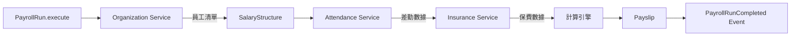
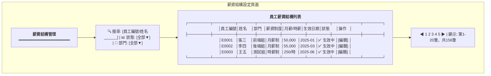
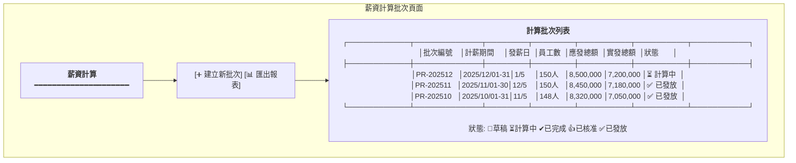
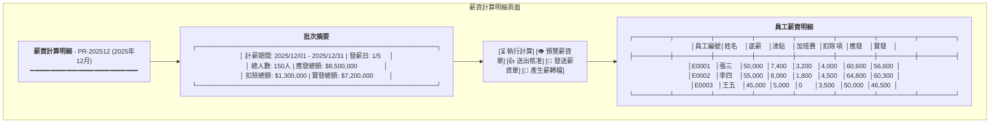
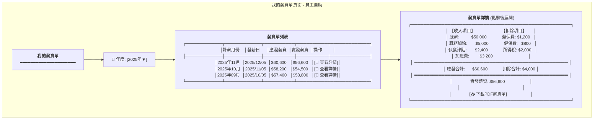
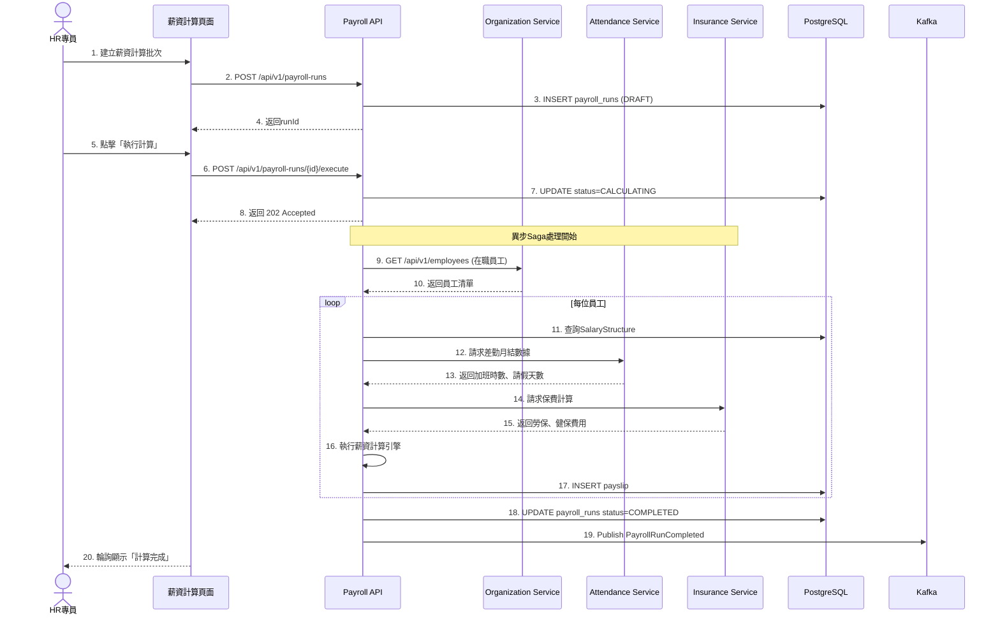
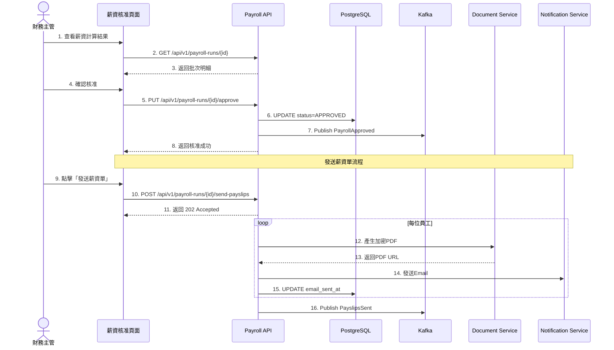
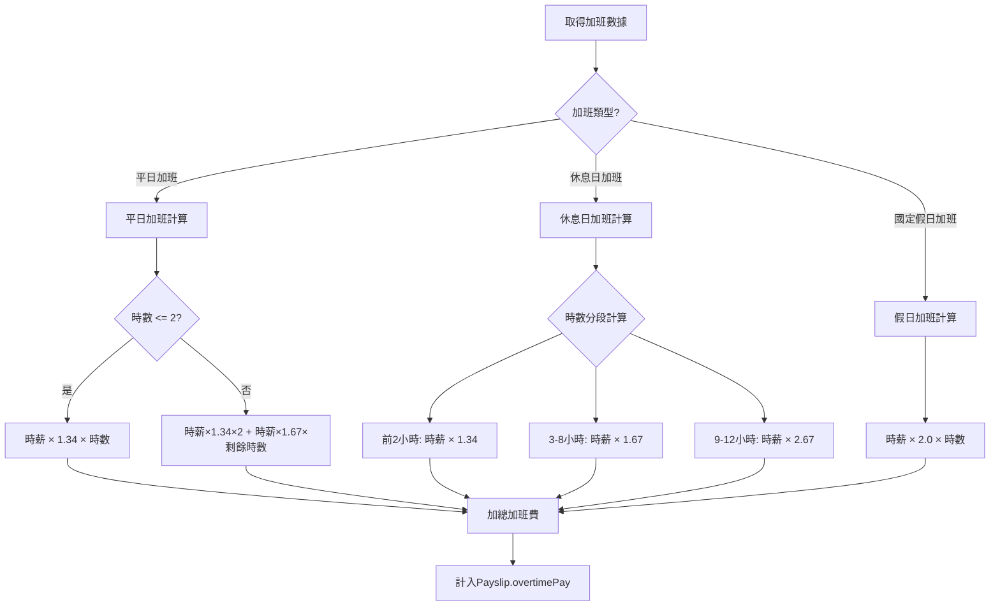

# 薪資管理服務系統設計書

**版本:** 1.0  
**日期:** 2025-12-07  
**Domain代號:** 04 (PAY)  
**目標:** 提供工程師完整的系統實作規格，供PM建立工項清單

---

## 目錄

1. [服務概述](#1-服務概述)
2. [UI設計](#2-ui設計)
3. [UX流程設計](#3-ux流程設計)
4. [畫面事件說明](#4-畫面事件說明)
5. [Data Flow設計](#5-data-flow設計)
6. [資料庫設計](#6-資料庫設計)
7. [Domain設計](#7-domain設計)
8. [領域事件設計](#8-領域事件設計)
9. [API設計](#9-api設計)
10. [工項清單摘要](#10-工項清單摘要)

---

## 1. 服務概述

### 1.1 服務定位
薪資管理服務是HR系統的**核心業務服務**，負責複雜的薪資計算邏輯。這是整個HR系統中計算最複雜的服務，必須整合差勤、保險、工時等多方數據，確保薪資計算的準確性與合規性。

### 1.2 核心功能
- ✅ **薪資結構管理:** 支援時薪制/月薪制、多領薪週期（日/週/半月/月領）
- ✅ **薪資項目設定:** 彈性設定20+種薪資項目（底薪、津貼、獎金、扣項）
- ✅ **自動化薪資運算:** 整合差勤、保險、工時數據，自動計算薪資
- ✅ **加班費計算:** 依勞基法計算平日/休息日/假日加班費
- ✅ **所得稅扣繳:** 自動計算所得稅、二代健保補充保費
- ✅ **薪資單管理:** 產生加密電子薪資單、Email發送
- ✅ **銀行薪轉:** 產生銀行薪轉媒體檔
- ✅ **專案成本核算:** 整合工時數據，計算專案人力成本（第二階段整合）

### 1.3 技術架構
- **前端:** ReactJS + Redux + Ant Design
- **後端:** Spring Boot 3.1.x + MyBatis
- **資料庫:** PostgreSQL 15.x
- **事件匯流排:** Kafka
- **排程任務:** Quartz Scheduler
- **PDF生成:** iText / OpenPDF

### 1.4 服務邊界

| 屬於本服務 | 不屬於本服務 |
|:---|:---|
| 薪資結構定義 | 差勤資料 (Attendance Service提供) |
| 薪資計算引擎 | 保險費用計算 (Insurance Service提供) |
| 薪資單產生 | 工時資料 (Timesheet Service提供) |
| 薪資歷史記錄 | 員工基本資料 (Organization Service) |
| 銀行薪轉檔案 | |

### 1.5 Saga模式整合

薪資計算需整合多個服務數據，採用Saga模式：



---

## 2. UI設計

### 2.1 頁面清單

| 頁面代碼 | 頁面名稱 | 路由 | 權限要求 |
|:---|:---|:---|:---:|
| `HR04-P01` | 薪資結構設定頁面 | `/admin/payroll/structures` | payroll:structure:manage |
| `HR04-P02` | 薪資項目設定頁面 | `/admin/payroll/items` | payroll:item:manage |
| `HR04-P03` | 薪資計算批次頁面 | `/admin/payroll/runs` | payroll:run:manage |
| `HR04-P04` | 薪資計算明細頁面 | `/admin/payroll/runs/:id` | payroll:run:read |
| `HR04-P05` | 薪資核准頁面 | `/admin/payroll/approval` | payroll:run:approve |
| `HR04-P06` | 我的薪資單頁面 (ESS) | `/profile/payslips` | - |
| `HR04-P07` | 員工薪資查詢頁面 | `/admin/payroll/employees` | payroll:payslip:read:all |
| `HR04-P08` | 薪轉檔案產生頁面 | `/admin/payroll/bank-transfer` | payroll:bank:manage |
| `HR04-M01` | 薪資結構編輯對話框 | (Modal) | payroll:structure:manage |
| `HR04-M02` | 薪資項目編輯對話框 | (Modal) | payroll:item:manage |

### 2.2 UI線稿 (Mermaid)

#### 2.2.1 薪資結構設定頁面 (HR04-P01)



#### 2.2.2 薪資計算批次頁面 (HR04-P03)



#### 2.2.3 薪資計算明細頁面 (HR04-P04)



#### 2.2.4 我的薪資單頁面 - ESS (HR04-P06)



---

## 3. UX流程設計

### 3.1 薪資計算執行流程 (Saga Pattern)



### 3.2 薪資核准與發放流程



### 3.3 加班費計算邏輯流程



---

## 4. 畫面事件說明

### 4.1 薪資結構設定頁面事件 (HR04-P01)

| 事件ID | 觸發元素 | 事件類型 | 事件處理 | 後端API |
|:---|:---|:---|:---|:---|
| `E-PAY-01` | 搜尋框 | onChange (debounce 500ms) | 重新查詢員工薪資結構 | GET /api/v1/salary-structures |
| `E-PAY-02` | 編輯按鈕 | onClick | 開啟薪資結構編輯對話框 | GET /api/v1/salary-structures/{id} |
| `E-PAY-03` | 儲存按鈕 | onClick | 儲存薪資結構 | PUT /api/v1/salary-structures/{id} |
| `E-PAY-04` | 新增項目按鈕 | onClick | 新增薪資項目列 | - |
| `E-PAY-05` | 刪除項目按鈕 | onClick | 移除薪資項目列 | - |

### 4.2 薪資計算批次頁面事件 (HR04-P03)

| 事件ID | 觸發元素 | 事件類型 | 事件處理 | 後端API |
|:---|:---|:---|:---|:---|
| `E-RUN-01` | 建立新批次按鈕 | onClick | 開啟建立批次對話框 | - |
| `E-RUN-02` | 確認建立按鈕 | onClick | 建立薪資計算批次 | POST /api/v1/payroll-runs |
| `E-RUN-03` | 批次列點擊 | onClick | 跳轉至批次明細頁 | - |
| `E-RUN-04` | 執行計算按鈕 | onClick | 執行薪資計算 | POST /api/v1/payroll-runs/{id}/execute |
| `E-RUN-05` | 送出核准按鈕 | onClick | 送交核准 | PUT /api/v1/payroll-runs/{id}/submit |
| `E-RUN-06` | 核准按鈕 | onClick | 核准薪資 | PUT /api/v1/payroll-runs/{id}/approve |
| `E-RUN-07` | 發送薪資單按鈕 | onClick | 發送所有薪資單 | POST /api/v1/payroll-runs/{id}/send-payslips |
| `E-RUN-08` | 產生薪轉檔按鈕 | onClick | 產生銀行媒體檔 | POST /api/v1/payroll-runs/{id}/bank-transfer-file |

### 4.3 我的薪資單頁面事件 (HR04-P06)

| 事件ID | 觸發元素 | 事件類型 | 事件處理 | 後端API |
|:---|:---|:---|:---|:---|
| `E-SLIP-01` | 年度選擇器 | onChange | 重新載入該年度薪資單 | GET /api/v1/payslips?year={year} |
| `E-SLIP-02` | 查看詳情按鈕 | onClick | 展開薪資單詳情 | GET /api/v1/payslips/{id} |
| `E-SLIP-03` | 下載PDF按鈕 | onClick | 下載加密PDF | GET /api/v1/payslips/{id}/pdf |

**E-SLIP-03 詳細流程:**
```typescript
const handleDownloadPDF = async (payslipId: string) => {
  try {
    // 1. 請求PDF (需密碼驗證)
    const response = await payrollService.downloadPayslipPDF(payslipId);
    
    // 2. 建立Blob並下載
    const blob = new Blob([response.data], { type: 'application/pdf' });
    const url = window.URL.createObjectURL(blob);
    
    const link = document.createElement('a');
    link.href = url;
    link.download = `薪資單_${payslipId}.pdf`;
    link.click();
    
    // 3. 提示密碼
    message.info('PDF密碼為您的身分證字號後4碼');
    
  } catch (error) {
    message.error('下載失敗，請稍後重試');
  }
};
```

---

*(文件持續，下一部分包含Data Flow設計、資料庫設計、Domain設計、完整API規格等)*
