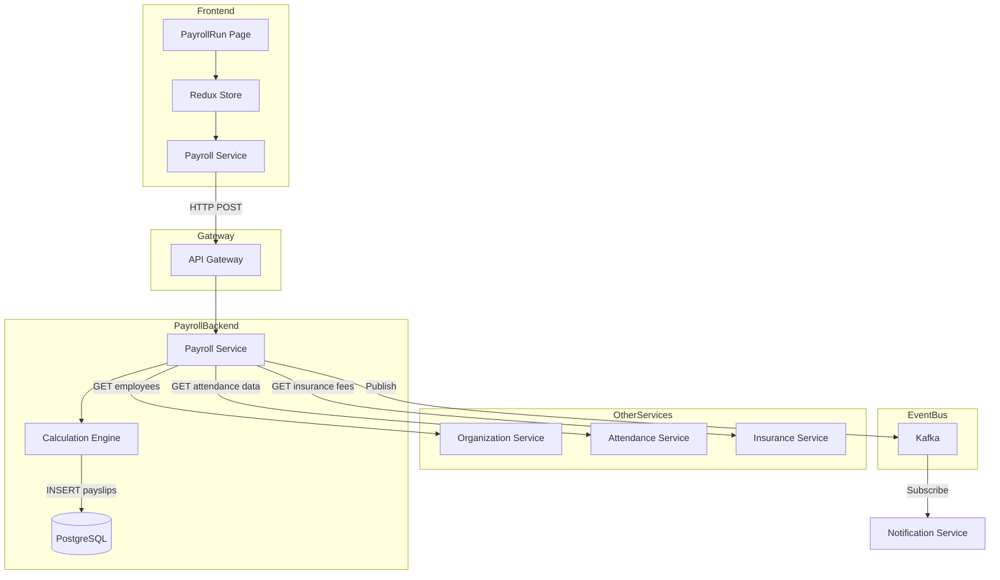
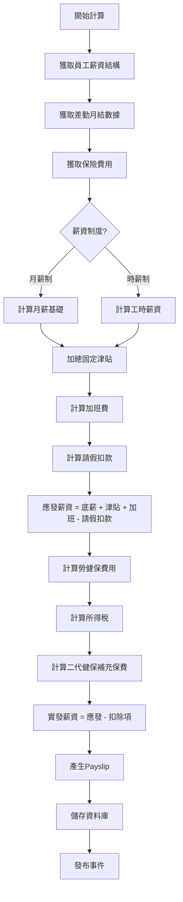
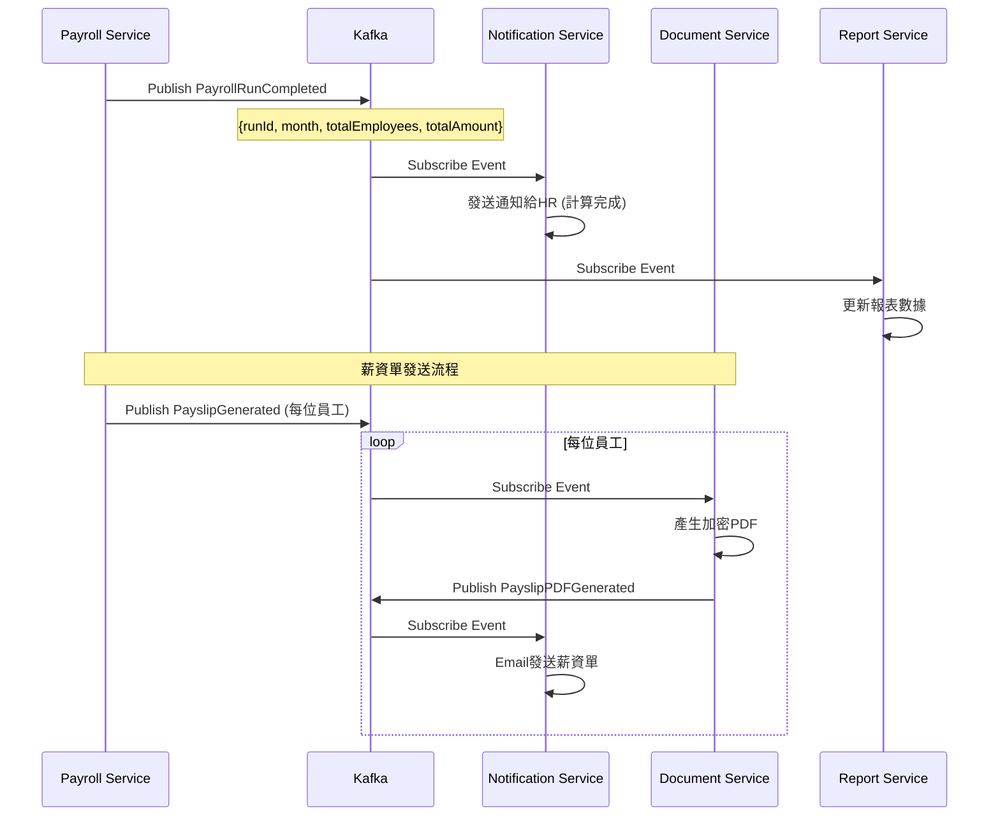
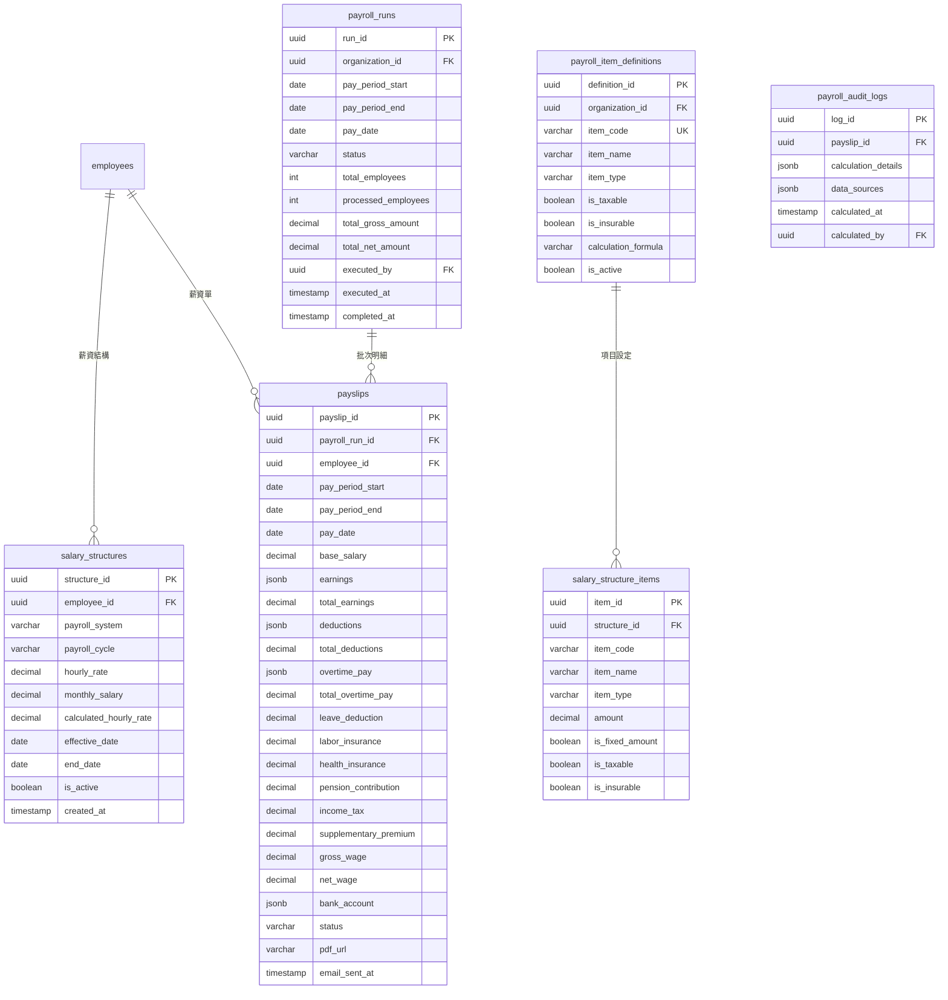

## 5. Data Flow設計

### 5.1 前端狀態管理 (Redux)

#### 5.1.1 State結構

```typescript
interface PayrollState {
  // 薪資結構
  salaryStructures: {
    list: SalaryStructure[];
    current: SalaryStructure | null;
    loading: boolean;
  };
  
  // 薪資計算批次
  payrollRuns: {
    list: PayrollRun[];
    current: PayrollRunDetail | null;
    status: PayrollRunStatus;
    loading: boolean;
    calculating: boolean;
  };
  
  // 薪資單明細
  payslips: {
    list: Payslip[];
    currentBatchPayslips: Payslip[];
    myPayslips: Payslip[];  // ESS用
    selectedPayslip: PayslipDetail | null;
    loading: boolean;
  };
  
  // 薪資項目設定
  payrollItems: {
    earnings: PayrollItem[];
    deductions: PayrollItem[];
    loading: boolean;
  };
}

interface PayrollRunDetail {
  runId: string;
  status: PayrollRunStatus;
  payPeriod: {
    start: string;
    end: string;
  };
  payDate: string;
  statistics: {
    totalEmployees: number;
    processedEmployees: number;
    totalGrossAmount: number;
    totalNetAmount: number;
    totalDeductions: number;
  };
  payslips: PayslipSummary[];
}

interface PayslipDetail {
  payslipId: string;
  employeeId: string;
  employeeName: string;
  payPeriod: string;
  payDate: string;
  
  // 收入項
  baseSalary: number;
  earnings: {
    itemName: string;
    amount: number;
  }[];
  totalEarnings: number;
  
  // 加班費
  overtimePay: {
    weekdayHours: number;
    weekdayPay: number;
    restDayHours: number;
    restDayPay: number;
    holidayHours: number;
    holidayPay: number;
    total: number;
  };
  
  // 扣除項
  deductions: {
    itemName: string;
    amount: number;
  }[];
  laborInsurance: number;
  healthInsurance: number;
  pensionSelfContribution: number;
  incomeTax: number;
  supplementaryPremium: number;
  totalDeductions: number;
  
  // 結果
  grossWage: number;
  netWage: number;
  
  pdfUrl: string;
}
```

#### 5.1.2 Redux Actions

```typescript
// 薪資計算批次Actions
export const payrollRunActions = {
  fetchPayrollRuns: createAsyncThunk(
    'payroll/fetchRuns',
    async (params: { year?: number }) => {
      const response = await payrollService.getPayrollRuns(params);
      return response;
    }
  ),
  
  createPayrollRun: createAsyncThunk(
    'payroll/createRun',
    async (data: CreatePayrollRunRequest) => {
      const response = await payrollService.createPayrollRun(data);
      return response;
    }
  ),
  
  executePayrollRun: createAsyncThunk(
    'payroll/executeRun',
    async (runId: string) => {
      const response = await payrollService.executePayrollRun(runId);
      return response;
    }
  ),
  
  approvePayrollRun: createAsyncThunk(
    'payroll/approveRun',
    async (runId: string) => {
      const response = await payrollService.approvePayrollRun(runId);
      return response;
    }
  ),
  
  sendPayslips: createAsyncThunk(
    'payroll/sendPayslips',
    async (runId: string, { dispatch }) => {
      const response = await payrollService.sendPayslips(runId);
      // 開始輪詢狀態
      dispatch(pollPayslipSendStatus(runId));
      return response;
    }
  ),
};

// 薪資單Actions
export const payslipActions = {
  fetchMyPayslips: createAsyncThunk(
    'payslip/fetchMine',
    async (year: number) => {
      const response = await payslipService.getMyPayslips(year);
      return response;
    }
  ),
  
  fetchPayslipDetail: createAsyncThunk(
    'payslip/fetchDetail',
    async (payslipId: string) => {
      const response = await payslipService.getPayslipDetail(payslipId);
      return response;
    }
  ),
  
  downloadPayslipPDF: createAsyncThunk(
    'payslip/downloadPDF',
    async (payslipId: string) => {
      const response = await payslipService.downloadPDF(payslipId);
      return response;
    }
  ),
};
```

### 5.2 前後端資料流

#### 5.2.1 薪資計算Saga資料流



#### 5.2.2 薪資計算引擎處理流程



### 5.3 服務間資料流

#### 5.3.1 薪資計算完成事件流



---

## 6. 資料庫設計

### 6.1 ER Diagram



### 6.2 DDL Script

```sql
-- 薪資項目定義表 (組織級設定)
CREATE TABLE payroll_item_definitions (
    definition_id UUID PRIMARY KEY DEFAULT gen_random_uuid(),
    organization_id UUID NOT NULL,
    item_code VARCHAR(50) NOT NULL,
    item_name VARCHAR(100) NOT NULL,
    item_type VARCHAR(20) NOT NULL CHECK (item_type IN ('EARNING', 'DEDUCTION')),
    is_taxable BOOLEAN DEFAULT TRUE,
    is_insurable BOOLEAN DEFAULT TRUE,
    calculation_formula TEXT,
    description TEXT,
    display_order INTEGER DEFAULT 0,
    is_active BOOLEAN DEFAULT TRUE,
    created_at TIMESTAMP DEFAULT CURRENT_TIMESTAMP,
    
    CONSTRAINT uk_item_code_org UNIQUE (organization_id, item_code)
);

CREATE INDEX idx_item_def_org ON payroll_item_definitions(organization_id);

COMMENT ON TABLE payroll_item_definitions IS '薪資項目定義表 (組織級)';
COMMENT ON COLUMN payroll_item_definitions.item_code IS '項目代碼: BASIC_SALARY, JOB_ALLOWANCE, MEAL_ALLOWANCE等';
COMMENT ON COLUMN payroll_item_definitions.item_type IS 'EARNING收入項, DEDUCTION扣除項';

-- 薪資結構表
CREATE TABLE salary_structures (
    structure_id UUID PRIMARY KEY DEFAULT gen_random_uuid(),
    employee_id UUID NOT NULL,
    
    payroll_system VARCHAR(20) NOT NULL CHECK (payroll_system IN ('HOURLY', 'MONTHLY')),
    payroll_cycle VARCHAR(20) NOT NULL CHECK (payroll_cycle IN ('DAILY', 'WEEKLY', 'BI_WEEKLY', 'MONTHLY')),
    
    hourly_rate DECIMAL(10,2),
    monthly_salary DECIMAL(12,2),
    calculated_hourly_rate DECIMAL(10,4),
    
    effective_date DATE NOT NULL,
    end_date DATE,
    is_active BOOLEAN DEFAULT TRUE,
    
    created_at TIMESTAMP DEFAULT CURRENT_TIMESTAMP,
    updated_at TIMESTAMP DEFAULT CURRENT_TIMESTAMP,
    created_by UUID,
    
    CONSTRAINT chk_salary_rate CHECK (
        (payroll_system = 'HOURLY' AND hourly_rate IS NOT NULL) OR
        (payroll_system = 'MONTHLY' AND monthly_salary IS NOT NULL)
    )
);

CREATE INDEX idx_salary_struct_emp ON salary_structures(employee_id, effective_date);
CREATE INDEX idx_salary_struct_active ON salary_structures(is_active) WHERE is_active = TRUE;

COMMENT ON TABLE salary_structures IS '員工薪資結構表';
COMMENT ON COLUMN salary_structures.calculated_hourly_rate IS '月薪÷240，用於加班費計算';

-- 薪資結構項目表
CREATE TABLE salary_structure_items (
    item_id UUID PRIMARY KEY DEFAULT gen_random_uuid(),
    structure_id UUID NOT NULL REFERENCES salary_structures(structure_id) ON DELETE CASCADE,
    item_code VARCHAR(50) NOT NULL,
    item_name VARCHAR(100) NOT NULL,
    item_type VARCHAR(20) NOT NULL CHECK (item_type IN ('EARNING', 'DEDUCTION')),
    amount DECIMAL(12,2) NOT NULL,
    is_fixed_amount BOOLEAN DEFAULT TRUE,
    is_taxable BOOLEAN DEFAULT TRUE,
    is_insurable BOOLEAN DEFAULT TRUE,
    display_order INTEGER DEFAULT 0
);

CREATE INDEX idx_struct_items ON salary_structure_items(structure_id);

COMMENT ON TABLE salary_structure_items IS '薪資結構明細項目表';

-- 薪資計算批次表
CREATE TABLE payroll_runs (
    run_id UUID PRIMARY KEY DEFAULT gen_random_uuid(),
    organization_id UUID NOT NULL,
    
    pay_period_start DATE NOT NULL,
    pay_period_end DATE NOT NULL,
    pay_date DATE NOT NULL,
    
    status VARCHAR(20) NOT NULL DEFAULT 'DRAFT' 
        CHECK (status IN ('DRAFT', 'CALCULATING', 'COMPLETED', 'SUBMITTED', 'APPROVED', 'PAID', 'CANCELLED')),
    
    total_employees INTEGER DEFAULT 0,
    processed_employees INTEGER DEFAULT 0,
    failed_employees INTEGER DEFAULT 0,
    total_gross_amount DECIMAL(15,2) DEFAULT 0,
    total_net_amount DECIMAL(15,2) DEFAULT 0,
    total_deductions DECIMAL(15,2) DEFAULT 0,
    
    executed_by UUID,
    executed_at TIMESTAMP,
    completed_at TIMESTAMP,
    
    submitted_by UUID,
    submitted_at TIMESTAMP,
    
    approved_by UUID,
    approved_at TIMESTAMP,
    rejection_reason TEXT,
    
    paid_at TIMESTAMP,
    bank_file_url VARCHAR(500),
    
    created_at TIMESTAMP DEFAULT CURRENT_TIMESTAMP,
    created_by UUID,
    
    CONSTRAINT chk_pay_period CHECK (pay_period_end >= pay_period_start),
    CONSTRAINT uk_payroll_run_period UNIQUE (organization_id, pay_period_start, pay_period_end)
);

CREATE INDEX idx_payroll_runs_org ON payroll_runs(organization_id, pay_period_start);
CREATE INDEX idx_payroll_runs_status ON payroll_runs(status);

COMMENT ON TABLE payroll_runs IS '薪資計算批次表';
COMMENT ON COLUMN payroll_runs.status IS 'DRAFT草稿, CALCULATING計算中, COMPLETED完成, SUBMITTED送審, APPROVED核准, PAID已發放, CANCELLED取消';

-- 薪資單表
CREATE TABLE payslips (
    payslip_id UUID PRIMARY KEY DEFAULT gen_random_uuid(),
    payroll_run_id UUID NOT NULL REFERENCES payroll_runs(run_id),
    employee_id UUID NOT NULL,
    employee_number VARCHAR(50) NOT NULL,
    employee_name VARCHAR(100) NOT NULL,
    department_name VARCHAR(100),
    
    pay_period_start DATE NOT NULL,
    pay_period_end DATE NOT NULL,
    pay_date DATE NOT NULL,
    
    -- 薪資制度
    payroll_system VARCHAR(20) NOT NULL,
    
    -- 基本薪資
    base_salary DECIMAL(12,2) NOT NULL,
    hourly_rate DECIMAL(10,2),
    work_hours DECIMAL(6,2),
    
    -- 收入項目 (JSONB)
    earnings JSONB DEFAULT '[]',
    total_earnings DECIMAL(12,2) NOT NULL DEFAULT 0,
    
    -- 加班費明細 (JSONB)
    overtime_pay JSONB DEFAULT '{}',
    total_overtime_pay DECIMAL(12,2) DEFAULT 0,
    
    -- 請假扣款
    leave_deduction DECIMAL(12,2) DEFAULT 0,
    
    -- 應發薪資
    gross_wage DECIMAL(12,2) NOT NULL,
    
    -- 保險費用
    labor_insurance DECIMAL(10,2) DEFAULT 0,
    health_insurance DECIMAL(10,2) DEFAULT 0,
    pension_self_contribution DECIMAL(10,2) DEFAULT 0,
    
    -- 稅金
    income_tax DECIMAL(10,2) DEFAULT 0,
    supplementary_premium DECIMAL(10,2) DEFAULT 0,
    
    -- 其他扣除項 (JSONB)
    deductions JSONB DEFAULT '[]',
    total_deductions DECIMAL(12,2) NOT NULL DEFAULT 0,
    
    -- 實發薪資
    net_wage DECIMAL(12,2) NOT NULL,
    
    -- 銀行帳戶
    bank_account JSONB,
    
    -- 專案成本 (第二階段)
    project_cost_allocation JSONB,
    
    -- 狀態
    status VARCHAR(20) DEFAULT 'DRAFT' CHECK (status IN ('DRAFT', 'FINALIZED', 'SENT')),
    pdf_url VARCHAR(500),
    email_sent_at TIMESTAMP,
    
    -- 錯誤資訊 (若計算失敗)
    has_error BOOLEAN DEFAULT FALSE,
    error_message TEXT,
    
    created_at TIMESTAMP DEFAULT CURRENT_TIMESTAMP,
    
    CONSTRAINT uk_payslip_emp_period UNIQUE (employee_id, pay_period_start, pay_period_end)
);

CREATE INDEX idx_payslips_run ON payslips(payroll_run_id);
CREATE INDEX idx_payslips_emp ON payslips(employee_id, pay_period_start);
CREATE INDEX idx_payslips_status ON payslips(status);

COMMENT ON TABLE payslips IS '薪資單明細表';
COMMENT ON COLUMN payslips.earnings IS 'JSON: [{itemCode, itemName, amount}]';
COMMENT ON COLUMN payslips.overtime_pay IS 'JSON: {weekdayHours, weekdayPay, restDayHours, restDayPay, holidayHours, holidayPay}';

-- 薪資計算歷程表 (Audit)
CREATE TABLE payroll_audit_logs (
    log_id UUID PRIMARY KEY DEFAULT gen_random_uuid(),
    payslip_id UUID NOT NULL REFERENCES payslips(payslip_id),
    
    -- 計算過程完整記錄
    calculation_details JSONB NOT NULL,
    
    -- 來源數據快照
    data_sources JSONB,
    
    calculated_at TIMESTAMP DEFAULT CURRENT_TIMESTAMP,
    calculated_by UUID
);

CREATE INDEX idx_audit_payslip ON payroll_audit_logs(payslip_id);

COMMENT ON TABLE payroll_audit_logs IS '薪資計算稽核歷程表';
COMMENT ON COLUMN payroll_audit_logs.calculation_details IS '完整計算步驟與公式';
COMMENT ON COLUMN payroll_audit_logs.data_sources IS '差勤/保險等來源數據快照';

-- 所得稅扣繳表 (依財政部公告)
CREATE TABLE income_tax_brackets (
    bracket_id UUID PRIMARY KEY DEFAULT gen_random_uuid(),
    year INTEGER NOT NULL,
    min_salary DECIMAL(12,2) NOT NULL,
    max_salary DECIMAL(12,2),
    tax_rate DECIMAL(5,4) NOT NULL,
    deduction_amount DECIMAL(10,2) DEFAULT 0,
    is_active BOOLEAN DEFAULT TRUE,
    
    CONSTRAINT uk_tax_bracket UNIQUE (year, min_salary)
);

COMMENT ON TABLE income_tax_brackets IS '所得稅扣繳級距表';
```

### 6.3 資料字典

| 表名 | 欄位 | 類型 | 說明 |
|:---|:---|:---|:---|
| `salary_structures` | payroll_system | ENUM | 薪資制度: HOURLY時薪制, MONTHLY月薪制 |
| `salary_structures` | payroll_cycle | ENUM | 領薪週期: DAILY/WEEKLY/BI_WEEKLY/MONTHLY |
| `salary_structure_items` | item_type | ENUM | EARNING收入項, DEDUCTION扣除項 |
| `payroll_runs` | status | ENUM | 批次狀態: DRAFT/CALCULATING/COMPLETED/SUBMITTED/APPROVED/PAID/CANCELLED |
| `payslips` | status | ENUM | 薪資單狀態: DRAFT/FINALIZED/SENT |

### 6.4 初始化資料

```sql
-- 初始化常用薪資項目定義
INSERT INTO payroll_item_definitions (organization_id, item_code, item_name, item_type, is_taxable, is_insurable, display_order) VALUES
-- 收入項
('00000000-0000-0000-0000-000000000001', 'BASIC_SALARY', '底薪', 'EARNING', TRUE, TRUE, 1),
('00000000-0000-0000-0000-000000000001', 'JOB_ALLOWANCE', '職務加給', 'EARNING', TRUE, TRUE, 2),
('00000000-0000-0000-0000-000000000001', 'MEAL_ALLOWANCE', '伙食津貼', 'EARNING', FALSE, FALSE, 3),
('00000000-0000-0000-0000-000000000001', 'TRANSPORT_ALLOWANCE', '交通津貼', 'EARNING', TRUE, TRUE, 4),
('00000000-0000-0000-0000-000000000001', 'HOUSING_ALLOWANCE', '住房津貼', 'EARNING', TRUE, TRUE, 5),
('00000000-0000-0000-0000-000000000001', 'PERFORMANCE_BONUS', '績效獎金', 'EARNING', TRUE, FALSE, 6),
('00000000-0000-0000-0000-000000000001', 'ATTENDANCE_BONUS', '全勤獎金', 'EARNING', TRUE, FALSE, 7),
('00000000-0000-0000-0000-000000000001', 'OVERTIME_PAY', '加班費', 'EARNING', TRUE, FALSE, 8),
-- 扣除項 (系統自動計算)
('00000000-0000-0000-0000-000000000001', 'LABOR_INSURANCE', '勞保費', 'DEDUCTION', FALSE, FALSE, 101),
('00000000-0000-0000-0000-000000000001', 'HEALTH_INSURANCE', '健保費', 'DEDUCTION', FALSE, FALSE, 102),
('00000000-0000-0000-0000-000000000001', 'PENSION_CONTRIBUTION', '勞退自提', 'DEDUCTION', FALSE, FALSE, 103),
('00000000-0000-0000-0000-000000000001', 'INCOME_TAX', '所得稅', 'DEDUCTION', FALSE, FALSE, 104),
('00000000-0000-0000-0000-000000000001', 'SUPPLEMENTARY_PREMIUM', '二代健保', 'DEDUCTION', FALSE, FALSE, 105);

-- 初始化所得稅級距 (2025年度，示例)
INSERT INTO income_tax_brackets (year, min_salary, max_salary, tax_rate) VALUES
(2025, 0, 84500, 0),
(2025, 84501, 254500, 0.05),
(2025, 254501, 511000, 0.12),
(2025, 511001, 1020000, 0.20),
(2025, 1020001, NULL, 0.30);
```

---

*(文件持續，下一部分包含Domain設計、領域事件設計、完整API規格等)*
