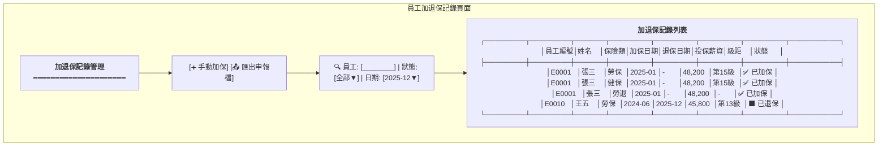
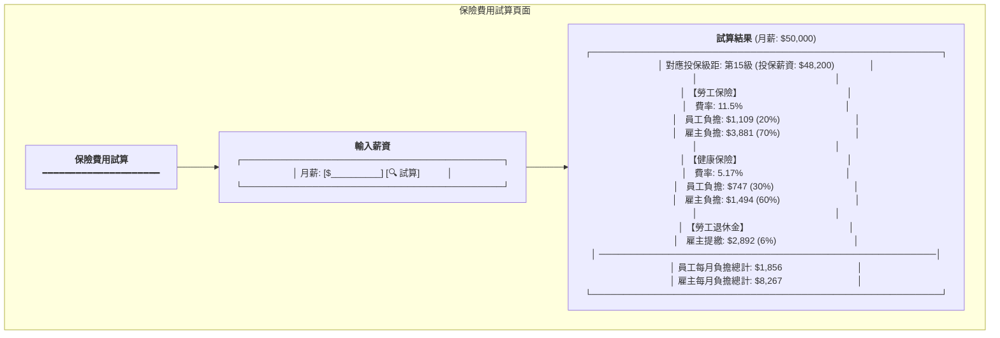
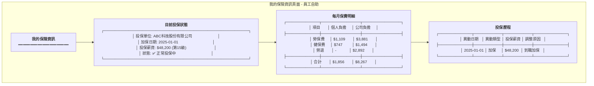
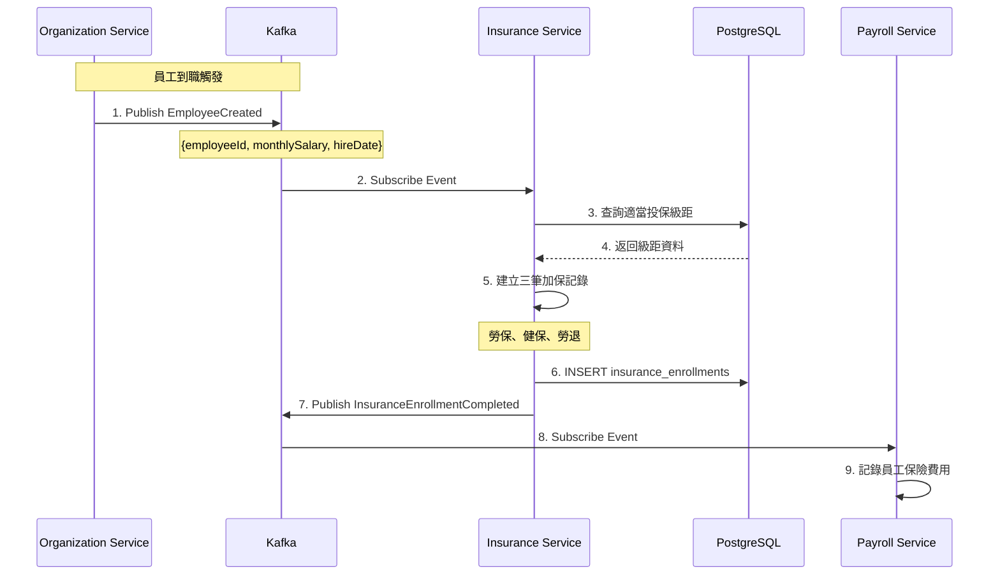
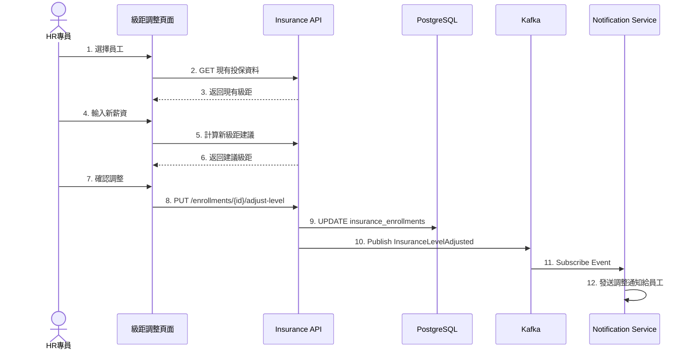
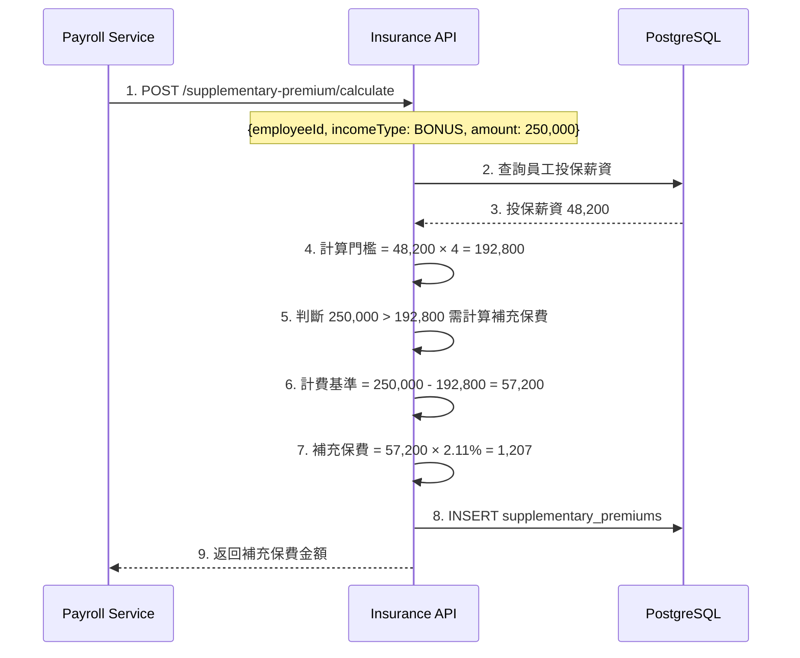

# 保險管理服務系統設計書

**版本:** 1.0  
**日期:** 2025-12-07  
**Domain代號:** 05 (INS)  
**目標:** 提供工程師完整的系統實作規格，供PM建立工項清單

---

## 目錄

1. [服務概述](#1-服務概述)
2. [UI設計](#2-ui設計)
3. [UX流程設計](#3-ux流程設計)
4. [畫面事件說明](#4-畫面事件說明)
5. [Data Flow設計](#5-data-flow設計)
6. [資料庫設計](#6-資料庫設計)
7. [Domain設計](#7-domain設計)
8. [領域事件設計](#8-領域事件設計)
9. [API設計](#9-api設計)
10. [工項清單摘要](#10-工項清單摘要)

---

## 1. 服務概述

### 1.1 服務定位
保險管理服務負責勞健保加退保自動化、投保級距管理、保險費用計算及政府申報檔案產生。本服務須確保符合台灣勞保、健保、勞退法規要求。

### 1.2 核心功能
- ✅ **多投保單位管理:** 母子公司分別投保
- ✅ **勞健保加退保自動化:** 訂閱員工事件自動處理
- ✅ **投保級距管理:** 自動對應、調整建議
- ✅ **費用計算:** 勞保、健保、勞退完整計算
- ✅ **二代健保補充保費:** 獎金超額2.11%計算
- ✅ **政府申報檔案:** 產生勞保局、健保局規範格式

### 1.3 技術架構
- **前端:** ReactJS + Redux + Ant Design
- **後端:** Spring Boot 3.1.x + MyBatis
- **資料庫:** PostgreSQL 15.x
- **事件匯流排:** Kafka

### 1.4 服務邊界

| 屬於本服務 | 不屬於本服務 |
|:---|:---|
| 保險資料管理 | 員工資料 (Organization Service) |
| 加退保處理 | 實際繳費 (Payroll提供數據) |
| 費用計算 | |
| 申報檔案產生 | |

### 1.5 費率常數 (2025年)

| 項目 | 費率 | 個人負擔 | 雇主負擔 | 政府負擔 |
|:---|:---:|:---:|:---:|:---:|
| 勞保 | 11.5% | 20% | 70% | 10% |
| 健保 | 5.17% | 30% | 60% | 10% |
| 勞退 | 6% | - | 100% | - |
| 補充保費 | 2.11% | 100% | - | - |

---

## 2. UI設計

### 2.1 頁面清單

| 頁面代碼 | 頁面名稱 | 路由 | 權限要求 |
|:---|:---|:---|:---:|
| `HR05-P01` | 投保單位管理頁面 | `/admin/insurance/units` | insurance:unit:manage |
| `HR05-P02` | 員工加退保記錄頁面 | `/admin/insurance/enrollments` | insurance:enrollment:read |
| `HR05-P03` | 投保級距管理頁面 | `/admin/insurance/levels` | insurance:level:manage |
| `HR05-P04` | 保險費用試算頁面 | `/admin/insurance/calculator` | insurance:calculate |
| `HR05-P05` | 補充保費管理頁面 | `/admin/insurance/supplementary` | insurance:supplementary:manage |
| `HR05-P06` | 申報檔案產生頁面 | `/admin/insurance/reports` | insurance:report:export |
| `HR05-P07` | 我的保險資訊頁面 (ESS) | `/profile/insurance` | - |
| `HR05-M01` | 手動加保對話框 | (Modal) | insurance:enrollment:manage |
| `HR05-M02` | 投保級距調整對話框 | (Modal) | insurance:enrollment:manage |

### 2.2 UI線稿 (Mermaid)

#### 2.2.1 員工加退保記錄頁面 (HR05-P02)



#### 2.2.2 保險費用試算頁面 (HR05-P04)



#### 2.2.3 我的保險資訊頁面 - ESS (HR05-P07)



---

## 3. UX流程設計

### 3.1 自動加保流程 (Event-Driven)



### 3.2 投保級距調整流程



### 3.3 補充保費計算流程



---

## 4. 畫面事件說明

### 4.1 加退保記錄頁面事件 (HR05-P02)

| 事件ID | 觸發元素 | 事件類型 | 事件處理 | 後端API |
|:---|:---|:---|:---|:---|
| `E-INS-01` | 搜尋框 | onChange | 篩選員工記錄 | GET /api/v1/insurance/enrollments |
| `E-INS-02` | 手動加保按鈕 | onClick | 開啟加保對話框 | - |
| `E-INS-03` | 確認加保 | onClick | 執行加保 | POST /api/v1/insurance/enrollments |
| `E-INS-04` | 匯出申報檔 | onClick | 產生申報檔案 | POST /api/v1/insurance/export |
| `E-INS-05` | 調整級距按鈕 | onClick | 開啟級距調整對話框 | - |

### 4.2 費用試算頁面事件 (HR05-P04)

| 事件ID | 觸發元素 | 事件類型 | 事件處理 | 後端API |
|:---|:---|:---|:---|:---|
| `E-CALC-01` | 試算按鈕 | onClick | 試算保費 | POST /api/v1/insurance/fees/calculate |

---

## 5. Data Flow設計

### 5.1 前端State結構

```typescript
interface InsuranceState {
  units: {
    list: InsuranceUnit[];
    loading: boolean;
  };
  enrollments: {
    list: InsuranceEnrollment[];
    selectedEmployee: string | null;
    loading: boolean;
  };
  levels: {
    laborLevels: InsuranceLevel[];
    healthLevels: InsuranceLevel[];
    loading: boolean;
  };
  calculator: {
    salary: number | null;
    result: CalculationResult | null;
    loading: boolean;
  };
  myInsurance: {
    data: MyInsuranceInfo | null;
    loading: boolean;
  };
}
```

---

## 6. 資料庫設計

### 6.1 DDL Script

```sql
-- 投保單位表
CREATE TABLE insurance_units (
    unit_id UUID PRIMARY KEY DEFAULT gen_random_uuid(),
    organization_id UUID NOT NULL,
    unit_code VARCHAR(50) NOT NULL,
    unit_name VARCHAR(255) NOT NULL,
    labor_insurance_number VARCHAR(50),
    health_insurance_number VARCHAR(50),
    pension_number VARCHAR(50),
    is_active BOOLEAN DEFAULT TRUE,
    created_at TIMESTAMP DEFAULT CURRENT_TIMESTAMP,
    CONSTRAINT uk_unit_code UNIQUE (unit_code)
);

-- 投保級距表
CREATE TABLE insurance_levels (
    level_id UUID PRIMARY KEY DEFAULT gen_random_uuid(),
    insurance_type VARCHAR(20) NOT NULL CHECK (insurance_type IN ('LABOR', 'HEALTH', 'PENSION')),
    level_number INTEGER NOT NULL,
    monthly_salary DECIMAL(10,2) NOT NULL,
    labor_employee_rate DECIMAL(6,4),
    labor_employer_rate DECIMAL(6,4),
    health_employee_rate DECIMAL(6,4),
    health_employer_rate DECIMAL(6,4),
    pension_employer_rate DECIMAL(6,4) DEFAULT 0.06,
    effective_date DATE NOT NULL,
    end_date DATE,
    is_active BOOLEAN DEFAULT TRUE,
    CONSTRAINT uk_level UNIQUE (insurance_type, level_number, effective_date)
);

-- 加退保記錄表
CREATE TABLE insurance_enrollments (
    enrollment_id UUID PRIMARY KEY DEFAULT gen_random_uuid(),
    employee_id UUID NOT NULL,
    insurance_unit_id UUID NOT NULL REFERENCES insurance_units(unit_id),
    insurance_type VARCHAR(20) NOT NULL CHECK (insurance_type IN ('LABOR', 'HEALTH', 'PENSION')),
    enroll_date DATE NOT NULL,
    withdraw_date DATE,
    insurance_level_id UUID REFERENCES insurance_levels(level_id),
    monthly_salary DECIMAL(10,2) NOT NULL,
    status VARCHAR(20) NOT NULL DEFAULT 'ACTIVE' CHECK (status IN ('PENDING', 'ACTIVE', 'WITHDRAWN')),
    is_reported BOOLEAN DEFAULT FALSE,
    reported_at TIMESTAMP,
    created_at TIMESTAMP DEFAULT CURRENT_TIMESTAMP,
    updated_at TIMESTAMP DEFAULT CURRENT_TIMESTAMP,
    CONSTRAINT uk_enrollment UNIQUE (employee_id, insurance_type, enroll_date)
);

CREATE INDEX idx_enrollment_emp ON insurance_enrollments(employee_id);
CREATE INDEX idx_enrollment_status ON insurance_enrollments(status);

-- 補充保費記錄表
CREATE TABLE supplementary_premiums (
    premium_id UUID PRIMARY KEY DEFAULT gen_random_uuid(),
    employee_id UUID NOT NULL,
    income_type VARCHAR(30) NOT NULL CHECK (income_type IN ('BONUS', 'PART_TIME_INCOME', 'PROFESSIONAL_FEE')),
    income_date DATE NOT NULL,
    income_amount DECIMAL(12,2) NOT NULL,
    insured_salary DECIMAL(10,2) NOT NULL,
    threshold DECIMAL(12,2) NOT NULL,
    premium_base DECIMAL(12,2) NOT NULL,
    premium_amount DECIMAL(10,2) NOT NULL,
    year INTEGER NOT NULL,
    month INTEGER NOT NULL,
    created_at TIMESTAMP DEFAULT CURRENT_TIMESTAMP
);

CREATE INDEX idx_supp_emp ON supplementary_premiums(employee_id);
CREATE INDEX idx_supp_year ON supplementary_premiums(year, month);

-- 保險費率設定表 (可調整)
CREATE TABLE insurance_rates (
    rate_id UUID PRIMARY KEY DEFAULT gen_random_uuid(),
    rate_type VARCHAR(30) NOT NULL,
    rate_value DECIMAL(6,4) NOT NULL,
    effective_date DATE NOT NULL,
    end_date DATE,
    is_active BOOLEAN DEFAULT TRUE
);
```

### 6.2 初始化資料

```sql
-- 初始化投保級距 (2025年勞保)
INSERT INTO insurance_levels (insurance_type, level_number, monthly_salary, labor_employee_rate, labor_employer_rate, effective_date) VALUES
('LABOR', 1, 27470, 0.023, 0.0805, '2025-01-01'),
('LABOR', 2, 27600, 0.023, 0.0805, '2025-01-01'),
('LABOR', 3, 28800, 0.023, 0.0805, '2025-01-01'),
-- ... 更多級距
('LABOR', 15, 48200, 0.023, 0.0805, '2025-01-01'),
('LABOR', 16, 50600, 0.023, 0.0805, '2025-01-01'),
('LABOR', 17, 53000, 0.023, 0.0805, '2025-01-01'),
('LABOR', 18, 45800, 0.023, 0.0805, '2025-01-01');

-- 初始化費率
INSERT INTO insurance_rates (rate_type, rate_value, effective_date) VALUES
('LABOR_TOTAL', 0.115, '2025-01-01'),
('HEALTH_TOTAL', 0.0517, '2025-01-01'),
('PENSION_EMPLOYER', 0.06, '2025-01-01'),
('SUPPLEMENTARY', 0.0211, '2025-01-01');
```

---

## 7. Domain設計

### 7.1 聚合根

#### InsuranceEnrollment聚合根

```java
@Entity
@Table(name = "insurance_enrollments")
public class InsuranceEnrollment {
    @EmbeddedId
    private EnrollmentId id;
    
    @Column(name = "employee_id", nullable = false)
    private UUID employeeId;
    
    @Column(name = "insurance_unit_id", nullable = false)
    private UUID insuranceUnitId;
    
    @Enumerated(EnumType.STRING)
    @Column(name = "insurance_type", nullable = false)
    private InsuranceType insuranceType;
    
    @Column(name = "enroll_date", nullable = false)
    private LocalDate enrollDate;
    
    @Column(name = "withdraw_date")
    private LocalDate withdrawDate;
    
    @Column(name = "monthly_salary", nullable = false)
    private BigDecimal monthlySalary;
    
    @Enumerated(EnumType.STRING)
    @Column(name = "status", nullable = false)
    private EnrollmentStatus status;
    
    /**
     * 建立加保記錄
     */
    public static InsuranceEnrollment enroll(
            UUID employeeId,
            UUID unitId,
            InsuranceType type,
            InsuranceLevel level,
            LocalDate enrollDate) {
        
        InsuranceEnrollment enrollment = new InsuranceEnrollment();
        enrollment.id = EnrollmentId.generate();
        enrollment.employeeId = employeeId;
        enrollment.insuranceUnitId = unitId;
        enrollment.insuranceType = type;
        enrollment.enrollDate = enrollDate;
        enrollment.monthlySalary = level.getMonthlySalary();
        enrollment.status = EnrollmentStatus.ACTIVE;
        
        return enrollment;
    }
    
    /**
     * 退保
     */
    public void withdraw(LocalDate withdrawDate) {
        if (this.status != EnrollmentStatus.ACTIVE) {
            throw new DomainException("只有已加保狀態可以退保");
        }
        this.withdrawDate = withdrawDate;
        this.status = EnrollmentStatus.WITHDRAWN;
    }
    
    /**
     * 調整投保級距
     */
    public void adjustLevel(InsuranceLevel newLevel) {
        this.monthlySalary = newLevel.getMonthlySalary();
    }
}
```

### 7.2 費用計算Domain Service

```java
@Service
public class InsuranceFeeCalculationService {
    
    private static final BigDecimal LABOR_EMPLOYEE_RATIO = new BigDecimal("0.20");
    private static final BigDecimal LABOR_EMPLOYER_RATIO = new BigDecimal("0.70");
    private static final BigDecimal HEALTH_EMPLOYEE_RATIO = new BigDecimal("0.30");
    private static final BigDecimal HEALTH_EMPLOYER_RATIO = new BigDecimal("0.60");
    private static final BigDecimal PENSION_EMPLOYER_RATE = new BigDecimal("0.06");
    private static final BigDecimal SUPPLEMENTARY_RATE = new BigDecimal("0.0211");
    
    public InsuranceFees calculate(InsuranceEnrollment enrollment, InsuranceRates rates) {
        BigDecimal salary = enrollment.getMonthlySalary();
        
        // 勞保費用
        BigDecimal laborTotal = salary.multiply(rates.getLaborRate());
        BigDecimal laborEmployee = laborTotal.multiply(LABOR_EMPLOYEE_RATIO);
        BigDecimal laborEmployer = laborTotal.multiply(LABOR_EMPLOYER_RATIO);
        
        // 健保費用
        BigDecimal healthTotal = salary.multiply(rates.getHealthRate());
        BigDecimal healthEmployee = healthTotal.multiply(HEALTH_EMPLOYEE_RATIO);
        BigDecimal healthEmployer = healthTotal.multiply(HEALTH_EMPLOYER_RATIO);
        
        // 勞退
        BigDecimal pensionEmployer = salary.multiply(PENSION_EMPLOYER_RATE);
        
        return new InsuranceFees(
            laborEmployee, laborEmployer,
            healthEmployee, healthEmployer,
            pensionEmployer
        );
    }
    
    /**
     * 計算補充保費
     */
    public SupplementaryPremiumResult calculateSupplementary(
            UUID employeeId,
            BigDecimal incomeAmount,
            IncomeType incomeType,
            BigDecimal insuredSalary) {
        
        // 門檻 = 投保薪資 × 4
        BigDecimal threshold = insuredSalary.multiply(new BigDecimal("4"));
        
        if (incomeAmount.compareTo(threshold) <= 0) {
            return SupplementaryPremiumResult.notRequired();
        }
        
        // 計費基準
        BigDecimal premiumBase = incomeAmount.subtract(threshold);
        
        // 上限1000萬
        BigDecimal maxBase = new BigDecimal("10000000");
        if (premiumBase.compareTo(maxBase) > 0) {
            premiumBase = maxBase;
        }
        
        // 補充保費
        BigDecimal premiumAmount = premiumBase.multiply(SUPPLEMENTARY_RATE)
            .setScale(0, RoundingMode.HALF_UP);
        
        return new SupplementaryPremiumResult(
            true, threshold, premiumBase, premiumAmount
        );
    }
}
```

---

## 8. 領域事件設計

| 事件名稱 | 觸發時機 | 發布服務 | 訂閱服務 |
|:---|:---|:---|:---|
| `InsuranceEnrollmentCompleted` | 加保完成 | Insurance | Payroll |
| `InsuranceWithdrawalCompleted` | 退保完成 | Insurance | Payroll |
| `InsuranceLevelAdjusted` | 投保級距調整 | Insurance | Payroll, Notification |
| `SupplementaryPremiumCalculated` | 補充保費計算 | Insurance | Payroll |

### 8.1 事件範例

```json
{
  "eventId": "evt-ins-001",
  "eventType": "InsuranceEnrollmentCompleted",
  "timestamp": "2025-01-01T09:00:00Z",
  "payload": {
    "employeeId": "emp-001",
    "enrollments": [
      {"type": "LABOR", "monthlySalary": 48200, "enrollDate": "2025-01-01"},
      {"type": "HEALTH", "monthlySalary": 48200, "enrollDate": "2025-01-01"},
      {"type": "PENSION", "monthlySalary": 48200, "enrollDate": "2025-01-01"}
    ],
    "fees": {
      "laborEmployee": 1109,
      "laborEmployer": 3881,
      "healthEmployee": 747,
      "healthEmployer": 1494,
      "pensionEmployer": 2892
    }
  }
}
```

---

## 9. API設計

### 9.1 Controller命名對照

| Controller | 說明 |
|:---|:---|
| `HR05EnrollmentCmdController` | 加退保Command操作 |
| `HR05EnrollmentQryController` | 加退保Query操作 |
| `HR05FeeCmdController` | 費用計算Command操作 |
| `HR05LevelQryController` | 投保級距Query操作 |
| `HR05ExportCmdController` | 申報檔案匯出 |

### 9.2 API總覽 (12個端點)

| 端點 | 方法 | 說明 |
|:---|:---:|:---|
| `/api/v1/insurance/enrollments` | POST | 手動加保 |
| `/api/v1/insurance/enrollments` | GET | 查詢加退保記錄 |
| `/api/v1/insurance/enrollments/{id}/withdraw` | PUT | 退保 |
| `/api/v1/insurance/enrollments/{id}/adjust-level` | PUT | 調整投保級距 |
| `/api/v1/insurance/fees/calculate` | POST | 計算保費 (供Payroll調用) |
| `/api/v1/insurance/levels` | GET | 查詢投保級距 |
| `/api/v1/insurance/supplementary-premium/calculate` | POST | 計算補充保費 |
| `/api/v1/insurance/export/enrollment-report` | POST | 匯出加退保申報檔 |
| `/api/v1/insurance/my` | GET | 查詢我的保險資訊 (ESS) |

---

## 10. 工項清單摘要

### 前端開發工項
1. HR05-P02 員工加退保記錄頁面
2. HR05-P04 保險費用試算頁面
3. HR05-P07 我的保險資訊頁面 (ESS)

### 後端開發工項
1. InsuranceEnrollment聚合根
2. InsuranceFeeCalculationService
3. SupplementaryPremiumCalculator
4. 加退保API (4端點)
5. 費用計算API (2端點)
6. 申報檔案產生 (勞保局/健保局格式)
7. 訂閱EmployeeCreated/EmployeeTerminated事件

### 資料庫開發工項
1. 建立5個資料表DDL
2. 初始化投保級距資料
3. 初始化費率設定

---

**文件完成日期:** 2025-12-07  
**版本:** 1.0
