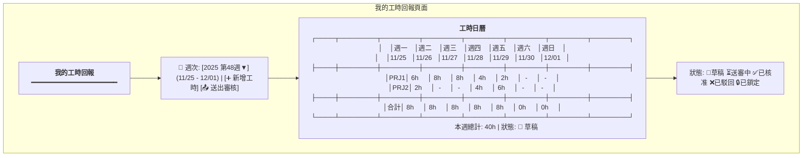
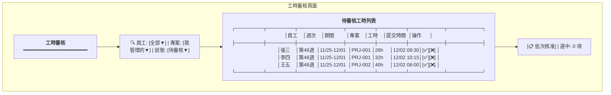
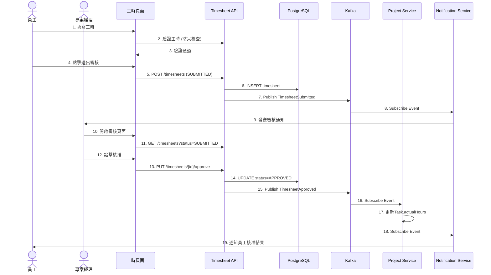
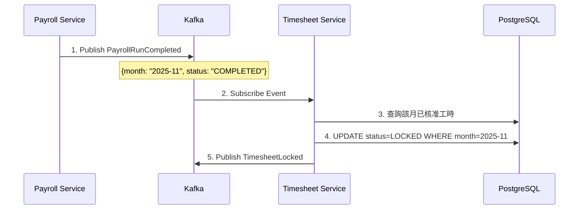

# 工時管理服務系統設計書

**版本:** 1.0  
**日期:** 2025-12-07  
**Domain代號:** 07 (TSH)  
**導入階段:** 第二階段（專案管理核心）

---

## 1. 服務概述

### 1.1 服務定位
工時管理服務負責員工工時回報、PM審核及工時統計分析。這是專案成本核算的關鍵數據來源，需與專案服務和薪資服務緊密整合。

### 1.2 核心功能
- ✅ **工時回報:** 日報/週報模式
- ✅ **工時審核:** PM審核工作流程
- ✅ **工時防呆:** 超時檢查、日期驗證、重複檢查
- ✅ **工時統計:** 個人/專案/部門統計
- ✅ **工時鎖定:** 薪資結算後自動鎖定

### 1.3 服務邊界

| 屬於本服務 | 不屬於本服務 |
|:---|:---|
| 工時回報管理 | 專案定義 (Project Service) |
| 工時審核流程 | 成本計算細節 (需整合薪資) |
| 工時統計分析 | |

---

## 2. UI設計

### 2.1 頁面清單

| 頁面代碼 | 頁面名稱 | 路由 | 權限要求 |
|:---|:---|:---|:---:|
| `HR07-P01` | 我的工時回報頁面 | `/profile/timesheets` | - |
| `HR07-P02` | 工時審核頁面 | `/admin/timesheets/approval` | timesheet:approve |
| `HR07-P03` | 工時統計報表頁面 | `/admin/timesheets/reports` | timesheet:report:read |
| `HR07-P04` | 專案工時查詢頁面 | `/admin/timesheets/by-project` | timesheet:read:all |
| `HR07-M01` | 工時填報對話框 | (Modal) | - |

### 2.2 UI線稿 (Mermaid)

#### 2.2.1 我的工時回報頁面 (HR07-P01)



#### 2.2.2 工時審核頁面 (HR07-P02)



---

## 3. UX流程設計

### 3.1 工時回報與審核流程



### 3.2 工時鎖定流程 (Event-Driven)



---

## 4. 畫面事件說明

| 事件ID | 觸發元素 | 事件處理 | 後端API |
|:---|:---|:---|:---|
| `E-TSH-01` | 新增工時按鈕 | 開啟工時填報對話框 | - |
| `E-TSH-02` | 儲存工時 | 新增工時明細 | POST /api/v1/timesheets/entries |
| `E-TSH-03` | 送出審核按鈕 | 提交工時 | PUT /api/v1/timesheets/{id}/submit |
| `E-TSH-04` | 核准按鈕 | 核准工時 | PUT /api/v1/timesheets/{id}/approve |
| `E-TSH-05` | 駁回按鈕 | 駁回工時 | PUT /api/v1/timesheets/{id}/reject |

---

## 5. 資料庫設計

### 5.1 DDL Script

```sql
-- 工時表
CREATE TABLE timesheets (
    timesheet_id UUID PRIMARY KEY DEFAULT gen_random_uuid(),
    employee_id UUID NOT NULL,
    period_type VARCHAR(20) NOT NULL CHECK (period_type IN ('DAILY', 'WEEKLY')),
    period_start_date DATE NOT NULL,
    period_end_date DATE NOT NULL,
    total_hours DECIMAL(6,2) DEFAULT 0,
    status VARCHAR(20) NOT NULL DEFAULT 'DRAFT' 
        CHECK (status IN ('DRAFT', 'SUBMITTED', 'APPROVED', 'REJECTED', 'LOCKED')),
    submitted_at TIMESTAMP,
    approved_by UUID,
    approved_at TIMESTAMP,
    rejection_reason TEXT,
    is_locked BOOLEAN DEFAULT FALSE,
    created_at TIMESTAMP DEFAULT CURRENT_TIMESTAMP,
    updated_at TIMESTAMP DEFAULT CURRENT_TIMESTAMP,
    
    CONSTRAINT uk_timesheet_period UNIQUE (employee_id, period_start_date, period_end_date)
);

CREATE INDEX idx_timesheet_employee ON timesheets(employee_id);
CREATE INDEX idx_timesheet_status ON timesheets(status);
CREATE INDEX idx_timesheet_period ON timesheets(period_start_date, period_end_date);

-- 工時明細表
CREATE TABLE timesheet_entries (
    entry_id UUID PRIMARY KEY DEFAULT gen_random_uuid(),
    timesheet_id UUID NOT NULL REFERENCES timesheets(timesheet_id) ON DELETE CASCADE,
    project_id UUID NOT NULL,
    task_id UUID,
    work_date DATE NOT NULL,
    hours DECIMAL(4,2) NOT NULL CHECK (hours > 0 AND hours <= 24),
    description TEXT,
    created_at TIMESTAMP DEFAULT CURRENT_TIMESTAMP,
    
    CONSTRAINT uk_entry UNIQUE (timesheet_id, project_id, work_date)
);

CREATE INDEX idx_entry_timesheet ON timesheet_entries(timesheet_id);
CREATE INDEX idx_entry_project ON timesheet_entries(project_id);
CREATE INDEX idx_entry_date ON timesheet_entries(work_date);
```

---

## 6. Domain設計

### 6.1 Timesheet聚合根

```java
@Entity
@Table(name = "timesheets")
public class Timesheet {
    @EmbeddedId
    private TimesheetId id;
    
    @Column(name = "employee_id", nullable = false)
    private UUID employeeId;
    
    @Enumerated(EnumType.STRING)
    @Column(name = "period_type")
    private TimesheetPeriod periodType;
    
    @Column(name = "period_start_date")
    private LocalDate periodStartDate;
    
    @Column(name = "period_end_date")
    private LocalDate periodEndDate;
    
    @OneToMany(cascade = CascadeType.ALL, orphanRemoval = true)
    @JoinColumn(name = "timesheet_id")
    private List<TimesheetEntry> entries = new ArrayList<>();
    
    @Column(name = "total_hours")
    private BigDecimal totalHours = BigDecimal.ZERO;
    
    @Enumerated(EnumType.STRING)
    @Column(name = "status")
    private TimesheetStatus status;
    
    @Column(name = "is_locked")
    private boolean isLocked;
    
    /**
     * 新增工時明細
     */
    public void addEntry(TimesheetEntry entry) {
        // 防呆: 不可回報未來日期
        if (entry.getWorkDate().isAfter(LocalDate.now())) {
            throw new DomainException("不可回報未來日期的工時");
        }
        
        // 防呆: 同日同專案不可重複
        boolean duplicate = this.entries.stream()
            .anyMatch(e -> e.getWorkDate().equals(entry.getWorkDate()) 
                && e.getProjectId().equals(entry.getProjectId()));
        if (duplicate) {
            throw new DomainException("同日同專案不可重複回報");
        }
        
        // 防呆: 每日不超過24小時
        BigDecimal dayTotal = this.entries.stream()
            .filter(e -> e.getWorkDate().equals(entry.getWorkDate()))
            .map(TimesheetEntry::getHours)
            .reduce(BigDecimal.ZERO, BigDecimal::add);
        
        if (dayTotal.add(entry.getHours()).compareTo(new BigDecimal("24")) > 0) {
            throw new DomainException("單日工時不可超過24小時");
        }
        
        this.entries.add(entry);
        recalculateTotal();
    }
    
    /**
     * 提交審核
     */
    public void submit() {
        if (this.status != TimesheetStatus.DRAFT && this.status != TimesheetStatus.REJECTED) {
            throw new DomainException("只有草稿或已駁回狀態可以提交");
        }
        if (this.entries.isEmpty()) {
            throw new DomainException("至少需要一筆工時記錄");
        }
        
        this.status = TimesheetStatus.SUBMITTED;
        
        DomainEventPublisher.publish(new TimesheetSubmittedEvent(
            this.id.getValue(),
            this.employeeId,
            this.totalHours
        ));
    }
    
    /**
     * 核准
     */
    public void approve(UUID approverId) {
        if (this.status != TimesheetStatus.SUBMITTED) {
            throw new DomainException("只有已提交狀態可以核准");
        }
        
        this.status = TimesheetStatus.APPROVED;
        
        DomainEventPublisher.publish(new TimesheetApprovedEvent(
            this.id.getValue(),
            this.employeeId,
            this.entries.stream()
                .collect(Collectors.groupingBy(
                    TimesheetEntry::getProjectId,
                    Collectors.reducing(BigDecimal.ZERO, TimesheetEntry::getHours, BigDecimal::add)
                ))
        ));
    }
    
    /**
     * 鎖定
     */
    public void lock() {
        if (this.status != TimesheetStatus.APPROVED) {
            throw new DomainException("只有已核准狀態可以鎖定");
        }
        this.status = TimesheetStatus.LOCKED;
        this.isLocked = true;
    }
}
```

---

## 7. 領域事件設計

| 事件名稱 | 觸發時機 | 訂閱服務 |
|:---|:---|:---|
| `TimesheetSubmitted` | 提交工時 | Workflow, Notification |
| `TimesheetApproved` | 審核通過 | Project, Payroll |
| `TimesheetRejected` | 審核駁回 | Notification |
| `TimesheetLocked` | 工時鎖定 | - |

---

## 8. API設計 (10個端點)

| 端點 | 方法 | Controller | 說明 |
|:---|:---:|:---|:---|
| `/api/v1/timesheets` | POST | HR07TimesheetCmdController | 建立工時表 |
| `/api/v1/timesheets/{id}/entries` | POST | HR07TimesheetCmdController | 新增工時明細 |
| `/api/v1/timesheets/{id}/submit` | PUT | HR07TimesheetCmdController | 提交審核 |
| `/api/v1/timesheets/{id}/approve` | PUT | HR07TimesheetCmdController | 核准 |
| `/api/v1/timesheets/{id}/reject` | PUT | HR07TimesheetCmdController | 駁回 |
| `/api/v1/timesheets/my` | GET | HR07TimesheetQryController | 我的工時 |
| `/api/v1/timesheets/pending-approval` | GET | HR07TimesheetQryController | 待審核列表 |
| `/api/v1/timesheets/summary` | GET | HR07TimesheetQryController | 個人統計 |
| `/api/v1/timesheets/project-summary` | GET | HR07TimesheetQryController | 專案統計 |
| `/api/v1/timesheets/unreported` | GET | HR07TimesheetQryController | 未回報員工 |

---

## 9. 工項清單摘要

### 前端工項
1. HR07-P01 我的工時回報頁面 (週曆視圖)
2. HR07-P02 工時審核頁面
3. HR07-P03 工時統計報表頁面

### 後端工項
1. Timesheet聚合根與Repository
2. 工時防呆驗證Service
3. 工時API (10端點)
4. 訂閱PayrollRunCompleted事件鎖定工時

---

**文件完成日期:** 2025-12-07
