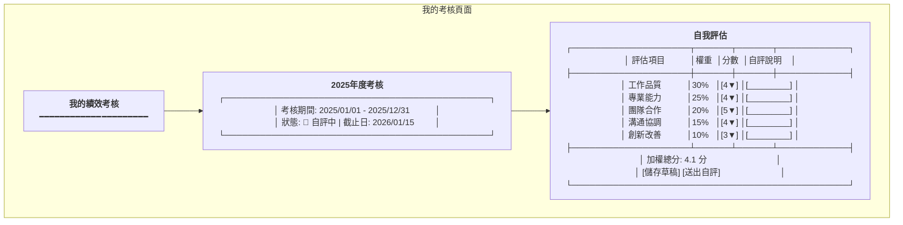
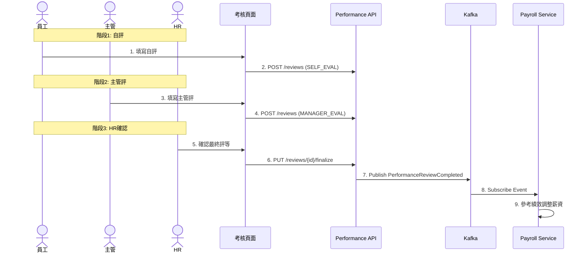

# 績效管理服務系統設計書

**版本:** 1.0  
**日期:** 2025-12-07  
**Domain代號:** 08 (PFM)  
**導入階段:** 第三階段（進階人資功能）

---

## 1. 服務概述

### 1.1 核心功能
- ✅ **考核週期管理:** 試用期/季度/年度考核
- ✅ **考核表單設計:** KPI、360度評估
- ✅ **考核流程:** 自評→主管評→覆核→HR確認
- ✅ **績效評等:** A/B/C/D等級，強制分配曲線
- ✅ **績效與薪資連動:** 調薪、獎金參考

### 1.2 服務邊界

| 屬於本服務 | 不屬於本服務 |
|:---|:---|
| 考核週期管理 | 薪資調整執行 (Payroll) |
| 考核表單管理 | 員工主管關係 (Organization) |
| 考核流程處理 | |

---

## 2. UI設計

### 2.1 頁面清單

| 頁面代碼 | 頁面名稱 | 路由 |
|:---|:---|:---|
| `HR08-P01` | 考核週期管理頁面 | `/admin/performance/cycles` |
| `HR08-P02` | 考核表單設計頁面 | `/admin/performance/templates` |
| `HR08-P03` | 我的考核頁面 (ESS) | `/profile/performance` |
| `HR08-P04` | 團隊考核頁面 | `/admin/performance/team` |
| `HR08-P05` | 考核結果分析頁面 | `/admin/performance/reports` |

### 2.2 UI線稿

#### 2.2.1 我的考核頁面 (HR08-P03)



---

## 3. UX流程設計

### 3.1 考核流程



---

## 4. 資料庫設計

```sql
-- 考核週期表
CREATE TABLE performance_cycles (
    cycle_id UUID PRIMARY KEY DEFAULT gen_random_uuid(),
    cycle_name VARCHAR(100) NOT NULL,
    cycle_type VARCHAR(20) NOT NULL CHECK (cycle_type IN ('PROBATION', 'QUARTERLY', 'ANNUAL')),
    start_date DATE NOT NULL,
    end_date DATE NOT NULL,
    self_eval_deadline DATE,
    manager_eval_deadline DATE,
    status VARCHAR(20) DEFAULT 'DRAFT' CHECK (status IN ('DRAFT', 'IN_PROGRESS', 'COMPLETED')),
    created_at TIMESTAMP DEFAULT CURRENT_TIMESTAMP
);

-- 考核記錄表
CREATE TABLE performance_reviews (
    review_id UUID PRIMARY KEY DEFAULT gen_random_uuid(),
    cycle_id UUID NOT NULL REFERENCES performance_cycles(cycle_id),
    employee_id UUID NOT NULL,
    reviewer_id UUID NOT NULL,
    review_type VARCHAR(20) NOT NULL CHECK (review_type IN ('SELF', 'MANAGER', 'PEER')),
    evaluation_items JSONB NOT NULL,
    overall_score DECIMAL(3,1),
    overall_rating VARCHAR(10),
    comments TEXT,
    status VARCHAR(20) DEFAULT 'DRAFT' CHECK (status IN ('DRAFT', 'SUBMITTED', 'FINALIZED')),
    submitted_at TIMESTAMP,
    created_at TIMESTAMP DEFAULT CURRENT_TIMESTAMP,
    
    CONSTRAINT uk_review UNIQUE (cycle_id, employee_id, reviewer_id, review_type)
);

CREATE INDEX idx_review_cycle ON performance_reviews(cycle_id);
CREATE INDEX idx_review_employee ON performance_reviews(employee_id);
```

---

## 5. Domain設計

```java
@Entity
public class PerformanceReview {
    @EmbeddedId
    private ReviewId id;
    
    private UUID cycleId;
    private UUID employeeId;
    private UUID reviewerId;
    
    @Enumerated(EnumType.STRING)
    private ReviewType reviewType;
    
    @Type(JsonType.class)
    @Column(columnDefinition = "jsonb")
    private List<EvaluationItem> evaluationItems;
    
    private BigDecimal overallScore;
    private String overallRating;
    
    /**
     * 計算加權總分
     */
    public BigDecimal calculateOverallScore() {
        return evaluationItems.stream()
            .map(item -> item.getWeight().multiply(new BigDecimal(item.getScore())))
            .reduce(BigDecimal.ZERO, BigDecimal::add);
    }
    
    /**
     * 提交
     */
    public void submit() {
        this.overallScore = calculateOverallScore();
        this.overallRating = determineRating(this.overallScore);
        this.status = ReviewStatus.SUBMITTED;
    }
    
    private String determineRating(BigDecimal score) {
        if (score.compareTo(new BigDecimal("4.5")) >= 0) return "A";
        if (score.compareTo(new BigDecimal("3.5")) >= 0) return "B";
        if (score.compareTo(new BigDecimal("2.5")) >= 0) return "C";
        return "D";
    }
}
```

---

## 6. 領域事件

| 事件名稱 | 觸發時機 | 訂閱服務 |
|:---|:---|:---|
| `PerformanceCycleStarted` | 開始考核週期 | Notification |
| `PerformanceReviewSubmitted` | 提交考核 | Notification |
| `PerformanceReviewCompleted` | 考核完成 | Payroll |

---

## 7. API設計 (8個端點)

| 端點 | 方法 | Controller |
|:---|:---:|:---|
| `/api/v1/performance/cycles` | POST | HR08CycleCmdController |
| `/api/v1/performance/cycles/{id}/start` | PUT | HR08CycleCmdController |
| `/api/v1/performance/reviews` | POST | HR08ReviewCmdController |
| `/api/v1/performance/reviews/{id}/submit` | PUT | HR08ReviewCmdController |
| `/api/v1/performance/reviews/{id}/finalize` | PUT | HR08ReviewCmdController |
| `/api/v1/performance/my` | GET | HR08ReviewQryController |
| `/api/v1/performance/team` | GET | HR08ReviewQryController |
| `/api/v1/performance/reports/distribution` | GET | HR08ReportQryController |

---

## 8. 工項清單摘要

### 前端工項
1. HR08-P01 考核週期管理頁面
2. HR08-P03 我的考核頁面 (自評表單)
3. HR08-P04 團隊考核頁面 (主管評)
4. HR08-P05 考核結果分析頁面 (分布圖)

### 後端工項
1. PerformanceCycle聚合根
2. PerformanceReview聚合根 (含評分計算)
3. 考核API (8端點)

---

**文件完成日期:** 2025-12-07
