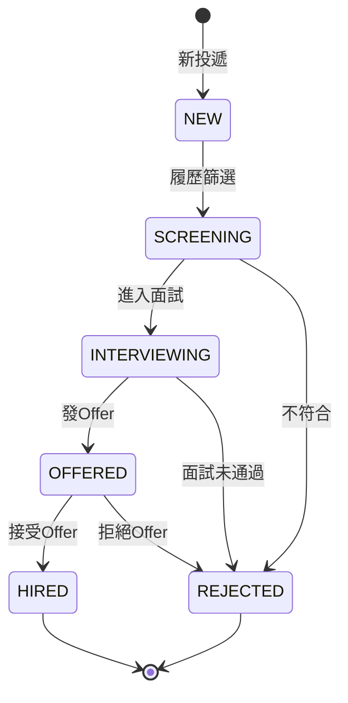
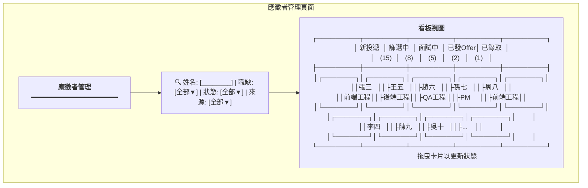
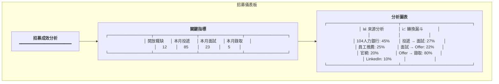
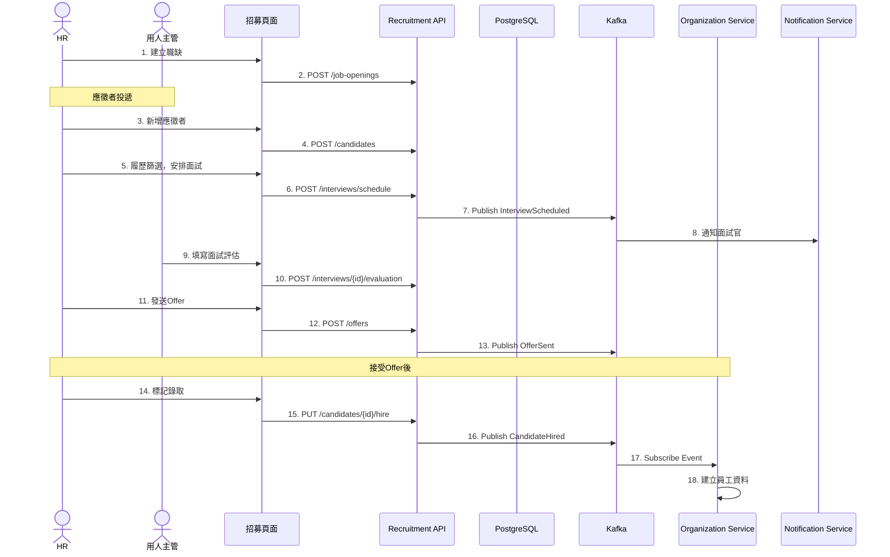

# 招募管理服務系統設計書

**版本:** 1.0  
**日期:** 2025-12-07  
**Domain代號:** 09 (REC)  
**導入階段:** 第三階段（進階人資功能）

---

## 1. 服務概述

### 1.1 核心功能
- ✅ **職缺需求管理:** 需求提出與審核
- ✅ **應徵者管理:** 履歷、來源、狀態追蹤
- ✅ **面試管理:** 排程、評估、結果彙整
- ✅ **Offer管理:** 發放、接受/拒絕
- ✅ **招募成效分析:** 來源、轉換率

### 1.2 應徵者狀態流程



---

## 2. UI設計

### 2.1 頁面清單

| 頁面代碼 | 頁面名稱 | 路由 |
|:---|:---|:---|
| `HR09-P01` | 職缺管理頁面 | `/admin/recruitment/jobs` |
| `HR09-P02` | 應徵者管理頁面 | `/admin/recruitment/candidates` |
| `HR09-P03` | 應徵者詳情頁面 | `/admin/recruitment/candidates/:id` |
| `HR09-P04` | 面試管理頁面 | `/admin/recruitment/interviews` |
| `HR09-P05` | Offer管理頁面 | `/admin/recruitment/offers` |
| `HR09-P06` | 招募儀表板 | `/admin/recruitment/dashboard` |

### 2.2 UI線稿

#### 2.2.1 應徵者管理頁面 (HR09-P02)



#### 2.2.2 招募儀表板 (HR09-P06)



---

## 3. UX流程設計

### 3.1 招募流程



---

## 4. 資料庫設計

```sql
-- 職缺表
CREATE TABLE job_openings (
    opening_id UUID PRIMARY KEY DEFAULT gen_random_uuid(),
    job_title VARCHAR(100) NOT NULL,
    department_id UUID NOT NULL,
    number_of_positions INTEGER DEFAULT 1,
    salary_range VARCHAR(100),
    requirements TEXT,
    responsibilities TEXT,
    status VARCHAR(20) DEFAULT 'OPEN' CHECK (status IN ('DRAFT', 'OPEN', 'CLOSED', 'FILLED')),
    open_date DATE,
    close_date DATE,
    created_by UUID,
    created_at TIMESTAMP DEFAULT CURRENT_TIMESTAMP
);

-- 應徵者表
CREATE TABLE candidates (
    candidate_id UUID PRIMARY KEY DEFAULT gen_random_uuid(),
    opening_id UUID REFERENCES job_openings(opening_id),
    full_name VARCHAR(100) NOT NULL,
    email VARCHAR(255) NOT NULL,
    phone_number VARCHAR(50),
    resume_url VARCHAR(500),
    source VARCHAR(30) CHECK (source IN ('JOB_BANK', 'REFERRAL', 'WEBSITE', 'LINKEDIN', 'OTHER')),
    referrer_id UUID,
    application_date DATE DEFAULT CURRENT_DATE,
    status VARCHAR(20) DEFAULT 'NEW' 
        CHECK (status IN ('NEW', 'SCREENING', 'INTERVIEWING', 'OFFERED', 'HIRED', 'REJECTED')),
    rejection_reason TEXT,
    created_at TIMESTAMP DEFAULT CURRENT_TIMESTAMP,
    updated_at TIMESTAMP DEFAULT CURRENT_TIMESTAMP
);

CREATE INDEX idx_candidate_status ON candidates(status);
CREATE INDEX idx_candidate_opening ON candidates(opening_id);

-- 面試表
CREATE TABLE interviews (
    interview_id UUID PRIMARY KEY DEFAULT gen_random_uuid(),
    candidate_id UUID NOT NULL REFERENCES candidates(candidate_id),
    interview_round INTEGER DEFAULT 1,
    interview_type VARCHAR(30) CHECK (interview_type IN ('PHONE', 'VIDEO', 'ONSITE', 'TECHNICAL')),
    interview_date TIMESTAMP NOT NULL,
    location VARCHAR(255),
    interviewers JSONB DEFAULT '[]',
    status VARCHAR(20) DEFAULT 'SCHEDULED' CHECK (status IN ('SCHEDULED', 'COMPLETED', 'CANCELLED')),
    created_at TIMESTAMP DEFAULT CURRENT_TIMESTAMP
);

-- 面試評估表
CREATE TABLE interview_evaluations (
    evaluation_id UUID PRIMARY KEY DEFAULT gen_random_uuid(),
    interview_id UUID NOT NULL REFERENCES interviews(interview_id),
    interviewer_id UUID NOT NULL,
    technical_score INTEGER CHECK (technical_score BETWEEN 1 AND 5),
    communication_score INTEGER CHECK (communication_score BETWEEN 1 AND 5),
    culture_fit_score INTEGER CHECK (culture_fit_score BETWEEN 1 AND 5),
    overall_rating VARCHAR(20) CHECK (overall_rating IN ('STRONG_HIRE', 'HIRE', 'NO_HIRE', 'STRONG_NO_HIRE')),
    comments TEXT,
    strengths TEXT,
    concerns TEXT,
    created_at TIMESTAMP DEFAULT CURRENT_TIMESTAMP,
    
    CONSTRAINT uk_evaluation UNIQUE (interview_id, interviewer_id)
);

-- Offer表
CREATE TABLE offers (
    offer_id UUID PRIMARY KEY DEFAULT gen_random_uuid(),
    candidate_id UUID NOT NULL REFERENCES candidates(candidate_id),
    offered_position VARCHAR(100) NOT NULL,
    offered_salary DECIMAL(12,2) NOT NULL,
    offered_start_date DATE,
    offer_date DATE DEFAULT CURRENT_DATE,
    expiry_date DATE NOT NULL,
    status VARCHAR(20) DEFAULT 'PENDING' CHECK (status IN ('PENDING', 'ACCEPTED', 'REJECTED', 'EXPIRED', 'WITHDRAWN')),
    response_date DATE,
    rejection_reason TEXT,
    created_by UUID,
    created_at TIMESTAMP DEFAULT CURRENT_TIMESTAMP
);
```

---

## 5. Domain設計

```java
@Entity
public class Candidate {
    @EmbeddedId
    private CandidateId id;
    
    private UUID openingId;
    private String fullName;
    private String email;
    private String phoneNumber;
    private String resumeUrl;
    
    @Enumerated(EnumType.STRING)
    private RecruitmentSource source;
    
    @Enumerated(EnumType.STRING)
    private CandidateStatus status;
    
    /**
     * 履歷篩選通過
     */
    public void passScreening() {
        if (this.status != CandidateStatus.NEW) {
            throw new DomainException("只有新投遞狀態可以篩選");
        }
        this.status = CandidateStatus.SCREENING;
    }
    
    /**
     * 進入面試
     */
    public void moveToInterview() {
        this.status = CandidateStatus.INTERVIEWING;
    }
    
    /**
     * 發送Offer
     */
    public void sendOffer() {
        if (this.status != CandidateStatus.INTERVIEWING) {
            throw new DomainException("只有面試中狀態可以發Offer");
        }
        this.status = CandidateStatus.OFFERED;
    }
    
    /**
     * 錄取
     */
    public void hire() {
        if (this.status != CandidateStatus.OFFERED) {
            throw new DomainException("只有已發Offer狀態可以錄取");
        }
        this.status = CandidateStatus.HIRED;
        
        DomainEventPublisher.publish(new CandidateHiredEvent(
            this.id.getValue(),
            this.fullName,
            this.email,
            this.phoneNumber
        ));
    }
    
    /**
     * 拒絕
     */
    public void reject(String reason) {
        this.status = CandidateStatus.REJECTED;
        this.rejectionReason = reason;
    }
}

public enum CandidateStatus {
    NEW, SCREENING, INTERVIEWING, OFFERED, HIRED, REJECTED
}
```

---

## 6. 領域事件

| 事件名稱 | 觸發時機 | 訂閱服務 |
|:---|:---|:---|
| `JobOpeningCreated` | 建立職缺 | - |
| `CandidateApplied` | 應徵者投遞 | - |
| `InterviewScheduled` | 安排面試 | Notification |
| `OfferSent` | 發送Offer | Notification |
| `CandidateHired` | 錄取 | Organization |

---

## 7. API設計 (14個端點)

| 端點 | 方法 | Controller |
|:---|:---:|:---|
| `/api/v1/recruitment/job-openings` | POST | HR09JobCmdController |
| `/api/v1/recruitment/job-openings` | GET | HR09JobQryController |
| `/api/v1/recruitment/candidates` | POST | HR09CandidateCmdController |
| `/api/v1/recruitment/candidates` | GET | HR09CandidateQryController |
| `/api/v1/recruitment/candidates/{id}` | GET | HR09CandidateQryController |
| `/api/v1/recruitment/candidates/{id}/status` | PUT | HR09CandidateCmdController |
| `/api/v1/recruitment/candidates/{id}/hire` | PUT | HR09CandidateCmdController |
| `/api/v1/recruitment/interviews/schedule` | POST | HR09InterviewCmdController |
| `/api/v1/recruitment/interviews/{id}/evaluation` | POST | HR09InterviewCmdController |
| `/api/v1/recruitment/interviews` | GET | HR09InterviewQryController |
| `/api/v1/recruitment/offers` | POST | HR09OfferCmdController |
| `/api/v1/recruitment/offers/{id}/accept` | PUT | HR09OfferCmdController |
| `/api/v1/recruitment/offers/{id}/reject` | PUT | HR09OfferCmdController |
| `/api/v1/recruitment/dashboard` | GET | HR09ReportQryController |

---

## 8. 工項清單摘要

### 前端工項
1. HR09-P01 職缺管理頁面
2. HR09-P02 應徵者管理頁面 (看板視圖+拖曳)
3. HR09-P03 應徵者詳情頁面 (時間軸)
4. HR09-P04 面試管理頁面 (評估表單)
5. HR09-P06 招募儀表板 (漏斗圖)

### 後端工項
1. JobOpening聚合根
2. Candidate聚合根 (含狀態機)
3. Interview聚合根
4. Offer聚合根
5. 招募API (14端點)
6. 發布CandidateHired事件整合Organization

---

**文件完成日期:** 2025-12-07
