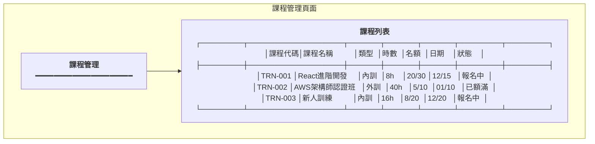

# 訓練管理服務系統設計書

**版本:** 1.0  
**日期:** 2025-12-07  
**Domain代號:** 10 (TRN)  
**導入階段:** 第三階段（進階人資功能）

---

## 1. 服務概述

### 1.1 核心功能
- ✅ **訓練計畫管理:** 年度計畫、預算控管
- ✅ **課程管理:** 內訓/外訓、線上/線下
- ✅ **報名審核:** 課程報名與審核
- ✅ **訓練時數追蹤:** 法定時數合規
- ✅ **證照管理:** 證照登錄、到期提醒

---

## 2. UI設計

### 2.1 頁面清單

| 頁面代碼 | 頁面名稱 | 路由 |
|:---|:---|:---|
| `HR10-P01` | 課程管理頁面 | `/admin/training/courses` |
| `HR10-P02` | 課程報名頁面 | `/admin/training/enrollments` |
| `HR10-P03` | 我的訓練 (ESS) | `/profile/training` |
| `HR10-P04` | 證照管理頁面 | `/admin/training/certificates` |
| `HR10-P05` | 我的證照 (ESS) | `/profile/certificates` |
| `HR10-P06` | 訓練時數統計 | `/admin/training/reports` |

### 2.2 UI線稿

#### 2.2.1 課程管理頁面 (HR10-P01)



---

## 3. 資料庫設計

```sql
-- 課程表
CREATE TABLE training_courses (
    course_id UUID PRIMARY KEY DEFAULT gen_random_uuid(),
    course_code VARCHAR(50) NOT NULL UNIQUE,
    course_name VARCHAR(255) NOT NULL,
    course_type VARCHAR(20) CHECK (course_type IN ('INTERNAL', 'EXTERNAL')),
    delivery_mode VARCHAR(20) CHECK (delivery_mode IN ('ONLINE', 'OFFLINE', 'HYBRID')),
    instructor VARCHAR(100),
    duration_hours DECIMAL(5,1) NOT NULL,
    max_participants INTEGER,
    start_date DATE,
    end_date DATE,
    location VARCHAR(255),
    cost DECIMAL(10,2) DEFAULT 0,
    status VARCHAR(20) DEFAULT 'DRAFT' CHECK (status IN ('DRAFT', 'OPEN', 'CLOSED', 'COMPLETED', 'CANCELLED')),
    created_at TIMESTAMP DEFAULT CURRENT_TIMESTAMP
);

-- 報名表
CREATE TABLE training_enrollments (
    enrollment_id UUID PRIMARY KEY DEFAULT gen_random_uuid(),
    course_id UUID NOT NULL REFERENCES training_courses(course_id),
    employee_id UUID NOT NULL,
    status VARCHAR(20) DEFAULT 'REGISTERED' CHECK (status IN ('REGISTERED', 'APPROVED', 'ATTENDED', 'COMPLETED', 'CANCELLED', 'NO_SHOW')),
    attendance BOOLEAN DEFAULT FALSE,
    completed_hours DECIMAL(5,1),
    score DECIMAL(5,2),
    created_at TIMESTAMP DEFAULT CURRENT_TIMESTAMP,
    
    CONSTRAINT uk_enrollment UNIQUE (course_id, employee_id)
);

-- 證照表
CREATE TABLE certificates (
    certificate_id UUID PRIMARY KEY DEFAULT gen_random_uuid(),
    employee_id UUID NOT NULL,
    certificate_name VARCHAR(255) NOT NULL,
    issuing_organization VARCHAR(255),
    certificate_number VARCHAR(100),
    issue_date DATE NOT NULL,
    expiry_date DATE,
    attachment_url VARCHAR(500),
    is_verified BOOLEAN DEFAULT FALSE,
    created_at TIMESTAMP DEFAULT CURRENT_TIMESTAMP
);

CREATE INDEX idx_cert_employee ON certificates(employee_id);
CREATE INDEX idx_cert_expiry ON certificates(expiry_date);
```

---

## 4. Domain設計

```java
@Entity
public class TrainingEnrollment {
    @EmbeddedId
    private EnrollmentId id;
    private UUID courseId;
    private UUID employeeId;
    
    @Enumerated(EnumType.STRING)
    private EnrollmentStatus status;
    
    private boolean attendance;
    private BigDecimal completedHours;
    
    /**
     * 確認出席
     */
    public void confirmAttendance(BigDecimal hours) {
        this.attendance = true;
        this.completedHours = hours;
        this.status = EnrollmentStatus.ATTENDED;
    }
    
    /**
     * 完成訓練
     */
    public void complete() {
        if (!this.attendance) {
            throw new DomainException("未出席無法完成");
        }
        this.status = EnrollmentStatus.COMPLETED;
        
        DomainEventPublisher.publish(new TrainingCompletedEvent(
            this.employeeId, this.courseId, this.completedHours
        ));
    }
}
```

---

## 5. 領域事件

| 事件名稱 | 觸發時機 | 訂閱服務 |
|:---|:---|:---|
| `TrainingCompletedEvent` | 完成訓練 | Report |
| `CertificateExpiringEvent` | 證照即將到期 | Notification |

---

## 6. API設計 (10個端點)

| 端點 | 方法 | Controller |
|:---|:---:|:---|
| `/api/v1/training/courses` | POST | HR10CourseCmdController |
| `/api/v1/training/courses` | GET | HR10CourseQryController |
| `/api/v1/training/enrollments` | POST | HR10EnrollmentCmdController |
| `/api/v1/training/enrollments/{id}/approve` | PUT | HR10EnrollmentCmdController |
| `/api/v1/training/enrollments/{id}/complete` | PUT | HR10EnrollmentCmdController |
| `/api/v1/training/my` | GET | HR10EnrollmentQryController |
| `/api/v1/training/certificates` | POST | HR10CertificateCmdController |
| `/api/v1/training/certificates` | GET | HR10CertificateQryController |
| `/api/v1/training/certificates/expiring` | GET | HR10CertificateQryController |
| `/api/v1/training/my/hours` | GET | HR10ReportQryController |

---

**文件完成日期:** 2025-12-07
