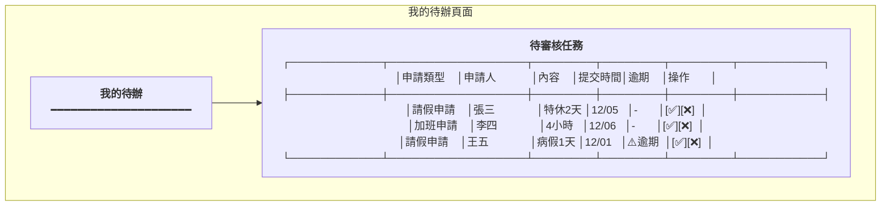
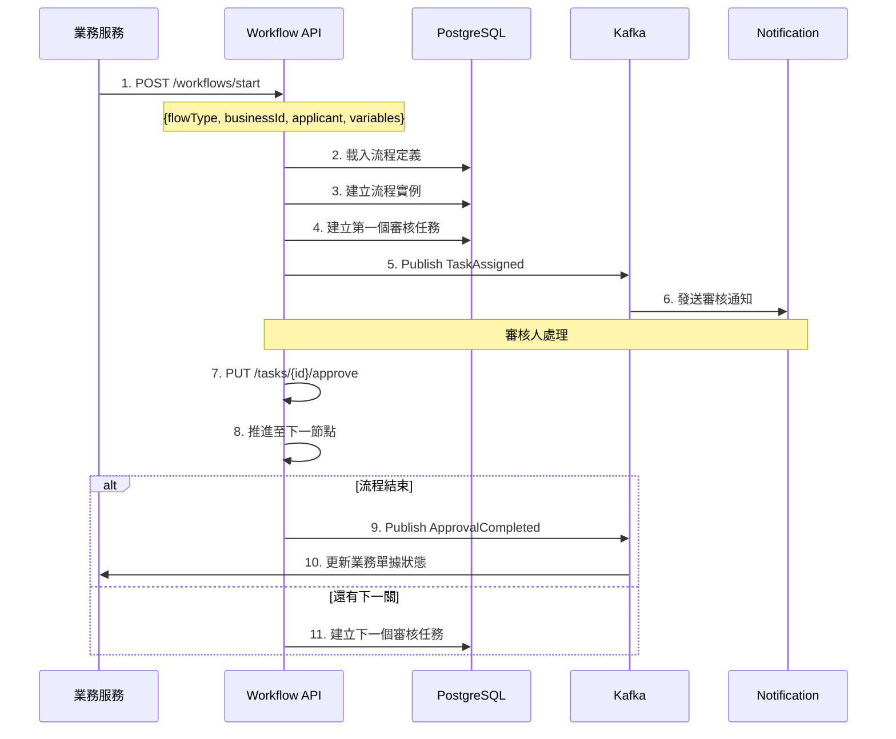

# 簽核流程服務系統設計書

**版本:** 1.0  
**日期:** 2025-12-07  
**Domain代號:** 11 (WKF)  
**導入階段:** 第一階段（核心基礎服務）

---

## 1. 服務概述

### 1.1 核心功能
- ✅ **流程定義:** 可視化流程設計
- ✅ **流程引擎:** 多級簽核、條件分流、平行會簽
- ✅ **代理人機制:** 請假/出差代理
- ✅ **逾時提醒:** 自動催辦

### 1.2 節點類型

| 節點類型 | 說明 |
|:---|:---|
| START | 開始節點 |
| APPROVAL | 審核節點 (單人/多人) |
| CONDITION | 條件分流 (依金額/天數等) |
| PARALLEL | 平行會簽 (需全部通過) |
| END | 結束節點 |

---

## 2. UI設計

| 頁面代碼 | 頁面名稱 | 路由 |
|:---|:---|:---|
| `HR11-P01` | 流程定義管理頁面 | `/admin/workflows/definitions` |
| `HR11-P02` | 流程設計器 | `/admin/workflows/designer/:id` |
| `HR11-P03` | 我的待辦頁面 | `/profile/tasks` |
| `HR11-P04` | 我的申請頁面 | `/profile/applications` |
| `HR11-P05` | 代理人設定頁面 | `/profile/delegation` |

### 2.1 UI線稿

#### 我的待辦頁面 (HR11-P03)



---

## 3. UX流程設計

### 3.1 審核流程執行



---

## 4. 資料庫設計

```sql
-- 流程定義表
CREATE TABLE workflow_definitions (
    definition_id UUID PRIMARY KEY DEFAULT gen_random_uuid(),
    flow_name VARCHAR(100) NOT NULL,
    flow_type VARCHAR(50) NOT NULL UNIQUE,
    nodes JSONB NOT NULL,
    edges JSONB NOT NULL,
    is_active BOOLEAN DEFAULT TRUE,
    version INTEGER DEFAULT 1,
    created_at TIMESTAMP DEFAULT CURRENT_TIMESTAMP
);

-- 流程實例表
CREATE TABLE workflow_instances (
    instance_id UUID PRIMARY KEY DEFAULT gen_random_uuid(),
    definition_id UUID NOT NULL REFERENCES workflow_definitions(definition_id),
    business_type VARCHAR(50) NOT NULL,
    business_id UUID NOT NULL,
    applicant_id UUID NOT NULL,
    current_node VARCHAR(100),
    status VARCHAR(20) DEFAULT 'RUNNING' CHECK (status IN ('RUNNING', 'COMPLETED', 'REJECTED', 'CANCELLED')),
    started_at TIMESTAMP DEFAULT CURRENT_TIMESTAMP,
    completed_at TIMESTAMP,
    
    CONSTRAINT uk_instance UNIQUE (business_type, business_id)
);

CREATE INDEX idx_instance_status ON workflow_instances(status);
CREATE INDEX idx_instance_applicant ON workflow_instances(applicant_id);

-- 審核任務表
CREATE TABLE approval_tasks (
    task_id UUID PRIMARY KEY DEFAULT gen_random_uuid(),
    instance_id UUID NOT NULL REFERENCES workflow_instances(instance_id),
    node_id VARCHAR(100) NOT NULL,
    assignee_id UUID NOT NULL,
    delegated_to UUID,
    status VARCHAR(20) DEFAULT 'PENDING' CHECK (status IN ('PENDING', 'APPROVED', 'REJECTED')),
    comments TEXT,
    due_date TIMESTAMP,
    is_overdue BOOLEAN DEFAULT FALSE,
    created_at TIMESTAMP DEFAULT CURRENT_TIMESTAMP,
    completed_at TIMESTAMP
);

CREATE INDEX idx_task_assignee ON approval_tasks(assignee_id, status);
CREATE INDEX idx_task_instance ON approval_tasks(instance_id);

-- 代理人設定表
CREATE TABLE delegations (
    delegation_id UUID PRIMARY KEY DEFAULT gen_random_uuid(),
    delegator_id UUID NOT NULL,
    delegatee_id UUID NOT NULL,
    start_date DATE NOT NULL,
    end_date DATE NOT NULL,
    is_active BOOLEAN DEFAULT TRUE,
    created_at TIMESTAMP DEFAULT CURRENT_TIMESTAMP,
    
    CONSTRAINT uk_delegation UNIQUE (delegator_id, start_date, end_date)
);
```

---

## 5. Domain設計

```java
@Entity
public class WorkflowInstance {
    @EmbeddedId
    private InstanceId id;
    private UUID definitionId;
    private String businessType;
    private UUID businessId;
    private UUID applicantId;
    private String currentNode;
    
    @Enumerated(EnumType.STRING)
    private InstanceStatus status;
    
    /**
     * 推進到下一節點
     */
    public void advanceToNode(String nextNode) {
        this.currentNode = nextNode;
        
        if ("END".equals(nextNode)) {
            this.status = InstanceStatus.COMPLETED;
            DomainEventPublisher.publish(new ApprovalCompletedEvent(
                this.businessType,
                this.businessId
            ));
        }
    }
    
    /**
     * 駁回
     */
    public void reject(String reason) {
        this.status = InstanceStatus.REJECTED;
        DomainEventPublisher.publish(new ApprovalRejectedEvent(
            this.businessType,
            this.businessId,
            reason
        ));
    }
}
```

---

## 6. 領域事件

| 事件名稱 | 觸發時機 | 訂閱服務 |
|:---|:---|:---|
| `ApprovalCompleted` | 流程核准完成 | 業務服務 (Attendance, Recruitment等) |
| `ApprovalRejected` | 流程駁回 | Notification, 業務服務 |
| `TaskAssigned` | 任務指派 | Notification |
| `TaskOverdue` | 任務逾期 | Notification |

---

## 7. API設計 (10個端點)

| 端點 | 方法 | Controller |
|:---|:---:|:---|
| `/api/v1/workflows/definitions` | POST | HR11DefinitionCmdController |
| `/api/v1/workflows/definitions` | GET | HR11DefinitionQryController |
| `/api/v1/workflows/start` | POST | HR11InstanceCmdController |
| `/api/v1/workflows/instances/{id}` | GET | HR11InstanceQryController |
| `/api/v1/workflows/tasks/pending` | GET | HR11TaskQryController |
| `/api/v1/workflows/tasks/{id}/approve` | PUT | HR11TaskCmdController |
| `/api/v1/workflows/tasks/{id}/reject` | PUT | HR11TaskCmdController |
| `/api/v1/workflows/my/applications` | GET | HR11InstanceQryController |
| `/api/v1/workflows/delegations` | POST | HR11DelegationCmdController |
| `/api/v1/workflows/delegations` | GET | HR11DelegationQryController |

---

**文件完成日期:** 2025-12-07
