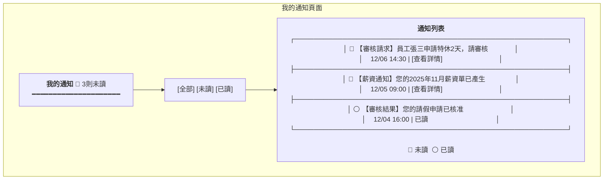
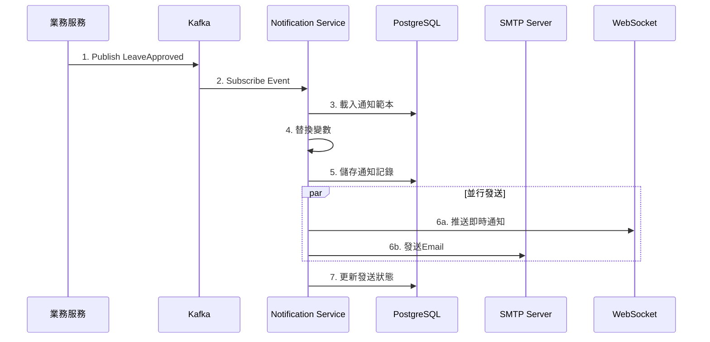

# 通知服務系統設計書

**版本:** 1.0  
**日期:** 2025-12-07  
**Domain代號:** 12 (NTF)  
**導入階段:** 第一階段（核心基礎服務）

---

## 1. 服務概述

### 1.1 核心功能
- ✅ **多渠道通知:** Email、系統訊息、推播、Teams/LINE
- ✅ **通知範本:** 變數替換、多語系
- ✅ **事件訂閱:** 訂閱所有業務事件發送通知
- ✅ **自動提醒Job:** 生日、合約到期、證照到期
- ✅ **通知偏好:** 使用者個人設定

### 1.2 通知渠道

| 渠道 | 技術 | 說明 |
|:---|:---|:---|
| IN_APP | WebSocket | 即時系統內通知 |
| EMAIL | Spring Mail + SMTP | HTML郵件 |
| PUSH | Firebase FCM | iOS/Android推播 |
| TEAMS | Webhook | Microsoft Teams整合 |
| LINE | LINE Notify API | LINE整合 |

---

## 2. UI設計

| 頁面代碼 | 頁面名稱 | 路由 |
|:---|:---|:---|
| `HR12-P01` | 通知範本管理頁面 | `/admin/notifications/templates` |
| `HR12-P02` | 我的通知頁面 | `/profile/notifications` |
| `HR12-P03` | 通知偏好設定頁面 | `/profile/notification-settings` |

### 2.1 UI線稿

#### 我的通知頁面 (HR12-P02)



---

## 3. Event-Driven架構

### 3.1 事件訂閱對照表

| 業務事件 | 通知對象 | 範本代碼 | 渠道 |
|:---|:---|:---|:---|
| `LeaveApplied` | 直屬主管 | LEAVE_APPROVAL_REQUEST | IN_APP, EMAIL |
| `LeaveApproved` | 申請人 | LEAVE_APPROVED | IN_APP, EMAIL |
| `LeaveRejected` | 申請人 | LEAVE_REJECTED | IN_APP, EMAIL |
| `PayslipGenerated` | 員工 | PAYSLIP_READY | IN_APP, EMAIL |
| `TaskAssigned` | 審核人 | APPROVAL_REQUEST | IN_APP, EMAIL |
| `CertificateExpiring` | 員工 | CERTIFICATE_EXPIRY | IN_APP, EMAIL |
| `ContractExpiring` | HR | CONTRACT_EXPIRY | IN_APP, EMAIL |

### 3.2 事件處理流程



---

## 4. 資料庫設計

```sql
-- 通知範本表
CREATE TABLE notification_templates (
    template_id UUID PRIMARY KEY DEFAULT gen_random_uuid(),
    template_code VARCHAR(100) NOT NULL UNIQUE,
    template_name VARCHAR(255) NOT NULL,
    subject VARCHAR(500),
    body TEXT NOT NULL,
    default_channels JSONB DEFAULT '["IN_APP"]',
    is_active BOOLEAN DEFAULT TRUE,
    created_at TIMESTAMP DEFAULT CURRENT_TIMESTAMP
);

-- 通知記錄表
CREATE TABLE notifications (
    notification_id UUID PRIMARY KEY DEFAULT gen_random_uuid(),
    recipient_id UUID NOT NULL,
    title VARCHAR(500) NOT NULL,
    content TEXT NOT NULL,
    notification_type VARCHAR(30) NOT NULL 
        CHECK (notification_type IN ('APPROVAL_REQUEST', 'APPROVAL_RESULT', 'REMINDER', 'ANNOUNCEMENT', 'ALERT')),
    channels JSONB DEFAULT '["IN_APP"]',
    priority VARCHAR(20) DEFAULT 'NORMAL' CHECK (priority IN ('LOW', 'NORMAL', 'HIGH', 'URGENT')),
    status VARCHAR(20) DEFAULT 'PENDING' CHECK (status IN ('PENDING', 'SENT', 'FAILED', 'READ')),
    sent_at TIMESTAMP,
    read_at TIMESTAMP,
    related_business_type VARCHAR(50),
    related_business_id UUID,
    created_at TIMESTAMP DEFAULT CURRENT_TIMESTAMP
);

CREATE INDEX idx_notification_recipient ON notifications(recipient_id, status);
CREATE INDEX idx_notification_created ON notifications(created_at DESC);

-- 通知偏好設定表
CREATE TABLE notification_preferences (
    preference_id UUID PRIMARY KEY DEFAULT gen_random_uuid(),
    employee_id UUID NOT NULL UNIQUE,
    email_enabled BOOLEAN DEFAULT TRUE,
    push_enabled BOOLEAN DEFAULT TRUE,
    in_app_enabled BOOLEAN DEFAULT TRUE,
    quiet_hours_start TIME,
    quiet_hours_end TIME,
    updated_at TIMESTAMP DEFAULT CURRENT_TIMESTAMP
);
```

---

## 5. 自動提醒Job

| Job名稱 | 執行頻率 | 觸發事件 |
|:---|:---|:---|
| `BirthdayReminderJob` | 每日08:00 | 發送當日生日祝福 |
| `ContractExpiryJob` | 每日09:00 | 合約30天內到期提醒HR |
| `CertificateExpiryJob` | 每週一 | 證照30天內到期提醒員工 |
| `AnnualLeaveExpiryJob` | 每週一 | 特休30天內到期提醒 |
| `TimesheetReminderJob` | 每日18:00 | 未回報工時提醒 |

---

## 6. API設計 (8個端點)

| 端點 | 方法 | Controller |
|:---|:---:|:---|
| `/api/v1/notifications/send` | POST | HR12NotificationCmdController |
| `/api/v1/notifications/me` | GET | HR12NotificationQryController |
| `/api/v1/notifications/{id}/read` | PUT | HR12NotificationCmdController |
| `/api/v1/notifications/read-all` | PUT | HR12NotificationCmdController |
| `/api/v1/notifications/unread-count` | GET | HR12NotificationQryController |
| `/api/v1/notifications/templates` | POST | HR12TemplateCmdController |
| `/api/v1/notifications/templates` | GET | HR12TemplateQryController |
| `/api/v1/notifications/preferences` | PUT | HR12PreferenceCmdController |

---

**文件完成日期:** 2025-12-07
</Parameter>
<parameter name="Complexity">7
