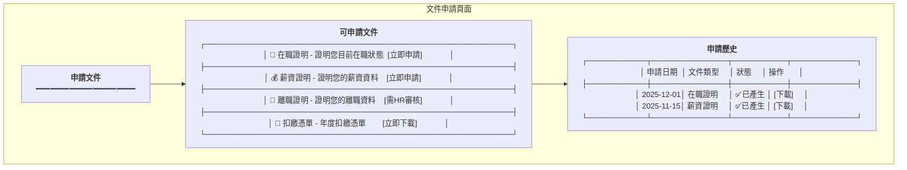
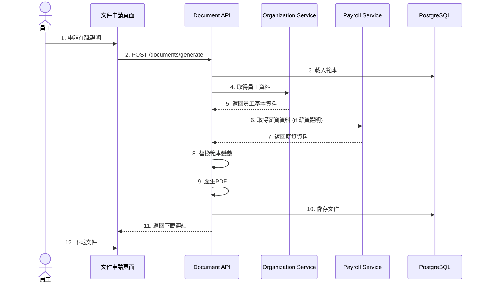

# 文件管理服務系統設計書

**版本:** 1.0  
**日期:** 2025-12-07  
**Domain代號:** 13 (DOC)  
**導入階段:** 第二階段

---

## 1. 服務概述

### 1.1 核心功能
- ✅ **文件上傳/下載:** 履歷、合約、證照、薪資單
- ✅ **版本控管:** 文件歷史版本
- ✅ **範本管理:** 在職證明、薪資證明等範本
- ✅ **文件產生:** 從範本產生PDF文件
- ✅ **加密儲存:** 薪資單加密保護
- ✅ **權限控制:** 私人/部門/公開

### 1.2 文件類型

| 類型 | 說明 | 加密 |
|:---|:---|:---:|
| EMPLOYEE_CONTRACT | 員工合約 | ❌ |
| EMPLOYEE_RESUME | 履歷 | ❌ |
| CERTIFICATE | 證照 | ❌ |
| PAYSLIP | 薪資單 | ✅ |
| GENERATED_DOCUMENT | 系統產生文件 | ❌ |

---

## 2. UI設計

| 頁面代碼 | 頁面名稱 | 路由 |
|:---|:---|:---|
| `HR13-P01` | 文件管理頁面 | `/admin/documents` |
| `HR13-P02` | 範本管理頁面 | `/admin/documents/templates` |
| `HR13-P03` | 我的文件頁面 (ESS) | `/profile/documents` |
| `HR13-P04` | 文件申請頁面 (ESS) | `/profile/documents/request` |

### 2.1 UI線稿

#### 文件申請頁面 (HR13-P04)



---

## 3. UX流程設計

### 3.1 文件產生流程



---

## 4. 資料庫設計

```sql
-- 文件表
CREATE TABLE documents (
    document_id UUID PRIMARY KEY DEFAULT gen_random_uuid(),
    document_type VARCHAR(50) NOT NULL 
        CHECK (document_type IN ('EMPLOYEE_CONTRACT', 'EMPLOYEE_RESUME', 'EMPLOYEE_PHOTO', 'CERTIFICATE', 'PAYSLIP', 'GENERATED_DOCUMENT')),
    business_type VARCHAR(50) NOT NULL,
    business_id UUID NOT NULL,
    file_name VARCHAR(255) NOT NULL,
    original_file_name VARCHAR(255) NOT NULL,
    file_size BIGINT NOT NULL,
    mime_type VARCHAR(100) NOT NULL,
    storage_path VARCHAR(500) NOT NULL,
    is_encrypted BOOLEAN DEFAULT FALSE,
    encryption_key VARCHAR(255),
    owner_id UUID NOT NULL,
    visibility VARCHAR(20) DEFAULT 'PRIVATE' CHECK (visibility IN ('PRIVATE', 'DEPARTMENT', 'PUBLIC')),
    version INTEGER DEFAULT 1,
    uploaded_by UUID NOT NULL,
    uploaded_at TIMESTAMP DEFAULT CURRENT_TIMESTAMP
);

CREATE INDEX idx_document_owner ON documents(owner_id);
CREATE INDEX idx_document_business ON documents(business_type, business_id);

-- 文件範本表
CREATE TABLE document_templates (
    template_id UUID PRIMARY KEY DEFAULT gen_random_uuid(),
    template_code VARCHAR(100) NOT NULL UNIQUE,
    template_name VARCHAR(255) NOT NULL,
    template_type VARCHAR(50) NOT NULL 
        CHECK (template_type IN ('EMPLOYMENT_CERT', 'SALARY_CERT', 'SEPARATION_CERT', 'TAX_WITHHOLDING')),
    template_content TEXT,
    template_file_path VARCHAR(500),
    variables JSONB DEFAULT '[]',
    is_active BOOLEAN DEFAULT TRUE,
    created_at TIMESTAMP DEFAULT CURRENT_TIMESTAMP
);

-- 文件下載記錄表 (稽核用)
CREATE TABLE document_download_logs (
    log_id UUID PRIMARY KEY DEFAULT gen_random_uuid(),
    document_id UUID NOT NULL REFERENCES documents(document_id),
    downloaded_by UUID NOT NULL,
    downloaded_at TIMESTAMP DEFAULT CURRENT_TIMESTAMP,
    ip_address VARCHAR(45)
);
```

---

## 5. 安全性設計

### 5.1 薪資單加密
```java
// AES-256加密
public String encryptPayslip(byte[] pdfContent, String password) {
    // 使用員工身分證後4碼作為密碼
    SecretKeySpec key = generateKey(password);
    Cipher cipher = Cipher.getInstance("AES/GCM/NoPadding");
    cipher.init(Cipher.ENCRYPT_MODE, key);
    return Base64.encode(cipher.doFinal(pdfContent));
}
```

### 5.2 檔案驗證
- 大小限制: 單檔10MB
- 類型限制: 禁止.exe, .sh, .bat
- 病毒掃描: 上傳前掃描 (ClamAV)

---

## 6. API設計 (8個端點)

| 端點 | 方法 | Controller |
|:---|:---:|:---|
| `/api/v1/documents/upload` | POST | HR13DocumentCmdController |
| `/api/v1/documents/{id}/download` | GET | HR13DocumentQryController |
| `/api/v1/documents` | GET | HR13DocumentQryController |
| `/api/v1/documents/generate` | POST | HR13DocumentCmdController |
| `/api/v1/documents/templates` | POST | HR13TemplateCmdController |
| `/api/v1/documents/templates` | GET | HR13TemplateQryController |
| `/api/v1/documents/my` | GET | HR13DocumentQryController |
| `/api/v1/documents/request` | POST | HR13DocumentCmdController |

---

**文件完成日期:** 2025-12-07
