# 人力資源暨專案管理系統 - 系統架構設計文件

**版本:** 1.0  
**日期:** 2025-12-03  
**架構師:** 系統架構設計團隊  
**審查人:** PM / Tech Lead

---

## 📋 目錄

1. [架構總覽](#1-架構總覽)
2. [設計原則](#2-設計原則)
3. [DDD領域驅動設計](#3-ddd領域驅動設計)
4. [SOLID原則應用](#4-solid原則應用)
5. [後端架構設計](#5-後端架構設計)
6. [前端架構設計](#6-前端架構設計)
7. [微服務劃分](#7-微服務劃分)
8. [技術棧](#8-技術棧)
9. [部署架構](#9-部署架構)

---

## 1. 架構總覽

### 1.1 系統架構圖

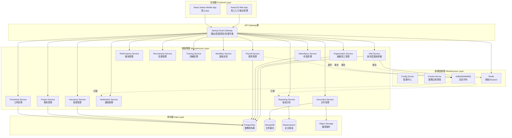

### 1.2 架構特點

| 特點 | 說明 | 優勢 |
|:---|:---|:---|
| **微服務架構** | 按業務領域拆分14個微服務 | 獨立部署、技術異構、故障隔離 |
| **事件驅動** | 使用Kafka進行服務間非同步通訊 | 解耦、可擴展、事件溯源 |
| **DDD設計** | 每個服務遵循DDD分層架構 | 領域模型清晰、業務邏輯聚焦 |
| **CQRS模式** | 讀寫分離,報表服務獨立 | 查詢效能優化、資料一致性 |
| **DAO與Domain分離** | Infrastructure層與Domain層解耦 | 可替換ORM/資料庫、測試友善 |
| **API-Service 1:1** | 每個API端點對應唯一Service方法 | 職責清晰、易於維護 |

---

## 2. 設計原則

### 2.1 核心設計原則

#### 2.1.1 關注點分離 (Separation of Concerns)
- **按業務領域拆分微服務**:每個服務專注單一業務領域
- **分層架構**:Interface、Application、Domain、Infrastructure四層明確分離
- **DAO與Domain分離**:資料存取邏輯與業務邏輯完全解耦

#### 2.1.2 高內聚低耦合 (High Cohesion, Low Coupling)
- **服務內高內聚**:相關業務邏輯聚合在同一聚合根
- **服務間低耦合**:通過事件驅動進行非同步通訊
- **介面隔離**:明確定義服務間的API契約

#### 2.1.3 單一職責 (Single Responsibility)
- 每個微服務只負責一個業務領域
- 每個API端點只對應一個Service方法
- 每個Service方法只處理一個業務用例

#### 2.1.4 依賴反轉 (Dependency Inversion)
- Domain層不依賴Infrastructure層
- 使用Repository介面定義資料存取契約
- 通過Spring IoC容器進行動態注入

---

## 3. DDD領域驅動設計

### 3.1 DDD分層架構

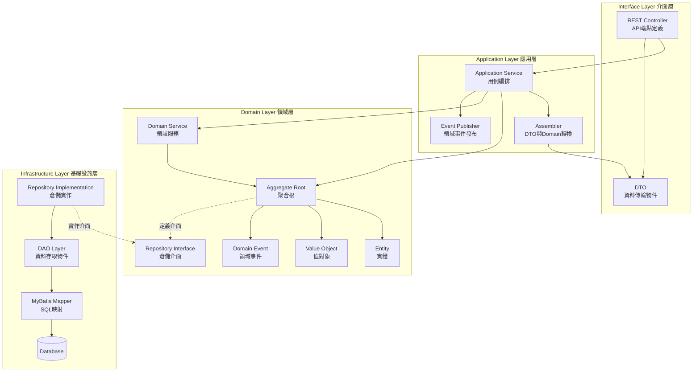

### 3.2 各層職責說明

#### Interface Layer (介面層)
**職責:**
- 定義REST API端點
- 請求參數驗證
- DTO與外部系統互動
- 異常統一處理

**檔案結構範例:**
```
com.company.hrms.iam.controllers/
├── rest/
│   ├── UserController.java
│   ├── RoleController.java
│   └── AuthController.java
├── dto/
│   ├── request/
│   │   ├── LoginRequest.java
│   │   └── CreateUserRequest.java
│   └── response/
│       ├── UserResponse.java
│       └── JwtTokenResponse.java
└── assembler/
    └── UserAssembler.java
```

**範例程式碼:**
```java
@RestController
@RequestMapping("/api/v1/users")
public class UserController {
    
    private final UserApplicationService userApplicationService;
    
    // 依賴注入 - 符合Dependency Inversion原則
    @Autowired
    public UserController(UserApplicationService userApplicationService) {
        this.userApplicationService = userApplicationService;
    }
    
    // 一個API對應一個Service方法
    @PostMapping
    public ResponseEntity<UserResponse> createUser(
            @Valid @RequestBody CreateUserRequest request) {
        return ResponseEntity.ok(userApplicationService.createUser(request));
    }
}
```

#### Application Layer (應用層)
**職責:**
- 用例流程編排
- 事務邊界控制
- 領域事件發布
- DTO與Domain Object轉換

**檔案結構範例:**
```
com.company.hrms.iam.application/
├── service/
│   ├── UserApplicationService.java
│   └── AuthApplicationService.java
├── assembler/
│   └── UserDTOAssembler.java
└── event/
    └── DomainEventPublisher.java
```

**範例程式碼:**
```java
@Service
@Transactional
public class UserApplicationService {
    
    private final UserRepository userRepository;
    private final DomainEventPublisher eventPublisher;
    private final UserDTOAssembler assembler;
    
    // 所有依賴通過構造器注入 - 符合SOLID原則
    @Autowired
    public UserApplicationService(
            UserRepository userRepository,
            DomainEventPublisher eventPublisher,
            UserDTOAssembler assembler) {
        this.userRepository = userRepository;
        this.eventPublisher = eventPublisher;
        this.assembler = assembler;
    }
    
    // 單一職責:只處理建立使用者的用例
    public UserResponse createUser(CreateUserRequest request) {
        // 1. DTO轉Domain
        User user = assembler.toDomain(request);
        
        // 2. 業務邏輯執行(委派給Domain)
        user.activate();
        
        // 3. 持久化
        userRepository.save(user);
        
        // 4. 發布領域事件
        eventPublisher.publish(new UserCreatedEvent(user.getId()));
        
        // 5. Domain轉DTO
        return assembler.toDTO(user);
    }
}
```

#### Domain Layer (領域層)
**職責:**
- 核心業務邏輯
- 領域模型定義
- 業務規則驗證
- 領域事件定義

**檔案結構範例:**
```
com.company.hrms.iam.domain/
├── model/
│   ├── aggregate/
│   │   └── User.java (聚合根)
│   ├── entity/
│   │   └── Role.java
│   └── valueobject/
│       ├── Email.java
│       ├── Password.java
│       └── UserId.java
├── service/
│   └── PasswordEncryptionService.java (領域服務)
├── repository/
│   └── UserRepository.java (介面定義)
└── event/
    ├── UserCreatedEvent.java
    └── UserDeletedEvent.java
```

**聚合根範例:**
```java
@Entity
@Table(name = "users")
public class User {
    
    @EmbeddedId
    private UserId id;
    
    @Embedded
    private Email email;
    
    @Embedded
    private Password password;
    
    @Enumerated(EnumType.STRING)
    private UserStatus status;
    
    private LocalDateTime lastLoginAt;
    
    // Domain邏輯:封裝在聚合根內
    public void activate() {
        if (this.status == UserStatus.DELETED) {
            throw new DomainException("無法啟用已刪除的使用者");
        }
        this.status = UserStatus.ACTIVE;
    }
    
    public void changePassword(Password newPassword, 
                               PasswordEncryptionService encryptionService) {
        // 業務規則:密碼不能與舊密碼相同
        if (this.password.equals(newPassword)) {
            throw new DomainException("新密碼不能與舊密碼相同");
        }
        this.password = encryptionService.encrypt(newPassword);
    }
    
    public void recordLogin() {
        this.lastLoginAt = LocalDateTime.now();
    }
}
```

**Repository介面定義(Domain層):**
```java
// 在Domain層定義介面 - 依賴反轉原則
public interface UserRepository {
    User findById(UserId id);
    User findByEmail(Email email);
    void save(User user);
    void delete(User user);
    List<User> findByStatus(UserStatus status);
}
```

#### Infrastructure Layer (基礎設施層)
**職責:**
- Repository介面實作
- 資料庫存取
- 外部系統整合
- 技術細節實現

**檔案結構範例:**
```
com.company.hrms.iam.infrastructure/
├── repository/
│   └── UserRepositoryImpl.java (實作Domain層的介面)
├── dao/
│   └── UserDAO.java
├── mapper/
│   └── UserMapper.java (MyBatis Mapper)
└── po/
    └── UserPO.java (Persistent Object)
```

**DAO與Domain分離設計:**
```java
// PO (Persistent Object) - 資料庫映射物件
@Data
public class UserPO {
    private String id;
    private String email;
    private String passwordHash;
    private String status;
    private Timestamp lastLoginAt;
    private Timestamp createdAt;
}

// DAO - 資料存取物件
@Repository
public class UserDAO {
    
    private final UserMapper userMapper;
    
    @Autowired
    public UserDAO(UserMapper userMapper) {
        this.userMapper = userMapper;
    }
    
    public UserPO selectById(String id) {
        return userMapper.selectById(id);
    }
    
    public void insert(UserPO userPO) {
        userMapper.insert(userPO);
    }
}

// Repository實作 - 將PO轉換為Domain Object
@Component
public class UserRepositoryImpl implements UserRepository {
    
    private final UserDAO userDAO;
    
    @Autowired
    public UserRepositoryImpl(UserDAO userDAO) {
        this.userDAO = userDAO;
    }
    
    @Override
    public User findById(UserId id) {
        UserPO po = userDAO.selectById(id.getValue());
        return convertToDomain(po);
    }
    
    @Override
    public void save(User user) {
        UserPO po = convertToPO(user);
        userDAO.insert(po);
    }
    
    // PO與Domain Object轉換
    private User convertToDomain(UserPO po) {
        return User.builder()
            .id(new UserId(po.getId()))
            .email(new Email(po.getEmail()))
            .password(Password.fromHash(po.getPasswordHash()))
            .status(UserStatus.valueOf(po.getStatus()))
            .lastLoginAt(po.getLastLoginAt().toLocalDateTime())
            .build();
    }
    
    private UserPO convertToPO(User user) {
        UserPO po = new UserPO();
        po.setId(user.getId().getValue());
        po.setEmail(user.getEmail().getValue());
        po.setPasswordHash(user.getPassword().getHash());
        po.setStatus(user.getStatus().name());
        return po;
    }
}
```

**MyBatis Mapper:**
```java
@Mapper
public interface UserMapper {
    
    @Select("SELECT * FROM users WHERE id = #{id}")
    UserPO selectById(String id);
    
    @Insert("INSERT INTO users (id, email, password_hash, status, created_at) " +
            "VALUES (#{id}, #{email}, #{passwordHash}, #{status}, #{createdAt})")
    void insert(UserPO user);
    
    @Update("UPDATE users SET email = #{email}, status = #{status} " +
            "WHERE id = #{id}")
    void update(UserPO user);
}
```

### 3.3 DAO與Domain分離的優勢

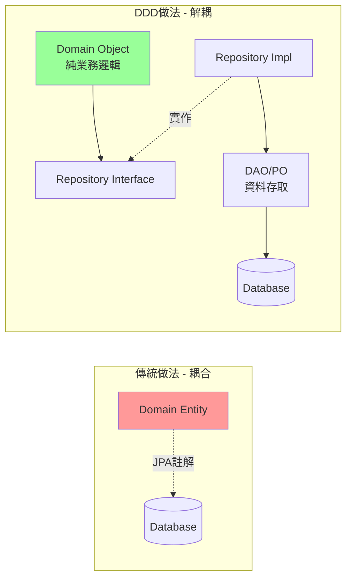

**優勢說明:**

| 優勢 | 說明 |
|:---|:---|
| **可替換性** | 未來可輕易從MyBatis切換到JPA或其他ORM,只需修改Infrastructure層 |
| **可測試性** | Domain層測試不需要資料庫,可Mock Repository介面 |
| **領域純淨性** | Domain Object不含任何技術框架註解,保持業務邏輯純粹 |
| **資料庫獨立** | Domain模型設計不受資料庫表結構限制 |
| **團隊分工** | 領域專家專注Domain層,技術專家處理Infrastructure層 |

---

## 4. SOLID原則應用

### 4.1 Single Responsibility Principle (單一職責原則)

**定義:**一個類別應該只有一個引起它變化的原因

**應用實例:**

```java
// ❌ 違反SRP:一個Service處理多個職責
public class UserService {
    public void createUser() { }
    public void sendWelcomeEmail() { }  // 應該由NotificationService處理
    public void generateReport() { }    // 應該由ReportService處理
}

// ✅ 符合SRP:每個Service單一職責
public class UserApplicationService {
    public UserResponse createUser(CreateUserRequest request) {
        // 只負責使用者建立的業務邏輯
    }
}

public class NotificationApplicationService {
    public void sendWelcomeEmail(UserId userId) {
        // 只負責通知相關業務邏輯
    }
}
```

**在本系統中的體現:**
- 每個微服務專注單一業務領域
- 每個API端點對應唯一Service方法
- Domain、Application、Infrastructure層各司其職

### 4.2 Open/Closed Principle (開放封閉原則)

**定義:**軟體實體應該對擴展開放,對修改封閉

**應用實例:**

```java
// 策略模式:薪資計算策略
public interface SalaryCalculationStrategy {
    BigDecimal calculate(Employee employee, WorkingHours hours);
}

// 月薪制計算策略
public class MonthlySalaryStrategy implements SalaryCalculationStrategy {
    @Override
    public BigDecimal calculate(Employee employee, WorkingHours hours) {
        return employee.getMonthlySalary();
    }
}

// 時薪制計算策略
public class HourlySalaryStrategy implements SalaryCalculationStrategy {
    @Override
    public BigDecimal calculate(Employee employee, WorkingHours hours) {
        return employee.getHourlyRate().multiply(hours.getTotal());
    }
}

// 薪資計算服務 - 對擴展開放,對修改封閉
public class SalaryCalculationService {
    
    private final Map<SalaryType, SalaryCalculationStrategy> strategies;
    
    public BigDecimal calculateSalary(Employee employee, WorkingHours hours) {
        SalaryCalculationStrategy strategy = strategies.get(employee.getSalaryType());
        return strategy.calculate(employee, hours);
    }
}

// 新增日薪制,無需修改現有程式碼,只需新增策略類別
public class DailySalaryStrategy implements SalaryCalculationStrategy {
    @Override
    public BigDecimal calculate(Employee employee, WorkingHours hours) {
        return employee.getDailyRate().multiply(hours.getDays());
    }
}
```

### 4.3 Liskov Substitution Principle (里氏替換原則)

**定義:**子類別必須能夠替換其基類別

**應用實例:**

```java
// 抽象基類:假別
public abstract class LeaveType {
    protected String name;
    protected boolean isPaid;
    
    public abstract boolean canApply(Employee employee);
    public abstract BigDecimal calculateDeduction(BigDecimal salary);
}

// 特休假
public class AnnualLeave extends LeaveType {
    @Override
    public boolean canApply(Employee employee) {
        return employee.getAnnualLeaveDays() > 0;
    }
    
    @Override
    public BigDecimal calculateDeduction(BigDecimal salary) {
        return BigDecimal.ZERO; // 全薪
    }
}

// 事假
public class PersonalLeave extends LeaveType {
    @Override
    public boolean canApply(Employee employee) {
        return true; // 任何員工都可以請事假
    }
    
    @Override
    public BigDecimal calculateDeduction(BigDecimal salary) {
        return salary; // 不支薪
    }
}

// 使用:可以用子類別替換基類別
public class LeaveApplicationService {
    public void applyLeave(Employee employee, LeaveType leaveType, int days) {
        if (leaveType.canApply(employee)) {
            // 處理請假邏輯
        }
    }
}
```

### 4.4 Interface Segregation Principle (介面隔離原則)

**定義:**客戶端不應該依賴它不需要的介面

**應用實例:**

```java
// ❌ 違反ISP:臃腫的介面
public interface EmployeeRepository {
    Employee findById(EmployeeId id);
    void save(Employee employee);
    List<Employee> findAll();
    List<Employee> findByDepartment(DepartmentId id);
    List<Employee> findByStatus(EmployeeStatus status);
    byte[] exportToExcel();
    void sendNotification(Employee employee);
}

// ✅ 符合ISP:介面隔離
public interface EmployeeRepository {
    Employee findById(EmployeeId id);
    void save(Employee employee);
}

public interface EmployeeQueryRepository {
    List<Employee> findAll();
    List<Employee> findByDepartment(DepartmentId id);
    List<Employee> findByStatus(EmployeeStatus status);
}

public interface EmployeeExportService {
    byte[] exportToExcel(List<Employee> employees);
}

public interface EmployeeNotificationService {
    void sendNotification(Employee employee, String message);
}
```

### 4.5 Dependency Inversion Principle (依賴反轉原則)

**定義:**高階模組不應該依賴低階模組,兩者都應該依賴抽象

**應用實例:**

```java
// ❌ 違反DIP:高階模組直接依賴低階模組
public class PayrollService {
    private MySQLEmployeeDAO employeeDAO = new MySQLEmployeeDAO(); // 緊耦合
    
    public void calculateSalary(EmployeeId id) {
        Employee employee = employeeDAO.findById(id);
        // ...
    }
}

// ✅ 符合DIP:依賴抽象(介面)

// Domain層定義介面(抽象)
public interface EmployeeRepository {
    Employee findById(EmployeeId id);
    void save(Employee employee);
}

// Application層依賴抽象
public class PayrollApplicationService {
    
    private final EmployeeRepository employeeRepository; // 依賴介面
    
    // 通過構造器注入 - Spring IoC自動注入實作
    @Autowired
    public PayrollApplicationService(EmployeeRepository employeeRepository) {
        this.employeeRepository = employeeRepository;
    }
    
    public void calculateSalary(EmployeeId id) {
        Employee employee = employeeRepository.findById(id);
        // ...
    }
}

// Infrastructure層實作介面
@Component
public class EmployeeRepositoryImpl implements EmployeeRepository {
    
    private final EmployeeDAO employeeDAO;
    
    @Autowired
    public EmployeeRepositoryImpl(EmployeeDAO employeeDAO) {
        this.employeeDAO = employeeDAO;
    }
    
    @Override
    public Employee findById(EmployeeId id) {
        EmployeePO po = employeeDAO.selectById(id.getValue());
        return convertToDomain(po);
    }
}
```

**依賴關係圖:**

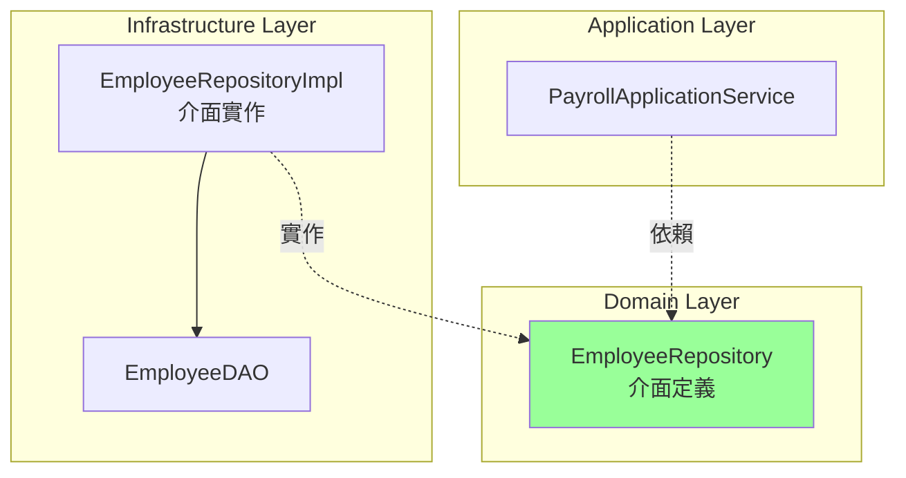

---

## 5. 後端架構設計

### 5.1 技術棧

| 層級 | 技術選型 | 版本 | 說明 |
|:---|:---|:---|:---|
| **語言** | Java | 17 LTS | 長期支援版本,效能優化 |
| **框架** | Spring Boot | 3.1.x | 微服務基礎框架 |
| **微服務** | Spring Cloud | 2022.0.x | 微服務全家桶 |
| **服務註冊** | Eureka | - | 服務發現與註冊中心 |
| **配置中心** | Spring Cloud Config | - | 集中化配置管理 |
| **API閘道** | Spring Cloud Gateway | - | 路由/認證/限流 |
| **負載均衡** | Spring Cloud LoadBalancer | - | 客戶端負載均衡 |
| **熔斷器** | Resilience4j | - | 容錯保護 |
| **訊息佇列** | Kafka | 3.x | 事件驅動通訊 |
| **ORM框架** | MyBatis | 3.5.x | SQL映射框架 |
| **資料庫** | PostgreSQL | 15.x | 主要業務資料庫 |
| **快取** | Redis | 7.x | 分散式快取/Session |
| **搜尋引擎** | Elasticsearch | 8.x | 全文檢索/報表查詢 |
| **文件儲存** | MinIO / AWS S3 | - | 物件儲存 |
| **認證授權** | Spring Security + JWT | - | 安全框架 |

### 5.2 微服務架構設計

#### 5.2.1 服務間通訊

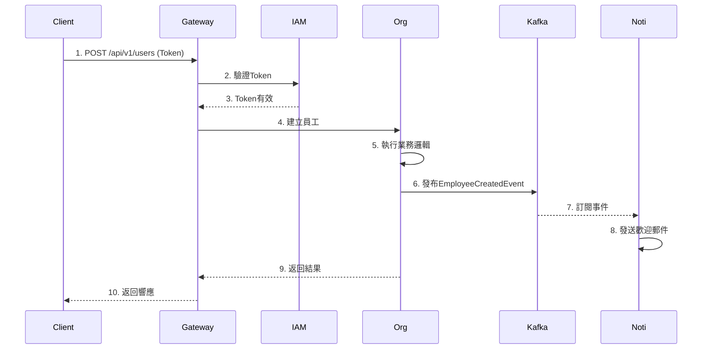

**同步通訊 (RESTful API):**
- 用於:查詢操作、需要即時回應的業務
- 通過Spring Cloud OpenFeign進行服務間呼叫
- 配合Resilience4j進行熔斷保護

**非同步通訊 (Event-Driven):**
- 用於:跨服務的業務流程、通知、報表更新
- 使用Kafka作為訊息中間件
- 確保最終一致性

#### 5.2.2 API與Service一對一映射

**核心原則:**
```
一個 API endpoint = 一個專屬的 Service 類別
```

**設計規範:**

本專案採用 **Factory模式 + AOP動態解析**,每個API端點對應一個專屬的Service實現類別。

```java
// Controller層:薄控制器,不注入Service
@RestController
@RequestMapping("/api/v1/employees")
public class EmployeeController extends CommandBaseController {
    
    // 新增員工 API
    @PostMapping
    public ResponseEntity<CreateEmployeeResponse> createEmployee(
            @RequestBody @Valid CreateEmployeeRequest request,
            @CurrentUser JWTModel currentUser) throws Exception {
        // 調用基類的execCommand,由Factory動態解析對應的Service
        return ResponseEntity.ok(execCommand(request, currentUser));
    }
    
    // 更新員工 API
    @PutMapping("/{employeeId}")
    public ResponseEntity<UpdateEmployeeResponse> updateEmployee(
            @PathVariable String employeeId,
            @RequestBody @Valid UpdateEmployeeRequest request,
            @CurrentUser JWTModel currentUser) throws Exception {
        return ResponseEntity.ok(execCommand(request, currentUser, employeeId));
    }
}

// Service層:每個API對應一個Service類別
@Service
public class CreateEmployeeServiceImpl 
        implements CommandApiService<CreateEmployeeRequest, CreateEmployeeResponse> {
    
    @Autowired
    private IEmployeeRepository employeeRepository;
    
    @Autowired
    private DomainEventPublisher eventPublisher;
    
    @Override
    public CreateEmployeeResponse execCommand(
            CreateEmployeeRequest req, 
            JWTModel currentUser, 
            String... args) throws Exception {
        // 1. 建立Domain Object
        Employee employee = Employee.create(req.getName(), req.getEmail());
        
        // 2. 執行業務邏輯
        employee.activate();
        
        // 3. 持久化
        employeeRepository.save(employee);
        
        // 4. 發布事件
        eventPublisher.publish(new EmployeeCreatedEvent(employee.getId()));
        
        // 5. 返回響應
        return new CreateEmployeeResponse(employee.getId());
    }
}

@Service
public class UpdateEmployeeServiceImpl 
        implements CommandApiService<UpdateEmployeeRequest, UpdateEmployeeResponse> {
    
    @Autowired
    private IEmployeeRepository employeeRepository;
    
    @Override
    public UpdateEmployeeResponse execCommand(
            UpdateEmployeeRequest req, 
            JWTModel currentUser, 
            String... args) throws Exception {
        String employeeId = args[0];  // 從可變參數取得路徑參數
        
        // 1. 查詢員工
        Employee employee = employeeRepository.findById(new EmployeeId(employeeId));
        
        // 2. 執行業務邏輯
        employee.updateInfo(req.getName(), req.getEmail());
        
        // 3. 持久化
        employeeRepository.save(employee);
        
        // 4. 返回響應
        return new UpdateEmployeeResponse(employee.getId());
    }
}
```

**動態Service解析機制:**

```java
// AOP切面:攔截Controller方法,設定Service Bean名稱
@Aspect
@Order(1)
@Component
public class ApiServiceAspect {
    
    @Autowired
    private BeanNameConfig beanNameConfig;
    
    @Before("execution(* com.company.hrms.*.api.controller..*.*(..))")
    public void before(JoinPoint joinPoint) {
        // 取得Controller方法名稱,拼接"ServiceImpl"
        String methodName = joinPoint.getSignature().getName();
        beanNameConfig.setBeanName(methodName + "ServiceImpl");
        // createEmployee -> createEmployeeServiceImpl
        // updateEmployee -> updateEmployeeServiceImpl
    }
}

// Factory:根據Bean名稱動態獲取對應的Service
@Component
public class CommandApiServiceFactory<TRequest, TResponse> {
    
    @Autowired(required = false)
    private Map<String, CommandApiService<TRequest, TResponse>> serviceMap;
    
    @Autowired
    private BeanNameConfig beanNameConfig;
    
    public CommandApiService<TRequest, TResponse> getApiService() {
        String beanName = beanNameConfig.getBeanName();
        // 使用equals精確比對,避免混淆
        return serviceMap.get(
            serviceMap.keySet().stream()
                .filter(x -> x.equals(beanName))
                .findFirst()
                .get()
        );
    }
}
```

**Service命名規則:**

| Controller方法名 | Service類別名 | Spring Bean名稱 |
|:---|:---|:---|
| `createEmployee()` | `CreateEmployeeServiceImpl` | `createEmployeeServiceImpl` |
| `updateEmployee()` | `UpdateEmployeeServiceImpl` | `updateEmployeeServiceImpl` |
| `getEmployee()` | `GetEmployeeServiceImpl` | `getEmployeeServiceImpl` |
| `deleteEmployee()` | `DeleteEmployeeServiceImpl` | `deleteEmployeeServiceImpl` |

**優勢:**
- ✅ **單一職責**:每個Service類別只處理一個API用例
- ✅ **易於維護**:修改某個API邏輯只需修改對應的Service類別
- ✅ **易於測試**:每個Service可獨立測試
- ✅ **解耦合**:Controller不直接注入Service,由Factory動態解析
- ✅ **命名一致性**:Service命名自動對應Controller方法名
- ✅ **避免上帝類別**:不會出現一個Service包含數十個方法的情況

#### 5.2.3 CQRS讀寫分離架構

**核心概念:**

本專案採用 **CQRS (Command Query Responsibility Segregation)** 模式,將寫入操作與查詢操作完全分離。

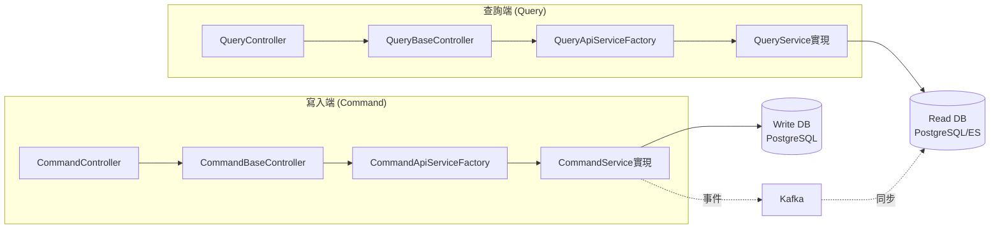

**Controller分離:**

| Controller類型 | 基類 | 用途 | HTTP方法 | Factory |
|:---|:---|:---|:---|:---|
| **CommandController** | `CommandBaseController` | 寫入操作 | POST/PUT/PATCH/DELETE | `CommandApiServiceFactory` |
| **QueryController** | `QueryBaseController` | 查詢操作 | GET | `QueryApiServiceFactory` |

**CommandController範例:**

```java
@RestController
@RequestMapping("/api/v1/employees")
public class EmployeeCommandController extends CommandBaseController {
    
    // 新增員工
    @PostMapping
    public ResponseEntity<CreateEmployeeResponse> createEmployee(
            @RequestBody @Valid CreateEmployeeRequest request,
            @CurrentUser JWTModel currentUser) throws Exception {
        return ResponseEntity.ok(execCommand(request, currentUser));
    }
    
    // 更新員工
    @PutMapping("/{employeeId}")
    public ResponseEntity<UpdateEmployeeResponse> updateEmployee(
            @PathVariable String employeeId,
            @RequestBody @Valid UpdateEmployeeRequest request,
            @CurrentUser JWTModel currentUser) throws Exception {
        return ResponseEntity.ok(execCommand(request, currentUser, employeeId));
    }
    
    // 刪除員工
    @DeleteMapping("/{employeeId}")
    public ResponseEntity<Void> deleteEmployee(
            @PathVariable String employeeId,
            @CurrentUser JWTModel currentUser) throws Exception {
        execCommand(new DeleteEmployeeRequest(), currentUser, employeeId);
        return ResponseEntity.noContent().build();
    }
}
```

**QueryController範例:**

```java
@RestController
@RequestMapping("/api/v1/employees")
public class EmployeeQueryController extends QueryBaseController {
    
    // 查詢單一員工
    @GetMapping("/{employeeId}")
    public ResponseEntity<EmployeeDetailResponse> getEmployee(
            @PathVariable String employeeId,
            @CurrentUser JWTModel currentUser) throws Exception {
        GetEmployeeRequest request = new GetEmployeeRequest();
        return ResponseEntity.ok(getResponse(request, currentUser, employeeId));
    }
    
    // 查詢員工列表
    @GetMapping
    public ResponseEntity<Page<EmployeeListResponse>> getEmployeeList(
            @ParameterObject @Valid EmployeeQueryRequest request,
            @CurrentUser JWTModel currentUser) throws Exception {
        return ResponseEntity.ok(getResponse(request, currentUser));
    }
}
```

**QueryBaseController實現:**

```java
public abstract class QueryBaseController {
    
    @Autowired
    private QueryApiServiceFactory factory;
    
    protected <TRequest, TResponse> TResponse getResponse(
            TRequest request,
            JWTModel currentUser,
            String... args) throws Exception {
        // 從Factory獲取對應的QueryService
        QueryApiService<TRequest, TResponse> service = 
            factory.getApiService();
        
        // 執行查詢邏輯
        return service.callApi(request, currentUser, args);
    }
}
```

**QueryApiService介面:**

```java
public interface QueryApiService<TRequest, TResponse> {
    TResponse callApi(TRequest request, JWTModel currentUser, String... args) 
        throws Exception;
}
```

**QueryService實現範例:**

```java
@Service
public class GetEmployeeServiceImpl 
        implements QueryApiService<GetEmployeeRequest, EmployeeDetailResponse> {
    
    @Autowired
    private IEmployeeQueryRepository employeeQueryRepository;
    
    @Autowired
    private EmployeeMapper mapper;
    
    @Override
    public EmployeeDetailResponse callApi(
            GetEmployeeRequest req,
            JWTModel currentUser,
            String... args) throws Exception {
        String employeeId = args[0];
        
        // 1. 查詢員工
        EmployeeDetailDto dto = employeeQueryRepository
            .findDetailById(new EmployeeId(employeeId));
        
        // 2. 權限檢查
        validateAccess(currentUser, dto);
        
        // 3. 組裝響應
        return mapper.toDetailResponse(dto);
    }
}

@Service
public class GetEmployeeListServiceImpl 
        implements QueryApiService<EmployeeQueryRequest, Page<EmployeeListResponse>> {
    
    @Autowired
    private IEmployeeQueryRepository employeeQueryRepository;
    
    @Override
    public Page<EmployeeListResponse> callApi(
            EmployeeQueryRequest req,
            JWTModel currentUser,
            String... args) throws Exception {
        // 1. 構建查詢條件
        EmployeeQueryCondition condition = buildCondition(req, currentUser);
        
        // 2. 執行查詢 (可能從ES查詢以提升效能)
        Page<EmployeeDto> page = employeeQueryRepository
            .findByCondition(condition, req.getPageable());
        
        // 3. 轉換為響應
        return page.map(mapper::toListResponse);
    }
}
```

**CQRS優勢:**

| 優勢 | 說明 |
|:---|:---|
| **職責分離** | Command處理業務邏輯,Query專注資料查詢 |
| **效能優化** | Query可使用讀寫分離資料庫、Elasticsearch等 |
| **擴展性** | 查詢端與寫入端可獨立擴展 |
| **簡化複雜查詢** | Query端可使用視圖、非正規化資料 |
| **快取友善** | Query端易於實施快取策略 |
| **安全隔離** | 降低查詢操作對寫入操作的影響 |

**讀寫資料庫分離:**

```yaml
spring:
  datasource:
    # 寫入資料庫 (主庫)
    write:
      url: jdbc:postgresql://master-db:5432/hrms
      username: hrms_write
      password: ${DB_WRITE_PASSWORD}
      hikari:
        maximum-pool-size: 20
    
    # 查詢資料庫 (從庫或ES)
    read:
      url: jdbc:postgresql://slave-db:5432/hrms
      username: hrms_read
      password: ${DB_READ_PASSWORD}
      hikari:
        maximum-pool-size: 50  # 查詢池較大
        read-only: true
```

**Repository分離:**

```java
// Command端Repository:寫入主庫
public interface IEmployeeRepository {
    void save(Employee employee);
    void delete(Employee employee);
}

// Query端Repository:查詢從庫或ES
public interface IEmployeeQueryRepository {
    EmployeeDetailDto findDetailById(EmployeeId id);
    Page<EmployeeDto> findByCondition(
        EmployeeQueryCondition condition, 
        Pageable pageable
    );
}
```

### 5.3 Service動態注入機制

**核心設計:**

本專案不採用傳統的直接注入Service方式,而是使用 **AOP + Factory模式** 實現動態Service解析。

**流程說明:**

```
1️⃣ HTTP請求到達
    ↓
2️⃣ ApiServiceAspect攔截 (@Before)
    ├─ Pointcut: controller..*.*(..

)
    ├─ 取得Controller方法名稱
    │   例如:method.getName() = "createEmployee"
    ├─ 拼接"ServiceImpl"後綴
    │   beanName = "createEmployee" + "ServiceImpl"
    └─ 設定到BeanNameConfig (@RequestScope)
        beanNameConfig.setBeanName("createEmployeeServiceImpl")
    ↓
3️⃣ Controller執行
    └─ 調用基類的execCommand() / getResponse()
    ↓
4️⃣ Factory動態解析Service
    ├─ Spring自動注入Map<String, Service>
    │   收集所有實現CommandApiService的Bean
    ├─ 從BeanNameConfig取得beanName
    └─ 使用equals精確比對,返回對應Service
    ↓
5️⃣ Service執行業務邏輯
```

**核心組件:**

```java
// 1. Request範圍的配置類
@Component
@RequestScope  // 關鍵:每個請求獨立
@Data
public class BeanNameConfig {
    private String beanName;
}

// 2. AOP切面
@Aspect
@Order(1)  // 優先級最高
@Component
public class ApiServiceAspect {
    
    @Autowired
    private BeanNameConfig beanNameConfig;
    
    @Before("execution(* com.company.hrms.*.api.controller..*.*(..))")
    public void before(JoinPoint joinPoint) {
        String methodName = joinPoint.getSignature().getName();
        beanNameConfig.setBeanName(methodName + "ServiceImpl");
    }
}

// 3. Service Factory
@Component
public class CommandApiServiceFactory<TRequest, TResponse> {
    
    // Spring自動注入所有實現CommandApiService的Bean
    @Autowired(required = false)
    private Map<String, CommandApiService<TRequest, TResponse>> serviceMap;
    
    @Autowired
    private BeanNameConfig beanNameConfig;
    
    public CommandApiService<TRequest, TResponse> getApiService() {
        String beanName = beanNameConfig.getBeanName();
        
        // 使用equals精確比對,避免混淆相似名稱
        String matchedKey = serviceMap.keySet().stream()
            .filter(key -> key.equals(beanName))
            .findFirst()
            .orElseThrow(() -> new RuntimeException(
                "找不到Service: " + beanName));
        
        return serviceMap.get(matchedKey);
    }
}

// 4. Controller基類
public abstract class CommandBaseController {
    
    @Autowired
    private CommandApiServiceFactory factory;
    
    protected <TRequest, TResponse> TResponse execCommand(
            TRequest request, 
            JWTModel currentUser, 
            String... args) throws Exception {
        // 從Factory獲取對應的Service
        CommandApiService<TRequest, TResponse> service = 
            factory.getApiService();
        
        // 執行Service邏輯
        return service.execCommand(request, currentUser, args);
    }
}
```

**為何使用equals而非contains?**

```java
// 假設有兩個Service:
// - GetEmployeeServiceImpl (Bean名稱: getEmployeeServiceImpl)
// - GetEmployeeListServiceImpl (Bean名稱: getEmployeeListServiceImpl)

// ❌ 使用contains會混淆:
beanNameConfig.setBeanName("getEmployeeServiceImpl");
serviceMap.keySet().stream()
    .filter(x -> x.contains("getEmployeeServiceImpl"))  
    // ❌ 會匹配到兩個: getEmployeeServiceImpl, getEmployeeListServiceImpl
    .findFirst()  // 不確定拿到哪一個!

// ✅ 使用equals精確匹配:
serviceMap.keySet().stream()
    .filter(x -> x.equals("getEmployeeServiceImpl"))  
    // ✅ 只匹配一個: getEmployeeServiceImpl
    .findFirst()  // 確定正確
```

**Service命名規則:**

| Controller方法 | Service類別名 | Spring Bean名稱 | 是否匹配 |
|:---|:---|:---|:---:|
| `createEmployee()` | `CreateEmployeeServiceImpl` | `createEmployeeServiceImpl` | ✅ |
| `getEmployee()` | `GetEmployeeServiceImpl` | `getEmployeeServiceImpl` | ✅ |
| `getEmployeeList()` | `GetEmployeeListServiceImpl` | `getEmployeeListServiceImpl` | ✅ |

**優勢:**
- ✅ Controller不需要注入Service,薄控制器
- ✅ 自動根據方法名找到對應Service
- ✅ 新增API只需加Service類別,Controller簡單呼叫execCommand
- ✅ 命名規則強制一致性
- ✅ 避免Service注入過多導致的構造器臃腫

### 5.4 MyBatis整合設計

#### 5.4.1 專案結構
```
src/main/java/
└── com.company.hrms.iam/
    ├── interfaces/        (Interface Layer)
    ├── application/       (Application Layer)
    ├── domain/           (Domain Layer)
    │   ├── model/
    │   └── repository/   (Repository介面定義)
    └── infrastructure/   (Infrastructure Layer)
        ├── repository/   (Repository實作)
        ├── dao/         (DAO類別)
        ├── mapper/      (MyBatis Mapper介面)
        └── po/          (Persistent Object)

src/main/resources/
└── mapper/
    └── UserMapper.xml   (MyBatis XML映射)
```

#### 5.4.2 MyBatis配置

**application.yml:**
```yaml
mybatis:
  mapper-locations: classpath:mapper/**/*.xml
  type-aliases-package: com.company.hrms.*.infrastructure.po
  configuration:
    map-underscore-to-camel-case: true
    cache-enabled: false  # 使用Redis做快取
    log-impl: org.apache.ibatis.logging.slf4j.Slf4jImpl
```

**Mapper XML範例:**
```xml
<?xml version="1.0" encoding="UTF-8"?>
<!DOCTYPE mapper PUBLIC "-//mybatis.org//DTD Mapper 3.0//EN" 
  "http://mybatis.org/dtd/mybatis-3-mapper.dtd">
<mapper namespace="com.company.hrms.iam.infrastructure.mapper.UserMapper">
    
    <resultMap id="UserPOMap" type="UserPO">
        <id property="id" column="id"/>
        <result property="email" column="email"/>
        <result property="passwordHash" column="password_hash"/>
        <result property="status" column="status"/>
        <result property="createdAt" column="created_at"/>
    </resultMap>
    
    <select id="selectById" resultMap="UserPOMap">
        SELECT * FROM users WHERE id = #{id}
    </select>
    
    <insert id="insert">
        INSERT INTO users (id, email, password_hash, status, created_at)
        VALUES (#{id}, #{email}, #{passwordHash}, #{status}, #{createdAt})
    </insert>
</mapper>
```

### 5.5 資料庫設計原則

#### 5.5.1 每個微服務獨立資料庫

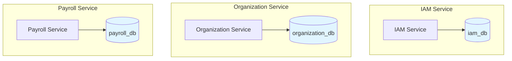

**優勢:**
- 資料隔離
- 獨立擴展
- 故障隔離
- 技術異構(可選用不同資料庫)

**資料一致性:**
- 使用Saga模式處理分散式事務
- 通過領域事件確保最終一致性

#### 5.5.2 表命名規範

| 規則 | 範例 | 說明 |
|:---|:---|:---|
| 小寫+底線 | `user_roles` | PostgreSQL慣例 |
| 複數形式 | `employees` | 表示集合 |
| 關聯表 | `employee_projects` | 多對多關係 |
| 審計表 | `audit_logs` | 稽核記錄 |

---

## 6. 前端架構設計

### 6.1 ReactJS架構設計

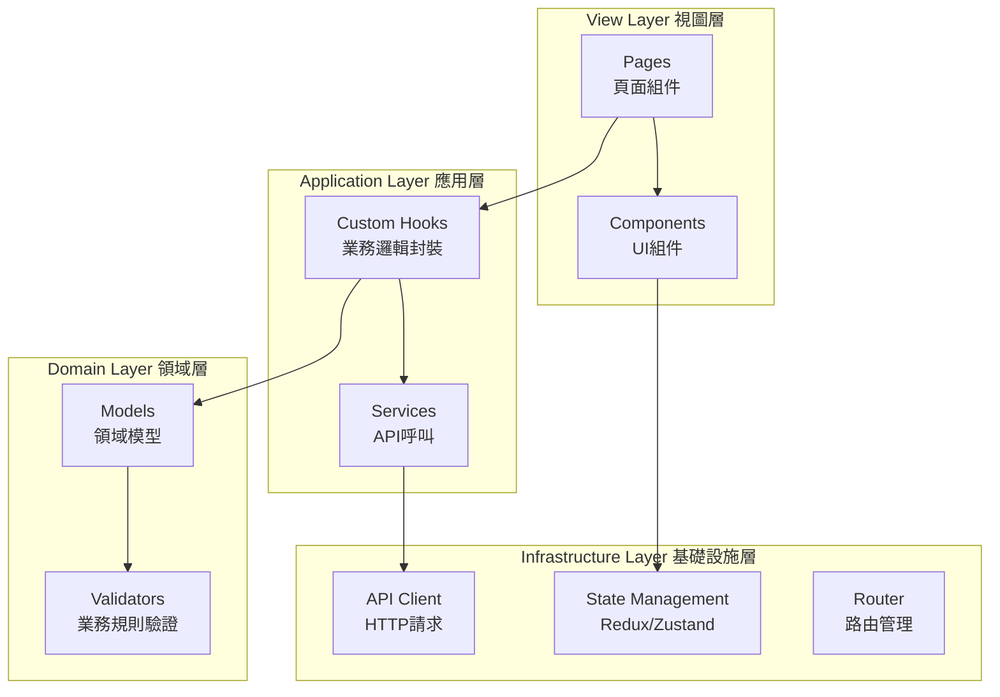

### 6.2 專案結構

```
frontend/
├── src/
│   ├── pages/                    # 頁面組件
│   │   ├── employee/
│   │   │   ├── EmployeeListPage.tsx
│   │   │   └── EmployeeDetailPage.tsx
│   │   └── attendance/
│   │       └── CheckInPage.tsx
│   ├── components/               # UI組件(符合SRP)
│   │   ├── common/
│   │   │   ├── Button/
│   │   │   ├── Input/
│   │   │   └── Table/
│   │   └── employee/
│   │       ├── EmployeeCard/
│   │       └── EmployeeForm/
│   ├── hooks/                    # Custom Hooks(業務邏輯)
│   │   ├── useEmployee.ts
│   │   └── useAttendance.ts
│   ├── services/                 # API服務(Infrastructure)
│   │   ├── employeeService.ts
│   │   └── attendanceService.ts
│   ├── models/                   # 領域模型
│   │   ├── Employee.ts
│   │   └── Attendance.ts
│   ├── validators/               # 業務規則驗證
│   │   ├── employeeValidator.ts
│   │   └── attendanceValidator.ts
│   ├── store/                    # 狀態管理
│   │   ├── slices/
│   │   └── store.ts
│   ├── api/                      # API Client
│   │   └── apiClient.ts
│   └── routes/                   # 路由配置
│       └── AppRouter.tsx
└── package.json
```

### 6.3 DDD在前端的應用

#### 6.3.1 領域模型定義

```typescript
// src/models/Employee.ts
export class Employee {
    constructor(
        public readonly id: string,
        public readonly name: string,
        public readonly email: Email,
        public readonly employeeNumber: string,
        public readonly departmentId: string,
        public readonly status: EmployeeStatus
    ) {}
    
    // 領域邏輯:判斷是否可以打卡
    canCheckIn(): boolean {
        return this.status === EmployeeStatus.ACTIVE;
    }
    
    // 領域邏輯:判斷是否可以請假
    canApplyLeave(): boolean {
        return this.status === EmployeeStatus.ACTIVE;
    }
}

// Value Object
export class Email {
    constructor(public readonly value: string) {
        this.validate();
    }
    
    private validate(): void {
        const emailRegex = /^[^\s@]+@[^\s@]+\.[^\s@]+$/;
        if (!emailRegex.test(this.value)) {
            throw new Error('Invalid email format');
        }
    }
}

export enum EmployeeStatus {
    ACTIVE = 'ACTIVE',
    INACTIVE = 'INACTIVE',
    RESIGNED = 'RESIGNED'
}
```

#### 6.3.2 Service層(API呼叫)

```typescript
// src/services/employeeService.ts
import { apiClient } from '@/api/apiClient';
import { Employee } from '@/models/Employee';

export class EmployeeService {
    
    async getEmployeeById(id: string): Promise<Employee> {
        const response = await apiClient.get(`/api/v1/employees/${id}`);
        return this.mapToEmployee(response.data);
    }
    
    async createEmployee(request: CreateEmployeeRequest): Promise<Employee> {
        const response = await apiClient.post('/api/v1/employees', request);
        return this.mapToEmployee(response.data);
    }
    
    // DTO轉Domain Model
    private mapToEmployee(dto: any): Employee {
        return new Employee(
            dto.id,
            dto.name,
            new Email(dto.email),
            dto.employeeNumber,
            dto.departmentId,
            dto.status as EmployeeStatus
        );
    }
}

export const employeeService = new EmployeeService();
```

#### 6.3.3 Custom Hook(應用層)

```typescript
// src/hooks/useEmployee.ts
import { useState, useEffect } from 'react';
import { employeeService } from '@/services/employeeService';
import { Employee } from '@/models/Employee';

// 封裝業務邏輯,符合SRP
export function useEmployee(employeeId: string) {
    const [employee, setEmployee] = useState<Employee | null>(null);
    const [loading, setLoading] = useState(false);
    const [error, setError] = useState<Error | null>(null);
    
    useEffect(() => {
        loadEmployee();
    }, [employeeId]);
    
    const loadEmployee = async () => {
        try {
            setLoading(true);
            const data = await employeeService.getEmployeeById(employeeId);
            setEmployee(data);
        } catch (err) {
            setError(err as Error);
        } finally {
            setLoading(false);
        }
    };
    
    const updateEmployee = async (request: UpdateEmployeeRequest) => {
        try {
            setLoading(true);
            const updated = await employeeService.updateEmployee(employeeId, request);
            setEmployee(updated);
        } catch (err) {
            setError(err as Error);
            throw err;
        } finally {
            setLoading(false);
        }
    };
    
    return {
        employee,
        loading,
        error,
        updateEmployee
    };
}
```

#### 6.3.4 頁面組件(View層)

```typescript
// src/pages/employee/EmployeeDetailPage.tsx
import React from 'react';
import { useParams } from 'react-router-dom';
import { useEmployee } from '@/hooks/useEmployee';
import { EmployeeCard } from '@/components/employee/EmployeeCard';
import { Button } from '@/components/common/Button';

export const EmployeeDetailPage: React.FC = () => {
    const { id } = useParams<{ id: string }>();
    const { employee, loading, error } = useEmployee(id);
    
    if (loading) return <div>Loading...</div>;
    if (error) return <div>Error: {error.message}</div>;
    if (!employee) return <div>Employee not found</div>;
    
    return (
        <div>
            <h1>員工詳情</h1>
            <EmployeeCard employee={employee} />
            
            {employee.canCheckIn() && (
                <Button onClick={() => handleCheckIn()}>打卡</Button>
            )}
        </div>
    );
    
    function handleCheckIn() {
        // 處理打卡邏輯
    }
};
```

### 6.4 SOLID在前端的應用

#### 6.4.1 單一職責原則(SRP)

```typescript
// ❌ 違反SRP:組件做太多事
export const EmployeePage = () => {
    const [employee, setEmployee] = useState(null);
    const [loading, setLoading] = useState(false);
    
    // 資料獲取
    useEffect(() => {
        fetchEmployee();
    }, []);
    
    // API呼叫
    const fetchEmployee = async () => { ... };
    
    // 表單驗證
    const validateForm = () => { ... };
    
    // 渲染
    return <div>...</div>;
};

// ✅ 符合SRP:職責分離

// 1. Hook負責資料獲取
export function useEmployeeData(id) {
    const [employee, setEmployee] = useState(null);
    const [loading, setLoading] = useState(false);
    
    useEffect(() => {
        employeeService.getById(id).then(setEmployee);
    }, [id]);
    
    return { employee, loading };
}

// 2. Validator負責驗證
export class EmployeeValidator {
    static validate(data: EmployeeFormData): ValidationResult {
        // 驗證邏輯
    }
}

// 3. 組件只負責渲染
export const EmployeePage = () => {
    const { employee, loading } = useEmployeeData(employeeId);
    
    return <EmployeeView employee={employee} loading={loading} />;
};
```

#### 6.4.2 開放封閉原則(OCP)

```typescript
// 策略模式:表單驗證策略
interface ValidationStrategy {
    validate(value: any): boolean;
}

class EmailValidationStrategy implements ValidationStrategy {
    validate(value: string): boolean {
        return /^[^\s@]+@[^\s@]+\.[^\s@]+$/.test(value);
    }
}

class PhoneValidationStrategy implements ValidationStrategy {
    validate(value: string): boolean {
        return /^09\d{8}$/.test(value);
    }
}

// 新增驗證策略,無需修改現有程式碼
class IdNumberValidationStrategy implements ValidationStrategy {
    validate(value: string): boolean {
        return /^[A-Z]\d{9}$/.test(value);
    }
}
```

---

## 7. 微服務劃分

### 7.1 服務清單

| 服務名稱 | 英文名稱 | 核心職責 | 聚合根 | 階段 |
|:---|:---|:---|:---|:---:|
| IAM服務 | IAM Service | 身份認證與授權 | User, Role, Permission | 第一階段 |
| 組織員工服務 | Organization Service | 組織架構與員工管理 | Company, Department, Employee | 第一階段 |
| 考勤管理服務 | Attendance Service | 打卡、請假、加班管理 | CheckIn, LeaveApplication, Overtime | 第一階段 |
| 薪資管理服務 | Payroll Service | 薪資計算與發放 | Salary, Payslip | 第一階段 |
| 保險管理服務 | Insurance Service | 勞健保管理 | Insurance, Contribution | 第一階段 |
| 專案管理服務 | Project Service | 客戶與專案管理 | Customer, Project, Task | 第二階段 |
| 工時管理服務 | Timesheet Service | 工時回報與追蹤 | Timesheet, WorkLog | 第二階段 |
| 績效管理服務 | Performance Service | 績效考核管理 | Performance, KPI | 第三階段 |
| 招募管理服務 | Recruitment Service | 招募流程管理 | JobPosting, Candidate | 第三階段 |
| 訓練管理服務 | Training Service | 教育訓練管理 | Course, Training | 第三階段 |
| 簽核流程服務 | Workflow Service | 簽核流程引擎 | WorkflowDefinition, WorkflowInstance | 第一階段 |
| 通知服務 | Notification Service | 通知與提醒 | Notification, NotificationTemplate | 第一階段 |
| 文件管理服務 | Document Service | 文件儲存與管理 | Document, Folder | 第一階段 |
| 報表分析服務 | Reporting Service | 報表與分析 | Report, Dashboard | 第二階段 |

### 7.2 服務依賴關係

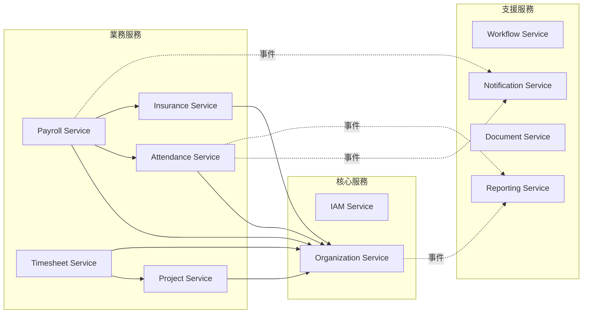

---

## 8. 技術棧

### 8.1 後端技術棧詳細說明

#### 8.1.1 核心框架

**Spring Boot 3.1.x**
- 依賴注入容器
- 自動配置
- 內嵌Web容器
- Actuator監控

**Spring Cloud 2022.0.x**
- 微服務基礎設施

#### 8.1.2 Spring Cloud組件

| 組件 | 功能 | 替代方案 |
|:---|:---|:---|
| Eureka | 服務註冊與發現 | Consul, Nacos |
| Config Server | 集中化配置 | Apollo, Nacos |
| Gateway | API閘道 | Zuul, Kong |
| LoadBalancer | 負載均衡 | Ribbon(已棄用) |
| OpenFeign | 聲明式HTTP客戶端 | RestTemplate |
| Resilience4j | 熔斷器 | Hystrix(已棄用) |

#### 8.1.3 資料存取

**MyBatis 3.5.x**
- SQL映射框架
- 支援動態SQL
- 結果映射靈活

**為何選擇MyBatis而非JPA?**

| 特性 | MyBatis | JPA/Hibernate |
|:---|:---|:---|
| SQL控制 | 完全控制 | 自動生成,難優化 |
| 複雜查詢 | 直接寫SQL | HQL/JPQL有限制 |
| 學習曲線 | 平緩 | 陡峭 |
| 效能調優 | 容易 | 困難 |
| DDD友善度 | 需手動映射(更符合DAO分離原則) | 註解綁定Entity(違反DDD純淨性) |

#### 8.1.4 訊息佇列

**Apache Kafka vs RabbitMQ**

選擇**Kafka**理由:
- 高吞吐量(百萬級/秒)
- 事件溯源支援
- 持久化事件日誌
- 適合微服務事件驅動架構

RabbitMQ適用場景:
- 需要複雜路由
- 需要訊息優先級
- 低延遲要求

### 8.2 前端技術棧詳細說明

| 技術 | 版本 | 用途 |
|:---|:---|:---|
| **React** | 18.x | UI框架 |
| **TypeScript** | 5.x | 型別安全 |
| **React Router** | 6.x | 路由管理 |
| **Redux Toolkit** | 1.9.x | 狀態管理 |
| **Ant Design** | 5.x | UI組件庫 |
| **Axios** | 1.x | HTTP客戶端 |
| **React Query** | 4.x | 資料獲取與快取 |
| **Formik + Yup** | - | 表單管理與驗證 |
| **ECharts** | 5.x | 圖表視覺化 |
| **Vite** | 4.x | 建置工具 |

### 8.3 DevOps工具鏈

| 類別 | 工具 | 用途 |
|:---|:---|:---|
| **版本控制** | Git + GitLab | 程式碼管理 |
| **CI/CD** | GitLab CI / Jenkins | 持續整合部署  |
| **容器化** | Docker | 應用容器化 |
| **容器編排** | Kubernetes | 容器管理 |
| **監控** | Prometheus + Grafana | 系統監控 |
| **日誌** | ELK Stack | 日誌收集分析 |
| **鏈路追蹤** | Zipkin / Jaeger | 分散式追蹤 |

---

## 9. 部署架構

### 9.1 部署架構圖

```mermaid
graph TB
    subgraph "用戶端"
        Browser[Web Browser]
        Mobile[Mobile App]
    end
    
    subgraph "CDN層"
        CDN[CDN<br/>靜態資源]
    end
    
    subgraph "負載均衡層"
        LB[Nginx Load Balancer]
    end
    
    subgraph "Kubernetes Cluster"
        subgraph "Ingress"
            Ingress[Ingress Controller]
        end
        
        subgraph "Services"
            Gateway[Gateway Service x3]
            IAM[IAM Service x2]
            Org[Org Service x3]
            Pay[Payroll Service x2]
        end
        
        subgraph "Infrastructure"
            Eureka[Eureka x2]
            Config[Config Server x2]
        end
    end
    
    subgraph "資料層"
        PSQL[(PostgreSQL<br/>主從複寫)]
        Redis[(Redis Cluster)]
        Kafka[(Kafka Cluster)]
    end
    
    Browser --> CDN
    Browser --> LB
    Mobile --> LB
    LB --> Ingress
    Ingress --> Gateway
    Gateway --> IAM
    Gateway --> Org
    Gateway --> Pay
    
    Gateway --> Eureka
    IAM --> Config
    
    IAM --> PSQL
    Org --> PSQL
    Pay --> PSQL
    
    Gateway --> Redis
    IAM --> Redis
    
    IAM --> Kafka
    Org --> Kafka
```

### 9.2 環境規劃

| 環境 | 用途 | 基礎設施 |
|:---|:---|:---|
| **開發環境(DEV)** | 開發人員本地開發 | Docker Compose |
| **測試環境(TEST)** | 功能測試、整合測試 | 單一K8s Cluster |
| **預生產環境(UAT)** | 使用者驗收測試 | 小規模K8s Cluster |
| **生產環境(PROD)** | 正式上線 | 高可用K8s Cluster |

### 9.3 擴展性設計

**水平擴展:**
- 無狀態服務設計
- 透過K8s HPA自動擴縮容
- 根據CPU/記憶體/QPS指標自動調整Pod數量

**垂直擴展:**
- 調整Pod資源限制
- 升級資料庫規格

**快取策略:**
- Redis快取熱點資料
- 減少資料庫查詢壓力

---

## 10. Docker容器化

### 10.1 Dockerfile設計

本專案採用 **多階段構建(Multi-stage Build)** 優化映像大小並提升安全性。

**Dockerfile範例 (微服務):**

```dockerfile
# ==================== 階段1: Maven構建階段 ====================
FROM maven:3.9-eclipse-temurin-17-alpine AS builder

WORKDIR /build

# 複製pom.xml並下載依賴(利用Docker快取層)
COPY pom.xml .
COPY base-package/pom.xml ./base-package/
COPY Java_Base/pom.xml ./Java_Base/
COPY entity_center/pom.xml ./entity_center/
COPY Java_Domain_Employee/pom.xml ./Java_Domain_Employee/
COPY Java_Datasource_Employee/pom.xml ./Java_Datasource_Employee/
RUN mvn dependency:go-offline -B

# 複製源代碼
COPY . .

# 構建應用(跳過測試以加快構建速度)
RUN mvn clean package -DskipTests -B

# ==================== 階段2: 運行時映像 ====================
FROM eclipse-temurin:17-jre-alpine

# 安全性:創建非root用戶
RUN addgroup -g 1000 hrms && \
    adduser -u 1000 -G hrms -s /bin/sh -D hrms

# 設定工作目錄
WORKDIR /app

# 從構建階段複製JAR文件
COPY --from=builder /build/organization-application/target/*.jar app.jar

# 檔案所有權轉移
RUN chown -R hrms:hrms /app

# 切換到非root用戶
USER hrms

# 環境變數
ENV JAVA_OPTS="-Xms512m -Xmx1024m -XX:+UseG1GC -XX:MaxGCPauseMillis=200"
ENV SERVER_PORT=8080

# 健康檢查
HEALTHCHECK --interval=30s --timeout=3s --start-period=40s --retries=3 \
  CMD wget --no-verbose --tries=1 --spider http://localhost:${SERVER_PORT}/actuator/health || exit 1

# 暴露端口
EXPOSE ${SERVER_PORT}

# 啟動命令
ENTRYPOINT ["sh", "-c", "java $JAVA_OPTS -jar app.jar"]
```

**Dockerfile最佳實踐:**

| 實踐 | 說明 | 優勢 |
|:---|:---|:---|
| **多階段構建** | 構建階段與運行階段分離 | 減小映像大小(構建工具不打包) |
| **使用alpine** | 基礎映像使用alpine | 映像大小減少60-70% |
| **依賴快取** | 先複製pom.xml,再複製源碼 | 利用Docker層快取,加快構建 |
| **非root用戶** | 創建專用用戶運行應用 | 提升安全性 |
| **健康檢查** | 添加HEALTHCHECK指令 | K8s可正確判斷容器健康狀態 |
| **.dockerignore** | 忽略不需要的文件 | 減少構建上下文大小 |

**.dockerignore範例:**

```
# Git
.git
.gitignore

# IDE
.idea
.vscode
*.iml

# Maven
target
.mvn

# Logs
*.log

# OS
.DS_Store
Thumbs.db

# Docker
Dockerfile
docker-compose.yml
.dockerignore
```

### 10.2 docker-compose本地開發環境

**docker-compose.yml:**

```yaml
version: '3.8'

services:
  # ==================== 基礎設施服務 ====================
  
  # PostgreSQL主資料庫
  postgres:
    image: postgres:15-alpine
    container_name: hrms-postgres
    environment:
      POSTGRES_DB: hrms
      POSTGRES_USER: hrms
      POSTGRES_PASSWORD: hrms_pass
    ports:
      - "5432:5432"
    volumes:
      - postgres_data:/var/lib/postgresql/data
      - ./init-scripts:/docker-entrypoint-initdb.d
    networks:
      - hrms-network
    healthcheck:
      test: ["CMD-SHELL", "pg_isready -U hrms"]
      interval: 10s
      timeout: 5s
      retries: 5

  # Redis快取
  redis:
    image: redis:7-alpine
    container_name: hrms-redis
    command: redis-server --requirepass redis_pass
    ports:
      - "6379:6379"
    volumes:
      - redis_data:/data
    networks:
      - hrms-network
    healthcheck:
      test: ["CMD", "redis-cli", "--raw", "incr", "ping"]
      interval: 10s
      timeout: 3s
      retries: 5

  # Kafka
  zookeeper:
    image: confluentinc/cp-zookeeper:7.5.0
    container_name: hrms-zookeeper
    environment:
      ZOOKEEPER_CLIENT_PORT: 2181
      ZOOKEEPER_TICK_TIME: 2000
    networks:
      - hrms-network

  kafka:
    image: confluentinc/cp-kafka:7.5.0
    container_name: hrms-kafka
    depends_on:
      - zookeeper
    ports:
      - "9092:9092"
    environment:
      KAFKA_BROKER_ID: 1
      KAFKA_ZOOKEEPER_CONNECT: zookeeper:2181
      KAFKA_ADVERTISED_LISTENERS: PLAINTEXT://kafka:29092,PLAINTEXT_HOST://localhost:9092
      KAFKA_LISTENER_SECURITY_PROTOCOL_MAP: PLAINTEXT:PLAINTEXT,PLAINTEXT_HOST:PLAINTEXT
      KAFKA_INTER_BROKER_LISTENER_NAME: PLAINTEXT
      KAFKA_OFFSETS_TOPIC_REPLICATION_FACTOR: 1
    networks:
      - hrms-network

  # Elasticsearch (報表查詢)
  elasticsearch:
    image: docker.elastic.co/elasticsearch/elasticsearch:8.11.0
    container_name: hrms-elasticsearch
    environment:
      - discovery.type=single-node
      - "ES_JAVA_OPTS=-Xms512m -Xmx512m"
      - xpack.security.enabled=false
    ports:
      - "9200:9200"
    volumes:
      - es_data:/usr/share/elasticsearch/data
    networks:
      - hrms-network

  # ==================== 微服務 ====================

  # API Gateway
  api-gateway:
    build:
      context: ./gateway-service
      dockerfile: Dockerfile
    container_name: hrms-api-gateway
    ports:
      - "8080:8080"
    environment:
      SPRING_PROFILES_ACTIVE: dev
      EUREKA_CLIENT_SERVICEURL_DEFAULTZONE: http://eureka-server:8761/eureka/
    depends_on:
      - eureka-server
      - redis
    networks:
      - hrms-network

  # Eureka註冊中心
  eureka-server:
    build:
      context: ./eureka-server
      dockerfile: Dockerfile
    container_name: hrms-eureka
    ports:
      - "8761:8761"
    environment:
      SPRING_PROFILES_ACTIVE: dev
    networks:
      - hrms-network

  # IAM服務
  iam-service:
    build:
      context: ./iam-service
      dockerfile: Dockerfile
    container_name: hrms-iam-service
    environment:
      SPRING_PROFILES_ACTIVE: dev
      SPRING_DATASOURCE_URL: jdbc:postgresql://postgres:5432/hrms
      SPRING_DATASOURCE_USERNAME: hrms
      SPRING_DATASOURCE_PASSWORD: hrms_pass
      SPRING_REDIS_HOST: redis
      SPRING_REDIS_PASSWORD: redis_pass
      SPRING_KAFKA_BOOTSTRAP_SERVERS: kafka:29092
      EUREKA_CLIENT_SERVICEURL_DEFAULTZONE: http://eureka-server:8761/eureka/
    depends_on:
      - postgres
      - redis
      - kafka
      - eureka-server
    networks:
      - hrms-network

  # 組織員工服務
  organization-service:
    build:
      context: ./organization-service
      dockerfile: Dockerfile
    container_name: hrms-organization-service
    environment:
      SPRING_PROFILES_ACTIVE: dev
      SPRING_DATASOURCE_URL: jdbc:postgresql://postgres:5432/hrms
      SPRING_DATASOURCE_USERNAME: hrms
      SPRING_DATASOURCE_PASSWORD: hrms_pass
      SPRING_KAFKA_BOOTSTRAP_SERVERS: kafka:29092
      EUREKA_CLIENT_SERVICEURL_DEFAULTZONE: http://eureka-server:8761/eureka/
    depends_on:
      - postgres
      - kafka
      - eureka-server
    networks:
      - hrms-network

# ==================== 網路配置 ====================
networks:
  hrms-network:
    driver: bridge

# ==================== 卷配置 ====================
volumes:
  postgres_data:
  redis_data:
  es_data:
```

**啟動本地環境:**

```bash
# 啟動所有服務
docker-compose up -d

# 查看日誌
docker-compose logs -f api-gateway

# 停止服務
docker-compose down

# 停止並刪除卷
docker-compose down -v
```

**環境變數管理(.env):**

```bash
# .env
POSTGRES_PASSWORD=your_secure_password
REDIS_PASSWORD=your_redis_password
JWT_SECRET=your_jwt_secret_key
```

```yaml
# docker-compose.yml中引用
environment:
  POSTGRES_PASSWORD: ${POSTGRES_PASSWORD}
```

### 10.3 Docker最佳實踐

| 實踐 | 說明 |
|:---|:---|
| **映像分層優化** | 將變動頻率低的層放前面 |
| **最小權限** | 使用非root用戶運行 |
| **健康檢查** | 確保容器正確運行 |
| **資源限制** | 設定memory和cpu限制 |
| **日誌管理** | 使用stdout/stderr輸出日誌 |
| **環境分離** | 使用.env管理敏感資訊 |

**資源限制範例:**

```yaml
services:
  organization-service:
    # ...其他配置
    deploy:
      resources:
        limits:
          cpus: '1'
          memory: 1G
        reservations:
          cpus: '0.5'
          memory: 512M
```

### 10.4 容器更新策略

#### 10.4.1 容器的不可變性(Immutability)

**核心概念:**

Docker容器是**不可變的(Immutable)**,一旦創建就無法修改內部應用程式碼。這是容器化的設計哲學。

**傳統Docker更新流程:**

```bash
# 修改程式碼後
mvn clean package

# 重新構建映像
docker build -t hrms/organization-service:v2.0 .

# 停止舊容器
docker stop organization-service

# 刪除舊容器
docker rm organization-service

# 啟動新容器
docker run -d --name organization-service hrms/organization-service:v2.0
```

**使用docker-compose:**

```bash
# 重新構建並啟動(自動停止舊容器)
docker-compose up -d --build organization-service

# 或分步執行
docker-compose build organization-service
docker-compose up -d organization-service
```

**缺點:**
- ❌ 服務短暫中斷(通常10-30秒)
- ❌ 需要手動執行命令
- ❌ 不適合生產環境

---

#### 10.4.2 Kubernetes滾動更新(零停機)

**核心概念:**

Kubernetes不是"不用重建容器",而是**自動化滾動更新**,對使用者完全透明。

**滾動更新流程:**

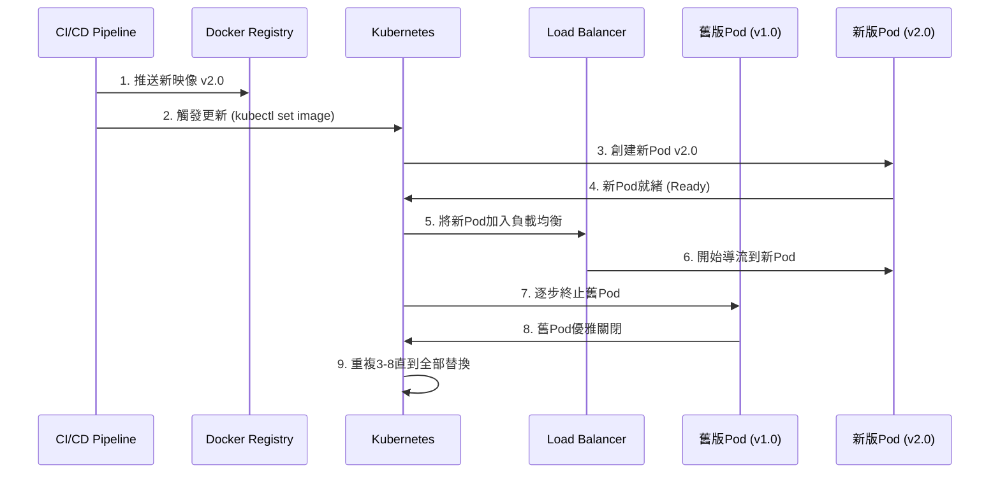

**Kubernetes Deployment配置:**

```yaml
apiVersion: apps/v1
kind: Deployment
metadata:
  name: organization-service
  namespace: hrms-prod
spec:
  replicas: 3
  strategy:
    type: RollingUpdate
    rollingUpdate:
      maxSurge: 1        # 最多額外啟動1個新Pod (總共4個)
      maxUnavailable: 0  # 最少保持3個可用Pod (零停機)
  template:
    metadata:
      labels:
        app: organization-service
        version: v2.0
    spec:
      containers:
      - name: organization-service
        image: registry.company.com/hrms/organization-service:v2.0
        ports:
        - containerPort: 8080
        # 就緒探針:確保新Pod完全就緒才接收流量
        readinessProbe:
          httpGet:
            path: /actuator/health/readiness
            port: 8080
          initialDelaySeconds: 30
          periodSeconds: 5
        # 存活探針:檢測Pod是否健康
        livenessProbe:
          httpGet:
            path: /actuator/health/liveness
            port: 8080
          initialDelaySeconds: 60
          periodSeconds: 10
        # 優雅關閉:給予30秒時間處理現有請求
        lifecycle:
          preStop:
            exec:
              command: ["/bin/sh", "-c", "sleep 15"]
```

**執行滾動更新:**

```bash
# 方法1: 直接更新映像
kubectl set image deployment/organization-service \
  organization-service=registry.company.com/hrms/organization-service:v2.0 \
  -n hrms-prod

# 方法2: 修改Deployment YAML後應用
kubectl apply -f organization-deployment.yaml

# 查看滾動更新狀態
kubectl rollout status deployment/organization-service -n hrms-prod

# 查看更新歷史
kubectl rollout history deployment/organization-service -n hrms-prod

# 回滾到上一版本
kubectl rollout undo deployment/organization-service -n hrms-prod

# 回滾到特定版本
kubectl rollout undo deployment/organization-service --to-revision=2 -n hrms-prod
```

**滾動更新過程示意:**

```
時間 T0 (初始狀態 - 3個舊Pod):
[v1.0 Pod1] [v1.0 Pod2] [v1.0 Pod3]
100%流量 →  ⬆️           ⬆️           ⬆️

時間 T1 (創建1個新Pod):
[v1.0 Pod1] [v1.0 Pod2] [v1.0 Pod3] [v2.0 Pod1 啟動中...]
100%流量 →  ⬆️           ⬆️           ⬆️

時間 T2 (新Pod就緒,舊Pod開始終止):
[v1.0 Pod1] [v1.0 Pod2] [v1.0 Pod3 關閉中] [v2.0 Pod1 ✅]
75%流量 →   ⬆️           ⬆️                          ⬆️ 25%

時間 T3 (持續替換):
[v1.0 Pod1] [v1.0 Pod2 關閉中] [v2.0 Pod1 ✅] [v2.0 Pod2 ✅]
50%流量 →   ⬆️                              ⬆️ 25%      ⬆️ 25%

時間 T4 (完成替換):
[v2.0 Pod1] [v2.0 Pod2] [v2.0 Pod3]
100%流量 →  ⬆️           ⬆️           ⬆️
```

**優勢:**
- ✅ **零停機**: 始終保持至少3個Pod運行
- ✅ **自動化**: CI/CD觸發,無需手動干預
- ✅ **可回滾**: 發現問題立即回滾
- ✅ **漸進式**: 逐步替換,降低風險

---

#### 10.4.3 開發環境熱重載方案

對於**開發環境**,頻繁重建容器影響效率,可使用以下方案:

**方案1: Volume掛載 + Spring Boot DevTools**

**docker-compose-dev.yml:**

```yaml
version: '3.8'

services:
  organization-service:
    build:
      context: ./organization-service
      dockerfile: Dockerfile.dev
    volumes:
      # 掛載編譯後的class檔案
      - ./organization-service/target/classes:/app/classes
      # 掛載配置檔案
      - ./organization-service/src/main/resources:/app/resources
    environment:
      SPRING_DEVTOOLS_RESTART_ENABLED: "true"
      SPRING_DEVTOOLS_LIVERELOAD_ENABLED: "true"
    ports:
      - "8081:8080"
      - "35729:35729"  # LiveReload端口
```

**Dockerfile.dev (開發環境專用):**

```dockerfile
FROM eclipse-temurin:17-jre-alpine

WORKDIR /app

# 複製依賴JAR(不常變動)
COPY target/dependency/*.jar ./lib/

# 使用Volume掛載的classes和resources(常變動)
# 不在映像中COPY,而是通過Volume動態掛載

# 開發環境啟動命令
ENTRYPOINT ["java", \
  "-cp", "/app/classes:/app/resources:/app/lib/*", \
  "com.company.hrms.organization.Application"]
```

**開發流程:**

```bash
# 1. 啟動開發環境
docker-compose -f docker-compose-dev.yml up -d

# 2. 在IDE中修改Java程式碼
# 3. Maven自動編譯 (或手動: mvn compile)
# 4. Spring DevTools自動檢測變更並重啟應用 (3-5秒)
# 5. 無需重建Docker映像!
```

**pom.xml配置:**

```xml
<dependency>
    <groupId>org.springframework.boot</groupId>
    <artifactId>spring-boot-devtools</artifactId>
    <scope>runtime</scope>
    <optional>true</optional>
</dependency>
```

**優勢:**
- ✅ 修改程式碼後3-5秒生效
- ✅ 無需重建Docker映像
- ✅ 保持容器化環境一致性

---

**方案2: Skaffold自動化開發流程**

Skaffold可自動監控程式碼變更,自動構建並部署到Kubernetes。

**skaffold.yaml:**

```yaml
apiVersion: skaffold/v4beta6
kind: Config
metadata:
  name: hrms-dev

build:
  artifacts:
  - image: hrms/organization-service
    context: ./organization-service
    docker:
      dockerfile: Dockerfile
    sync:
      manual:
        - src: 'src/**/*.java'
          dest: /app/classes

deploy:
  kubectl:
    manifests:
      - k8s/dev/*.yaml

portForward:
  - resourceType: service
    resourceName: organization-service
    port: 8080
    localPort: 8081
```

**使用方式:**

```bash
# 啟動開發模式(自動監控、構建、部署)
skaffold dev

# Skaffold會:
# 1. 監控程式碼變更
# 2. 自動重新構建映像
# 3. 自動部署到K8s
# 4. 自動轉發端口
```

---

#### 10.4.4 環境更新策略對比

| 環境 | 更新策略 | 工具 | 停機時間 | 適用場景 |
|:---|:---|:---|:---|:---|
| **本地開發** | Volume + DevTools | docker-compose | 3-5秒(自動重啟) | 快速迭代開發 |
| **本地開發(K8s)** | Skaffold自動化 | Skaffold | 10-20秒(自動構建部署) | 測試K8s配置 |
| **DEV環境** | 重建容器 | docker-compose | 10-30秒 | 簡單環境 |
| **TEST環境** | K8s滾動更新 | kubectl / CI/CD | 零停機 | 集成測試 |
| **Staging環境** | K8s滾動更新 | CI/CD | 零停機 | 預發布驗證 |
| **Production環境** | K8s滾動更新 + 金絲雀 | CI/CD | 零停機 | 生產環境 |

---

#### 10.4.5 金絲雀發布(Canary Deployment)

對於**生產環境**,可使用金絲雀發布進一步降低風險。

**策略:**
1. 先將新版本部署到5%流量
2. 監控指標(錯誤率、延遲、業務指標)
3. 如果正常,逐步增加到10% → 25% → 50% → 100%
4. 如果異常,立即回滾

**使用Istio實現金絲雀發布:**

```yaml
apiVersion: networking.istio.io/v1beta1
kind: VirtualService
metadata:
  name: organization-service
spec:
  hosts:
  - organization-service
  http:
  - match:
    - headers:
        user-type:
          exact: internal  # 內部用戶先體驗新版本
    route:
    - destination:
        host: organization-service
        subset: v2
  - route:
    - destination:
        host: organization-service
        subset: v1
      weight: 95  # 95%流量到舊版本
    - destination:
        host: organization-service
        subset: v2
      weight: 5   # 5%流量到新版本(金絲雀)
```

---

#### 10.4.6 最佳實踐總結

| 實踐 | 說明 |
|:---|:---|
| **開發環境** | 使用Volume + DevTools實現熱重載 |
| **生產環境** | 使用K8s滾動更新實現零停機 |
| **健康檢查** | 配置readinessProbe和livenessProbe |
| **優雅關閉** | 設置preStop hook,給予時間處理現有請求 |
| **版本管理** | 使用GitCommit SHA作為映像標籤 |
| **回滾機制** | 保留至少3個歷史版本以便快速回滾 |
| **漸進式發布** | 生產環境使用金絲雀發布降低風險 |

---

## 11. CI/CD流水線

### 11.1 GitLab CI配置

**.gitlab-ci.yml:**

```yaml
stages:
  - build
  - test
  - package
  - deploy

variables:
  MAVEN_OPTS: "-Dmaven.repo.local=.m2/repository"
  DOCKER_REGISTRY: "registry.company.com"
  IMAGE_TAG: "$CI_COMMIT_SHORT_SHA"

# ==================== 構建階段 ====================
build:
  stage: build
  image: maven:3.9-eclipse-temurin-17
  script:
    - mvn clean compile -B
  cache:
    key: ${CI_COMMIT_REF_SLUG}
    paths:
      - .m2/repository
  artifacts:
    paths:
      - target/
    expire_in: 1 hour
  only:
    - branches

# ==================== 測試階段 ====================
unit-test:
  stage: test
  image: maven:3.9-eclipse-temurin-17
  script:
    - mvn test -B
    - mvn jacoco:report
  coverage: '/Total.*?([0-9]{1,3})%/'
  artifacts:
    reports:
      junit: target/surefire-reports/TEST-*.xml
      coverage_report:
        coverage_format: cobertura
        path: target/site/jacoco/jacoco.xml
  only:
    - branches

integration-test:
  stage: test
  image: maven:3.9-eclipse-temurin-17
  services:
    - postgres:15-alpine
  variables:
    POSTGRES_DB: hrms_test
    POSTGRES_USER: hrms
    POSTGRES_PASSWORD: test_pass
  script:
    - mvn verify -P integration-test -B
  only:
    - branches

# ==================== 打包階段 ====================
package-docker:
  stage: package
  image: docker:24-dind
  services:
    - docker:24-dind
  before_script:
    - echo  $DOCKER_REGISTRY_PASSWORD | docker login -u $DOCKER_REGISTRY_USER --password-stdin $DOCKER_REGISTRY
  script:
    # 構建並推送IAM服務
    - docker build -t $DOCKER_REGISTRY/hrms/iam-service:$IMAGE_TAG -f iam-service/Dockerfile .
    - docker push $DOCKER_REGISTRY/hrms/iam-service:$IMAGE_TAG
    
    # 構建並推送Organization服務
    - docker build -t $DOCKER_REGISTRY/hrms/organization-service:$IMAGE_TAG -f organization-service/Dockerfile .
    - docker push $DOCKER_REGISTRY/hrms/organization-service:$IMAGE_TAG
    
    # Tag latest
    - docker tag $DOCKER_REGISTRY/hrms/iam-service:$IMAGE_TAG $DOCKER_REGISTRY/hrms/iam-service:latest
    - docker push $DOCKER_REGISTRY/hrms/iam-service:latest
  only:
    - main
    - develop

# ==================== 部署階段 ====================
deploy-dev:
  stage: deploy
  image: bitnami/kubectl:latest
  script:
    - kubectl config use-context dev-cluster
    - kubectl set image deployment/iam-service iam-service=$DOCKER_REGISTRY/hrms/iam-service:$IMAGE_TAG -n hrms-dev
    - kubectl set image deployment/organization-service organization-service=$DOCKER_REGISTRY/hrms/organization-service:$IMAGE_TAG -n hrms-dev
    - kubectl rollout status deployment/iam-service -n hrms-dev
  environment:
    name: development
    url: https://dev.hrms.company.com
  only:
    - develop

deploy-staging:
  stage: deploy
  image: bitnami/kubectl:latest
  script:
    - kubectl config use-context staging-cluster
    - kubectl set image deployment/iam-service iam-service=$DOCKER_REGISTRY/hrms/iam-service:$IMAGE_TAG -n hrms-staging
    - kubectl rollout status deployment/iam-service -n hrms-staging
  environment:
    name: staging
    url: https://staging.hrms.company.com
  when: manual
  only:
    - main

deploy-production:
  stage: deploy
  image: bitnami/kubectl:latest
  script:
    - kubectl config use-context prod-cluster
    - kubectl set image deployment/iam-service iam-service=$DOCKER_REGISTRY/hrms/iam-service:$IMAGE_TAG -n hrms-prod
    - kubectl rollout status deployment/iam-service -n hrms-prod
  environment:
    name: production
    url: https://hrms.company.com
  when: manual
  only:
    - main
  needs:
    - deploy-staging
```

### 11.2 Jenkins Pipeline配置

**Jenkinsfile:**

```groovy
pipeline {
    agent any
    
    environment {
        DOCKER_REGISTRY = 'registry.company.com'
        IMAGE_TAG = "${env.GIT_COMMIT.take(8)}"
    }
    
    stages {
        stage('Checkout') {
            steps {
                checkout scm
            }
        }
        
        stage('Build') {
            agent {
                docker {
                    image 'maven:3.9-eclipse-temurin-17'
                    args '-v $HOME/.m2:/root/.m2'
                }
            }
            steps {
                sh 'mvn clean compile -B'
            }
        }
        
        stage('Test') {
            parallel {
                stage('Unit Test') {
                    agent {
                        docker {
                            image 'maven:3.9-eclipse-temurin-17'
                        }
                    }
                    steps {
                        sh 'mvn test -B'
                    }
                    post {
                        always {
                            junit 'target/surefire-reports/*.xml'
                            jacoco()
                        }
                    }
                }
                
                stage('Integration Test') {
                    agent {
                        docker {
                            image 'maven:3.9-eclipse-temurin-17'
                        }
                    }
                    steps {
                        sh 'mvn verify -P integration-test -B'
                    }
                }
            }
        }
        
        stage('Package') {
            steps {
                script {
                    docker.build("${DOCKER_REGISTRY}/hrms/iam-service:${IMAGE_TAG}", "-f iam-service/Dockerfile .")
                    docker.build("${DOCKER_REGISTRY}/hrms/organization-service:${IMAGE_TAG}", "-f organization-service/Dockerfile .")
                }
            }
        }
        
        stage('Push Images') {
            steps {
                script {
                    docker.withRegistry("https://${DOCKER_REGISTRY}", 'docker-credentials') {
                        docker.image("${DOCKER_REGISTRY}/hrms/iam-service:${IMAGE_TAG}").push()
                        docker.image("${DOCKER_REGISTRY}/hrms/iam-service:${IMAGE_TAG}").push('latest')
                    }
                }
            }
        }
        
        stage('Deploy to Dev') {
            when {
                branch 'develop'
            }
            steps {
                sh '''
                    kubectl set image deployment/iam-service \
                        iam-service=${DOCKER_REGISTRY}/hrms/iam-service:${IMAGE_TAG} \
                        -n hrms-dev
                    kubectl rollout status deployment/iam-service -n hrms-dev
                '''
            }
        }
        
        stage('Deploy to Production') {
            when {
                branch 'main'
            }
            steps {
                input message: 'Deploy to Production?', ok: 'Deploy'
                sh '''
                    kubectl set image deployment/iam-service \
                        iam-service=${DOCKER_REGISTRY}/hrms/iam-service:${IMAGE_TAG} \
                        -n hrms-prod
                    kubectl rollout status deployment/iam-service -n hrms-prod
                '''
            }
        }
    }
    
    post {
        success {
            slackSend color: 'good', message: "Build Successful: ${env.JOB_NAME} #${env.BUILD_NUMBER}"
        }
        failure {
            slackSend color: 'danger', message: "Build Failed: ${env.JOB_NAME} #${env.BUILD_NUMBER}"
        }
    }
}
```

### 11.3 CI/CD流程圖

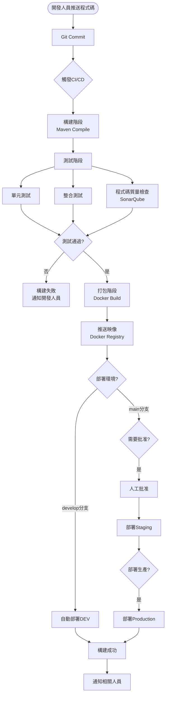

### 11.4 自動化測試整合

**測試金字塔:**

```
         /\
        /單\       10% - E2E測試
       /元測\
      /  試  \     30% - 整合測試
     /--------\
    /集成測試  \
   /------------\  60% - 單元測試
  /  單元測試    \
 /----------------\
```

**測試覆蓋率要求:**

| 測試類型 | 覆蓋率要求 | 工具 |
|:---|:---|:---|
| 單元測試 | ≥ 80% | JUnit 5, Mockito |
| 整合測試 | ≥ 60% | Spring Boot Test, Testcontainers |
| API測試 | 100% | RestAssured |
| E2E測試 | 核心流程 | Selenium, Cypress |

**測試配置 (pom.xml):**

```xml
<plugin>
    <groupId>org.jacoco</groupId>
    <artifactId>jacoco-maven-plugin</artifactId>
    <version>0.8.11</version>
    <executions>
        <execution>
            <goals>
                <goal>prepare-agent</goal>
            </goals>
        </execution>
        <execution>
            <id>report</id>
            <phase>test</phase>
            <goals>
                <goal>report</goal>
            </goals>
        </execution>
        <execution>
            <id>check</id>
            <goals>
                <goal>check</goal>
            </goals>
            <configuration>
                <rules>
                    <rule>
                        <element>PACKAGE</element>
                        <limits>
                            <limit>
                                <counter>LINE</counter>
                                <value>COVEREDRATIO</value>
                                <minimum>0.80</minimum>
                            </limit>
                        </limits>
                    </rule>
                </rules>
            </configuration>
        </execution>
    </executions>
</plugin>
```

---

**文件結束**

**版本歷史:**
- v1.0 (2025-12-03): 初版,包含DDD、SOLID、微服務架構設計
- v1.1 (2025-12-04): 新增CQRS讀寫分離、Docker容器化、CI/CD流水線
